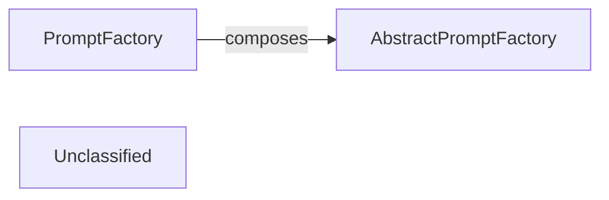

## Details

The prompt generation subsystem is centered around the `PromptFactory`, which serves as the primary interface for constructing LLM-optimized prompts. Instead of directly implementing prompt generation logic, `PromptFactory` leverages a composition pattern, utilizing an instance of `AbstractPromptFactory`. This `AbstractPromptFactory` defines the common interface for prompt creation, allowing various concrete prompt factories (e.g., for different LLMs like Gemini Flash or Claude) to provide specific implementations. This architectural choice ensures modularity, extensibility, and a consistent approach to prompt generation across diverse analysis tasks within the project's AI Interpretation Layer.

### AbstractPromptFactory
This component establishes the contract and defines the interface for prompt generation. It ensures a consistent and standardized approach to creating prompts, regardless of the specific LLM or analysis task. Concrete prompt factories (e.g., `GeminiFlashBidirectionalPromptFactory`, `ClaudeBidirectionalPromptFactory`) implement this interface to provide specific prompt generation logic. This aligns with the project's emphasis on modularity and extensibility.

**Related Classes/Methods**:

- <a href="https://github.com/CodeBoarding/CodeBoarding/blob/main/.codeboardingagents/prompts/abstract_prompt_factory.py" target="_blank" rel="noopener noreferrer">`AbstractPromptFactory`</a>

### PromptFactory
This component acts as the primary orchestrator for dynamically generating and formatting prompts. It interprets static analysis results, applies task-specific parameters, and constructs LLM-optimized prompts by *composing* and *delegating* the actual prompt generation to an instance of `AbstractPromptFactory`. This design allows `PromptFactory` to remain decoupled from the specifics of prompt generation, promoting flexibility and extensibility. As the central executor of prompt generation, it is crucial to the "AI Interpretation Layer" and the "pipeline-driven, AI-centric approach" of the project.

**Related Classes/Methods**:

- <a href="https://github.com/CodeBoarding/CodeBoarding/blob/main/.codeboardingagents/prompts/prompt_factory.py" target="_blank" rel="noopener noreferrer">`PromptFactory`</a>

### Unclassified
Component for all unclassified files and utility functions (Utility functions/External Libraries/Dependencies)

**Related Classes/Methods**: _None_

### [FAQ](https://github.com/CodeBoarding/GeneratedOnBoardings/tree/main?tab=readme-ov-file#faq)
