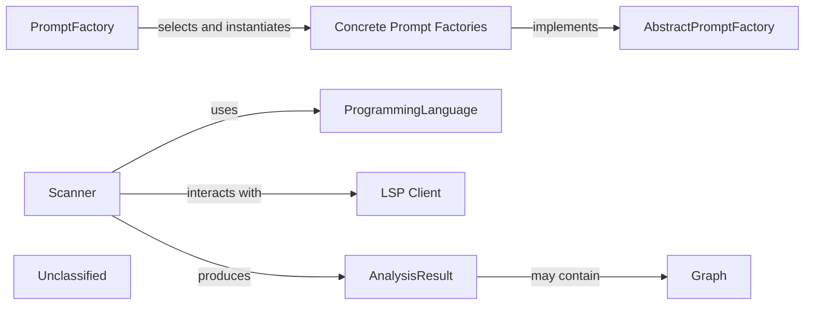

## Details

The project's architecture now encompasses two primary subsystems: the `PromptFactory` and the `Static Analyzer`. The `PromptFactory` subsystem is responsible for dynamically generating LLM prompts based on specified types and models, utilizing an abstract factory pattern to manage concrete prompt implementations. The newly introduced `Static Analyzer` subsystem focuses on source code analysis, employing a `Scanner` to parse code, leveraging `ProgrammingLanguage` abstractions for language-specific handling, and potentially interacting with an `LSP Client` for enhanced analysis capabilities. The output of this analysis is encapsulated in an `AnalysisResult`, which may include `Graph` representations of the code. These two subsystems operate independently but contribute to the overall functionality of the project, with the `Static Analyzer` providing insights into code structure and behavior that could potentially inform or be utilized by other parts of the system.

### PromptFactory
Responsible for dynamically generating LLM prompts based on specified types and models.

**Related Classes/Methods**:

- <a href="https://github.com/CodeBoarding/CodeBoarding/blob/main/.codeboardingagents/prompts/claude_prompts_bidirectional.py#L382-L446" target="_blank" rel="noopener noreferrer">`PromptFactory`:382-446</a>

### AbstractPromptFactory
Defines the interface for prompt factories.

**Related Classes/Methods**:

- <a href="https://github.com/CodeBoarding/CodeBoarding/blob/main/.codeboardingagents/prompts/abstract_prompt_factory.py#L10-L95" target="_blank" rel="noopener noreferrer">`AbstractPromptFactory`:10-95</a>

### Concrete Prompt Factories
Implementations of the AbstractPromptFactory for specific prompt types and models.

**Related Classes/Methods**:

- `ConcretePromptFactory`:1-10

### Scanner
Responsible for parsing source code and extracting relevant information, acting as the entry point for static analysis.

**Related Classes/Methods**:

- <a href="https://github.com/CodeBoarding/CodeBoarding/blob/main/.codeboardingstatic_analyzer/scanner.py" target="_blank" rel="noopener noreferrer">`static_analyzer.scanner.Scanner`</a>

### ProgrammingLanguage
Defines the interfaces or base classes for handling different programming languages, allowing the Scanner to be extensible.

**Related Classes/Methods**:

- <a href="https://github.com/CodeBoarding/CodeBoarding/blob/main/.codeboardingstatic_analyzer/programming_language.py" target="_blank" rel="noopener noreferrer">`static_analyzer.programming_language.ProgrammingLanguage`</a>

### LSP Client
Integrates with Language Server Protocol (LSP) for interacting with language servers to obtain analysis data.

**Related Classes/Methods**:

### AnalysisResult
Encapsulates the output of the static analysis, providing a structured representation of the findings.

**Related Classes/Methods**:

- <a href="https://github.com/CodeBoarding/CodeBoarding/blob/main/.codeboardingstatic_analyzer/analysis_result.py" target="_blank" rel="noopener noreferrer">`static_analyzer.analysis_result.AnalysisResult`</a>

### Graph
Used to represent the relationships within the analyzed code, such as control flow graphs or dependency graphs.

**Related Classes/Methods**:

- <a href="https://github.com/CodeBoarding/CodeBoarding/blob/main/.codeboardingstatic_analyzer/graph.py" target="_blank" rel="noopener noreferrer">`static_analyzer.graph.Graph`</a>

### Unclassified
Component for all unclassified files and utility functions (Utility functions/External Libraries/Dependencies)

**Related Classes/Methods**: _None_

### [FAQ](https://github.com/CodeBoarding/GeneratedOnBoardings/tree/main?tab=readme-ov-file#faq)
