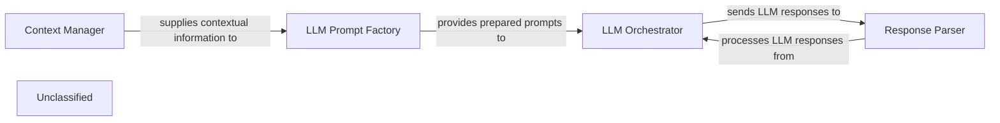

## Details

This system describes a workflow for interacting with Large Language Models (LLMs) for code analysis. The main flow involves a Context Manager preparing relevant information, which is then used by an LLM Prompt Factory to generate tailored prompts. These prompts are passed to an LLM Orchestrator, responsible for managing interactions with various LLM providers and sending the prompts. Finally, a Response Parser processes the raw LLM responses, extracting and structuring the necessary information for further use.

### LLM Prompt Factory [[Expand]](./LLM_Prompt_Factory.md)
Dynamically generates and manages prompts specifically tailored for various Large Language Models (LLMs) and different code analysis tasks. It creates tailored prompts based on specific code analysis tasks, integrates relevant static analysis data and contextual information, adapts prompt structure for different LLM providers, and manages prompt templates.

**Related Classes/Methods**:

- <a href="https://github.com/CodeBoarding/CodeBoarding/blob/main/.codeboardingagents/prompts/prompt_factory.py" target="_blank" rel="noopener noreferrer">`agents.prompts.prompt_factory.PromptFactory`</a>

### LLM Orchestrator
Manages the interaction with different LLM providers (e.g., OpenAI, Anthropic, Google Gemini, AWS Bedrock, Ollama), handling API calls, model selection, and response routing.

**Related Classes/Methods**:

### Response Parser
Extracts and structures relevant information from the raw text responses generated by LLMs. This component is vital for transforming unstructured LLM output into a format usable by subsequent components, such as the Output Generation Engine.

**Related Classes/Methods**:

- `Response Parser`

### Context Manager
Prepares and manages the contextual information (e.g., code snippets, static analysis results, architectural patterns) that is fed into the prompts. It aggregates and organizes data from various sources to enrich the LLM's understanding.

**Related Classes/Methods**:

- `Context Manager`

### Unclassified
Component for all unclassified files and utility functions (Utility functions/External Libraries/Dependencies)

**Related Classes/Methods**: _None_

### [FAQ](https://github.com/CodeBoarding/GeneratedOnBoardings/tree/main?tab=readme-ov-file#faq)
