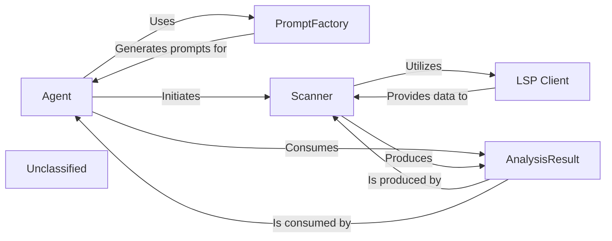

## Details

The system's architecture is centered around an Agent that orchestrates static code analysis and decision-making. The Agent utilizes a PromptFactory to dynamically generate context-aware prompts, guiding its interactions and analysis tasks. To perform code analysis, the Agent invokes the Scanner, which acts as the primary interface for static analysis. The Scanner relies on the LSP Client to communicate with external Language Servers, thereby acquiring rich, language-specific code insights. All findings from the static analysis are then structured and encapsulated within an AnalysisResult object, which the Agent subsequently consumes to inform its actions and refine its understanding of the codebase. This modular design ensures clear separation of concerns, enabling flexible integration with various language servers and adaptable agent behaviors.

### Agent
Drives the overall analysis process, makes decisions based on analysis results, and orchestrates interactions with other components. It utilizes PromptFactory for dynamic prompt generation and Scanner to initiate code analysis.

**Related Classes/Methods**:

- <a href="https://github.com/CodeBoarding/CodeBoarding/blob/main/.codeboardingagents/abstraction_agent.py" target="_blank" rel="noopener noreferrer">`agents.abstraction_agent`</a>
- <a href="https://github.com/CodeBoarding/CodeBoarding/blob/main/.codeboardingagents/agent.py" target="_blank" rel="noopener noreferrer">`agents.agent`</a>
- <a href="https://github.com/CodeBoarding/CodeBoarding/blob/main/.codeboardingagents/agent_responses.py" target="_blank" rel="noopener noreferrer">`agents.agent_responses`</a>
- <a href="https://github.com/CodeBoarding/CodeBoarding/blob/main/.codeboardingagents/details_agent.py" target="_blank" rel="noopener noreferrer">`agents.details_agent`</a>
- <a href="https://github.com/CodeBoarding/CodeBoarding/blob/main/.codeboardingagents/tools/" target="_blank" rel="noopener noreferrer">`agents.tools`</a>
- <a href="https://github.com/CodeBoarding/CodeBoarding/blob/main/.codeboardingagents/prompts/" target="_blank" rel="noopener noreferrer">`agents.prompts`</a>

### PromptFactory
Dynamically generates LLM prompts based on specified types and models, providing structured input for the Agent.

**Related Classes/Methods**:

- <a href="https://github.com/CodeBoarding/CodeBoarding/blob/main/.codeboardingagents/prompts/" target="_blank" rel="noopener noreferrer">`agents.prompts`</a>

### Scanner
Acts as the entry point for static analysis, parsing source code, extracting relevant information, and orchestrating the data gathering from language servers.

**Related Classes/Methods**:

- <a href="https://github.com/CodeBoarding/CodeBoarding/blob/main/.codeboardingstatic_analyzer/scanner.py" target="_blank" rel="noopener noreferrer">`static_analyzer.scanner`</a>

### LSP Client
Integrates with Language Server Protocol (LSP) to communicate with external language servers, obtaining rich analysis data such as definitions, references, and diagnostics.

**Related Classes/Methods**:

- <a href="https://github.com/CodeBoarding/CodeBoarding/blob/main/.codeboardingstatic_analyzer/lsp_client/client.py" target="_blank" rel="noopener noreferrer">`static_analyzer.lsp_client.client`</a>

### AnalysisResult
Encapsulates the structured output of the static analysis, including code graphs, findings, and other relevant data, providing a standardized format for consumption.

**Related Classes/Methods**:

- <a href="https://github.com/CodeBoarding/CodeBoarding/blob/main/.codeboardingstatic_analyzer/analysis_result.py" target="_blank" rel="noopener noreferrer">`static_analyzer.analysis_result`</a>

### Unclassified
Component for all unclassified files and utility functions (Utility functions/External Libraries/Dependencies)

**Related Classes/Methods**: _None_

### [FAQ](https://github.com/CodeBoarding/GeneratedOnBoardings/tree/main?tab=readme-ov-file#faq)
