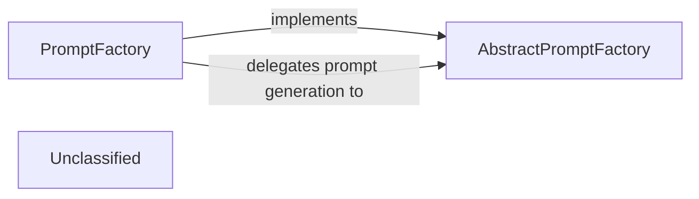

## Details

The `agents.prompts` subsystem provides a flexible and extensible mechanism for generating LLM-specific prompts. It is centered around the `AbstractPromptFactory`, which establishes a common interface for all prompt creation logic. The `PromptFactory` serves as the concrete implementation, dynamically selecting and instantiating specialized prompt factories based on the target LLM and desired prompt characteristics. This design pattern enables the system to seamlessly integrate with diverse LLM providers and prompt variations, ensuring consistent and adaptable prompt generation throughout the application. The `PromptFactory` delegates the actual retrieval of prompt messages to the chosen concrete `AbstractPromptFactory` implementation, effectively decoupling prompt content from the prompt selection mechanism.

### AbstractPromptFactory
Defines the standardized interface and contract for all prompt generation implementations. This component ensures consistency and allows for polymorphic prompt creation strategies, aligning with the modular design pattern of the project.

**Related Classes/Methods**:

- <a href="https://github.com/CodeBoarding/CodeBoarding/blob/main/.codeboardingagents/prompts/abstract_prompt_factory.py#L9-L94" target="_blank" rel="noopener noreferrer">`agents.prompts.abstract_prompt_factory.AbstractPromptFactory`:9-94</a>

### PromptFactory
The concrete implementation that dynamically selects, constructs, and formats prompts with contextual information for different LLM providers. It acts as the central orchestrator for prompt creation within the AI Interpretation Layer.

**Related Classes/Methods**:

- <a href="https://github.com/CodeBoarding/CodeBoarding/blob/main/.codeboardingagents/prompts/prompt_factory.py#L33-L109" target="_blank" rel="noopener noreferrer">`agents.prompts.prompt_factory.PromptFactory`:33-109</a>

### Unclassified
Component for all unclassified files and utility functions (Utility functions/External Libraries/Dependencies)

**Related Classes/Methods**: _None_

### [FAQ](https://github.com/CodeBoarding/GeneratedOnBoardings/tree/main?tab=readme-ov-file#faq)
