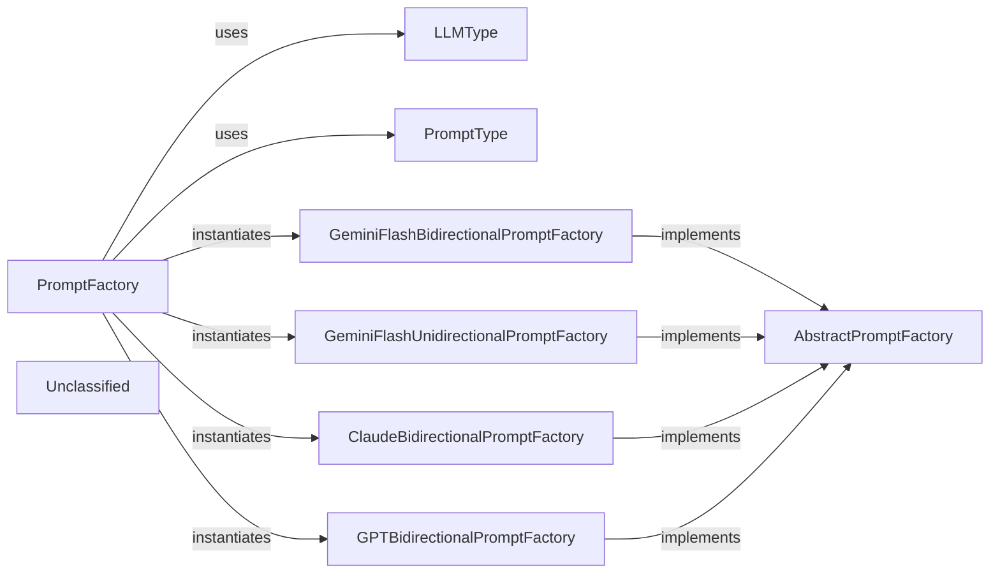

## Details

The LLM Prompt Factory subsystem is a critical part of the AI Interpretation Layer within the project's Code analysis and documentation generation tool architecture. It adheres to the Factory Method and Strategy patterns, enabling dynamic prompt generation tailored for various LLMs and interaction styles.

### PromptFactory
The primary orchestrator for creating and managing LLM prompts. It acts as the central entry point, dynamically selecting and instantiating the appropriate concrete prompt factory based on the desired `LLMType` and `PromptType`. It provides methods to retrieve specific prompts by name or all available prompts from the selected factory.

**Related Classes/Methods**:

- <a href="https://github.com/CodeBoarding/CodeBoarding/blob/main/.codeboardingagents/prompts/prompt_factory.py" target="_blank" rel="noopener noreferrer">`PromptFactory`</a>
- <a href="https://github.com/CodeBoarding/CodeBoarding/blob/main/.codeboardingagents/prompts/prompt_factory.py#L26-L32" target="_blank" rel="noopener noreferrer">`LLMType`:26-32</a>
- <a href="https://github.com/CodeBoarding/CodeBoarding/blob/main/.codeboardingagents/prompts/prompt_factory.py#L19-L23" target="_blank" rel="noopener noreferrer">`PromptType`:19-23</a>
- <a href="https://github.com/CodeBoarding/CodeBoarding/blob/main/.codeboardingagents/prompts/abstract_prompt_factory.py" target="_blank" rel="noopener noreferrer">`AbstractPromptFactory`</a>
- <a href="https://github.com/CodeBoarding/CodeBoarding/blob/main/.codeboardingagents/prompts/gemini_flash_prompts_bidirectional.py#L369-L433" target="_blank" rel="noopener noreferrer">`GeminiFlashBidirectionalPromptFactory`:369-433</a>
- <a href="https://github.com/CodeBoarding/CodeBoarding/blob/main/.codeboardingagents/prompts/gemini_flash_prompts_unidirectional.py#L369-L434" target="_blank" rel="noopener noreferrer">`GeminiFlashUnidirectionalPromptFactory`:369-434</a>
- <a href="https://github.com/CodeBoarding/CodeBoarding/blob/main/.codeboardingagents/prompts/claude_prompts_bidirectional.py#L382-L446" target="_blank" rel="noopener noreferrer">`ClaudeBidirectionalPromptFactory`:382-446</a>
- <a href="https://github.com/CodeBoarding/CodeBoarding/blob/main/.codeboardingagents/prompts/gpt_prompts_bidirectional.py#L571-L635" target="_blank" rel="noopener noreferrer">`GPTBidirectionalPromptFactory`:571-635</a>

### AbstractPromptFactory
An abstract base class that defines the contract for all concrete prompt factories. It establishes the interface for retrieving prompts, ensuring a consistent API across different LLM and prompt interaction type implementations. This promotes modularity and extensibility.

**Related Classes/Methods**:

- <a href="https://github.com/CodeBoarding/CodeBoarding/blob/main/.codeboardingagents/prompts/abstract_prompt_factory.py" target="_blank" rel="noopener noreferrer">`AbstractPromptFactory`</a>

### LLMType
An enumeration that defines the various Large Language Model types supported by the system (e.g., `GEMINI_FLASH`, `CLAUDE`, `GPT4`). It provides a clear, enumerated set of options for LLM models, used by `PromptFactory` for dynamic factory selection.

**Related Classes/Methods**:

- <a href="https://github.com/CodeBoarding/CodeBoarding/blob/main/.codeboardingagents/prompts/prompt_factory.py#L26-L32" target="_blank" rel="noopener noreferrer">`LLMType`:26-32</a>

### PromptType
An enumeration that defines the interaction patterns for prompts (e.g., `BIDIRECTIONAL`, `UNIDIRECTIONAL`). It provides a clear, enumerated set of options for prompt interaction styles, used by `PromptFactory` for dynamic factory selection.

**Related Classes/Methods**:

- <a href="https://github.com/CodeBoarding/CodeBoarding/blob/main/.codeboardingagents/prompts/prompt_factory.py#L19-L23" target="_blank" rel="noopener noreferrer">`PromptType`:19-23</a>

### GeminiFlashBidirectionalPromptFactory
A concrete implementation of `AbstractPromptFactory` specifically designed for generating bidirectional prompts for Gemini Flash LLMs. This class encapsulates the actual string templates and logic for its designated LLM and prompt style.

**Related Classes/Methods**:

- <a href="https://github.com/CodeBoarding/CodeBoarding/blob/main/.codeboardingagents/prompts/gemini_flash_prompts_bidirectional.py#L369-L433" target="_blank" rel="noopener noreferrer">`GeminiFlashBidirectionalPromptFactory`:369-433</a>
- <a href="https://github.com/CodeBoarding/CodeBoarding/blob/main/.codeboardingagents/prompts/abstract_prompt_factory.py" target="_blank" rel="noopener noreferrer">`AbstractPromptFactory`</a>

### GeminiFlashUnidirectionalPromptFactory
A concrete implementation of `AbstractPromptFactory` for generating unidirectional prompts specifically for Gemini Flash LLMs. It holds the specific prompt templates for this LLM and interaction style.

**Related Classes/Methods**:

- <a href="https://github.com/CodeBoarding/CodeBoarding/blob/main/.codeboardingagents/prompts/gemini_flash_prompts_unidirectional.py#L369-L434" target="_blank" rel="noopener noreferrer">`GeminiFlashUnidirectionalPromptFactory`:369-434</a>
- <a href="https://github.com/CodeBoarding/CodeBoarding/blob/main/.codeboardingagents/prompts/abstract_prompt_factory.py" target="_blank" rel="noopener noreferrer">`AbstractPromptFactory`</a>

### ClaudeBidirectionalPromptFactory
A concrete implementation of `AbstractPromptFactory` for generating bidirectional prompts for Claude LLMs. This class contains the specific prompt templates for Claude's bidirectional interactions.

**Related Classes/Methods**:

- <a href="https://github.com/CodeBoarding/CodeBoarding/blob/main/.codeboardingagents/prompts/claude_prompts_bidirectional.py#L382-L446" target="_blank" rel="noopener noreferrer">`ClaudeBidirectionalPromptFactory`:382-446</a>
- <a href="https://github.com/CodeBoarding/CodeBoarding/blob/main/.codeboardingagents/prompts/abstract_prompt_factory.py" target="_blank" rel="noopener noreferrer">`AbstractPromptFactory`</a>

### GPTBidirectionalPromptFactory
A concrete implementation of `AbstractPromptFactory` for generating bidirectional prompts for GPT LLMs. It manages the prompt templates tailored for GPT's bidirectional communication.

**Related Classes/Methods**:

- <a href="https://github.com/CodeBoarding/CodeBoarding/blob/main/.codeboardingagents/prompts/gpt_prompts_bidirectional.py#L571-L635" target="_blank" rel="noopener noreferrer">`GPTBidirectionalPromptFactory`:571-635</a>
- <a href="https://github.com/CodeBoarding/CodeBoarding/blob/main/.codeboardingagents/prompts/abstract_prompt_factory.py" target="_blank" rel="noopener noreferrer">`AbstractPromptFactory`</a>

### Unclassified
Component for all unclassified files and utility functions (Utility functions/External Libraries/Dependencies)

**Related Classes/Methods**: _None_

### [FAQ](https://github.com/CodeBoarding/GeneratedOnBoardings/tree/main?tab=readme-ov-file#faq)
