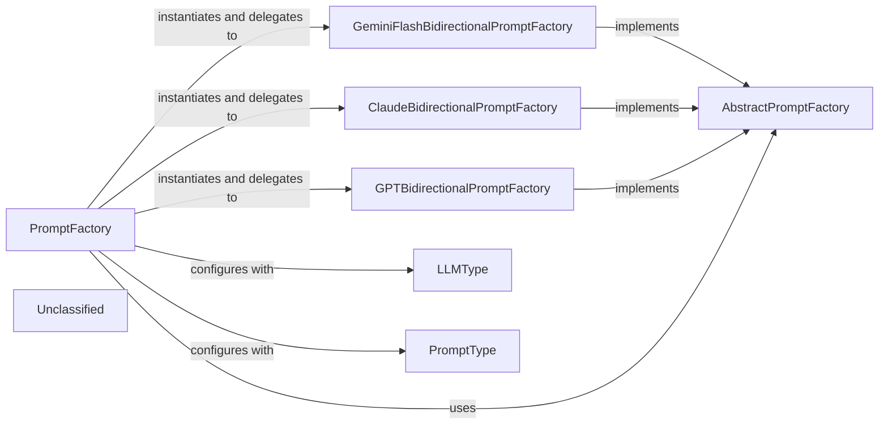

## Details

The LLM Prompt Factory subsystem is structured around a robust Factory pattern. The PromptFactory serves as the central orchestrator, leveraging the LLMType and PromptType enumerations to dynamically select and instantiate the correct concrete prompt factory. All concrete factories (e.g., GeminiFlashBidirectionalPromptFactory, ClaudeBidirectionalPromptFactory, GPTBidirectionalPromptFactory) adhere to the AbstractPromptFactory interface, ensuring a consistent contract for prompt generation. This design promotes high extensibility, allowing new LLM providers or prompt interaction styles to be integrated by simply adding new concrete factory implementations without requiring modifications to the core PromptFactory logic.

### PromptFactory
The primary orchestrator of the subsystem. It dynamically selects and instantiates the appropriate concrete prompt factory based on the specified LLMType and PromptType, then delegates the actual prompt generation. It serves as the main entry point for clients requiring LLM prompts.

**Related Classes/Methods**:

- <a href="https://github.com/CodeBoarding/CodeBoarding/blob/main/.codeboardingagents/prompts/prompt_factory.py" target="_blank" rel="noopener noreferrer">`PromptFactory`</a>

### AbstractPromptFactory
An abstract base class that defines the common interface and contract for all concrete prompt factories. It ensures a consistent method signature for retrieving prompts, promoting architectural consistency and extensibility.

**Related Classes/Methods**:

- <a href="https://github.com/CodeBoarding/CodeBoarding/blob/main/.codeboardingagents/prompts/prompt_factory.py" target="_blank" rel="noopener noreferrer">`AbstractPromptFactory`</a>

### GeminiFlashBidirectionalPromptFactory
A concrete implementation of AbstractPromptFactory responsible for generating bidirectional prompts specifically tailored for Gemini Flash Large Language Models.

**Related Classes/Methods**:

- <a href="https://github.com/CodeBoarding/CodeBoarding/blob/main/.codeboardingagents/prompts/prompt_factory.py" target="_blank" rel="noopener noreferrer">`GeminiFlashBidirectionalPromptFactory`</a>

### ClaudeBidirectionalPromptFactory
A concrete implementation of AbstractPromptFactory that generates bidirectional prompts optimized for Claude Large Language Models.

**Related Classes/Methods**:

- <a href="https://github.com/CodeBoarding/CodeBoarding/blob/main/.codeboardingagents/prompts/prompt_factory.py" target="_blank" rel="noopener noreferrer">`ClaudeBidirectionalPromptFactory`</a>

### GPTBidirectionalPromptFactory
A concrete implementation of AbstractPromptFactory designed to produce bidirectional prompts for GPT Large Language Models.

**Related Classes/Methods**:

- <a href="https://github.com/CodeBoarding/CodeBoarding/blob/main/.codeboardingagents/prompts/prompt_factory.py" target="_blank" rel="noopener noreferrer">`GPTBidirectionalPromptFactory`</a>

### LLMType
An enumeration that defines the distinct types of Large Language Models supported by the system (e.g., GEMINI_FLASH, CLAUDE, GPT4). It acts as a critical configuration parameter for the PromptFactory.

**Related Classes/Methods**:

- <a href="https://github.com/CodeBoarding/CodeBoarding/blob/main/.codeboardingagents/prompts/prompt_factory.py" target="_blank" rel="noopener noreferrer">`LLMType`</a>

### PromptType
An enumeration that specifies the desired interaction style for the prompts (e.g., BIDIRECTIONAL, UNIDIRECTIONAL). It also serves as a configuration parameter for the PromptFactory.

**Related Classes/Methods**:

- <a href="https://github.com/CodeBoarding/CodeBoarding/blob/main/.codeboardingagents/prompts/prompt_factory.py" target="_blank" rel="noopener noreferrer">`PromptType`</a>

### Unclassified
Component for all unclassified files and utility functions (Utility functions/External Libraries/Dependencies)

**Related Classes/Methods**: _None_

### [FAQ](https://github.com/CodeBoarding/GeneratedOnBoardings/tree/main?tab=readme-ov-file#faq)
