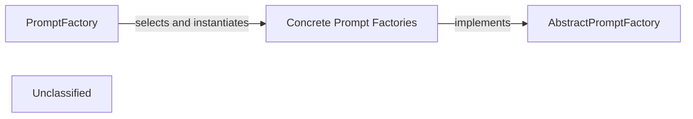

## Details

The prompt management subsystem provides a clear separation of concerns, with PromptFactory acting as a facade for prompt retrieval. An external agent initiates the process by requesting a prompt from PromptFactory, specifying the desired LLMType and PromptType. PromptFactory then uses this information to dynamically select and instantiate the appropriate Concrete Prompt Factory. This concrete factory, which adheres to the AbstractPromptFactory interface, then generates and returns the specific prompt. This design allows for easy addition of new LLM types or prompt interaction patterns by simply creating new concrete factory implementations without altering the core PromptFactory logic.

### PromptFactory
The central orchestrator for creating and managing LLM prompts. It acts as the primary entry point, dynamically selecting and instantiating the appropriate concrete prompt factory based on the desired LLMType (e.g., GEMINI_FLASH, CLAUDE, GPT4) and PromptType (e.g., BIDIRECTIONAL, UNIDIRECTIONAL).

**Related Classes/Methods**:

- <a href="https://github.com/CodeBoarding/CodeBoarding/blob/main/.codeboardingagents/prompts/prompt_factory.py#L26-L32" target="_blank" rel="noopener noreferrer">`LLMType`:26-32</a>
- <a href="https://github.com/CodeBoarding/CodeBoarding/blob/main/.codeboardingagents/prompts/prompt_factory.py#L19-L23" target="_blank" rel="noopener noreferrer">`PromptType`:19-23</a>
- <a href="https://github.com/CodeBoarding/CodeBoarding/blob/main/.codeboardingagents/prompts/abstract_prompt_factory.py" target="_blank" rel="noopener noreferrer">`AbstractPromptFactory`</a>
- <a href="https://github.com/CodeBoarding/CodeBoarding/blob/main/.codeboardingagents/prompts/gemini_flash_prompts_bidirectional.py#L369-L433" target="_blank" rel="noopener noreferrer">`GeminiFlashBidirectionalPromptFactory`:369-433</a>

### AbstractPromptFactory
An abstract base class that defines the contract for all concrete prompt factories. It establishes the interface for retrieving prompts, ensuring a consistent API across different LLM and prompt interaction type implementations.

**Related Classes/Methods**:

- <a href="https://github.com/CodeBoarding/CodeBoarding/blob/main/.codeboardingagents/prompts/abstract_prompt_factory.py" target="_blank" rel="noopener noreferrer">`AbstractPromptFactory`</a>

### Concrete Prompt Factories
A group of specialized implementations of AbstractPromptFactory. Each concrete factory is responsible for encapsulating the specific prompt templates and logic for a particular LLMType and PromptType combination.

**Related Classes/Methods**:

- <a href="https://github.com/CodeBoarding/CodeBoarding/blob/main/.codeboardingagents/prompts/abstract_prompt_factory.py" target="_blank" rel="noopener noreferrer">`AbstractPromptFactory`</a>
- <a href="https://github.com/CodeBoarding/CodeBoarding/blob/main/.codeboardingagents/prompts/gemini_flash_prompts_bidirectional.py#L369-L433" target="_blank" rel="noopener noreferrer">`GeminiFlashBidirectionalPromptFactory`:369-433</a>
- <a href="https://github.com/CodeBoarding/CodeBoarding/blob/main/.codeboardingagents/prompts/claude_prompts_bidirectional.py#L382-L446" target="_blank" rel="noopener noreferrer">`ClaudeBidirectionalPromptFactory`:382-446</a>
- <a href="https://github.com/CodeBoarding/CodeBoarding/blob/main/.codeboardingagents/prompts/gpt_prompts_bidirectional.py#L571-L635" target="_blank" rel="noopener noreferrer">`GPTBidirectionalPromptFactory`:571-635</a>

### Unclassified
Component for all unclassified files and utility functions (Utility functions/External Libraries/Dependencies)

**Related Classes/Methods**: _None_

### [FAQ](https://github.com/CodeBoarding/GeneratedOnBoardings/tree/main?tab=readme-ov-file#faq)
