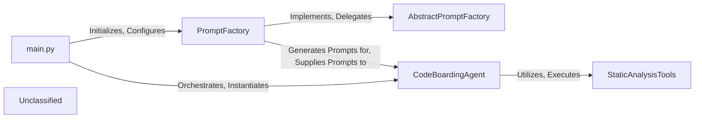

## Details

The application's architecture is centered around an AI-driven code analysis pipeline. The `main.py` component initiates the process, responsible for setting up the environment and orchestrating the core components. It initializes the `PromptFactory`, which serves as the primary orchestrator for dynamically generating and formatting LLM-optimized prompts. These prompts are then consumed by the `CodeBoardingAgent`, the central intelligence component. The `CodeBoardingAgent` leverages an `LLM` for interpretation and generation, and a suite of `StaticAnalysisTools` to gather comprehensive information about the codebase. The `AbstractPromptFactory` defines the contract for prompt generation, ensuring modularity and extensibility within the prompt generation mechanism. This design allows for a flexible and extensible system where prompt generation is decoupled from the agent's core logic, enabling dynamic adaptation to various analysis tasks and LLM types, forming the core of the "AI Interpretation Layer."

### main.py
The central orchestrator responsible for initializing the PromptFactory and managing the CodeBoardingAgent.

**Related Classes/Methods**:

- <a href="https://github.com/CodeBoarding/CodeBoarding/blob/main/.codeboardingmain.py#L340-L431" target="_blank" rel="noopener noreferrer">`main`:340-431</a>

### PromptFactory
Primary orchestrator for dynamically generating and formatting LLM-optimized prompts.

**Related Classes/Methods**:

- <a href="https://github.com/CodeBoarding/CodeBoarding/blob/main/.codeboardingagents/prompts/prompt_factory.py" target="_blank" rel="noopener noreferrer">`PromptFactory`</a>

### AbstractPromptFactory
Defines the interface and contract for prompt generation, ensuring consistency and extensibility.

**Related Classes/Methods**:

- <a href="https://github.com/CodeBoarding/CodeBoarding/blob/main/.codeboardingagents/prompts/abstract_prompt_factory.py" target="_blank" rel="noopener noreferrer">`AbstractPromptFactory`</a>

### CodeBoardingAgent
The central intelligence component that interacts with the LLM, executes tools, and processes information to perform static code analysis and generate insights.

**Related Classes/Methods**:

- <a href="https://github.com/CodeBoarding/CodeBoarding/blob/main/.codeboardingagents/agent.py" target="_blank" rel="noopener noreferrer">`CodeBoardingAgent`</a>

### StaticAnalysisTools
A collection of specialized tools (e.g., CodeReferenceReader, GetCFGTool, FileStructureTool) used by the CodeBoardingAgent to gather information about the codebase.

**Related Classes/Methods**:

- <a href="https://github.com/CodeBoarding/CodeBoarding/blob/main/.codeboardingagents/tools/read_source.py#L26-L114" target="_blank" rel="noopener noreferrer">`CodeReferenceReader`:26-114</a>
- <a href="https://github.com/CodeBoarding/CodeBoarding/blob/main/.codeboardingagents/tools/read_cfg.py#L11-L68" target="_blank" rel="noopener noreferrer">`GetCFGTool`:11-68</a>
- <a href="https://github.com/CodeBoarding/CodeBoarding/blob/main/.codeboardingagents/tools/read_file_structure.py#L21-L126" target="_blank" rel="noopener noreferrer">`FileStructureTool`:21-126</a>

### Unclassified
Component for all unclassified files and utility functions (Utility functions/External Libraries/Dependencies)

**Related Classes/Methods**: _None_

### [FAQ](https://github.com/CodeBoarding/GeneratedOnBoardings/tree/main?tab=readme-ov-file#faq)
