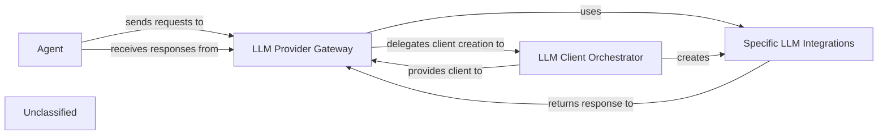

## Details

The `agents` subsystem is centered around the `CodeBoardingAgent`, which acts as the primary `Agent` and also embodies the `LLM Provider Gateway` and `LLM Client Orchestrator` functionalities. The `CodeBoardingAgent` directly manages the selection and initialization of various `Specific LLM Integrations` (e.g., `ChatOpenAI`, `ChatAnthropic`) based on available API keys. This design allows the agent to dynamically adapt to different LLM providers without external factory components. The `Agent` sends requests to the `LLM Provider Gateway` (which is part of itself) and receives responses, abstracting the underlying LLM communication details. The `LLM Client Orchestrator` within the `CodeBoardingAgent` is responsible for instantiating the correct `Specific LLM Integrations`, which then handle the actual communication with external LLM services.

### LLM Provider Gateway [[Expand]](./LLM_Provider_Gateway.md)
This is the overarching conceptual component that acts as a facade for all LLM interactions. It manages the lifecycle of LLM requests, from receiving a request to delegating to the appropriate client and handling initial response processing. It embodies the "Modular Architecture" by providing a consistent interface regardless of the underlying LLM provider.

**Related Classes/Methods**:

- <a href="https://github.com/CodeBoarding/CodeBoarding/blob/main/.codeboardingagents/agent.py#L90-L157" target="_blank" rel="noopener noreferrer">`agents.agent.CodeBoardingAgent._initialize_llm`:90-157</a>

### LLM Client Orchestrator
This component, embodied by the `CodeBoardingAgent`, is responsible for dynamically selecting and initializing specific LLM client implementations (e.g., `ChatOpenAI`, `ChatGoogleGenerativeAI`). It directly manages the configuration and instantiation of various LLM providers based on available API keys, promoting a flexible "Plugin/Extension Architecture" within the agent itself.

**Related Classes/Methods**:

- <a href="https://github.com/CodeBoarding/CodeBoarding/blob/main/.codeboardingagents/agent.py#L90-L157" target="_blank" rel="noopener noreferrer">`agents.agent.CodeBoardingAgent._initialize_llm`:90-157</a>

### Specific LLM Integrations
These are the concrete implementations of various LLM clients (e.g., `ChatOpenAI`, `ChatAnthropic`, `ChatGoogleGenerativeAI`, `ChatBedrockConverse`, `ChatCerebras`, `ChatOllama`) directly used by the `LLM Client Orchestrator`. Each integration handles the unique API calls, authentication, and data formatting for a particular external LLM provider, enforcing "Separation of Concerns" by isolating provider-specific logic.

**Related Classes/Methods**:

- `langchain_openai.ChatOpenAI`:1-10
- `langchain_google_genai.ChatGoogleGenerativeAI`
- `langchain_aws.ChatBedrockConverse`
- `langchain_cerebras.ChatCerebras`:10-25
- `langchain_ollama.ChatOllama`:1-10

### Agent
The primary orchestrator within the `agents` package that initiates requests for LLM interactions. It acts as the consumer of the `LLM Provider Gateway`, abstracting the details of LLM communication from its core reasoning logic. This component is part of the broader "AI Interpretation Layer" and drives the "Data Flow" through the LLM integration.

**Related Classes/Methods**:

- <a href="https://github.com/CodeBoarding/CodeBoarding/blob/main/.codeboardingagents/agent.py#L44-L247" target="_blank" rel="noopener noreferrer">`agents.agent.CodeBoardingAgent`:44-247</a>

### Unclassified
Component for all unclassified files and utility functions (Utility functions/External Libraries/Dependencies)

**Related Classes/Methods**: _None_

### [FAQ](https://github.com/CodeBoarding/GeneratedOnBoardings/tree/main?tab=readme-ov-file#faq)
