```mermaid
graph LR
    Application_Orchestrator["Application Orchestrator"]
    Analysis_Diagram_Generator["Analysis & Diagram Generator"]
    Code_Analysis_Agent["Code Analysis Agent"]
    LLM_Provider_Manager["LLM Provider Manager"]
    External_LLM_Integrations["External LLM Integrations"]
    Unclassified["Unclassified"]
    Application_Orchestrator -- "initiates analysis workflow" --> Analysis_Diagram_Generator
    Application_Orchestrator -- "manages output of" --> Analysis_Diagram_Generator
    Analysis_Diagram_Generator -- "configures and invokes analysis" --> Code_Analysis_Agent
    Code_Analysis_Agent -- "requests LLM client" --> LLM_Provider_Manager
    LLM_Provider_Manager -- "instantiates and configures LLM client" --> External_LLM_Integrations
    Code_Analysis_Agent -- "sends prompts and receives responses" --> External_LLM_Integrations
    Analysis_Diagram_Generator -- "returns analysis results" --> Application_Orchestrator
    click Application_Orchestrator href "https://github.com/CodeBoarding/CodeBoarding/blob/main/.codeboarding/Application_Orchestrator.md" "Details"
```

## Details

The system's architecture is driven by the Application Orchestrator, which manages the end-to-end process of generating architectural documentation from code repositories. It delegates the core analysis tasks to the Analysis & Diagram Generator, which in turn configures and invokes the Code Analysis Agent. This agent, the intelligent core, performs detailed code understanding and interacts with various Large Language Models through the LLM Provider Manager. The LLM Provider Manager dynamically selects and initializes specific External LLM Integrations, enabling the agent to send prompts and receive responses from different LLM services. Finally, the analysis results are returned to the Application Orchestrator for documentation generation and output. This layered approach ensures modularity, flexibility in LLM integration, and a clear separation of concerns across the system.

### Application Orchestrator [[Expand]](./Application_Orchestrator.md)
The central control point of the application, responsible for managing the overall workflow from input (remote/local repositories) to output (analysis and documentation). It handles argument parsing, environment setup, repository cloning, and the high-level coordination of analysis and documentation generation.

**Related Classes/Methods**:

- <a href="https://github.com/CodeBoarding/CodeBoarding/blob/main/.codeboardingmain.py" target="_blank" rel="noopener noreferrer">`main:process_remote_repository`</a>
- <a href="https://github.com/CodeBoarding/CodeBoarding/blob/main/.codeboardingmain.py" target="_blank" rel="noopener noreferrer">`main:process_local_repository`</a>
- <a href="https://github.com/CodeBoarding/CodeBoarding/blob/main/.codeboardingmain.py" target="_blank" rel="noopener noreferrer">`main:generate_analysis`</a>
- <a href="https://github.com/CodeBoarding/CodeBoarding/blob/main/.codeboardingmain.py" target="_blank" rel="noopener noreferrer">`main:generate_markdown_docs`</a>

### Analysis & Diagram Generator
This component orchestrates the static analysis of the codebase and the generation of architectural diagrams and insights. It acts as an interface between the Application Orchestrator and the Code Analysis Agent, preparing the context and processing the results for documentation.

**Related Classes/Methods**:

- <a href="https://github.com/CodeBoarding/CodeBoarding/blob/main/.codeboardingdiagram_analysis/diagram_generator.py#L34-L293" target="_blank" rel="noopener noreferrer">`diagram_analysis.DiagramGenerator`:34-293</a>

### Code Analysis Agent
The intelligent core responsible for understanding the codebase, performing static analysis, and generating architectural insights. It leverages various internal tools and interacts with external LLMs to fulfill its analysis tasks.

**Related Classes/Methods**:

- <a href="https://github.com/CodeBoarding/CodeBoarding/blob/main/.codeboardingagents/agent.py" target="_blank" rel="noopener noreferrer">`agents.agent.CodeBoardingAgent`</a>

### LLM Provider Manager
Manages the dynamic selection and initialization of different Large Language Model clients. It abstracts the complexities of integrating with various LLM providers, allowing the Code Analysis Agent to interact with a unified interface.

**Related Classes/Methods**:

- <a href="https://github.com/CodeBoarding/CodeBoarding/blob/main/.codeboardingagents/agent.py" target="_blank" rel="noopener noreferrer">`agents.agent.CodeBoardingAgent:_initialize_llm`</a>

### External LLM Integrations
Concrete implementations that provide the interface to specific external Large Language Models (e.g., OpenAI, Anthropic, Google Gemini). Each integration handles the unique API calls, authentication, and data formatting required for its respective LLM.

**Related Classes/Methods**:

- `langchain_openai.ChatOpenAI`
- `langchain_anthropic.ChatAnthropic`
- `langchain_google_genai.ChatGoogleGenerativeAI`

### Unclassified
Component for all unclassified files and utility functions (Utility functions/External Libraries/Dependencies)

**Related Classes/Methods**: _None_

### [FAQ](https://github.com/CodeBoarding/GeneratedOnBoardings/tree/main?tab=readme-ov-file#faq)
