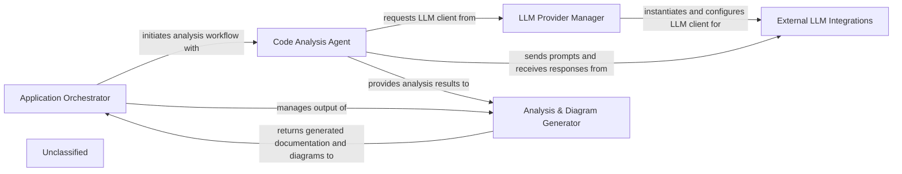

## Details

The system's architecture is orchestrated by the Application Orchestrator, which manages the end-to-end workflow from processing local or remote repositories to generating final architectural documentation. Central to its operation is the Code Analysis Agent, an intelligent core that leverages an enhanced internal LSP Client for deep static analysis, extracting detailed code structure, call graphs, and class hierarchies. This rich code understanding, combined with insights from External LLM Integrations managed by the LLM Provider Manager, allows the agent to generate comprehensive architectural insights. These insights are then processed by the Analysis & Diagram Generator to produce structured documentation and visual diagrams, completing the analysis cycle under the guidance of the Application Orchestrator.

### Application Orchestrator [[Expand]](./Application_Orchestrator.md)
Manages the overall application lifecycle, handling user input, repository setup, and coordinating the analysis and documentation generation. It oversees the end-to-end workflow.

**Related Classes/Methods**:

- `ApplicationOrchestrator`

### Code Analysis Agent
Responsible for in-depth code understanding, performing detailed static analysis using its internal LSP Client, formulating prompts for external LLMs, and generating architectural insights.

**Related Classes/Methods**:

- `CodeAnalysisAgent`

### Analysis & Diagram Generator
Takes comprehensive analysis results from the Code Analysis Agent and transforms them into structured documentation and visual diagrams.

**Related Classes/Methods**:

- `AnalysisDiagramGenerator`

### LLM Provider Manager
Dynamically selects and configures the appropriate External LLM Integration based on the Code Analysis Agent's needs.

**Related Classes/Methods**:

- `LLMProviderManager`

### External LLM Integrations
Represents the various external Large Language Models (e.g., OpenAI, Anthropic, Google Gemini) that the Code Analysis Agent interacts with to send prompts and receive responses.

**Related Classes/Methods**:

- `ExternalLLMIntegration`

### Unclassified
Component for all unclassified files and utility functions (Utility functions/External Libraries/Dependencies)

**Related Classes/Methods**: _None_

### [FAQ](https://github.com/CodeBoarding/GeneratedOnBoardings/tree/main?tab=readme-ov-file#faq)
