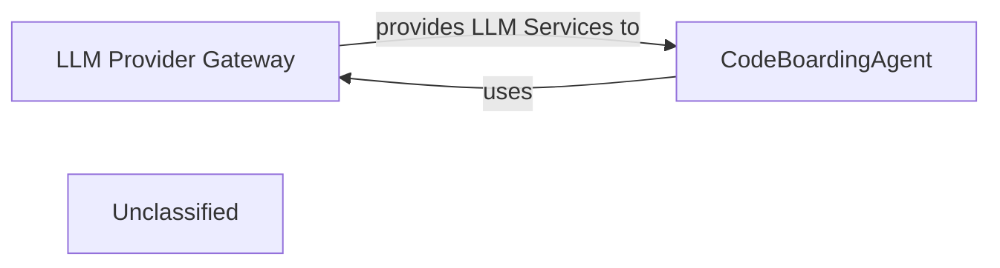

## Details

The system's core functionality revolves around the CodeBoardingAgent within the AI Interpretation Layer, which intelligently processes code and generates documentation. This agent relies heavily on the LLM Provider Gateway to abstract and manage interactions with various Large Language Models. The gateway ensures a standardized interface for LLM communication, handling provider-specific complexities, authentication, and response parsing, thereby enabling the CodeBoardingAgent to focus on its primary task of code interpretation and documentation generation.

### LLM Provider Gateway [[Expand]](./LLM_Provider_Gateway.md)
Provides a unified and consistent API for the AI Interpretation Layer to interact with various Large Language Model providers. It encapsulates provider-specific APIs, manages authentication, executes API calls, parses responses into a standardized format, and implements error handling and retry logic. This component is crucial for abstracting away the complexities of different LLM services, allowing the rest of the system to interact with LLMs uniformly.

**Related Classes/Methods**: _None_

### CodeBoardingAgent
A key component within the AI Interpretation Layer responsible for orchestrating the code analysis and documentation generation process using LLMs. It relies on the LLM Provider Gateway to set up and configure the appropriate LLM instance for its operations, enabling it to interpret code, generate insights, and facilitate the creation of architectural documentation. This agent represents the intelligent core that leverages LLMs for understanding and transforming code.

**Related Classes/Methods**: _None_

### Unclassified
Component for all unclassified files and utility functions (Utility functions/External Libraries/Dependencies)

**Related Classes/Methods**: _None_

### [FAQ](https://github.com/CodeBoarding/GeneratedOnBoardings/tree/main?tab=readme-ov-file#faq)
