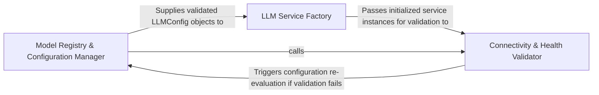

## Details

Configures the reasoning layer by mapping user preferences to LLM service instances and validating API connectivity.

### Model Registry & Configuration Manager
Resolves model identifiers into structured configuration objects by merging environment variables, default settings, and user-provided overrides.

**Related Classes/Methods**: _None_

**Source Files:**

- [`core/plugin_loader.py`](https://github.com/CodeBoarding/CodeBoarding/blob/main/.codeboardingcore/plugin_loader.py)
  - `core.plugin_loader.load_plugins` ([L17-L46](https://github.com/CodeBoarding/CodeBoarding/blob/main/.codeboardingcore/plugin_loader.py#L17-L46)) - Function
- [`repo_utils/__init__.py`](https://github.com/CodeBoarding/CodeBoarding/blob/main/.codeboardingrepo_utils/__init__.py)
  - `repo_utils.__init__.require_git_import` ([L30-L57](https://github.com/CodeBoarding/CodeBoarding/blob/main/.codeboardingrepo_utils/__init__.py#L30-L57)) - Function

### LLM Service Factory
Implements the factory pattern to instantiate provider-specific client objects based on the resolved configuration.

**Related Classes/Methods**: _None_

**Source Files:**

- [`diagram_analysis/__init__.py`](https://github.com/CodeBoarding/CodeBoarding/blob/main/.codeboardingdiagram_analysis/__init__.py)
  - `diagram_analysis.__init__.__getattr__` ([L6-L22](https://github.com/CodeBoarding/CodeBoarding/blob/main/.codeboardingdiagram_analysis/__init__.py#L6-L22)) - Function

### Connectivity & Health Validator
Executes pre-flight checks to ensure API keys are present and the target LLM endpoints are reachable.

**Related Classes/Methods**: _None_

**Source Files:**

- [`repo_utils/__init__.py`](https://github.com/CodeBoarding/CodeBoarding/blob/main/.codeboardingrepo_utils/__init__.py)
  - `repo_utils.__init__.require_git_import.decorator` ([L37-L55](https://github.com/CodeBoarding/CodeBoarding/blob/main/.codeboardingrepo_utils/__init__.py#L37-L55)) - Function

### [FAQ](https://github.com/CodeBoarding/GeneratedOnBoardings/tree/main?tab=readme-ov-file#faq)