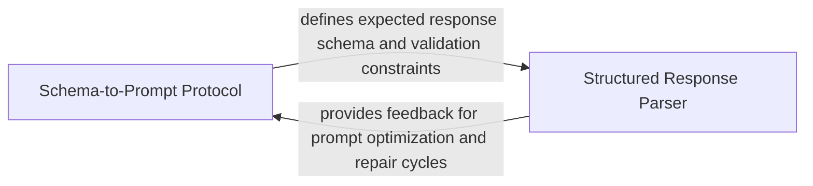

## Details

Defines the foundational protocol for making Pydantic models compatible with LLM extraction, managing JSON schema generation and instruction strings.

### Schema-to-Prompt Protocol
Defines the foundational contract for serializing internal data structures into LLM-compatible schemas and managing instruction injection.

**Related Classes/Methods**: _None_

**Source Files:**

- [`agents/agent_responses.py`](https://github.com/CodeBoarding/CodeBoarding/blob/main/.codeboardingagents/agent_responses.py)
  - `agents.agent_responses.CFGAnalysisInsights.llm_str` ([L710-L716](https://github.com/CodeBoarding/CodeBoarding/blob/main/.codeboardingagents/agent_responses.py#L710-L716)) - Method

### Structured Response Parser
Handles the runtime extraction, validation, and re-hydration of LLM-generated data into the application's internal object model.

**Related Classes/Methods**: _None_

**Source Files:**

- [`agents/agent_responses.py`](https://github.com/CodeBoarding/CodeBoarding/blob/main/.codeboardingagents/agent_responses.py)
  - `agents.agent_responses.CFGComponent.llm_str` ([L694-L701](https://github.com/CodeBoarding/CodeBoarding/blob/main/.codeboardingagents/agent_responses.py#L694-L701)) - Method

### [FAQ](https://github.com/CodeBoarding/GeneratedOnBoardings/tree/main?tab=readme-ov-file#faq)