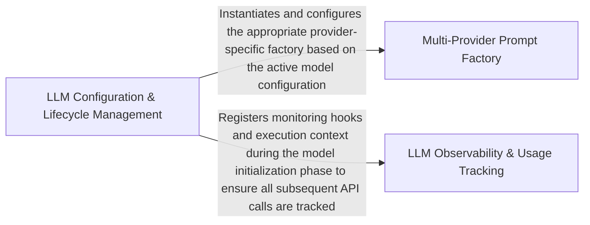

## Details

Handles integration with external LLM providers, including prompt construction, context window management, and API usage monitoring.

### LLM Configuration & Lifecycle Management
Centralizes the management of LLM settings, provider credentials, and model selection. It serves as the primary entry point for the subsystem, orchestrating the initialization of both the prompt generation logic and the monitoring infrastructure based on user configuration.

**Related Classes/Methods**:

- `agents.llm_config.LLMConfig`:64-103
- `agents.llm_config.initialize_llms`:319-322

**Source Files:**

- [`agents/llm_config.py`](https://github.com/CodeBoarding/CodeBoarding/blob/main/.codeboardingagents/llm_config.py)
  - `agents.llm_config.configure_models` ([L34-L60](https://github.com/CodeBoarding/CodeBoarding/blob/main/.codeboardingagents/llm_config.py#L34-L60)) - Function
  - `agents.llm_config.LLMConfig` ([L64-L103](https://github.com/CodeBoarding/CodeBoarding/blob/main/.codeboardingagents/llm_config.py#L64-L103)) - Class
  - `agents.llm_config.LLMConfig.get_api_key` ([L88-L89](https://github.com/CodeBoarding/CodeBoarding/blob/main/.codeboardingagents/llm_config.py#L88-L89)) - Method
  - `agents.llm_config.LLMConfig.is_active` ([L91-L95](https://github.com/CodeBoarding/CodeBoarding/blob/main/.codeboardingagents/llm_config.py#L91-L95)) - Method
  - `agents.llm_config.LLMConfig.get_resolved_extra_args` ([L97-L103](https://github.com/CodeBoarding/CodeBoarding/blob/main/.codeboardingagents/llm_config.py#L97-L103)) - Method
  - `agents.llm_config._initialize_llm` ([L254-L295](https://github.com/CodeBoarding/CodeBoarding/blob/main/.codeboardingagents/llm_config.py#L254-L295)) - Function
  - `agents.llm_config.validate_api_key_provided` ([L298-L305](https://github.com/CodeBoarding/CodeBoarding/blob/main/.codeboardingagents/llm_config.py#L298-L305)) - Function
  - `agents.llm_config.initialize_agent_llm` ([L308-L311](https://github.com/CodeBoarding/CodeBoarding/blob/main/.codeboardingagents/llm_config.py#L308-L311)) - Function
  - `agents.llm_config.initialize_parsing_llm` ([L314-L316](https://github.com/CodeBoarding/CodeBoarding/blob/main/.codeboardingagents/llm_config.py#L314-L316)) - Function
  - `agents.llm_config.initialize_llms` ([L319-L322](https://github.com/CodeBoarding/CodeBoarding/blob/main/.codeboardingagents/llm_config.py#L319-L322)) - Function
- [`agents/prompts/prompt_factory.py`](https://github.com/CodeBoarding/CodeBoarding/blob/main/.codeboardingagents/prompts/prompt_factory.py)
  - `agents.prompts.prompt_factory.LLMType.from_model_name` ([L30-L46](https://github.com/CodeBoarding/CodeBoarding/blob/main/.codeboardingagents/prompts/prompt_factory.py#L30-L46)) - Method

### Multi-Provider Prompt Factory
Implements a polymorphic prompt generation system that translates high-level agent requests into provider-specific instructions. It uses an Abstract Factory pattern to handle the syntactic and structural differences between models (e.g., Claude's XML-ish prompts vs. GPT's system messages).

**Related Classes/Methods**:

- `agents.prompts.prompt_factory.PromptFactory`:49-99
- `agents.prompts.abstract_prompt_factory.AbstractPromptFactory`:10-59
- `agents.prompts.prompt_factory.get_system_message`:130-131

**Source Files:**

- [`agents/prompts/__init__.py`](https://github.com/CodeBoarding/CodeBoarding/blob/main/.codeboardingagents/prompts/__init__.py)
  - `agents.prompts.__init__.__getattr__` ([L35-L47](https://github.com/CodeBoarding/CodeBoarding/blob/main/.codeboardingagents/prompts/__init__.py#L35-L47)) - Function
- [`agents/prompts/abstract_prompt_factory.py`](https://github.com/CodeBoarding/CodeBoarding/blob/main/.codeboardingagents/prompts/abstract_prompt_factory.py)
  - `agents.prompts.abstract_prompt_factory.AbstractPromptFactory` ([L10-L59](https://github.com/CodeBoarding/CodeBoarding/blob/main/.codeboardingagents/prompts/abstract_prompt_factory.py#L10-L59)) - Class
  - `agents.prompts.abstract_prompt_factory.AbstractPromptFactory.get_system_message` ([L14-L15](https://github.com/CodeBoarding/CodeBoarding/blob/main/.codeboardingagents/prompts/abstract_prompt_factory.py#L14-L15)) - Method
  - `agents.prompts.abstract_prompt_factory.AbstractPromptFactory.get_cluster_grouping_message` ([L18-L19](https://github.com/CodeBoarding/CodeBoarding/blob/main/.codeboardingagents/prompts/abstract_prompt_factory.py#L18-L19)) - Method
  - `agents.prompts.abstract_prompt_factory.AbstractPromptFactory.get_final_analysis_message` ([L22-L23](https://github.com/CodeBoarding/CodeBoarding/blob/main/.codeboardingagents/prompts/abstract_prompt_factory.py#L22-L23)) - Method
  - `agents.prompts.abstract_prompt_factory.AbstractPromptFactory.get_planner_system_message` ([L26-L27](https://github.com/CodeBoarding/CodeBoarding/blob/main/.codeboardingagents/prompts/abstract_prompt_factory.py#L26-L27)) - Method
  - `agents.prompts.abstract_prompt_factory.AbstractPromptFactory.get_expansion_prompt` ([L30-L31](https://github.com/CodeBoarding/CodeBoarding/blob/main/.codeboardingagents/prompts/abstract_prompt_factory.py#L30-L31)) - Method
  - `agents.prompts.abstract_prompt_factory.AbstractPromptFactory.get_system_meta_analysis_message` ([L34-L35](https://github.com/CodeBoarding/CodeBoarding/blob/main/.codeboardingagents/prompts/abstract_prompt_factory.py#L34-L35)) - Method
  - `agents.prompts.abstract_prompt_factory.AbstractPromptFactory.get_meta_information_prompt` ([L38-L39](https://github.com/CodeBoarding/CodeBoarding/blob/main/.codeboardingagents/prompts/abstract_prompt_factory.py#L38-L39)) - Method
  - `agents.prompts.abstract_prompt_factory.AbstractPromptFactory.get_file_classification_message` ([L42-L43](https://github.com/CodeBoarding/CodeBoarding/blob/main/.codeboardingagents/prompts/abstract_prompt_factory.py#L42-L43)) - Method
  - `agents.prompts.abstract_prompt_factory.AbstractPromptFactory.get_validation_feedback_message` ([L46-L47](https://github.com/CodeBoarding/CodeBoarding/blob/main/.codeboardingagents/prompts/abstract_prompt_factory.py#L46-L47)) - Method
  - `agents.prompts.abstract_prompt_factory.AbstractPromptFactory.get_system_details_message` ([L50-L51](https://github.com/CodeBoarding/CodeBoarding/blob/main/.codeboardingagents/prompts/abstract_prompt_factory.py#L50-L51)) - Method
  - `agents.prompts.abstract_prompt_factory.AbstractPromptFactory.get_cfg_details_message` ([L54-L55](https://github.com/CodeBoarding/CodeBoarding/blob/main/.codeboardingagents/prompts/abstract_prompt_factory.py#L54-L55)) - Method
  - `agents.prompts.abstract_prompt_factory.AbstractPromptFactory.get_details_message` ([L58-L59](https://github.com/CodeBoarding/CodeBoarding/blob/main/.codeboardingagents/prompts/abstract_prompt_factory.py#L58-L59)) - Method
- [`agents/prompts/claude_prompts.py`](https://github.com/CodeBoarding/CodeBoarding/blob/main/.codeboardingagents/prompts/claude_prompts.py)
  - `agents.prompts.claude_prompts.ClaudePromptFactory` ([L344-L390](https://github.com/CodeBoarding/CodeBoarding/blob/main/.codeboardingagents/prompts/claude_prompts.py#L344-L390)) - Class
  - `agents.prompts.claude_prompts.ClaudePromptFactory.get_system_message` ([L347-L348](https://github.com/CodeBoarding/CodeBoarding/blob/main/.codeboardingagents/prompts/claude_prompts.py#L347-L348)) - Method
  - `agents.prompts.claude_prompts.ClaudePromptFactory.get_cluster_grouping_message` ([L350-L351](https://github.com/CodeBoarding/CodeBoarding/blob/main/.codeboardingagents/prompts/claude_prompts.py#L350-L351)) - Method
  - `agents.prompts.claude_prompts.ClaudePromptFactory.get_final_analysis_message` ([L353-L354](https://github.com/CodeBoarding/CodeBoarding/blob/main/.codeboardingagents/prompts/claude_prompts.py#L353-L354)) - Method
  - `agents.prompts.claude_prompts.ClaudePromptFactory.get_planner_system_message` ([L356-L357](https://github.com/CodeBoarding/CodeBoarding/blob/main/.codeboardingagents/prompts/claude_prompts.py#L356-L357)) - Method
  - `agents.prompts.claude_prompts.ClaudePromptFactory.get_expansion_prompt` ([L359-L360](https://github.com/CodeBoarding/CodeBoarding/blob/main/.codeboardingagents/prompts/claude_prompts.py#L359-L360)) - Method
  - `agents.prompts.claude_prompts.ClaudePromptFactory.get_validator_system_message` ([L362-L363](https://github.com/CodeBoarding/CodeBoarding/blob/main/.codeboardingagents/prompts/claude_prompts.py#L362-L363)) - Method
  - `agents.prompts.claude_prompts.ClaudePromptFactory.get_component_validation_component` ([L365-L366](https://github.com/CodeBoarding/CodeBoarding/blob/main/.codeboardingagents/prompts/claude_prompts.py#L365-L366)) - Method
  - `agents.prompts.claude_prompts.ClaudePromptFactory.get_relationships_validation` ([L368-L369](https://github.com/CodeBoarding/CodeBoarding/blob/main/.codeboardingagents/prompts/claude_prompts.py#L368-L369)) - Method
  - `agents.prompts.claude_prompts.ClaudePromptFactory.get_system_meta_analysis_message` ([L371-L372](https://github.com/CodeBoarding/CodeBoarding/blob/main/.codeboardingagents/prompts/claude_prompts.py#L371-L372)) - Method
  - `agents.prompts.claude_prompts.ClaudePromptFactory.get_meta_information_prompt` ([L374-L375](https://github.com/CodeBoarding/CodeBoarding/blob/main/.codeboardingagents/prompts/claude_prompts.py#L374-L375)) - Method
  - `agents.prompts.claude_prompts.ClaudePromptFactory.get_file_classification_message` ([L377-L378](https://github.com/CodeBoarding/CodeBoarding/blob/main/.codeboardingagents/prompts/claude_prompts.py#L377-L378)) - Method
  - `agents.prompts.claude_prompts.ClaudePromptFactory.get_validation_feedback_message` ([L380-L381](https://github.com/CodeBoarding/CodeBoarding/blob/main/.codeboardingagents/prompts/claude_prompts.py#L380-L381)) - Method
  - `agents.prompts.claude_prompts.ClaudePromptFactory.get_system_details_message` ([L383-L384](https://github.com/CodeBoarding/CodeBoarding/blob/main/.codeboardingagents/prompts/claude_prompts.py#L383-L384)) - Method
  - `agents.prompts.claude_prompts.ClaudePromptFactory.get_cfg_details_message` ([L386-L387](https://github.com/CodeBoarding/CodeBoarding/blob/main/.codeboardingagents/prompts/claude_prompts.py#L386-L387)) - Method
  - `agents.prompts.claude_prompts.ClaudePromptFactory.get_details_message` ([L389-L390](https://github.com/CodeBoarding/CodeBoarding/blob/main/.codeboardingagents/prompts/claude_prompts.py#L389-L390)) - Method
- [`agents/prompts/deepseek_prompts.py`](https://github.com/CodeBoarding/CodeBoarding/blob/main/.codeboardingagents/prompts/deepseek_prompts.py)
  - `agents.prompts.deepseek_prompts.DeepSeekPromptFactory` ([L349-L395](https://github.com/CodeBoarding/CodeBoarding/blob/main/.codeboardingagents/prompts/deepseek_prompts.py#L349-L395)) - Class
  - `agents.prompts.deepseek_prompts.DeepSeekPromptFactory.get_system_message` ([L352-L353](https://github.com/CodeBoarding/CodeBoarding/blob/main/.codeboardingagents/prompts/deepseek_prompts.py#L352-L353)) - Method
  - `agents.prompts.deepseek_prompts.DeepSeekPromptFactory.get_cluster_grouping_message` ([L355-L356](https://github.com/CodeBoarding/CodeBoarding/blob/main/.codeboardingagents/prompts/deepseek_prompts.py#L355-L356)) - Method
  - `agents.prompts.deepseek_prompts.DeepSeekPromptFactory.get_final_analysis_message` ([L358-L359](https://github.com/CodeBoarding/CodeBoarding/blob/main/.codeboardingagents/prompts/deepseek_prompts.py#L358-L359)) - Method
  - `agents.prompts.deepseek_prompts.DeepSeekPromptFactory.get_planner_system_message` ([L361-L362](https://github.com/CodeBoarding/CodeBoarding/blob/main/.codeboardingagents/prompts/deepseek_prompts.py#L361-L362)) - Method
  - `agents.prompts.deepseek_prompts.DeepSeekPromptFactory.get_expansion_prompt` ([L364-L365](https://github.com/CodeBoarding/CodeBoarding/blob/main/.codeboardingagents/prompts/deepseek_prompts.py#L364-L365)) - Method
  - `agents.prompts.deepseek_prompts.DeepSeekPromptFactory.get_validator_system_message` ([L367-L368](https://github.com/CodeBoarding/CodeBoarding/blob/main/.codeboardingagents/prompts/deepseek_prompts.py#L367-L368)) - Method
  - `agents.prompts.deepseek_prompts.DeepSeekPromptFactory.get_component_validation_component` ([L370-L371](https://github.com/CodeBoarding/CodeBoarding/blob/main/.codeboardingagents/prompts/deepseek_prompts.py#L370-L371)) - Method
  - `agents.prompts.deepseek_prompts.DeepSeekPromptFactory.get_relationships_validation` ([L373-L374](https://github.com/CodeBoarding/CodeBoarding/blob/main/.codeboardingagents/prompts/deepseek_prompts.py#L373-L374)) - Method
  - `agents.prompts.deepseek_prompts.DeepSeekPromptFactory.get_system_meta_analysis_message` ([L376-L377](https://github.com/CodeBoarding/CodeBoarding/blob/main/.codeboardingagents/prompts/deepseek_prompts.py#L376-L377)) - Method
  - `agents.prompts.deepseek_prompts.DeepSeekPromptFactory.get_meta_information_prompt` ([L379-L380](https://github.com/CodeBoarding/CodeBoarding/blob/main/.codeboardingagents/prompts/deepseek_prompts.py#L379-L380)) - Method
  - `agents.prompts.deepseek_prompts.DeepSeekPromptFactory.get_file_classification_message` ([L382-L383](https://github.com/CodeBoarding/CodeBoarding/blob/main/.codeboardingagents/prompts/deepseek_prompts.py#L382-L383)) - Method
  - `agents.prompts.deepseek_prompts.DeepSeekPromptFactory.get_validation_feedback_message` ([L385-L386](https://github.com/CodeBoarding/CodeBoarding/blob/main/.codeboardingagents/prompts/deepseek_prompts.py#L385-L386)) - Method
  - `agents.prompts.deepseek_prompts.DeepSeekPromptFactory.get_system_details_message` ([L388-L389](https://github.com/CodeBoarding/CodeBoarding/blob/main/.codeboardingagents/prompts/deepseek_prompts.py#L388-L389)) - Method
  - `agents.prompts.deepseek_prompts.DeepSeekPromptFactory.get_cfg_details_message` ([L391-L392](https://github.com/CodeBoarding/CodeBoarding/blob/main/.codeboardingagents/prompts/deepseek_prompts.py#L391-L392)) - Method
  - `agents.prompts.deepseek_prompts.DeepSeekPromptFactory.get_details_message` ([L394-L395](https://github.com/CodeBoarding/CodeBoarding/blob/main/.codeboardingagents/prompts/deepseek_prompts.py#L394-L395)) - Method
- [`agents/prompts/gemini_flash_prompts.py`](https://github.com/CodeBoarding/CodeBoarding/blob/main/.codeboardingagents/prompts/gemini_flash_prompts.py)
  - `agents.prompts.gemini_flash_prompts.GeminiFlashPromptFactory` ([L329-L375](https://github.com/CodeBoarding/CodeBoarding/blob/main/.codeboardingagents/prompts/gemini_flash_prompts.py#L329-L375)) - Class
  - `agents.prompts.gemini_flash_prompts.GeminiFlashPromptFactory.get_system_message` ([L332-L333](https://github.com/CodeBoarding/CodeBoarding/blob/main/.codeboardingagents/prompts/gemini_flash_prompts.py#L332-L333)) - Method
  - `agents.prompts.gemini_flash_prompts.GeminiFlashPromptFactory.get_cluster_grouping_message` ([L335-L336](https://github.com/CodeBoarding/CodeBoarding/blob/main/.codeboardingagents/prompts/gemini_flash_prompts.py#L335-L336)) - Method
  - `agents.prompts.gemini_flash_prompts.GeminiFlashPromptFactory.get_final_analysis_message` ([L338-L339](https://github.com/CodeBoarding/CodeBoarding/blob/main/.codeboardingagents/prompts/gemini_flash_prompts.py#L338-L339)) - Method
  - `agents.prompts.gemini_flash_prompts.GeminiFlashPromptFactory.get_planner_system_message` ([L341-L342](https://github.com/CodeBoarding/CodeBoarding/blob/main/.codeboardingagents/prompts/gemini_flash_prompts.py#L341-L342)) - Method
  - `agents.prompts.gemini_flash_prompts.GeminiFlashPromptFactory.get_expansion_prompt` ([L344-L345](https://github.com/CodeBoarding/CodeBoarding/blob/main/.codeboardingagents/prompts/gemini_flash_prompts.py#L344-L345)) - Method
  - `agents.prompts.gemini_flash_prompts.GeminiFlashPromptFactory.get_validator_system_message` ([L347-L348](https://github.com/CodeBoarding/CodeBoarding/blob/main/.codeboardingagents/prompts/gemini_flash_prompts.py#L347-L348)) - Method
  - `agents.prompts.gemini_flash_prompts.GeminiFlashPromptFactory.get_component_validation_component` ([L350-L351](https://github.com/CodeBoarding/CodeBoarding/blob/main/.codeboardingagents/prompts/gemini_flash_prompts.py#L350-L351)) - Method
  - `agents.prompts.gemini_flash_prompts.GeminiFlashPromptFactory.get_relationships_validation` ([L353-L354](https://github.com/CodeBoarding/CodeBoarding/blob/main/.codeboardingagents/prompts/gemini_flash_prompts.py#L353-L354)) - Method
  - `agents.prompts.gemini_flash_prompts.GeminiFlashPromptFactory.get_system_meta_analysis_message` ([L356-L357](https://github.com/CodeBoarding/CodeBoarding/blob/main/.codeboardingagents/prompts/gemini_flash_prompts.py#L356-L357)) - Method
  - `agents.prompts.gemini_flash_prompts.GeminiFlashPromptFactory.get_meta_information_prompt` ([L359-L360](https://github.com/CodeBoarding/CodeBoarding/blob/main/.codeboardingagents/prompts/gemini_flash_prompts.py#L359-L360)) - Method
  - `agents.prompts.gemini_flash_prompts.GeminiFlashPromptFactory.get_file_classification_message` ([L362-L363](https://github.com/CodeBoarding/CodeBoarding/blob/main/.codeboardingagents/prompts/gemini_flash_prompts.py#L362-L363)) - Method
  - `agents.prompts.gemini_flash_prompts.GeminiFlashPromptFactory.get_validation_feedback_message` ([L365-L366](https://github.com/CodeBoarding/CodeBoarding/blob/main/.codeboardingagents/prompts/gemini_flash_prompts.py#L365-L366)) - Method
  - `agents.prompts.gemini_flash_prompts.GeminiFlashPromptFactory.get_system_details_message` ([L368-L369](https://github.com/CodeBoarding/CodeBoarding/blob/main/.codeboardingagents/prompts/gemini_flash_prompts.py#L368-L369)) - Method
  - `agents.prompts.gemini_flash_prompts.GeminiFlashPromptFactory.get_cfg_details_message` ([L371-L372](https://github.com/CodeBoarding/CodeBoarding/blob/main/.codeboardingagents/prompts/gemini_flash_prompts.py#L371-L372)) - Method
  - `agents.prompts.gemini_flash_prompts.GeminiFlashPromptFactory.get_details_message` ([L374-L375](https://github.com/CodeBoarding/CodeBoarding/blob/main/.codeboardingagents/prompts/gemini_flash_prompts.py#L374-L375)) - Method
- [`agents/prompts/glm_prompts.py`](https://github.com/CodeBoarding/CodeBoarding/blob/main/.codeboardingagents/prompts/glm_prompts.py)
  - `agents.prompts.glm_prompts.GLMPromptFactory` ([L368-L414](https://github.com/CodeBoarding/CodeBoarding/blob/main/.codeboardingagents/prompts/glm_prompts.py#L368-L414)) - Class
  - `agents.prompts.glm_prompts.GLMPromptFactory.get_system_message` ([L371-L372](https://github.com/CodeBoarding/CodeBoarding/blob/main/.codeboardingagents/prompts/glm_prompts.py#L371-L372)) - Method
  - `agents.prompts.glm_prompts.GLMPromptFactory.get_cluster_grouping_message` ([L374-L375](https://github.com/CodeBoarding/CodeBoarding/blob/main/.codeboardingagents/prompts/glm_prompts.py#L374-L375)) - Method
  - `agents.prompts.glm_prompts.GLMPromptFactory.get_final_analysis_message` ([L377-L378](https://github.com/CodeBoarding/CodeBoarding/blob/main/.codeboardingagents/prompts/glm_prompts.py#L377-L378)) - Method
  - `agents.prompts.glm_prompts.GLMPromptFactory.get_planner_system_message` ([L380-L381](https://github.com/CodeBoarding/CodeBoarding/blob/main/.codeboardingagents/prompts/glm_prompts.py#L380-L381)) - Method
  - `agents.prompts.glm_prompts.GLMPromptFactory.get_expansion_prompt` ([L383-L384](https://github.com/CodeBoarding/CodeBoarding/blob/main/.codeboardingagents/prompts/glm_prompts.py#L383-L384)) - Method
  - `agents.prompts.glm_prompts.GLMPromptFactory.get_validator_system_message` ([L386-L387](https://github.com/CodeBoarding/CodeBoarding/blob/main/.codeboardingagents/prompts/glm_prompts.py#L386-L387)) - Method
  - `agents.prompts.glm_prompts.GLMPromptFactory.get_component_validation_component` ([L389-L390](https://github.com/CodeBoarding/CodeBoarding/blob/main/.codeboardingagents/prompts/glm_prompts.py#L389-L390)) - Method
  - `agents.prompts.glm_prompts.GLMPromptFactory.get_relationships_validation` ([L392-L393](https://github.com/CodeBoarding/CodeBoarding/blob/main/.codeboardingagents/prompts/glm_prompts.py#L392-L393)) - Method
  - `agents.prompts.glm_prompts.GLMPromptFactory.get_system_meta_analysis_message` ([L395-L396](https://github.com/CodeBoarding/CodeBoarding/blob/main/.codeboardingagents/prompts/glm_prompts.py#L395-L396)) - Method
  - `agents.prompts.glm_prompts.GLMPromptFactory.get_meta_information_prompt` ([L398-L399](https://github.com/CodeBoarding/CodeBoarding/blob/main/.codeboardingagents/prompts/glm_prompts.py#L398-L399)) - Method
  - `agents.prompts.glm_prompts.GLMPromptFactory.get_file_classification_message` ([L401-L402](https://github.com/CodeBoarding/CodeBoarding/blob/main/.codeboardingagents/prompts/glm_prompts.py#L401-L402)) - Method
  - `agents.prompts.glm_prompts.GLMPromptFactory.get_validation_feedback_message` ([L404-L405](https://github.com/CodeBoarding/CodeBoarding/blob/main/.codeboardingagents/prompts/glm_prompts.py#L404-L405)) - Method
  - `agents.prompts.glm_prompts.GLMPromptFactory.get_system_details_message` ([L407-L408](https://github.com/CodeBoarding/CodeBoarding/blob/main/.codeboardingagents/prompts/glm_prompts.py#L407-L408)) - Method
  - `agents.prompts.glm_prompts.GLMPromptFactory.get_cfg_details_message` ([L410-L411](https://github.com/CodeBoarding/CodeBoarding/blob/main/.codeboardingagents/prompts/glm_prompts.py#L410-L411)) - Method
  - `agents.prompts.glm_prompts.GLMPromptFactory.get_details_message` ([L413-L414](https://github.com/CodeBoarding/CodeBoarding/blob/main/.codeboardingagents/prompts/glm_prompts.py#L413-L414)) - Method
- [`agents/prompts/gpt_prompts.py`](https://github.com/CodeBoarding/CodeBoarding/blob/main/.codeboardingagents/prompts/gpt_prompts.py)
  - `agents.prompts.gpt_prompts.GPTPromptFactory` ([L433-L479](https://github.com/CodeBoarding/CodeBoarding/blob/main/.codeboardingagents/prompts/gpt_prompts.py#L433-L479)) - Class
  - `agents.prompts.gpt_prompts.GPTPromptFactory.get_system_message` ([L436-L437](https://github.com/CodeBoarding/CodeBoarding/blob/main/.codeboardingagents/prompts/gpt_prompts.py#L436-L437)) - Method
  - `agents.prompts.gpt_prompts.GPTPromptFactory.get_cluster_grouping_message` ([L439-L440](https://github.com/CodeBoarding/CodeBoarding/blob/main/.codeboardingagents/prompts/gpt_prompts.py#L439-L440)) - Method
  - `agents.prompts.gpt_prompts.GPTPromptFactory.get_final_analysis_message` ([L442-L443](https://github.com/CodeBoarding/CodeBoarding/blob/main/.codeboardingagents/prompts/gpt_prompts.py#L442-L443)) - Method
  - `agents.prompts.gpt_prompts.GPTPromptFactory.get_planner_system_message` ([L445-L446](https://github.com/CodeBoarding/CodeBoarding/blob/main/.codeboardingagents/prompts/gpt_prompts.py#L445-L446)) - Method
  - `agents.prompts.gpt_prompts.GPTPromptFactory.get_expansion_prompt` ([L448-L449](https://github.com/CodeBoarding/CodeBoarding/blob/main/.codeboardingagents/prompts/gpt_prompts.py#L448-L449)) - Method
  - `agents.prompts.gpt_prompts.GPTPromptFactory.get_validator_system_message` ([L451-L452](https://github.com/CodeBoarding/CodeBoarding/blob/main/.codeboardingagents/prompts/gpt_prompts.py#L451-L452)) - Method
  - `agents.prompts.gpt_prompts.GPTPromptFactory.get_component_validation_component` ([L454-L455](https://github.com/CodeBoarding/CodeBoarding/blob/main/.codeboardingagents/prompts/gpt_prompts.py#L454-L455)) - Method
  - `agents.prompts.gpt_prompts.GPTPromptFactory.get_relationships_validation` ([L457-L458](https://github.com/CodeBoarding/CodeBoarding/blob/main/.codeboardingagents/prompts/gpt_prompts.py#L457-L458)) - Method
  - `agents.prompts.gpt_prompts.GPTPromptFactory.get_system_meta_analysis_message` ([L460-L461](https://github.com/CodeBoarding/CodeBoarding/blob/main/.codeboardingagents/prompts/gpt_prompts.py#L460-L461)) - Method
  - `agents.prompts.gpt_prompts.GPTPromptFactory.get_meta_information_prompt` ([L463-L464](https://github.com/CodeBoarding/CodeBoarding/blob/main/.codeboardingagents/prompts/gpt_prompts.py#L463-L464)) - Method
  - `agents.prompts.gpt_prompts.GPTPromptFactory.get_file_classification_message` ([L466-L467](https://github.com/CodeBoarding/CodeBoarding/blob/main/.codeboardingagents/prompts/gpt_prompts.py#L466-L467)) - Method
  - `agents.prompts.gpt_prompts.GPTPromptFactory.get_validation_feedback_message` ([L469-L470](https://github.com/CodeBoarding/CodeBoarding/blob/main/.codeboardingagents/prompts/gpt_prompts.py#L469-L470)) - Method
  - `agents.prompts.gpt_prompts.GPTPromptFactory.get_system_details_message` ([L472-L473](https://github.com/CodeBoarding/CodeBoarding/blob/main/.codeboardingagents/prompts/gpt_prompts.py#L472-L473)) - Method
  - `agents.prompts.gpt_prompts.GPTPromptFactory.get_cfg_details_message` ([L475-L476](https://github.com/CodeBoarding/CodeBoarding/blob/main/.codeboardingagents/prompts/gpt_prompts.py#L475-L476)) - Method
  - `agents.prompts.gpt_prompts.GPTPromptFactory.get_details_message` ([L478-L479](https://github.com/CodeBoarding/CodeBoarding/blob/main/.codeboardingagents/prompts/gpt_prompts.py#L478-L479)) - Method
- [`agents/prompts/kimi_prompts.py`](https://github.com/CodeBoarding/CodeBoarding/blob/main/.codeboardingagents/prompts/kimi_prompts.py)
  - `agents.prompts.kimi_prompts.KimiPromptFactory` ([L356-L402](https://github.com/CodeBoarding/CodeBoarding/blob/main/.codeboardingagents/prompts/kimi_prompts.py#L356-L402)) - Class
  - `agents.prompts.kimi_prompts.KimiPromptFactory.get_system_message` ([L359-L360](https://github.com/CodeBoarding/CodeBoarding/blob/main/.codeboardingagents/prompts/kimi_prompts.py#L359-L360)) - Method
  - `agents.prompts.kimi_prompts.KimiPromptFactory.get_cluster_grouping_message` ([L362-L363](https://github.com/CodeBoarding/CodeBoarding/blob/main/.codeboardingagents/prompts/kimi_prompts.py#L362-L363)) - Method
  - `agents.prompts.kimi_prompts.KimiPromptFactory.get_final_analysis_message` ([L365-L366](https://github.com/CodeBoarding/CodeBoarding/blob/main/.codeboardingagents/prompts/kimi_prompts.py#L365-L366)) - Method
  - `agents.prompts.kimi_prompts.KimiPromptFactory.get_planner_system_message` ([L368-L369](https://github.com/CodeBoarding/CodeBoarding/blob/main/.codeboardingagents/prompts/kimi_prompts.py#L368-L369)) - Method
  - `agents.prompts.kimi_prompts.KimiPromptFactory.get_expansion_prompt` ([L371-L372](https://github.com/CodeBoarding/CodeBoarding/blob/main/.codeboardingagents/prompts/kimi_prompts.py#L371-L372)) - Method
  - `agents.prompts.kimi_prompts.KimiPromptFactory.get_validator_system_message` ([L374-L375](https://github.com/CodeBoarding/CodeBoarding/blob/main/.codeboardingagents/prompts/kimi_prompts.py#L374-L375)) - Method
  - `agents.prompts.kimi_prompts.KimiPromptFactory.get_component_validation_component` ([L377-L378](https://github.com/CodeBoarding/CodeBoarding/blob/main/.codeboardingagents/prompts/kimi_prompts.py#L377-L378)) - Method
  - `agents.prompts.kimi_prompts.KimiPromptFactory.get_relationships_validation` ([L380-L381](https://github.com/CodeBoarding/CodeBoarding/blob/main/.codeboardingagents/prompts/kimi_prompts.py#L380-L381)) - Method
  - `agents.prompts.kimi_prompts.KimiPromptFactory.get_system_meta_analysis_message` ([L383-L384](https://github.com/CodeBoarding/CodeBoarding/blob/main/.codeboardingagents/prompts/kimi_prompts.py#L383-L384)) - Method
  - `agents.prompts.kimi_prompts.KimiPromptFactory.get_meta_information_prompt` ([L386-L387](https://github.com/CodeBoarding/CodeBoarding/blob/main/.codeboardingagents/prompts/kimi_prompts.py#L386-L387)) - Method
  - `agents.prompts.kimi_prompts.KimiPromptFactory.get_file_classification_message` ([L389-L390](https://github.com/CodeBoarding/CodeBoarding/blob/main/.codeboardingagents/prompts/kimi_prompts.py#L389-L390)) - Method
  - `agents.prompts.kimi_prompts.KimiPromptFactory.get_validation_feedback_message` ([L392-L393](https://github.com/CodeBoarding/CodeBoarding/blob/main/.codeboardingagents/prompts/kimi_prompts.py#L392-L393)) - Method
  - `agents.prompts.kimi_prompts.KimiPromptFactory.get_system_details_message` ([L395-L396](https://github.com/CodeBoarding/CodeBoarding/blob/main/.codeboardingagents/prompts/kimi_prompts.py#L395-L396)) - Method
  - `agents.prompts.kimi_prompts.KimiPromptFactory.get_cfg_details_message` ([L398-L399](https://github.com/CodeBoarding/CodeBoarding/blob/main/.codeboardingagents/prompts/kimi_prompts.py#L398-L399)) - Method
  - `agents.prompts.kimi_prompts.KimiPromptFactory.get_details_message` ([L401-L402](https://github.com/CodeBoarding/CodeBoarding/blob/main/.codeboardingagents/prompts/kimi_prompts.py#L401-L402)) - Method
- [`agents/prompts/prompt_factory.py`](https://github.com/CodeBoarding/CodeBoarding/blob/main/.codeboardingagents/prompts/prompt_factory.py)
  - `agents.prompts.prompt_factory.LLMType` ([L20-L46](https://github.com/CodeBoarding/CodeBoarding/blob/main/.codeboardingagents/prompts/prompt_factory.py#L20-L46)) - Class
  - `agents.prompts.prompt_factory.PromptFactory` ([L49-L99](https://github.com/CodeBoarding/CodeBoarding/blob/main/.codeboardingagents/prompts/prompt_factory.py#L49-L99)) - Class
  - `agents.prompts.prompt_factory.PromptFactory.__init__` ([L52-L54](https://github.com/CodeBoarding/CodeBoarding/blob/main/.codeboardingagents/prompts/prompt_factory.py#L52-L54)) - Method
  - `agents.prompts.prompt_factory.PromptFactory._create_prompt_factory` ([L56-L79](https://github.com/CodeBoarding/CodeBoarding/blob/main/.codeboardingagents/prompts/prompt_factory.py#L56-L79)) - Method
  - `agents.prompts.prompt_factory.PromptFactory.get_prompt` ([L81-L87](https://github.com/CodeBoarding/CodeBoarding/blob/main/.codeboardingagents/prompts/prompt_factory.py#L81-L87)) - Method
  - `agents.prompts.prompt_factory.PromptFactory.get_all_prompts` ([L89-L99](https://github.com/CodeBoarding/CodeBoarding/blob/main/.codeboardingagents/prompts/prompt_factory.py#L89-L99)) - Method
  - `agents.prompts.prompt_factory.initialize_global_factory` ([L106-L111](https://github.com/CodeBoarding/CodeBoarding/blob/main/.codeboardingagents/prompts/prompt_factory.py#L106-L111)) - Function
  - `agents.prompts.prompt_factory.get_global_factory` ([L114-L121](https://github.com/CodeBoarding/CodeBoarding/blob/main/.codeboardingagents/prompts/prompt_factory.py#L114-L121)) - Function
  - `agents.prompts.prompt_factory.get_prompt` ([L124-L126](https://github.com/CodeBoarding/CodeBoarding/blob/main/.codeboardingagents/prompts/prompt_factory.py#L124-L126)) - Function
  - `agents.prompts.prompt_factory.get_system_message` ([L130-L131](https://github.com/CodeBoarding/CodeBoarding/blob/main/.codeboardingagents/prompts/prompt_factory.py#L130-L131)) - Function
  - `agents.prompts.prompt_factory.get_cluster_grouping_message` ([L134-L135](https://github.com/CodeBoarding/CodeBoarding/blob/main/.codeboardingagents/prompts/prompt_factory.py#L134-L135)) - Function
  - `agents.prompts.prompt_factory.get_final_analysis_message` ([L138-L139](https://github.com/CodeBoarding/CodeBoarding/blob/main/.codeboardingagents/prompts/prompt_factory.py#L138-L139)) - Function
  - `agents.prompts.prompt_factory.get_planner_system_message` ([L142-L143](https://github.com/CodeBoarding/CodeBoarding/blob/main/.codeboardingagents/prompts/prompt_factory.py#L142-L143)) - Function
  - `agents.prompts.prompt_factory.get_expansion_prompt` ([L146-L147](https://github.com/CodeBoarding/CodeBoarding/blob/main/.codeboardingagents/prompts/prompt_factory.py#L146-L147)) - Function
  - `agents.prompts.prompt_factory.get_system_meta_analysis_message` ([L150-L151](https://github.com/CodeBoarding/CodeBoarding/blob/main/.codeboardingagents/prompts/prompt_factory.py#L150-L151)) - Function
  - `agents.prompts.prompt_factory.get_meta_information_prompt` ([L154-L155](https://github.com/CodeBoarding/CodeBoarding/blob/main/.codeboardingagents/prompts/prompt_factory.py#L154-L155)) - Function
  - `agents.prompts.prompt_factory.get_file_classification_message` ([L158-L159](https://github.com/CodeBoarding/CodeBoarding/blob/main/.codeboardingagents/prompts/prompt_factory.py#L158-L159)) - Function
  - `agents.prompts.prompt_factory.get_validation_feedback_message` ([L162-L163](https://github.com/CodeBoarding/CodeBoarding/blob/main/.codeboardingagents/prompts/prompt_factory.py#L162-L163)) - Function
  - `agents.prompts.prompt_factory.get_system_details_message` ([L166-L167](https://github.com/CodeBoarding/CodeBoarding/blob/main/.codeboardingagents/prompts/prompt_factory.py#L166-L167)) - Function
  - `agents.prompts.prompt_factory.get_cfg_details_message` ([L170-L171](https://github.com/CodeBoarding/CodeBoarding/blob/main/.codeboardingagents/prompts/prompt_factory.py#L170-L171)) - Function
  - `agents.prompts.prompt_factory.get_details_message` ([L174-L175](https://github.com/CodeBoarding/CodeBoarding/blob/main/.codeboardingagents/prompts/prompt_factory.py#L174-L175)) - Function

### LLM Observability & Usage Tracking
Provides real-time monitoring and post-execution analysis of LLM interactions. It captures token usage, tool execution metrics, and performance data through a callback-driven architecture and execution decorators, ensuring cost transparency and debugging capabilities.

**Related Classes/Methods**:

- `monitoring.callbacks.MonitoringCallback`:16-163
- `monitoring.context.monitor_execution.MonitorContext`:73-91
- `monitoring.context.monitor_execution.trace`

**Source Files:**

- [`monitoring/callbacks.py`](https://github.com/CodeBoarding/CodeBoarding/blob/main/.codeboardingmonitoring/callbacks.py)
  - `monitoring.callbacks.MonitoringCallback` ([L16-L163](https://github.com/CodeBoarding/CodeBoarding/blob/main/.codeboardingmonitoring/callbacks.py#L16-L163)) - Class
  - `monitoring.callbacks.MonitoringCallback.__init__` ([L21-L26](https://github.com/CodeBoarding/CodeBoarding/blob/main/.codeboardingmonitoring/callbacks.py#L21-L26)) - Method
  - `monitoring.callbacks.MonitoringCallback.model_name` ([L33-L35](https://github.com/CodeBoarding/CodeBoarding/blob/main/.codeboardingmonitoring/callbacks.py#L33-L35)) - Method
  - `monitoring.callbacks.MonitoringCallback.stats` ([L38-L41](https://github.com/CodeBoarding/CodeBoarding/blob/main/.codeboardingmonitoring/callbacks.py#L38-L41)) - Method
  - `monitoring.callbacks.MonitoringCallback.on_llm_end` ([L43-L62](https://github.com/CodeBoarding/CodeBoarding/blob/main/.codeboardingmonitoring/callbacks.py#L43-L62)) - Method
  - `monitoring.callbacks.MonitoringCallback.on_tool_start` ([L64-L79](https://github.com/CodeBoarding/CodeBoarding/blob/main/.codeboardingmonitoring/callbacks.py#L64-L79)) - Method
  - `monitoring.callbacks.MonitoringCallback.on_tool_end` ([L81-L89](https://github.com/CodeBoarding/CodeBoarding/blob/main/.codeboardingmonitoring/callbacks.py#L81-L89)) - Method
  - `monitoring.callbacks.MonitoringCallback.on_tool_error` ([L91-L104](https://github.com/CodeBoarding/CodeBoarding/blob/main/.codeboardingmonitoring/callbacks.py#L91-L104)) - Method
  - `monitoring.callbacks.MonitoringCallback._extract_usage` ([L106-L163](https://github.com/CodeBoarding/CodeBoarding/blob/main/.codeboardingmonitoring/callbacks.py#L106-L163)) - Method
  - `monitoring.callbacks.MonitoringCallback._extract_usage._coerce_int` ([L107-L111](https://github.com/CodeBoarding/CodeBoarding/blob/main/.codeboardingmonitoring/callbacks.py#L107-L111)) - Function
  - `monitoring.callbacks.MonitoringCallback._extract_usage._extract_usage_from_mapping` ([L113-L131](https://github.com/CodeBoarding/CodeBoarding/blob/main/.codeboardingmonitoring/callbacks.py#L113-L131)) - Function
- [`monitoring/context.py`](https://github.com/CodeBoarding/CodeBoarding/blob/main/.codeboardingmonitoring/context.py)
  - `monitoring.context.monitor_execution` ([L19-L128](https://github.com/CodeBoarding/CodeBoarding/blob/main/.codeboardingmonitoring/context.py#L19-L128)) - Function
  - `monitoring.context.monitor_execution.DummyContext` ([L32-L37](https://github.com/CodeBoarding/CodeBoarding/blob/main/.codeboardingmonitoring/context.py#L32-L37)) - Class
  - `monitoring.context.monitor_execution.DummyContext.step` ([L33-L34](https://github.com/CodeBoarding/CodeBoarding/blob/main/.codeboardingmonitoring/context.py#L33-L34)) - Method
  - `monitoring.context.monitor_execution.DummyContext.end_step` ([L36-L37](https://github.com/CodeBoarding/CodeBoarding/blob/main/.codeboardingmonitoring/context.py#L36-L37)) - Method
  - `monitoring.context.monitor_execution.MonitorContext` ([L73-L91](https://github.com/CodeBoarding/CodeBoarding/blob/main/.codeboardingmonitoring/context.py#L73-L91)) - Class
  - `monitoring.context.monitor_execution.MonitorContext.__init__` ([L74-L75](https://github.com/CodeBoarding/CodeBoarding/blob/main/.codeboardingmonitoring/context.py#L74-L75)) - Method
  - `monitoring.context.monitor_execution.MonitorContext.step` ([L77-L81](https://github.com/CodeBoarding/CodeBoarding/blob/main/.codeboardingmonitoring/context.py#L77-L81)) - Method
  - `monitoring.context.monitor_execution.MonitorContext.end_step` ([L83-L87](https://github.com/CodeBoarding/CodeBoarding/blob/main/.codeboardingmonitoring/context.py#L83-L87)) - Method
  - `monitoring.context.monitor_execution.MonitorContext.close` ([L89-L91](https://github.com/CodeBoarding/CodeBoarding/blob/main/.codeboardingmonitoring/context.py#L89-L91)) - Method
  - `monitoring.context.trace` ([L131-L173](https://github.com/CodeBoarding/CodeBoarding/blob/main/.codeboardingmonitoring/context.py#L131-L173)) - Function
  - `monitoring.context.trace._create_wrapper` ([L139-L161](https://github.com/CodeBoarding/CodeBoarding/blob/main/.codeboardingmonitoring/context.py#L139-L161)) - Function
  - `monitoring.context.trace._create_wrapper.wrapper` ([L141-L159](https://github.com/CodeBoarding/CodeBoarding/blob/main/.codeboardingmonitoring/context.py#L141-L159)) - Function
  - `monitoring.context.trace.decorator` ([L169-L171](https://github.com/CodeBoarding/CodeBoarding/blob/main/.codeboardingmonitoring/context.py#L169-L171)) - Function
- [`monitoring/mixin.py`](https://github.com/CodeBoarding/CodeBoarding/blob/main/.codeboardingmonitoring/mixin.py)
  - `monitoring.mixin.MonitoringMixin` ([L5-L16](https://github.com/CodeBoarding/CodeBoarding/blob/main/.codeboardingmonitoring/mixin.py#L5-L16)) - Class
  - `monitoring.mixin.MonitoringMixin.__init__` ([L6-L12](https://github.com/CodeBoarding/CodeBoarding/blob/main/.codeboardingmonitoring/mixin.py#L6-L12)) - Method
  - `monitoring.mixin.MonitoringMixin.get_monitoring_results` ([L14-L16](https://github.com/CodeBoarding/CodeBoarding/blob/main/.codeboardingmonitoring/mixin.py#L14-L16)) - Method
- [`monitoring/stats.py`](https://github.com/CodeBoarding/CodeBoarding/blob/main/.codeboardingmonitoring/stats.py)
  - `monitoring.stats.RunStats` ([L10-L46](https://github.com/CodeBoarding/CodeBoarding/blob/main/.codeboardingmonitoring/stats.py#L10-L46)) - Class
  - `monitoring.stats.RunStats.__init__` ([L13-L15](https://github.com/CodeBoarding/CodeBoarding/blob/main/.codeboardingmonitoring/stats.py#L13-L15)) - Method
  - `monitoring.stats.RunStats.reset` ([L17-L26](https://github.com/CodeBoarding/CodeBoarding/blob/main/.codeboardingmonitoring/stats.py#L17-L26)) - Method
  - `monitoring.stats.RunStats.to_dict` ([L28-L46](https://github.com/CodeBoarding/CodeBoarding/blob/main/.codeboardingmonitoring/stats.py#L28-L46)) - Method
- [`monitoring/writers.py`](https://github.com/CodeBoarding/CodeBoarding/blob/main/.codeboardingmonitoring/writers.py)
  - `monitoring.writers.StreamingStatsWriter` ([L18-L172](https://github.com/CodeBoarding/CodeBoarding/blob/main/.codeboardingmonitoring/writers.py#L18-L172)) - Class
  - `monitoring.writers.StreamingStatsWriter.__init__` ([L24-L44](https://github.com/CodeBoarding/CodeBoarding/blob/main/.codeboardingmonitoring/writers.py#L24-L44)) - Method
  - `monitoring.writers.StreamingStatsWriter.llm_usage_file` ([L47-L48](https://github.com/CodeBoarding/CodeBoarding/blob/main/.codeboardingmonitoring/writers.py#L47-L48)) - Method
  - `monitoring.writers.StreamingStatsWriter.__enter__` ([L50-L52](https://github.com/CodeBoarding/CodeBoarding/blob/main/.codeboardingmonitoring/writers.py#L50-L52)) - Method
  - `monitoring.writers.StreamingStatsWriter.__exit__` ([L54-L56](https://github.com/CodeBoarding/CodeBoarding/blob/main/.codeboardingmonitoring/writers.py#L54-L56)) - Method
  - `monitoring.writers.StreamingStatsWriter.start` ([L58-L68](https://github.com/CodeBoarding/CodeBoarding/blob/main/.codeboardingmonitoring/writers.py#L58-L68)) - Method
  - `monitoring.writers.StreamingStatsWriter.stop` ([L70-L82](https://github.com/CodeBoarding/CodeBoarding/blob/main/.codeboardingmonitoring/writers.py#L70-L82)) - Method
  - `monitoring.writers.StreamingStatsWriter._loop` ([L84-L88](https://github.com/CodeBoarding/CodeBoarding/blob/main/.codeboardingmonitoring/writers.py#L84-L88)) - Method
  - `monitoring.writers.StreamingStatsWriter._stream_token_usage` ([L90-L114](https://github.com/CodeBoarding/CodeBoarding/blob/main/.codeboardingmonitoring/writers.py#L90-L114)) - Method
  - `monitoring.writers.StreamingStatsWriter._save_llm_usage` ([L116-L137](https://github.com/CodeBoarding/CodeBoarding/blob/main/.codeboardingmonitoring/writers.py#L116-L137)) - Method
  - `monitoring.writers.StreamingStatsWriter._save_run_metadata` ([L139-L172](https://github.com/CodeBoarding/CodeBoarding/blob/main/.codeboardingmonitoring/writers.py#L139-L172)) - Method

### [FAQ](https://github.com/CodeBoarding/GeneratedOnBoardings/tree/main?tab=readme-ov-file#faq)