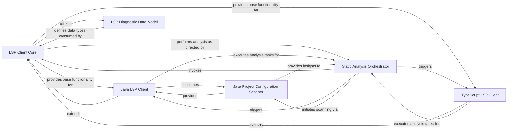

## Details

Communicates with Language Server Protocol servers to extract language‑specific structural information such as ASTs, symbol definitions, and references.

### LSP Client Core
Provides the foundational Language Server Protocol (LSP) communication layer. It manages the connection lifecycle with LSP servers, handles generic LSP requests, responses, and notifications, and offers core functionalities for querying code elements such as symbols, definitions, references, and call hierarchies.

**Related Classes/Methods**:

- <a href="https://github.com/CodeBoarding/CodeBoarding/blob/main/.codeboardingstatic_analyzer/lsp_client/__init__.py" target="_blank" rel="noopener noreferrer">`repos.codeboarding.static_analysis.LSPClient`</a>
- <a href="https://github.com/CodeBoarding/CodeBoarding/blob/main/.codeboardingstatic_analyzer/lsp_client/__init__.py" target="_blank" rel="noopener noreferrer">`repos.codeboarding.static_analysis.LSPConnectionManager`</a>
- <a href="https://github.com/CodeBoarding/CodeBoarding/blob/main/.codeboardingstatic_analyzer/lsp_client/__init__.py" target="_blank" rel="noopener noreferrer">`repos.codeboarding.static_analysis.LSPRequestSender`</a>

### Java LSP Client
Specializes the LSP Client Core for Java language servers. It supplies Java-specific initialization parameters, loads Java projects, and tailors communication for Java code analysis.

**Related Classes/Methods**:

- <a href="https://github.com/CodeBoarding/CodeBoarding/blob/main/.codeboardingstatic_analyzer/lsp_client/java_client.py" target="_blank" rel="noopener noreferrer">`repos.codeboarding.static_analysis.JavaLSPClient`</a>
- <a href="https://github.com/CodeBoarding/CodeBoarding/blob/main/.codeboardingstatic_analyzer/lsp_client/java_client.py" target="_blank" rel="noopener noreferrer">`repos.codeboarding.static_analysis.JavaProjectInitializer`</a>
- <a href="https://github.com/CodeBoarding/CodeBoarding/blob/main/.codeboardingstatic_analyzer/lsp_client/java_client.py" target="_blank" rel="noopener noreferrer">`repos.codeboarding.static_analysis.JavaLSPMethodHandler`</a>
- <a href="https://github.com/CodeBoarding/CodeBoarding/blob/main/.codeboardingstatic_analyzer/lsp_client/java_client.py" target="_blank" rel="noopener noreferrer">`repos.codeboarding.static_analysis.JavaWorkspaceManager`</a>

### TypeScript LSP Client
Specializes the LSP Client Core for TypeScript/JavaScript language servers. It handles TypeScript-specific project bootstrapping, configuration, and communication.

**Related Classes/Methods**:

- <a href="https://github.com/CodeBoarding/CodeBoarding/blob/main/.codeboardingstatic_analyzer/lsp_client/typescript_client.py" target="_blank" rel="noopener noreferrer">`repos.codeboarding.static_analysis.TypeScriptLSPClient`</a>
- <a href="https://github.com/CodeBoarding/CodeBoarding/blob/main/.codeboardingstatic_analyzer/lsp_client/typescript_client.py" target="_blank" rel="noopener noreferrer">`repos.codeboarding.static_analysis.TypeScriptProjectConfigurator`</a>
- <a href="https://github.com/CodeBoarding/CodeBoarding/blob/main/.codeboardingstatic_analyzer/lsp_client/typescript_client.py" target="_blank" rel="noopener noreferrer">`repos.codeboarding.static_analysis.TypeScriptLSPMethodHandler`</a>
- <a href="https://github.com/CodeBoarding/CodeBoarding/blob/main/.codeboardingstatic_analyzer/lsp_client/typescript_client.py" target="_blank" rel="noopener noreferrer">`repos.codeboarding.static_analysis.TypeScriptWorkspaceManager`</a>

### Java Project Configuration Scanner
Scans the codebase for Java build configurations (Maven, Gradle, Eclipse, etc.) and extracts project structure information. This data is required by the Java LSP Client to correctly initialise its workspace.

**Related Classes/Methods**:

- <a href="https://github.com/CodeBoarding/CodeBoarding/blob/main/.codeboardingstatic_analyzer/java_config_scanner.py" target="_blank" rel="noopener noreferrer">`static_analyzer.java_config_scanner`</a>
- <a href="https://github.com/CodeBoarding/CodeBoarding/blob/main/.codeboardingstatic_analyzer/java_config_scanner.py" target="_blank" rel="noopener noreferrer">`static_analyzer.java_config_scanner.MavenConfigParser`</a>
- <a href="https://github.com/CodeBoarding/CodeBoarding/blob/main/.codeboardingstatic_analyzer/java_config_scanner.py" target="_blank" rel="noopener noreferrer">`static_analyzer.java_config_scanner.GradleConfigParser`</a>
- <a href="https://github.com/CodeBoarding/CodeBoarding/blob/main/.codeboardingstatic_analyzer/java_config_scanner.py" target="_blank" rel="noopener noreferrer">`static_analyzer.java_config_scanner.ProjectStructureExtractor`</a>

### Static Analysis Orchestrator
Coordinates the overall static-analysis workflow. It identifies source files, prepares them for analysis, and triggers specific analysis tasks by invoking the appropriate LSP client.

**Related Classes/Methods**: _None_

### LSP Diagnostic Data Model
Defines structured data types and utilities for representing, parsing, and managing diagnostic information (errors, warnings, suggestions) received from language servers.

**Related Classes/Methods**:

- <a href="https://github.com/CodeBoarding/CodeBoarding/blob/main/.codeboardingstatic_analyzer/lsp_client/diagnostics.py" target="_blank" rel="noopener noreferrer">`repos.codeboarding.lsp_data.Diagnostic`</a>
- <a href="https://github.com/CodeBoarding/CodeBoarding/blob/main/.codeboardingstatic_analyzer/lsp_client/diagnostics.py" target="_blank" rel="noopener noreferrer">`repos.codeboarding.lsp_data.DiagnosticParser`</a>
- <a href="https://github.com/CodeBoarding/CodeBoarding/blob/main/.codeboardingstatic_analyzer/lsp_client/diagnostics.py" target="_blank" rel="noopener noreferrer">`repos.codeboarding.lsp_data.DiagnosticManager`</a>
- <a href="https://github.com/CodeBoarding/CodeBoarding/blob/main/.codeboardingstatic_analyzer/lsp_client/diagnostics.py" target="_blank" rel="noopener noreferrer">`repos.codeboarding.lsp_data.DiagnosticSeverity`</a>

### [FAQ](https://github.com/CodeBoarding/GeneratedOnBoardings/tree/main?tab=readme-ov-file#faq)