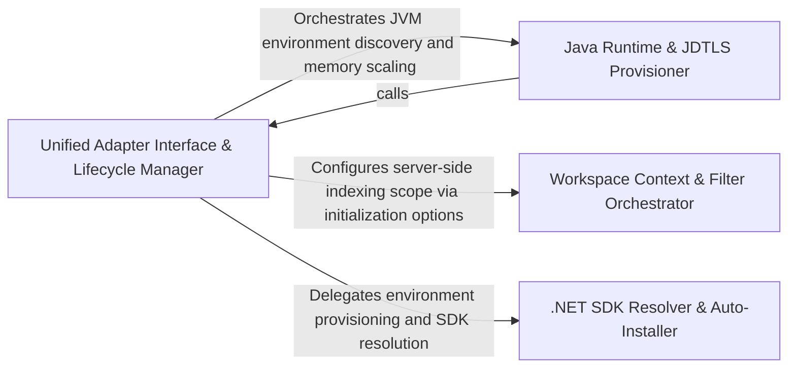

## Details

Bridges discovery logic and static analysis engines by configuring and spawning Language Servers.

### Unified Adapter Interface & Lifecycle Manager [[Expand]](./Unified_Adapter_Interface_Lifecycle_Manager.md)
Defines the contract for language-specific integrations and manages the operational state and health of LSP server processes.

**Related Classes/Methods**:

- `static_analyzer.engine.adapters.rust_adapter.RustAdapter.get_lsp_command`:140-155

**Source Files:**

- [`static_analyzer/engine/adapters/csharp_adapter.py`](https://github.com/CodeBoarding/CodeBoarding/blob/main/.codeboardingstatic_analyzer/engine/adapters/csharp_adapter.py)
  - `static_analyzer.engine.adapters.csharp_adapter.CSharpAdapter.get_lsp_command` ([L47-L55](https://github.com/CodeBoarding/CodeBoarding/blob/main/.codeboardingstatic_analyzer/engine/adapters/csharp_adapter.py#L47-L55)) - Method
- [`static_analyzer/engine/adapters/go_adapter.py`](https://github.com/CodeBoarding/CodeBoarding/blob/main/.codeboardingstatic_analyzer/engine/adapters/go_adapter.py)
  - `static_analyzer.engine.adapters.go_adapter.GoAdapter` ([L73-L223](https://github.com/CodeBoarding/CodeBoarding/blob/main/.codeboardingstatic_analyzer/engine/adapters/go_adapter.py#L73-L223)) - Class
  - `static_analyzer.engine.adapters.go_adapter.GoAdapter.language` ([L76-L77](https://github.com/CodeBoarding/CodeBoarding/blob/main/.codeboardingstatic_analyzer/engine/adapters/go_adapter.py#L76-L77)) - Method
  - `static_analyzer.engine.adapters.go_adapter.GoAdapter.language_enum` ([L80-L81](https://github.com/CodeBoarding/CodeBoarding/blob/main/.codeboardingstatic_analyzer/engine/adapters/go_adapter.py#L80-L81)) - Method
  - `static_analyzer.engine.adapters.go_adapter.GoAdapter.lsp_command` ([L84-L85](https://github.com/CodeBoarding/CodeBoarding/blob/main/.codeboardingstatic_analyzer/engine/adapters/go_adapter.py#L84-L85)) - Method
  - `static_analyzer.engine.adapters.go_adapter.GoAdapter.language_id` ([L88-L89](https://github.com/CodeBoarding/CodeBoarding/blob/main/.codeboardingstatic_analyzer/engine/adapters/go_adapter.py#L88-L89)) - Method
  - `static_analyzer.engine.adapters.go_adapter.GoAdapter.get_lsp_command` ([L91-L103](https://github.com/CodeBoarding/CodeBoarding/blob/main/.codeboardingstatic_analyzer/engine/adapters/go_adapter.py#L91-L103)) - Method
  - `static_analyzer.engine.adapters.go_adapter.GoAdapter.build_reference_key` ([L134-L136](https://github.com/CodeBoarding/CodeBoarding/blob/main/.codeboardingstatic_analyzer/engine/adapters/go_adapter.py#L134-L136)) - Method
  - `static_analyzer.engine.adapters.go_adapter.GoAdapter.get_workspace_settings` ([L167-L176](https://github.com/CodeBoarding/CodeBoarding/blob/main/.codeboardingstatic_analyzer/engine/adapters/go_adapter.py#L167-L176)) - Method
  - `static_analyzer.engine.adapters.go_adapter.GoAdapter.get_lsp_env` ([L178-L186](https://github.com/CodeBoarding/CodeBoarding/blob/main/.codeboardingstatic_analyzer/engine/adapters/go_adapter.py#L178-L186)) - Method
- [`static_analyzer/engine/adapters/java_adapter.py`](https://github.com/CodeBoarding/CodeBoarding/blob/main/.codeboardingstatic_analyzer/engine/adapters/java_adapter.py)
  - `static_analyzer.engine.adapters.java_adapter.JavaAdapter._find_jdtls_root` ([L74-L103](https://github.com/CodeBoarding/CodeBoarding/blob/main/.codeboardingstatic_analyzer/engine/adapters/java_adapter.py#L74-L103)) - Method
- [`static_analyzer/engine/adapters/rust_adapter.py`](https://github.com/CodeBoarding/CodeBoarding/blob/main/.codeboardingstatic_analyzer/engine/adapters/rust_adapter.py)
  - `static_analyzer.engine.adapters.rust_adapter.RustAdapter.validate_workspace_ready` ([L123-L130](https://github.com/CodeBoarding/CodeBoarding/blob/main/.codeboardingstatic_analyzer/engine/adapters/rust_adapter.py#L123-L130)) - Method
  - `static_analyzer.engine.adapters.rust_adapter.RustAdapter.get_lsp_command` ([L140-L155](https://github.com/CodeBoarding/CodeBoarding/blob/main/.codeboardingstatic_analyzer/engine/adapters/rust_adapter.py#L140-L155)) - Method
  - `static_analyzer.engine.adapters.rust_adapter.RustAdapter._check_cargo_usable` ([L157-L185](https://github.com/CodeBoarding/CodeBoarding/blob/main/.codeboardingstatic_analyzer/engine/adapters/rust_adapter.py#L157-L185)) - Method
- [`static_analyzer/engine/language_adapter.py`](https://github.com/CodeBoarding/CodeBoarding/blob/main/.codeboardingstatic_analyzer/engine/language_adapter.py)
  - `static_analyzer.engine.language_adapter.LanguageAdapter.lsp_command` ([L50-L51](https://github.com/CodeBoarding/CodeBoarding/blob/main/.codeboardingstatic_analyzer/engine/language_adapter.py#L50-L51)) - Method
  - `static_analyzer.engine.language_adapter.LanguageAdapter.get_lsp_command` ([L62-L74](https://github.com/CodeBoarding/CodeBoarding/blob/main/.codeboardingstatic_analyzer/engine/language_adapter.py#L62-L74)) - Method
- [`static_analyzer/engine/lsp_client.py`](https://github.com/CodeBoarding/CodeBoarding/blob/main/.codeboardingstatic_analyzer/engine/lsp_client.py)
  - `static_analyzer.engine.lsp_client.LSPClient.server_health` ([L479-L480](https://github.com/CodeBoarding/CodeBoarding/blob/main/.codeboardingstatic_analyzer/engine/lsp_client.py#L479-L480)) - Method
  - `static_analyzer.engine.lsp_client.LSPClient.server_health_message` ([L483-L484](https://github.com/CodeBoarding/CodeBoarding/blob/main/.codeboardingstatic_analyzer/engine/lsp_client.py#L483-L484)) - Method
- [`utils.py`](https://github.com/CodeBoarding/CodeBoarding/blob/main/.codeboardingutils.py)
  - `utils.get_config` ([L83-L89](https://github.com/CodeBoarding/CodeBoarding/blob/main/.codeboardingutils.py#L83-L89)) - Function

### Java Runtime & JDTLS Provisioner [[Expand]](./Java_Runtime_JDTLS_Provisioner.md)
Automates discovery of Java 21+ runtimes and manages resource allocation for Eclipse JDT.LS to prevent OOM errors.

**Related Classes/Methods**:

- `static_analyzer.java_utils.create_jdtls_command`:184-242
- `static_analyzer.java_utils.find_java_21_or_later`:95-137
- `static_analyzer.engine.adapters.java_adapter.JavaAdapter._calculate_heap_size`:106-131

**Source Files:**

- [`static_analyzer/engine/adapters/java_adapter.py`](https://github.com/CodeBoarding/CodeBoarding/blob/main/.codeboardingstatic_analyzer/engine/adapters/java_adapter.py)
  - `static_analyzer.engine.adapters.java_adapter.JavaAdapter.get_lsp_command` ([L51-L71](https://github.com/CodeBoarding/CodeBoarding/blob/main/.codeboardingstatic_analyzer/engine/adapters/java_adapter.py#L51-L71)) - Method
  - `static_analyzer.engine.adapters.java_adapter.JavaAdapter._calculate_heap_size` ([L106-L131](https://github.com/CodeBoarding/CodeBoarding/blob/main/.codeboardingstatic_analyzer/engine/adapters/java_adapter.py#L106-L131)) - Method
- [`static_analyzer/engine/utils.py`](https://github.com/CodeBoarding/CodeBoarding/blob/main/.codeboardingstatic_analyzer/engine/utils.py)
  - `static_analyzer.engine.utils._MemoryStatusEx` ([L54-L65](https://github.com/CodeBoarding/CodeBoarding/blob/main/.codeboardingstatic_analyzer/engine/utils.py#L54-L65)) - Class
  - `static_analyzer.engine.utils.total_ram_gb` ([L68-L87](https://github.com/CodeBoarding/CodeBoarding/blob/main/.codeboardingstatic_analyzer/engine/utils.py#L68-L87)) - Function
- [`static_analyzer/java_utils.py`](https://github.com/CodeBoarding/CodeBoarding/blob/main/.codeboardingstatic_analyzer/java_utils.py)
  - `static_analyzer.java_utils.get_java_version` ([L12-L34](https://github.com/CodeBoarding/CodeBoarding/blob/main/.codeboardingstatic_analyzer/java_utils.py#L12-L34)) - Function
  - `static_analyzer.java_utils.detect_java_installations` ([L37-L92](https://github.com/CodeBoarding/CodeBoarding/blob/main/.codeboardingstatic_analyzer/java_utils.py#L37-L92)) - Function
  - `static_analyzer.java_utils.find_java_21_or_later` ([L95-L137](https://github.com/CodeBoarding/CodeBoarding/blob/main/.codeboardingstatic_analyzer/java_utils.py#L95-L137)) - Function
  - `static_analyzer.java_utils._is_arm64` ([L140-L142](https://github.com/CodeBoarding/CodeBoarding/blob/main/.codeboardingstatic_analyzer/java_utils.py#L140-L142)) - Function
  - `static_analyzer.java_utils.get_jdtls_config_dir` ([L145-L157](https://github.com/CodeBoarding/CodeBoarding/blob/main/.codeboardingstatic_analyzer/java_utils.py#L145-L157)) - Function
  - `static_analyzer.java_utils.find_launcher_jar` ([L160-L181](https://github.com/CodeBoarding/CodeBoarding/blob/main/.codeboardingstatic_analyzer/java_utils.py#L160-L181)) - Function
  - `static_analyzer.java_utils.create_jdtls_command` ([L184-L242](https://github.com/CodeBoarding/CodeBoarding/blob/main/.codeboardingstatic_analyzer/java_utils.py#L184-L242)) - Function

### .NET SDK Resolver & Auto-Installer [[Expand]](./_NET_SDK_Resolver_Auto_Installer.md)
Manages .NET SDK versions based on project requirements and provides a sandbox for automatic installation of missing dependencies.

**Related Classes/Methods**:

- `static_analyzer.dotnet_sdk.resolve_dotnet_sdk`:87-155
- `static_analyzer.dotnet_sdk.DotnetSdkResolution`:44-50
- `static_analyzer.engine.adapters.csharp_adapter.CSharpAdapter.prepare_project`:188-238

**Source Files:**

- [`static_analyzer/dotnet_sdk.py`](https://github.com/CodeBoarding/CodeBoarding/blob/main/.codeboardingstatic_analyzer/dotnet_sdk.py)
  - `static_analyzer.dotnet_sdk.DotnetSdkError` ([L39-L40](https://github.com/CodeBoarding/CodeBoarding/blob/main/.codeboardingstatic_analyzer/dotnet_sdk.py#L39-L40)) - Class
  - `static_analyzer.dotnet_sdk.DotnetSdkResolution` ([L44-L50](https://github.com/CodeBoarding/CodeBoarding/blob/main/.codeboardingstatic_analyzer/dotnet_sdk.py#L44-L50)) - Class
  - `static_analyzer.dotnet_sdk._Probe` ([L54-L57](https://github.com/CodeBoarding/CodeBoarding/blob/main/.codeboardingstatic_analyzer/dotnet_sdk.py#L54-L57)) - Class
  - `static_analyzer.dotnet_sdk.dotnet_install_dir` ([L60-L61](https://github.com/CodeBoarding/CodeBoarding/blob/main/.codeboardingstatic_analyzer/dotnet_sdk.py#L60-L61)) - Function
  - `static_analyzer.dotnet_sdk.private_dotnet_path` ([L64-L65](https://github.com/CodeBoarding/CodeBoarding/blob/main/.codeboardingstatic_analyzer/dotnet_sdk.py#L64-L65)) - Function
  - `static_analyzer.dotnet_sdk.find_global_json` ([L68-L75](https://github.com/CodeBoarding/CodeBoarding/blob/main/.codeboardingstatic_analyzer/dotnet_sdk.py#L68-L75)) - Function
  - `static_analyzer.dotnet_sdk.read_global_sdk_version` ([L78-L84](https://github.com/CodeBoarding/CodeBoarding/blob/main/.codeboardingstatic_analyzer/dotnet_sdk.py#L78-L84)) - Function
  - `static_analyzer.dotnet_sdk.resolve_dotnet_sdk` ([L87-L155](https://github.com/CodeBoarding/CodeBoarding/blob/main/.codeboardingstatic_analyzer/dotnet_sdk.py#L87-L155)) - Function
  - `static_analyzer.dotnet_sdk.system_dotnet_env` ([L158-L185](https://github.com/CodeBoarding/CodeBoarding/blob/main/.codeboardingstatic_analyzer/dotnet_sdk.py#L158-L185)) - Function
  - `static_analyzer.dotnet_sdk._private_dotnet_env` ([L188-L193](https://github.com/CodeBoarding/CodeBoarding/blob/main/.codeboardingstatic_analyzer/dotnet_sdk.py#L188-L193)) - Function
  - `static_analyzer.dotnet_sdk._merged_env` ([L196-L199](https://github.com/CodeBoarding/CodeBoarding/blob/main/.codeboardingstatic_analyzer/dotnet_sdk.py#L196-L199)) - Function
  - `static_analyzer.dotnet_sdk._probe_dotnet` ([L202-L215](https://github.com/CodeBoarding/CodeBoarding/blob/main/.codeboardingstatic_analyzer/dotnet_sdk.py#L202-L215)) - Function
  - `static_analyzer.dotnet_sdk._has_sdk_major` ([L218-L242](https://github.com/CodeBoarding/CodeBoarding/blob/main/.codeboardingstatic_analyzer/dotnet_sdk.py#L218-L242)) - Function
  - `static_analyzer.dotnet_sdk._install_from_global_json` ([L245-L247](https://github.com/CodeBoarding/CodeBoarding/blob/main/.codeboardingstatic_analyzer/dotnet_sdk.py#L245-L247)) - Function
  - `static_analyzer.dotnet_sdk._install_channel` ([L250-L252](https://github.com/CodeBoarding/CodeBoarding/blob/main/.codeboardingstatic_analyzer/dotnet_sdk.py#L250-L252)) - Function
  - `static_analyzer.dotnet_sdk._run_install_script` ([L255-L291](https://github.com/CodeBoarding/CodeBoarding/blob/main/.codeboardingstatic_analyzer/dotnet_sdk.py#L255-L291)) - Function
  - `static_analyzer.dotnet_sdk._download_install_script` ([L294-L316](https://github.com/CodeBoarding/CodeBoarding/blob/main/.codeboardingstatic_analyzer/dotnet_sdk.py#L294-L316)) - Function
  - `static_analyzer.dotnet_sdk._to_powershell_install_args` ([L319-L327](https://github.com/CodeBoarding/CodeBoarding/blob/main/.codeboardingstatic_analyzer/dotnet_sdk.py#L319-L327)) - Function
- [`static_analyzer/engine/adapters/csharp_adapter.py`](https://github.com/CodeBoarding/CodeBoarding/blob/main/.codeboardingstatic_analyzer/engine/adapters/csharp_adapter.py)
  - `static_analyzer.engine.adapters.csharp_adapter.CSharpAdapter.prepare_project` ([L188-L238](https://github.com/CodeBoarding/CodeBoarding/blob/main/.codeboardingstatic_analyzer/engine/adapters/csharp_adapter.py#L188-L238)) - Method
  - `static_analyzer.engine.adapters.csharp_adapter.CSharpAdapter.get_lsp_env` ([L240-L256](https://github.com/CodeBoarding/CodeBoarding/blob/main/.codeboardingstatic_analyzer/engine/adapters/csharp_adapter.py#L240-L256)) - Method
- [`tool_registry/paths.py`](https://github.com/CodeBoarding/CodeBoarding/blob/main/.codeboardingtool_registry/paths.py)
  - `tool_registry.paths.user_data_dir` ([L78-L80](https://github.com/CodeBoarding/CodeBoarding/blob/main/.codeboardingtool_registry/paths.py#L78-L80)) - Function

### Workspace Context & Filter Orchestrator [[Expand]](./Workspace_Context_Filter_Orchestrator.md)
Translates repository ignore rules into LSP initialization options to prevent indexing of irrelevant or massive directories.

**Related Classes/Methods**:

- `static_analyzer.engine.adapters.go_adapter.GoAdapter.get_lsp_init_options`:138-165
- `static_analyzer.engine.adapters.go_adapter._directory_filters_from_ignore_manager`:22-70

**Source Files:**

- [`repo_utils/ignore.py`](https://github.com/CodeBoarding/CodeBoarding/blob/main/.codeboardingrepo_utils/ignore.py)
  - `repo_utils.ignore.RepoIgnoreManager.__init__` ([L175-L177](https://github.com/CodeBoarding/CodeBoarding/blob/main/.codeboardingrepo_utils/ignore.py#L175-L177)) - Method
  - `repo_utils.ignore.RepoIgnoreManager.reload` ([L179-L191](https://github.com/CodeBoarding/CodeBoarding/blob/main/.codeboardingrepo_utils/ignore.py#L179-L191)) - Method
  - `repo_utils.ignore.RepoIgnoreManager._load_gitignore_patterns` ([L193-L204](https://github.com/CodeBoarding/CodeBoarding/blob/main/.codeboardingrepo_utils/ignore.py#L193-L204)) - Method
  - `repo_utils.ignore.RepoIgnoreManager._load_codeboardingignore_patterns` ([L206-L223](https://github.com/CodeBoarding/CodeBoarding/blob/main/.codeboardingrepo_utils/ignore.py#L206-L223)) - Method
- [`static_analyzer/engine/adapters/go_adapter.py`](https://github.com/CodeBoarding/CodeBoarding/blob/main/.codeboardingstatic_analyzer/engine/adapters/go_adapter.py)
  - `static_analyzer.engine.adapters.go_adapter._directory_filters_from_ignore_manager` ([L22-L70](https://github.com/CodeBoarding/CodeBoarding/blob/main/.codeboardingstatic_analyzer/engine/adapters/go_adapter.py#L22-L70)) - Function
  - `static_analyzer.engine.adapters.go_adapter.GoAdapter.get_lsp_init_options` ([L138-L165](https://github.com/CodeBoarding/CodeBoarding/blob/main/.codeboardingstatic_analyzer/engine/adapters/go_adapter.py#L138-L165)) - Method

### [FAQ](https://github.com/CodeBoarding/GeneratedOnBoardings/tree/main?tab=readme-ov-file#faq)