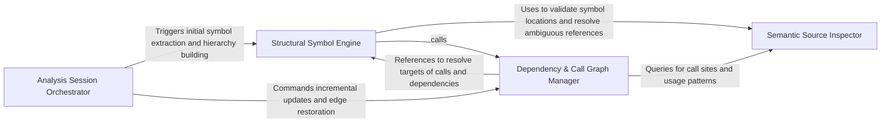

## Details

Manages the high-level analysis session, coordinating between the protocol client and language-specific adapters to build a comprehensive model of the codebase.

### Analysis Session Orchestrator
Manages the high-level execution flow, environment preparation, LSP client initialization, and coordination between incremental update logic and symbol engines.

**Related Classes/Methods**:

- `static_analyzer.__init__.StaticAnalyzer`:169-771
- `static_analyzer.__init__.StaticAnalyzer.start_clients`:198-297
- `tool_registry.paths.ensure_node_on_path`:248-277

**Source Files:**

- [`static_analyzer/__init__.py`](https://github.com/CodeBoarding/CodeBoarding/blob/main/.codeboardingstatic_analyzer/__init__.py)
  - `static_analyzer.__init__.StaticAnalyzer.__enter__` ([L191-L193](https://github.com/CodeBoarding/CodeBoarding/blob/main/.codeboardingstatic_analyzer/__init__.py#L191-L193)) - Method
  - `static_analyzer.__init__.StaticAnalyzer.__exit__` ([L195-L196](https://github.com/CodeBoarding/CodeBoarding/blob/main/.codeboardingstatic_analyzer/__init__.py#L195-L196)) - Method
  - `static_analyzer.__init__.StaticAnalyzer.start_clients` ([L198-L297](https://github.com/CodeBoarding/CodeBoarding/blob/main/.codeboardingstatic_analyzer/__init__.py#L198-L297)) - Method
  - `static_analyzer.__init__.StaticAnalyzer.stop_clients` ([L299-L317](https://github.com/CodeBoarding/CodeBoarding/blob/main/.codeboardingstatic_analyzer/__init__.py#L299-L317)) - Method
- [`tool_registry/paths.py`](https://github.com/CodeBoarding/CodeBoarding/blob/main/.codeboardingtool_registry/paths.py)
  - `tool_registry.paths.ensure_node_on_path` ([L248-L277](https://github.com/CodeBoarding/CodeBoarding/blob/main/.codeboardingtool_registry/paths.py#L248-L277)) - Function

### Structural Symbol Engine
Constructs the vertical model of the codebase by mapping file-level symbols into a linked hierarchy, resolving inheritance, nesting, and type definitions.

**Related Classes/Methods**:

- `static_analyzer.engine.hierarchy_builder.HierarchyBuilder`:19-200
- `static_analyzer.engine.symbol_table.SymbolTable`:16-328
- `static_analyzer.engine.hierarchy_builder.HierarchyBuilder._link_hierarchy`:184-200

**Source Files:**

- [`static_analyzer/engine/hierarchy_builder.py`](https://github.com/CodeBoarding/CodeBoarding/blob/main/.codeboardingstatic_analyzer/engine/hierarchy_builder.py)
  - `static_analyzer.engine.hierarchy_builder.HierarchyBuilder.__init__` ([L22-L32](https://github.com/CodeBoarding/CodeBoarding/blob/main/.codeboardingstatic_analyzer/engine/hierarchy_builder.py#L22-L32)) - Method
  - `static_analyzer.engine.hierarchy_builder.HierarchyBuilder.build` ([L34-L111](https://github.com/CodeBoarding/CodeBoarding/blob/main/.codeboardingstatic_analyzer/engine/hierarchy_builder.py#L34-L111)) - Method
  - `static_analyzer.engine.hierarchy_builder.HierarchyBuilder._resolve_type_hierarchy_item` ([L113-L135](https://github.com/CodeBoarding/CodeBoarding/blob/main/.codeboardingstatic_analyzer/engine/hierarchy_builder.py#L113-L135)) - Method
  - `static_analyzer.engine.hierarchy_builder.HierarchyBuilder._infer_hierarchy_from_source` ([L137-L182](https://github.com/CodeBoarding/CodeBoarding/blob/main/.codeboardingstatic_analyzer/engine/hierarchy_builder.py#L137-L182)) - Method
  - `static_analyzer.engine.hierarchy_builder.HierarchyBuilder._link_hierarchy` ([L184-L200](https://github.com/CodeBoarding/CodeBoarding/blob/main/.codeboardingstatic_analyzer/engine/hierarchy_builder.py#L184-L200)) - Method
- [`static_analyzer/engine/symbol_table.py`](https://github.com/CodeBoarding/CodeBoarding/blob/main/.codeboardingstatic_analyzer/engine/symbol_table.py)
  - `static_analyzer.engine.symbol_table.SymbolTable.file_symbols` ([L52-L54](https://github.com/CodeBoarding/CodeBoarding/blob/main/.codeboardingstatic_analyzer/engine/symbol_table.py#L52-L54)) - Method

### Dependency & Call Graph Manager
Manages horizontal relationships between code entities, building and maintaining the call graph and file-level dependencies with incremental update logic.

**Related Classes/Methods**:

- `static_analyzer.engine.call_graph_builder.CallGraphBuilder`:23-302
- `static_analyzer.incremental_orchestrator._rebuild_changed_file_edges`:109-120
- `static_analyzer.__init__.StaticAnalyzer.discover_file_dependencies`:439-488

**Source Files:**

- [`static_analyzer/__init__.py`](https://github.com/CodeBoarding/CodeBoarding/blob/main/.codeboardingstatic_analyzer/__init__.py)
  - `static_analyzer.__init__.StaticAnalyzer.get_diagnostics_generation` ([L351-L353](https://github.com/CodeBoarding/CodeBoarding/blob/main/.codeboardingstatic_analyzer/__init__.py#L351-L353)) - Method
  - `static_analyzer.__init__.StaticAnalyzer.discover_file_dependencies` ([L439-L488](https://github.com/CodeBoarding/CodeBoarding/blob/main/.codeboardingstatic_analyzer/__init__.py#L439-L488)) - Method
- [`static_analyzer/engine/call_graph_builder.py`](https://github.com/CodeBoarding/CodeBoarding/blob/main/.codeboardingstatic_analyzer/engine/call_graph_builder.py)
  - `static_analyzer.engine.call_graph_builder.CallGraphBuilder.__init__` ([L26-L37](https://github.com/CodeBoarding/CodeBoarding/blob/main/.codeboardingstatic_analyzer/engine/call_graph_builder.py#L26-L37)) - Method
  - `static_analyzer.engine.call_graph_builder.CallGraphBuilder._warmup_references` ([L201-L216](https://github.com/CodeBoarding/CodeBoarding/blob/main/.codeboardingstatic_analyzer/engine/call_graph_builder.py#L201-L216)) - Method
- [`static_analyzer/engine/source_inspector.py`](https://github.com/CodeBoarding/CodeBoarding/blob/main/.codeboardingstatic_analyzer/engine/source_inspector.py)
  - `static_analyzer.engine.source_inspector.SourceInspector` ([L9-L203](https://github.com/CodeBoarding/CodeBoarding/blob/main/.codeboardingstatic_analyzer/engine/source_inspector.py#L9-L203)) - Class
  - `static_analyzer.engine.source_inspector.SourceInspector.__init__` ([L15-L16](https://github.com/CodeBoarding/CodeBoarding/blob/main/.codeboardingstatic_analyzer/engine/source_inspector.py#L15-L16)) - Method
  - `static_analyzer.engine.source_inspector.SourceInspector.find_call_sites` ([L119-L203](https://github.com/CodeBoarding/CodeBoarding/blob/main/.codeboardingstatic_analyzer/engine/source_inspector.py#L119-L203)) - Method
- [`static_analyzer/engine/symbol_table.py`](https://github.com/CodeBoarding/CodeBoarding/blob/main/.codeboardingstatic_analyzer/engine/symbol_table.py)
  - `static_analyzer.engine.symbol_table.SymbolTable` ([L16-L328](https://github.com/CodeBoarding/CodeBoarding/blob/main/.codeboardingstatic_analyzer/engine/symbol_table.py#L16-L328)) - Class
  - `static_analyzer.engine.symbol_table.SymbolTable.__init__` ([L23-L39](https://github.com/CodeBoarding/CodeBoarding/blob/main/.codeboardingstatic_analyzer/engine/symbol_table.py#L23-L39)) - Method
- [`static_analyzer/engine/utils.py`](https://github.com/CodeBoarding/CodeBoarding/blob/main/.codeboardingstatic_analyzer/engine/utils.py)
  - `static_analyzer.engine.utils.uri_to_path` ([L16-L32](https://github.com/CodeBoarding/CodeBoarding/blob/main/.codeboardingstatic_analyzer/engine/utils.py#L16-L32)) - Function
- [`static_analyzer/incremental_orchestrator.py`](https://github.com/CodeBoarding/CodeBoarding/blob/main/.codeboardingstatic_analyzer/incremental_orchestrator.py)
  - `static_analyzer.incremental_orchestrator._rebuild_changed_file_edges` ([L109-L120](https://github.com/CodeBoarding/CodeBoarding/blob/main/.codeboardingstatic_analyzer/incremental_orchestrator.py#L109-L120)) - Function
  - `static_analyzer.incremental_orchestrator._restore_inbound_edges` ([L123-L171](https://github.com/CodeBoarding/CodeBoarding/blob/main/.codeboardingstatic_analyzer/incremental_orchestrator.py#L123-L171)) - Function
  - `static_analyzer.incremental_orchestrator._edge_reference_still_exists` ([L174-L199](https://github.com/CodeBoarding/CodeBoarding/blob/main/.codeboardingstatic_analyzer/incremental_orchestrator.py#L174-L199)) - Function
  - `static_analyzer.incremental_orchestrator._add_outbound_edges_from_changed_files` ([L202-L249](https://github.com/CodeBoarding/CodeBoarding/blob/main/.codeboardingstatic_analyzer/incremental_orchestrator.py#L202-L249)) - Function
  - `static_analyzer.incremental_orchestrator._containing_callable_nodes` ([L252-L257](https://github.com/CodeBoarding/CodeBoarding/blob/main/.codeboardingstatic_analyzer/incremental_orchestrator.py#L252-L257)) - Function
  - `static_analyzer.incremental_orchestrator._definition_nodes` ([L260-L261](https://github.com/CodeBoarding/CodeBoarding/blob/main/.codeboardingstatic_analyzer/incremental_orchestrator.py#L260-L261)) - Function
  - `static_analyzer.incremental_orchestrator._definition_points_to_node` ([L264-L273](https://github.com/CodeBoarding/CodeBoarding/blob/main/.codeboardingstatic_analyzer/incremental_orchestrator.py#L264-L273)) - Function
  - `static_analyzer.incremental_orchestrator._position_inside_node` ([L276-L282](https://github.com/CodeBoarding/CodeBoarding/blob/main/.codeboardingstatic_analyzer/incremental_orchestrator.py#L276-L282)) - Function

### Semantic Source Inspector
Provides low-level syntax validation and usage detection, acting as a predicate engine to bridge the gap between raw text and semantic symbols.

**Related Classes/Methods**:

- `static_analyzer.engine.source_inspector.SourceInspector`:9-203
- `static_analyzer.engine.source_inspector.SourceInspector.find_call_sites`:119-203
- `static_analyzer.engine.source_inspector.SourceInspector.is_invocation`:35-66

**Source Files:**

- [`static_analyzer/engine/source_inspector.py`](https://github.com/CodeBoarding/CodeBoarding/blob/main/.codeboardingstatic_analyzer/engine/source_inspector.py)
  - `static_analyzer.engine.source_inspector.SourceInspector.get_source_line` ([L18-L23](https://github.com/CodeBoarding/CodeBoarding/blob/main/.codeboardingstatic_analyzer/engine/source_inspector.py#L18-L23)) - Method
  - `static_analyzer.engine.source_inspector.SourceInspector.get_file_lines` ([L25-L33](https://github.com/CodeBoarding/CodeBoarding/blob/main/.codeboardingstatic_analyzer/engine/source_inspector.py#L25-L33)) - Method
  - `static_analyzer.engine.source_inspector.SourceInspector.is_invocation` ([L35-L66](https://github.com/CodeBoarding/CodeBoarding/blob/main/.codeboardingstatic_analyzer/engine/source_inspector.py#L35-L66)) - Method
  - `static_analyzer.engine.source_inspector.SourceInspector.is_callable_usage` ([L68-L99](https://github.com/CodeBoarding/CodeBoarding/blob/main/.codeboardingstatic_analyzer/engine/source_inspector.py#L68-L99)) - Method
  - `static_analyzer.engine.source_inspector.SourceInspector._is_inside_call_arguments` ([L102-L117](https://github.com/CodeBoarding/CodeBoarding/blob/main/.codeboardingstatic_analyzer/engine/source_inspector.py#L102-L117)) - Method
- [`static_analyzer/incremental_orchestrator.py`](https://github.com/CodeBoarding/CodeBoarding/blob/main/.codeboardingstatic_analyzer/incremental_orchestrator.py)
  - `static_analyzer.incremental_orchestrator._reference_matches_edge_kind` ([L285-L302](https://github.com/CodeBoarding/CodeBoarding/blob/main/.codeboardingstatic_analyzer/incremental_orchestrator.py#L285-L302)) - Function

### [FAQ](https://github.com/CodeBoarding/GeneratedOnBoardings/tree/main?tab=readme-ov-file#faq)