```mermaid
graph LR
    JSON_RPC_Transport_Message_Broker["JSON-RPC Transport & Message Broker"]
    Semantic_Query_Type_Resolver["Semantic Query & Type Resolver"]
    High_Throughput_Batch_Processor["High-Throughput Batch Processor"]
    Workspace_Lifecycle_Manager["Workspace & Lifecycle Manager"]
    Event_Handler_Diagnostic_Parser["Event Handler & Diagnostic Parser"]
    Analysis_Orchestration_Bridge["Analysis Orchestration Bridge"]
    JSON_RPC_Transport_Message_Broker -- "resolves batch response futures" --> High_Throughput_Batch_Processor
    JSON_RPC_Transport_Message_Broker -- "calls" --> Semantic_Query_Type_Resolver
    JSON_RPC_Transport_Message_Broker -- "calls" --> Workspace_Lifecycle_Manager
    JSON_RPC_Transport_Message_Broker -- "routes unsolicited server notifications" --> Event_Handler_Diagnostic_Parser
    Semantic_Query_Type_Resolver -- "normalizes protocol URIs to local paths" --> Analysis_Orchestration_Bridge
    Semantic_Query_Type_Resolver -- "dispatches synchronous protocol requests" --> JSON_RPC_Transport_Message_Broker
    Semantic_Query_Type_Resolver -- "calls" --> High_Throughput_Batch_Processor
    Semantic_Query_Type_Resolver -- "calls" --> Workspace_Lifecycle_Manager
    High_Throughput_Batch_Processor -- "calls" --> Workspace_Lifecycle_Manager
    High_Throughput_Batch_Processor -- "submits bulk message payloads" --> JSON_RPC_Transport_Message_Broker
    Workspace_Lifecycle_Manager -- "orchestrates process lifecycle and transport initialization" --> JSON_RPC_Transport_Message_Broker
    Workspace_Lifecycle_Manager -- "calls" --> Semantic_Query_Type_Resolver
    Event_Handler_Diagnostic_Parser -- "feeds diagnostic data into incremental analysis" --> Analysis_Orchestration_Bridge
    Analysis_Orchestration_Bridge -- "synchronizes workspace state via notifications" --> JSON_RPC_Transport_Message_Broker
    Analysis_Orchestration_Bridge -- "queries semantic metadata for graph construction" --> Semantic_Query_Type_Resolver
    Analysis_Orchestration_Bridge -- "calls" --> Workspace_Lifecycle_Manager
    Analysis_Orchestration_Bridge -- "triggers bulk symbol resolution during warmup" --> High_Throughput_Batch_Processor
    click JSON_RPC_Transport_Message_Broker href "https://github.com/CodeBoarding/CodeBoarding/blob/main/.codeboarding/JSON_RPC_Transport_Message_Broker.md" "Details"
    click Semantic_Query_Type_Resolver href "https://github.com/CodeBoarding/CodeBoarding/blob/main/.codeboarding/Semantic_Query_Type_Resolver.md" "Details"
    click High_Throughput_Batch_Processor href "https://github.com/CodeBoarding/CodeBoarding/blob/main/.codeboarding/High_Throughput_Batch_Processor.md" "Details"
    click Workspace_Lifecycle_Manager href "https://github.com/CodeBoarding/CodeBoarding/blob/main/.codeboarding/Workspace_Lifecycle_Manager.md" "Details"
    click Event_Handler_Diagnostic_Parser href "https://github.com/CodeBoarding/CodeBoarding/blob/main/.codeboarding/Event_Handler_Diagnostic_Parser.md" "Details"
    click Analysis_Orchestration_Bridge href "https://github.com/CodeBoarding/CodeBoarding/blob/main/.codeboarding/Analysis_Orchestration_Bridge.md" "Details"
```

## Details

Manages the low-level asynchronous communication layer with various Language Servers, encapsulating JSON-RPC complexities and implementing high-performance batching logic.

### JSON-RPC Transport & Message Broker [[Expand]](./JSON_RPC_Transport_Message_Broker.md)
The foundational layer responsible for managing the asynchronous I/O streams, process lifecycle, and the low-level serialization of JSON-RPC messages.

**Related Classes/Methods**:

- `static_analyzer.engine.lsp_client.LSPClient.start`:96-188
- `static_analyzer.engine.lsp_client.LSPClient._reader_loop`:680-716
- `static_analyzer.engine.lsp_client.LSPClient._write_message`:588-601

**Source Files:**

- [`static_analyzer/engine/lsp_client.py`](https://github.com/CodeBoarding/CodeBoarding/blob/main/.codeboardingstatic_analyzer/engine/lsp_client.py)
  - `static_analyzer.engine.lsp_client.LSPClient.__enter__` ([L104-L106](https://github.com/CodeBoarding/CodeBoarding/blob/main/.codeboardingstatic_analyzer/engine/lsp_client.py#L104-L106)) - Method
  - `static_analyzer.engine.lsp_client.LSPClient.start` ([L111-L206](https://github.com/CodeBoarding/CodeBoarding/blob/main/.codeboardingstatic_analyzer/engine/lsp_client.py#L111-L206)) - Method
  - `static_analyzer.engine.lsp_client.LSPClient.did_change` ([L266-L277](https://github.com/CodeBoarding/CodeBoarding/blob/main/.codeboardingstatic_analyzer/engine/lsp_client.py#L266-L277)) - Method
  - `static_analyzer.engine.lsp_client.LSPClient.did_close` ([L279-L287](https://github.com/CodeBoarding/CodeBoarding/blob/main/.codeboardingstatic_analyzer/engine/lsp_client.py#L279-L287)) - Method
  - `static_analyzer.engine.lsp_client.LSPClient._send_notification` ([L597-L604](https://github.com/CodeBoarding/CodeBoarding/blob/main/.codeboardingstatic_analyzer/engine/lsp_client.py#L597-L604)) - Method
  - `static_analyzer.engine.lsp_client.LSPClient._write_message` ([L606-L619](https://github.com/CodeBoarding/CodeBoarding/blob/main/.codeboardingstatic_analyzer/engine/lsp_client.py#L606-L619)) - Method
  - `static_analyzer.engine.lsp_client.LSPClient._reader_loop` ([L698-L734](https://github.com/CodeBoarding/CodeBoarding/blob/main/.codeboardingstatic_analyzer/engine/lsp_client.py#L698-L734)) - Method
  - `static_analyzer.engine.lsp_client.LSPClient._handle_server_request` ([L736-L750](https://github.com/CodeBoarding/CodeBoarding/blob/main/.codeboardingstatic_analyzer/engine/lsp_client.py#L736-L750)) - Method
  - `static_analyzer.engine.lsp_client.LSPClient._read_single_message` ([L847-L887](https://github.com/CodeBoarding/CodeBoarding/blob/main/.codeboardingstatic_analyzer/engine/lsp_client.py#L847-L887)) - Method

### Semantic Query & Type Resolver [[Expand]](./Semantic_Query_Type_Resolver.md)
Implements the standard LSP feature set for synchronous semantic queries, translating high-level requests into protocol-compliant messages.

**Related Classes/Methods**:

- `static_analyzer.engine.lsp_client.LSPClient._send_request`:541-577
- `static_analyzer.engine.lsp_client.LSPClient.type_hierarchy_prepare`:375-386
- `static_analyzer.engine.lsp_client.LSPClient.definition`:325-339

**Source Files:**

- [`static_analyzer/engine/hierarchy_builder.py`](https://github.com/CodeBoarding/CodeBoarding/blob/main/.codeboardingstatic_analyzer/engine/hierarchy_builder.py)
  - `static_analyzer.engine.hierarchy_builder.HierarchyBuilder.build` ([L34-L111](https://github.com/CodeBoarding/CodeBoarding/blob/main/.codeboardingstatic_analyzer/engine/hierarchy_builder.py#L34-L111)) - Method
  - `static_analyzer.engine.hierarchy_builder.HierarchyBuilder._resolve_type_hierarchy_item` ([L113-L135](https://github.com/CodeBoarding/CodeBoarding/blob/main/.codeboardingstatic_analyzer/engine/hierarchy_builder.py#L113-L135)) - Method
- [`static_analyzer/engine/language_adapter.py`](https://github.com/CodeBoarding/CodeBoarding/blob/main/.codeboardingstatic_analyzer/engine/language_adapter.py)
  - `static_analyzer.engine.language_adapter.LanguageAdapter.is_class_like` ([L281-L282](https://github.com/CodeBoarding/CodeBoarding/blob/main/.codeboardingstatic_analyzer/engine/language_adapter.py#L281-L282)) - Method
- [`static_analyzer/engine/lsp_client.py`](https://github.com/CodeBoarding/CodeBoarding/blob/main/.codeboardingstatic_analyzer/engine/lsp_client.py)
  - `static_analyzer.engine.lsp_client.MethodNotFoundError` ([L40-L41](https://github.com/CodeBoarding/CodeBoarding/blob/main/.codeboardingstatic_analyzer/engine/lsp_client.py#L40-L41)) - Class
  - `static_analyzer.engine.lsp_client.LSPClient.definition` ([L343-L357](https://github.com/CodeBoarding/CodeBoarding/blob/main/.codeboardingstatic_analyzer/engine/lsp_client.py#L343-L357)) - Method
  - `static_analyzer.engine.lsp_client.LSPClient.implementation` ([L368-L382](https://github.com/CodeBoarding/CodeBoarding/blob/main/.codeboardingstatic_analyzer/engine/lsp_client.py#L368-L382)) - Method
  - `static_analyzer.engine.lsp_client.LSPClient.type_hierarchy_prepare` ([L393-L404](https://github.com/CodeBoarding/CodeBoarding/blob/main/.codeboardingstatic_analyzer/engine/lsp_client.py#L393-L404)) - Method
  - `static_analyzer.engine.lsp_client.LSPClient.type_hierarchy_supertypes` ([L406-L411](https://github.com/CodeBoarding/CodeBoarding/blob/main/.codeboardingstatic_analyzer/engine/lsp_client.py#L406-L411)) - Method
  - `static_analyzer.engine.lsp_client.LSPClient.type_hierarchy_subtypes` ([L413-L418](https://github.com/CodeBoarding/CodeBoarding/blob/main/.codeboardingstatic_analyzer/engine/lsp_client.py#L413-L418)) - Method
  - `static_analyzer.engine.lsp_client.LSPClient._send_request` ([L559-L595](https://github.com/CodeBoarding/CodeBoarding/blob/main/.codeboardingstatic_analyzer/engine/lsp_client.py#L559-L595)) - Method
- [`static_analyzer/engine/symbol_table.py`](https://github.com/CodeBoarding/CodeBoarding/blob/main/.codeboardingstatic_analyzer/engine/symbol_table.py)
  - `static_analyzer.engine.symbol_table.SymbolTable.file_symbols` ([L52-L54](https://github.com/CodeBoarding/CodeBoarding/blob/main/.codeboardingstatic_analyzer/engine/symbol_table.py#L52-L54)) - Method

### High-Throughput Batch Processor [[Expand]](./High_Throughput_Batch_Processor.md)
An optimization layer designed for bulk analysis tasks, grouping multiple LSP requests to reduce overhead and improve warmup speeds.

**Related Classes/Methods**:

- `static_analyzer.engine.lsp_client.LSPClient.send_references_batch`:298-323
- `static_analyzer.engine.lsp_client.LSPClient.send_definition_batch`:341-348
- `static_analyzer.engine.lsp_client.LSPClient._collect_batch_responses`:626-676

**Source Files:**

- [`static_analyzer/engine/lsp_client.py`](https://github.com/CodeBoarding/CodeBoarding/blob/main/.codeboardingstatic_analyzer/engine/lsp_client.py)
  - `static_analyzer.engine.lsp_client.LSPClient.send_references_batch` ([L316-L341](https://github.com/CodeBoarding/CodeBoarding/blob/main/.codeboardingstatic_analyzer/engine/lsp_client.py#L316-L341)) - Method
  - `static_analyzer.engine.lsp_client.LSPClient.send_references_batch.build_params` ([L334-L339](https://github.com/CodeBoarding/CodeBoarding/blob/main/.codeboardingstatic_analyzer/engine/lsp_client.py#L334-L339)) - Function
  - `static_analyzer.engine.lsp_client.LSPClient.send_definition_batch` ([L359-L366](https://github.com/CodeBoarding/CodeBoarding/blob/main/.codeboardingstatic_analyzer/engine/lsp_client.py#L359-L366)) - Method
  - `static_analyzer.engine.lsp_client.LSPClient.send_implementation_batch` ([L384-L391](https://github.com/CodeBoarding/CodeBoarding/blob/main/.codeboardingstatic_analyzer/engine/lsp_client.py#L384-L391)) - Method
  - `static_analyzer.engine.lsp_client.LSPClient._position_params` ([L506-L511](https://github.com/CodeBoarding/CodeBoarding/blob/main/.codeboardingstatic_analyzer/engine/lsp_client.py#L506-L511)) - Method
  - `static_analyzer.engine.lsp_client.LSPClient._send_batch` ([L513-L557](https://github.com/CodeBoarding/CodeBoarding/blob/main/.codeboardingstatic_analyzer/engine/lsp_client.py#L513-L557)) - Method
  - `static_analyzer.engine.lsp_client.LSPClient._next_response` ([L621-L642](https://github.com/CodeBoarding/CodeBoarding/blob/main/.codeboardingstatic_analyzer/engine/lsp_client.py#L621-L642)) - Method
  - `static_analyzer.engine.lsp_client.LSPClient._collect_batch_responses` ([L644-L694](https://github.com/CodeBoarding/CodeBoarding/blob/main/.codeboardingstatic_analyzer/engine/lsp_client.py#L644-L694)) - Method

### Workspace & Lifecycle Manager [[Expand]](./Workspace_Lifecycle_Manager.md)
Orchestrates the initialization sequence of language servers and ensures the project environment is correctly synchronized.

**Related Classes/Methods**:

- `static_analyzer.__init__.StaticAnalyzer.start_clients`:209-309
- `static_analyzer.engine.lsp_client.LSPClient.wait_for_server_ready`:442-465
- `static_analyzer.engine.language_adapter.LanguageAdapter.prepare_project`:224-232

**Source Files:**

- [`static_analyzer/__init__.py`](https://github.com/CodeBoarding/CodeBoarding/blob/main/.codeboardingstatic_analyzer/__init__.py)
  - `static_analyzer.__init__.StaticAnalyzer.__enter__` ([L202-L204](https://github.com/CodeBoarding/CodeBoarding/blob/main/.codeboardingstatic_analyzer/__init__.py#L202-L204)) - Method
  - `static_analyzer.__init__.StaticAnalyzer.start_clients` ([L209-L309](https://github.com/CodeBoarding/CodeBoarding/blob/main/.codeboardingstatic_analyzer/__init__.py#L209-L309)) - Method
  - `static_analyzer.__init__.StaticAnalyzer.get_diagnostics_generation` ([L369-L371](https://github.com/CodeBoarding/CodeBoarding/blob/main/.codeboardingstatic_analyzer/__init__.py#L369-L371)) - Method
- [`static_analyzer/engine/adapters/csharp_adapter.py`](https://github.com/CodeBoarding/CodeBoarding/blob/main/.codeboardingstatic_analyzer/engine/adapters/csharp_adapter.py)
  - `static_analyzer.engine.adapters.csharp_adapter.CSharpAdapter.wait_for_diagnostics` ([L179-L190](https://github.com/CodeBoarding/CodeBoarding/blob/main/.codeboardingstatic_analyzer/engine/adapters/csharp_adapter.py#L179-L190)) - Method
- [`static_analyzer/engine/adapters/rust_adapter.py`](https://github.com/CodeBoarding/CodeBoarding/blob/main/.codeboardingstatic_analyzer/engine/adapters/rust_adapter.py)
  - `static_analyzer.engine.adapters.rust_adapter.RustAdapter.wait_for_diagnostics` ([L109-L121](https://github.com/CodeBoarding/CodeBoarding/blob/main/.codeboardingstatic_analyzer/engine/adapters/rust_adapter.py#L109-L121)) - Method
- [`static_analyzer/engine/language_adapter.py`](https://github.com/CodeBoarding/CodeBoarding/blob/main/.codeboardingstatic_analyzer/engine/language_adapter.py)
  - `static_analyzer.engine.language_adapter.LanguageAdapter.get_lsp_init_options` ([L140-L142](https://github.com/CodeBoarding/CodeBoarding/blob/main/.codeboardingstatic_analyzer/engine/language_adapter.py#L140-L142)) - Method
  - `static_analyzer.engine.language_adapter.LanguageAdapter.get_workspace_settings` ([L144-L154](https://github.com/CodeBoarding/CodeBoarding/blob/main/.codeboardingstatic_analyzer/engine/language_adapter.py#L144-L154)) - Method
  - `static_analyzer.engine.language_adapter.LanguageAdapter.get_lsp_default_timeout` ([L156-L164](https://github.com/CodeBoarding/CodeBoarding/blob/main/.codeboardingstatic_analyzer/engine/language_adapter.py#L156-L164)) - Method
  - `static_analyzer.engine.language_adapter.LanguageAdapter.wait_for_workspace_ready` ([L167-L174](https://github.com/CodeBoarding/CodeBoarding/blob/main/.codeboardingstatic_analyzer/engine/language_adapter.py#L167-L174)) - Method
  - `static_analyzer.engine.language_adapter.LanguageAdapter.validate_workspace_ready` ([L226-L228](https://github.com/CodeBoarding/CodeBoarding/blob/main/.codeboardingstatic_analyzer/engine/language_adapter.py#L226-L228)) - Method
  - `static_analyzer.engine.language_adapter.LanguageAdapter.get_lsp_env` ([L230-L232](https://github.com/CodeBoarding/CodeBoarding/blob/main/.codeboardingstatic_analyzer/engine/language_adapter.py#L230-L232)) - Method
  - `static_analyzer.engine.language_adapter.LanguageAdapter.prepare_project` ([L234-L242](https://github.com/CodeBoarding/CodeBoarding/blob/main/.codeboardingstatic_analyzer/engine/language_adapter.py#L234-L242)) - Method
- [`static_analyzer/engine/lsp_client.py`](https://github.com/CodeBoarding/CodeBoarding/blob/main/.codeboardingstatic_analyzer/engine/lsp_client.py)
  - `static_analyzer.engine.lsp_client.LSPClient` ([L44-L887](https://github.com/CodeBoarding/CodeBoarding/blob/main/.codeboardingstatic_analyzer/engine/lsp_client.py#L44-L887)) - Class
  - `static_analyzer.engine.lsp_client.LSPClient.__exit__` ([L108-L109](https://github.com/CodeBoarding/CodeBoarding/blob/main/.codeboardingstatic_analyzer/engine/lsp_client.py#L108-L109)) - Method
  - `static_analyzer.engine.lsp_client.LSPClient.shutdown` ([L208-L235](https://github.com/CodeBoarding/CodeBoarding/blob/main/.codeboardingstatic_analyzer/engine/lsp_client.py#L208-L235)) - Method
  - `static_analyzer.engine.lsp_client.LSPClient.get_diagnostics_generation` ([L427-L430](https://github.com/CodeBoarding/CodeBoarding/blob/main/.codeboardingstatic_analyzer/engine/lsp_client.py#L427-L430)) - Method
  - `static_analyzer.engine.lsp_client.LSPClient.wait_for_diagnostics_quiesce` ([L432-L456](https://github.com/CodeBoarding/CodeBoarding/blob/main/.codeboardingstatic_analyzer/engine/lsp_client.py#L432-L456)) - Method
  - `static_analyzer.engine.lsp_client.LSPClient.wait_for_server_ready` ([L460-L483](https://github.com/CodeBoarding/CodeBoarding/blob/main/.codeboardingstatic_analyzer/engine/lsp_client.py#L460-L483)) - Method
  - `static_analyzer.engine.lsp_client.LSPClient.reset_ready_signal` ([L485-L494](https://github.com/CodeBoarding/CodeBoarding/blob/main/.codeboardingstatic_analyzer/engine/lsp_client.py#L485-L494)) - Method
- [`tool_registry/paths.py`](https://github.com/CodeBoarding/CodeBoarding/blob/main/.codeboardingtool_registry/paths.py)
  - `tool_registry.paths.ensure_node_on_path` ([L267-L296](https://github.com/CodeBoarding/CodeBoarding/blob/main/.codeboardingtool_registry/paths.py#L267-L296)) - Function

### Event Handler & Diagnostic Parser [[Expand]](./Event_Handler_Diagnostic_Parser.md)
Manages the reactive side of the LSP protocol, processing unsolicited notifications and converting them into internal domain models.

**Related Classes/Methods**:

- `static_analyzer.engine.lsp_client.LSPClient._handle_notification`:734-791
- `static_analyzer.lsp_client.diagnostics.LSPDiagnostic.from_lsp_dict`:37-50

**Source Files:**

- [`static_analyzer/engine/lsp_client.py`](https://github.com/CodeBoarding/CodeBoarding/blob/main/.codeboardingstatic_analyzer/engine/lsp_client.py)
  - `static_analyzer.engine.lsp_client.LSPClient._handle_notification` ([L752-L845](https://github.com/CodeBoarding/CodeBoarding/blob/main/.codeboardingstatic_analyzer/engine/lsp_client.py#L752-L845)) - Method
- [`static_analyzer/lsp_client/diagnostics.py`](https://github.com/CodeBoarding/CodeBoarding/blob/main/.codeboardingstatic_analyzer/lsp_client/diagnostics.py)
  - `static_analyzer.lsp_client.diagnostics.DiagnosticPosition` ([L11-L15](https://github.com/CodeBoarding/CodeBoarding/blob/main/.codeboardingstatic_analyzer/lsp_client/diagnostics.py#L11-L15)) - Class
  - `static_analyzer.lsp_client.diagnostics.DiagnosticRange` ([L19-L23](https://github.com/CodeBoarding/CodeBoarding/blob/main/.codeboardingstatic_analyzer/lsp_client/diagnostics.py#L19-L23)) - Class
  - `static_analyzer.lsp_client.diagnostics.LSPDiagnostic` ([L27-L58](https://github.com/CodeBoarding/CodeBoarding/blob/main/.codeboardingstatic_analyzer/lsp_client/diagnostics.py#L27-L58)) - Class
  - `static_analyzer.lsp_client.diagnostics.LSPDiagnostic.from_lsp_dict` ([L37-L50](https://github.com/CodeBoarding/CodeBoarding/blob/main/.codeboardingstatic_analyzer/lsp_client/diagnostics.py#L37-L50)) - Method
  - `static_analyzer.lsp_client.diagnostics.LSPDiagnostic.dedup_key` ([L52-L58](https://github.com/CodeBoarding/CodeBoarding/blob/main/.codeboardingstatic_analyzer/lsp_client/diagnostics.py#L52-L58)) - Method

### Analysis Orchestration Bridge [[Expand]](./Analysis_Orchestration_Bridge.md)
The integration layer that connects the protocol controller to the higher-level analysis logic, coordinating incremental updates.

**Related Classes/Methods**:

- `static_analyzer.incremental_orchestrator._rebuild_changed_file_edges`:110-127
- `static_analyzer.engine.call_graph_builder.CallGraphBuilder._warmup_references`:201-216
- `static_analyzer.engine.utils.uri_to_path`:16-32

**Source Files:**

- [`static_analyzer/__init__.py`](https://github.com/CodeBoarding/CodeBoarding/blob/main/.codeboardingstatic_analyzer/__init__.py)
  - `static_analyzer.__init__.StaticAnalyzer.discover_file_dependencies` ([L463-L512](https://github.com/CodeBoarding/CodeBoarding/blob/main/.codeboardingstatic_analyzer/__init__.py#L463-L512)) - Method
- [`static_analyzer/engine/call_graph_builder.py`](https://github.com/CodeBoarding/CodeBoarding/blob/main/.codeboardingstatic_analyzer/engine/call_graph_builder.py)
  - `static_analyzer.engine.call_graph_builder.CallGraphBuilder.__init__` ([L26-L37](https://github.com/CodeBoarding/CodeBoarding/blob/main/.codeboardingstatic_analyzer/engine/call_graph_builder.py#L26-L37)) - Method
  - `static_analyzer.engine.call_graph_builder.CallGraphBuilder._warmup_references` ([L210-L225](https://github.com/CodeBoarding/CodeBoarding/blob/main/.codeboardingstatic_analyzer/engine/call_graph_builder.py#L210-L225)) - Method
- [`static_analyzer/engine/language_adapter.py`](https://github.com/CodeBoarding/CodeBoarding/blob/main/.codeboardingstatic_analyzer/engine/language_adapter.py)
  - `static_analyzer.engine.language_adapter.LanguageAdapter.references_per_query_timeout` ([L326-L328](https://github.com/CodeBoarding/CodeBoarding/blob/main/.codeboardingstatic_analyzer/engine/language_adapter.py#L326-L328)) - Method
- [`static_analyzer/engine/lsp_client.py`](https://github.com/CodeBoarding/CodeBoarding/blob/main/.codeboardingstatic_analyzer/engine/lsp_client.py)
  - `static_analyzer.engine.lsp_client.LSPClient.did_open` ([L239-L264](https://github.com/CodeBoarding/CodeBoarding/blob/main/.codeboardingstatic_analyzer/engine/lsp_client.py#L239-L264)) - Method
  - `static_analyzer.engine.lsp_client.LSPClient.references` ([L302-L314](https://github.com/CodeBoarding/CodeBoarding/blob/main/.codeboardingstatic_analyzer/engine/lsp_client.py#L302-L314)) - Method
- [`static_analyzer/engine/models.py`](https://github.com/CodeBoarding/CodeBoarding/blob/main/.codeboardingstatic_analyzer/engine/models.py)
  - `static_analyzer.engine.models.CallSite.lsp_line` ([L54-L55](https://github.com/CodeBoarding/CodeBoarding/blob/main/.codeboardingstatic_analyzer/engine/models.py#L54-L55)) - Method
  - `static_analyzer.engine.models.CallSite.lsp_column` ([L58-L59](https://github.com/CodeBoarding/CodeBoarding/blob/main/.codeboardingstatic_analyzer/engine/models.py#L58-L59)) - Method
- [`static_analyzer/engine/source_inspector.py`](https://github.com/CodeBoarding/CodeBoarding/blob/main/.codeboardingstatic_analyzer/engine/source_inspector.py)
  - `static_analyzer.engine.source_inspector.SourceInspector` ([L96-L400](https://github.com/CodeBoarding/CodeBoarding/blob/main/.codeboardingstatic_analyzer/engine/source_inspector.py#L96-L400)) - Class
- [`static_analyzer/engine/symbol_table.py`](https://github.com/CodeBoarding/CodeBoarding/blob/main/.codeboardingstatic_analyzer/engine/symbol_table.py)
  - `static_analyzer.engine.symbol_table.SymbolTable` ([L16-L328](https://github.com/CodeBoarding/CodeBoarding/blob/main/.codeboardingstatic_analyzer/engine/symbol_table.py#L16-L328)) - Class
- [`static_analyzer/engine/utils.py`](https://github.com/CodeBoarding/CodeBoarding/blob/main/.codeboardingstatic_analyzer/engine/utils.py)
  - `static_analyzer.engine.utils.uri_to_path` ([L16-L32](https://github.com/CodeBoarding/CodeBoarding/blob/main/.codeboardingstatic_analyzer/engine/utils.py#L16-L32)) - Function
  - `static_analyzer.engine.utils.definition_location` ([L35-L51](https://github.com/CodeBoarding/CodeBoarding/blob/main/.codeboardingstatic_analyzer/engine/utils.py#L35-L51)) - Function
- [`static_analyzer/incremental_orchestrator.py`](https://github.com/CodeBoarding/CodeBoarding/blob/main/.codeboardingstatic_analyzer/incremental_orchestrator.py)
  - `static_analyzer.incremental_orchestrator._rebuild_changed_file_edges` ([L111-L129](https://github.com/CodeBoarding/CodeBoarding/blob/main/.codeboardingstatic_analyzer/incremental_orchestrator.py#L111-L129)) - Function
  - `static_analyzer.incremental_orchestrator._restore_cross_boundary_edges` ([L132-L184](https://github.com/CodeBoarding/CodeBoarding/blob/main/.codeboardingstatic_analyzer/incremental_orchestrator.py#L132-L184)) - Function
  - `static_analyzer.incremental_orchestrator._edge_reference_call_sites` ([L187-L213](https://github.com/CodeBoarding/CodeBoarding/blob/main/.codeboardingstatic_analyzer/incremental_orchestrator.py#L187-L213)) - Function
  - `static_analyzer.incremental_orchestrator._add_outbound_edges_from_changed_files` ([L216-L267](https://github.com/CodeBoarding/CodeBoarding/blob/main/.codeboardingstatic_analyzer/incremental_orchestrator.py#L216-L267)) - Function
  - `static_analyzer.incremental_orchestrator._most_specific_node_at_position` ([L270-L294](https://github.com/CodeBoarding/CodeBoarding/blob/main/.codeboardingstatic_analyzer/incremental_orchestrator.py#L270-L294)) - Function
  - `static_analyzer.incremental_orchestrator._definition_nodes` ([L297-L330](https://github.com/CodeBoarding/CodeBoarding/blob/main/.codeboardingstatic_analyzer/incremental_orchestrator.py#L297-L330)) - Function
  - `static_analyzer.incremental_orchestrator._position_inside_node` ([L333-L339](https://github.com/CodeBoarding/CodeBoarding/blob/main/.codeboardingstatic_analyzer/incremental_orchestrator.py#L333-L339)) - Function
- [`static_analyzer/internal_references.py`](https://github.com/CodeBoarding/CodeBoarding/blob/main/.codeboardingstatic_analyzer/internal_references.py)
  - `static_analyzer.internal_references.ReferenceNode` ([L9-L10](https://github.com/CodeBoarding/CodeBoarding/blob/main/.codeboardingstatic_analyzer/internal_references.py#L9-L10)) - Class
  - `static_analyzer.internal_references.InternalReferenceSource` ([L13-L16](https://github.com/CodeBoarding/CodeBoarding/blob/main/.codeboardingstatic_analyzer/internal_references.py#L13-L16)) - Class
  - `static_analyzer.internal_references.parent_qualified_name` ([L23-L28](https://github.com/CodeBoarding/CodeBoarding/blob/main/.codeboardingstatic_analyzer/internal_references.py#L23-L28)) - Function
- [`static_analyzer/node.py`](https://github.com/CodeBoarding/CodeBoarding/blob/main/.codeboardingstatic_analyzer/node.py)
  - `static_analyzer.node.Node.is_callable` ([L33-L35](https://github.com/CodeBoarding/CodeBoarding/blob/main/.codeboardingstatic_analyzer/node.py#L33-L35)) - Method
  - `static_analyzer.node.Node.is_callback_or_anonymous` ([L48-L57](https://github.com/CodeBoarding/CodeBoarding/blob/main/.codeboardingstatic_analyzer/node.py#L48-L57)) - Method
  - `static_analyzer.node.Node.__hash__` ([L65-L66](https://github.com/CodeBoarding/CodeBoarding/blob/main/.codeboardingstatic_analyzer/node.py#L65-L66)) - Method
  - `static_analyzer.node.Node.__repr__` ([L68-L69](https://github.com/CodeBoarding/CodeBoarding/blob/main/.codeboardingstatic_analyzer/node.py#L68-L69)) - Method

### [FAQ](https://github.com/CodeBoarding/GeneratedOnBoardings/tree/main?tab=readme-ov-file#faq)