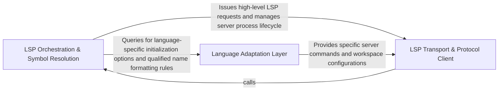

## Details

Manages the lifecycle of Language Servers and provides a unified interface for multi-language symbol extraction.

### LSP Orchestration & Symbol Resolution [[Expand]](./LSP_Orchestration_Symbol_Resolution.md)
Manages the high-level analysis session, coordinating between the protocol client and language-specific adapters to build a comprehensive model of the codebase.

**Related Classes/Methods**:

- `static_analyzer.__init__.StaticAnalyzer`:169-771
- `static_analyzer.engine.hierarchy_builder.HierarchyBuilder`:19-200
- `static_analyzer.engine.symbol_table.SymbolTable`:16-328
- `static_analyzer.engine.source_inspector.SourceInspector`:9-203

**Source Files:**

- [`static_analyzer/__init__.py`](https://github.com/CodeBoarding/CodeBoarding/blob/main/.codeboardingstatic_analyzer/__init__.py)
  - `static_analyzer.__init__.StaticAnalyzer.__enter__` ([L191-L193](https://github.com/CodeBoarding/CodeBoarding/blob/main/.codeboardingstatic_analyzer/__init__.py#L191-L193)) - Method
  - `static_analyzer.__init__.StaticAnalyzer.__exit__` ([L195-L196](https://github.com/CodeBoarding/CodeBoarding/blob/main/.codeboardingstatic_analyzer/__init__.py#L195-L196)) - Method
  - `static_analyzer.__init__.StaticAnalyzer.start_clients` ([L198-L297](https://github.com/CodeBoarding/CodeBoarding/blob/main/.codeboardingstatic_analyzer/__init__.py#L198-L297)) - Method
  - `static_analyzer.__init__.StaticAnalyzer.stop_clients` ([L299-L317](https://github.com/CodeBoarding/CodeBoarding/blob/main/.codeboardingstatic_analyzer/__init__.py#L299-L317)) - Method
  - `static_analyzer.__init__.StaticAnalyzer.get_diagnostics_generation` ([L351-L353](https://github.com/CodeBoarding/CodeBoarding/blob/main/.codeboardingstatic_analyzer/__init__.py#L351-L353)) - Method
  - `static_analyzer.__init__.StaticAnalyzer.discover_file_dependencies` ([L439-L488](https://github.com/CodeBoarding/CodeBoarding/blob/main/.codeboardingstatic_analyzer/__init__.py#L439-L488)) - Method
- [`static_analyzer/engine/call_graph_builder.py`](https://github.com/CodeBoarding/CodeBoarding/blob/main/.codeboardingstatic_analyzer/engine/call_graph_builder.py)
  - `static_analyzer.engine.call_graph_builder.CallGraphBuilder.__init__` ([L26-L37](https://github.com/CodeBoarding/CodeBoarding/blob/main/.codeboardingstatic_analyzer/engine/call_graph_builder.py#L26-L37)) - Method
  - `static_analyzer.engine.call_graph_builder.CallGraphBuilder._warmup_references` ([L201-L216](https://github.com/CodeBoarding/CodeBoarding/blob/main/.codeboardingstatic_analyzer/engine/call_graph_builder.py#L201-L216)) - Method
- [`static_analyzer/engine/hierarchy_builder.py`](https://github.com/CodeBoarding/CodeBoarding/blob/main/.codeboardingstatic_analyzer/engine/hierarchy_builder.py)
  - `static_analyzer.engine.hierarchy_builder.HierarchyBuilder.__init__` ([L22-L32](https://github.com/CodeBoarding/CodeBoarding/blob/main/.codeboardingstatic_analyzer/engine/hierarchy_builder.py#L22-L32)) - Method
  - `static_analyzer.engine.hierarchy_builder.HierarchyBuilder.build` ([L34-L111](https://github.com/CodeBoarding/CodeBoarding/blob/main/.codeboardingstatic_analyzer/engine/hierarchy_builder.py#L34-L111)) - Method
  - `static_analyzer.engine.hierarchy_builder.HierarchyBuilder._resolve_type_hierarchy_item` ([L113-L135](https://github.com/CodeBoarding/CodeBoarding/blob/main/.codeboardingstatic_analyzer/engine/hierarchy_builder.py#L113-L135)) - Method
  - `static_analyzer.engine.hierarchy_builder.HierarchyBuilder._infer_hierarchy_from_source` ([L137-L182](https://github.com/CodeBoarding/CodeBoarding/blob/main/.codeboardingstatic_analyzer/engine/hierarchy_builder.py#L137-L182)) - Method
  - `static_analyzer.engine.hierarchy_builder.HierarchyBuilder._link_hierarchy` ([L184-L200](https://github.com/CodeBoarding/CodeBoarding/blob/main/.codeboardingstatic_analyzer/engine/hierarchy_builder.py#L184-L200)) - Method
- [`static_analyzer/engine/source_inspector.py`](https://github.com/CodeBoarding/CodeBoarding/blob/main/.codeboardingstatic_analyzer/engine/source_inspector.py)
  - `static_analyzer.engine.source_inspector.SourceInspector` ([L9-L203](https://github.com/CodeBoarding/CodeBoarding/blob/main/.codeboardingstatic_analyzer/engine/source_inspector.py#L9-L203)) - Class
  - `static_analyzer.engine.source_inspector.SourceInspector.__init__` ([L15-L16](https://github.com/CodeBoarding/CodeBoarding/blob/main/.codeboardingstatic_analyzer/engine/source_inspector.py#L15-L16)) - Method
  - `static_analyzer.engine.source_inspector.SourceInspector.get_source_line` ([L18-L23](https://github.com/CodeBoarding/CodeBoarding/blob/main/.codeboardingstatic_analyzer/engine/source_inspector.py#L18-L23)) - Method
  - `static_analyzer.engine.source_inspector.SourceInspector.get_file_lines` ([L25-L33](https://github.com/CodeBoarding/CodeBoarding/blob/main/.codeboardingstatic_analyzer/engine/source_inspector.py#L25-L33)) - Method
  - `static_analyzer.engine.source_inspector.SourceInspector.is_invocation` ([L35-L66](https://github.com/CodeBoarding/CodeBoarding/blob/main/.codeboardingstatic_analyzer/engine/source_inspector.py#L35-L66)) - Method
  - `static_analyzer.engine.source_inspector.SourceInspector.is_callable_usage` ([L68-L99](https://github.com/CodeBoarding/CodeBoarding/blob/main/.codeboardingstatic_analyzer/engine/source_inspector.py#L68-L99)) - Method
  - `static_analyzer.engine.source_inspector.SourceInspector._is_inside_call_arguments` ([L102-L117](https://github.com/CodeBoarding/CodeBoarding/blob/main/.codeboardingstatic_analyzer/engine/source_inspector.py#L102-L117)) - Method
  - `static_analyzer.engine.source_inspector.SourceInspector.find_call_sites` ([L119-L203](https://github.com/CodeBoarding/CodeBoarding/blob/main/.codeboardingstatic_analyzer/engine/source_inspector.py#L119-L203)) - Method
- [`static_analyzer/engine/symbol_table.py`](https://github.com/CodeBoarding/CodeBoarding/blob/main/.codeboardingstatic_analyzer/engine/symbol_table.py)
  - `static_analyzer.engine.symbol_table.SymbolTable` ([L16-L328](https://github.com/CodeBoarding/CodeBoarding/blob/main/.codeboardingstatic_analyzer/engine/symbol_table.py#L16-L328)) - Class
  - `static_analyzer.engine.symbol_table.SymbolTable.__init__` ([L23-L39](https://github.com/CodeBoarding/CodeBoarding/blob/main/.codeboardingstatic_analyzer/engine/symbol_table.py#L23-L39)) - Method
  - `static_analyzer.engine.symbol_table.SymbolTable.file_symbols` ([L52-L54](https://github.com/CodeBoarding/CodeBoarding/blob/main/.codeboardingstatic_analyzer/engine/symbol_table.py#L52-L54)) - Method
- [`static_analyzer/engine/utils.py`](https://github.com/CodeBoarding/CodeBoarding/blob/main/.codeboardingstatic_analyzer/engine/utils.py)
  - `static_analyzer.engine.utils.uri_to_path` ([L16-L32](https://github.com/CodeBoarding/CodeBoarding/blob/main/.codeboardingstatic_analyzer/engine/utils.py#L16-L32)) - Function
- [`static_analyzer/incremental_orchestrator.py`](https://github.com/CodeBoarding/CodeBoarding/blob/main/.codeboardingstatic_analyzer/incremental_orchestrator.py)
  - `static_analyzer.incremental_orchestrator._rebuild_changed_file_edges` ([L109-L120](https://github.com/CodeBoarding/CodeBoarding/blob/main/.codeboardingstatic_analyzer/incremental_orchestrator.py#L109-L120)) - Function
  - `static_analyzer.incremental_orchestrator._restore_inbound_edges` ([L123-L171](https://github.com/CodeBoarding/CodeBoarding/blob/main/.codeboardingstatic_analyzer/incremental_orchestrator.py#L123-L171)) - Function
  - `static_analyzer.incremental_orchestrator._edge_reference_still_exists` ([L174-L199](https://github.com/CodeBoarding/CodeBoarding/blob/main/.codeboardingstatic_analyzer/incremental_orchestrator.py#L174-L199)) - Function
  - `static_analyzer.incremental_orchestrator._add_outbound_edges_from_changed_files` ([L202-L249](https://github.com/CodeBoarding/CodeBoarding/blob/main/.codeboardingstatic_analyzer/incremental_orchestrator.py#L202-L249)) - Function
  - `static_analyzer.incremental_orchestrator._containing_callable_nodes` ([L252-L257](https://github.com/CodeBoarding/CodeBoarding/blob/main/.codeboardingstatic_analyzer/incremental_orchestrator.py#L252-L257)) - Function
  - `static_analyzer.incremental_orchestrator._definition_nodes` ([L260-L261](https://github.com/CodeBoarding/CodeBoarding/blob/main/.codeboardingstatic_analyzer/incremental_orchestrator.py#L260-L261)) - Function
  - `static_analyzer.incremental_orchestrator._definition_points_to_node` ([L264-L273](https://github.com/CodeBoarding/CodeBoarding/blob/main/.codeboardingstatic_analyzer/incremental_orchestrator.py#L264-L273)) - Function
  - `static_analyzer.incremental_orchestrator._position_inside_node` ([L276-L282](https://github.com/CodeBoarding/CodeBoarding/blob/main/.codeboardingstatic_analyzer/incremental_orchestrator.py#L276-L282)) - Function
  - `static_analyzer.incremental_orchestrator._reference_matches_edge_kind` ([L285-L302](https://github.com/CodeBoarding/CodeBoarding/blob/main/.codeboardingstatic_analyzer/incremental_orchestrator.py#L285-L302)) - Function
- [`tool_registry/paths.py`](https://github.com/CodeBoarding/CodeBoarding/blob/main/.codeboardingtool_registry/paths.py)
  - `tool_registry.paths.ensure_node_on_path` ([L265-L294](https://github.com/CodeBoarding/CodeBoarding/blob/main/.codeboardingtool_registry/paths.py#L265-L294)) - Function

### Language Adaptation Layer [[Expand]](./Language_Adaptation_Layer.md)
Provides a polymorphic abstraction layer that translates generic analysis requests into language-specific configurations, commands, and qualified name resolution logic.

**Related Classes/Methods**:

- `static_analyzer.engine.language_adapter.LanguageAdapter`:22-368
- `static_analyzer.engine.adapters.java_adapter.JavaAdapter`:25-300
- `static_analyzer.engine.adapters.rust_adapter.RustAdapter`:75-190
- `static_analyzer.engine.adapters.typescript_adapter.TypeScriptAdapter`:11-33

**Source Files:**

- [`static_analyzer/engine/adapters/csharp_adapter.py`](https://github.com/CodeBoarding/CodeBoarding/blob/main/.codeboardingstatic_analyzer/engine/adapters/csharp_adapter.py)
  - `static_analyzer.engine.adapters.csharp_adapter.CSharpAdapter.extract_package` ([L137-L142](https://github.com/CodeBoarding/CodeBoarding/blob/main/.codeboardingstatic_analyzer/engine/adapters/csharp_adapter.py#L137-L142)) - Method
  - `static_analyzer.engine.adapters.csharp_adapter.CSharpAdapter.wait_for_diagnostics` ([L175-L186](https://github.com/CodeBoarding/CodeBoarding/blob/main/.codeboardingstatic_analyzer/engine/adapters/csharp_adapter.py#L175-L186)) - Method
  - `static_analyzer.engine.adapters.csharp_adapter.CSharpAdapter.get_all_packages` ([L266-L268](https://github.com/CodeBoarding/CodeBoarding/blob/main/.codeboardingstatic_analyzer/engine/adapters/csharp_adapter.py#L266-L268)) - Method
- [`static_analyzer/engine/adapters/go_adapter.py`](https://github.com/CodeBoarding/CodeBoarding/blob/main/.codeboardingstatic_analyzer/engine/adapters/go_adapter.py)
  - `static_analyzer.engine.adapters.go_adapter.GoAdapter.build_qualified_name` ([L105-L126](https://github.com/CodeBoarding/CodeBoarding/blob/main/.codeboardingstatic_analyzer/engine/adapters/go_adapter.py#L105-L126)) - Method
  - `static_analyzer.engine.adapters.go_adapter.GoAdapter._is_pointer_receiver` ([L129-L132](https://github.com/CodeBoarding/CodeBoarding/blob/main/.codeboardingstatic_analyzer/engine/adapters/go_adapter.py#L129-L132)) - Method
- [`static_analyzer/engine/adapters/java_adapter.py`](https://github.com/CodeBoarding/CodeBoarding/blob/main/.codeboardingstatic_analyzer/engine/adapters/java_adapter.py)
  - `static_analyzer.engine.adapters.java_adapter.JavaAdapter` ([L25-L300](https://github.com/CodeBoarding/CodeBoarding/blob/main/.codeboardingstatic_analyzer/engine/adapters/java_adapter.py#L25-L300)) - Class
  - `static_analyzer.engine.adapters.java_adapter.JavaAdapter.wait_for_workspace_ready` ([L28-L33](https://github.com/CodeBoarding/CodeBoarding/blob/main/.codeboardingstatic_analyzer/engine/adapters/java_adapter.py#L28-L33)) - Method
  - `static_analyzer.engine.adapters.java_adapter.JavaAdapter.language` ([L36-L37](https://github.com/CodeBoarding/CodeBoarding/blob/main/.codeboardingstatic_analyzer/engine/adapters/java_adapter.py#L36-L37)) - Method
  - `static_analyzer.engine.adapters.java_adapter.JavaAdapter.language_enum` ([L40-L41](https://github.com/CodeBoarding/CodeBoarding/blob/main/.codeboardingstatic_analyzer/engine/adapters/java_adapter.py#L40-L41)) - Method
  - `static_analyzer.engine.adapters.java_adapter.JavaAdapter.lsp_command` ([L44-L45](https://github.com/CodeBoarding/CodeBoarding/blob/main/.codeboardingstatic_analyzer/engine/adapters/java_adapter.py#L44-L45)) - Method
  - `static_analyzer.engine.adapters.java_adapter.JavaAdapter.language_id` ([L48-L49](https://github.com/CodeBoarding/CodeBoarding/blob/main/.codeboardingstatic_analyzer/engine/adapters/java_adapter.py#L48-L49)) - Method
  - `static_analyzer.engine.adapters.java_adapter.JavaAdapter.build_qualified_name` ([L133-L158](https://github.com/CodeBoarding/CodeBoarding/blob/main/.codeboardingstatic_analyzer/engine/adapters/java_adapter.py#L133-L158)) - Method
  - `static_analyzer.engine.adapters.java_adapter.JavaAdapter._clean_symbol_name` ([L161-L199](https://github.com/CodeBoarding/CodeBoarding/blob/main/.codeboardingstatic_analyzer/engine/adapters/java_adapter.py#L161-L199)) - Method
  - `static_analyzer.engine.adapters.java_adapter.JavaAdapter._strip_generics` ([L202-L213](https://github.com/CodeBoarding/CodeBoarding/blob/main/.codeboardingstatic_analyzer/engine/adapters/java_adapter.py#L202-L213)) - Method
  - `static_analyzer.engine.adapters.java_adapter.JavaAdapter._split_params` ([L216-L235](https://github.com/CodeBoarding/CodeBoarding/blob/main/.codeboardingstatic_analyzer/engine/adapters/java_adapter.py#L216-L235)) - Method
  - `static_analyzer.engine.adapters.java_adapter.JavaAdapter.extract_package` ([L237-L267](https://github.com/CodeBoarding/CodeBoarding/blob/main/.codeboardingstatic_analyzer/engine/adapters/java_adapter.py#L237-L267)) - Method
  - `static_analyzer.engine.adapters.java_adapter.JavaAdapter.get_workspace_settings` ([L269-L281](https://github.com/CodeBoarding/CodeBoarding/blob/main/.codeboardingstatic_analyzer/engine/adapters/java_adapter.py#L269-L281)) - Method
  - `static_analyzer.engine.adapters.java_adapter.JavaAdapter.edge_strategy` ([L284-L286](https://github.com/CodeBoarding/CodeBoarding/blob/main/.codeboardingstatic_analyzer/engine/adapters/java_adapter.py#L284-L286)) - Method
  - `static_analyzer.engine.adapters.java_adapter.JavaAdapter.should_track_for_edges` ([L288-L289](https://github.com/CodeBoarding/CodeBoarding/blob/main/.codeboardingstatic_analyzer/engine/adapters/java_adapter.py#L288-L289)) - Method
  - `static_analyzer.engine.adapters.java_adapter.JavaAdapter.get_package_for_file` ([L291-L294](https://github.com/CodeBoarding/CodeBoarding/blob/main/.codeboardingstatic_analyzer/engine/adapters/java_adapter.py#L291-L294)) - Method
  - `static_analyzer.engine.adapters.java_adapter.JavaAdapter.get_all_packages` ([L296-L300](https://github.com/CodeBoarding/CodeBoarding/blob/main/.codeboardingstatic_analyzer/engine/adapters/java_adapter.py#L296-L300)) - Method
- [`static_analyzer/engine/adapters/php_adapter.py`](https://github.com/CodeBoarding/CodeBoarding/blob/main/.codeboardingstatic_analyzer/engine/adapters/php_adapter.py)
  - `static_analyzer.engine.adapters.php_adapter.PHPAdapter.extract_package` ([L30-L31](https://github.com/CodeBoarding/CodeBoarding/blob/main/.codeboardingstatic_analyzer/engine/adapters/php_adapter.py#L30-L31)) - Method
  - `static_analyzer.engine.adapters.php_adapter.PHPAdapter.get_all_packages` ([L49-L50](https://github.com/CodeBoarding/CodeBoarding/blob/main/.codeboardingstatic_analyzer/engine/adapters/php_adapter.py#L49-L50)) - Method
- [`static_analyzer/engine/adapters/typescript_adapter.py`](https://github.com/CodeBoarding/CodeBoarding/blob/main/.codeboardingstatic_analyzer/engine/adapters/typescript_adapter.py)
  - `static_analyzer.engine.adapters.typescript_adapter.TypeScriptAdapter` ([L11-L33](https://github.com/CodeBoarding/CodeBoarding/blob/main/.codeboardingstatic_analyzer/engine/adapters/typescript_adapter.py#L11-L33)) - Class
  - `static_analyzer.engine.adapters.typescript_adapter.TypeScriptAdapter.language` ([L14-L15](https://github.com/CodeBoarding/CodeBoarding/blob/main/.codeboardingstatic_analyzer/engine/adapters/typescript_adapter.py#L14-L15)) - Method
  - `static_analyzer.engine.adapters.typescript_adapter.TypeScriptAdapter.language_enum` ([L18-L19](https://github.com/CodeBoarding/CodeBoarding/blob/main/.codeboardingstatic_analyzer/engine/adapters/typescript_adapter.py#L18-L19)) - Method
  - `static_analyzer.engine.adapters.typescript_adapter.TypeScriptAdapter.lsp_command` ([L22-L23](https://github.com/CodeBoarding/CodeBoarding/blob/main/.codeboardingstatic_analyzer/engine/adapters/typescript_adapter.py#L22-L23)) - Method
  - `static_analyzer.engine.adapters.typescript_adapter.TypeScriptAdapter.language_id` ([L26-L27](https://github.com/CodeBoarding/CodeBoarding/blob/main/.codeboardingstatic_analyzer/engine/adapters/typescript_adapter.py#L26-L27)) - Method
  - `static_analyzer.engine.adapters.typescript_adapter.TypeScriptAdapter.extract_package` ([L29-L30](https://github.com/CodeBoarding/CodeBoarding/blob/main/.codeboardingstatic_analyzer/engine/adapters/typescript_adapter.py#L29-L30)) - Method
  - `static_analyzer.engine.adapters.typescript_adapter.TypeScriptAdapter.get_all_packages` ([L32-L33](https://github.com/CodeBoarding/CodeBoarding/blob/main/.codeboardingstatic_analyzer/engine/adapters/typescript_adapter.py#L32-L33)) - Method
  - `static_analyzer.engine.adapters.typescript_adapter.JavaScriptAdapter` ([L36-L52](https://github.com/CodeBoarding/CodeBoarding/blob/main/.codeboardingstatic_analyzer/engine/adapters/typescript_adapter.py#L36-L52)) - Class
  - `static_analyzer.engine.adapters.typescript_adapter.JavaScriptAdapter.language` ([L39-L40](https://github.com/CodeBoarding/CodeBoarding/blob/main/.codeboardingstatic_analyzer/engine/adapters/typescript_adapter.py#L39-L40)) - Method
  - `static_analyzer.engine.adapters.typescript_adapter.JavaScriptAdapter.language_enum` ([L43-L44](https://github.com/CodeBoarding/CodeBoarding/blob/main/.codeboardingstatic_analyzer/engine/adapters/typescript_adapter.py#L43-L44)) - Method
  - `static_analyzer.engine.adapters.typescript_adapter.JavaScriptAdapter.language_id` ([L47-L48](https://github.com/CodeBoarding/CodeBoarding/blob/main/.codeboardingstatic_analyzer/engine/adapters/typescript_adapter.py#L47-L48)) - Method
  - `static_analyzer.engine.adapters.typescript_adapter.JavaScriptAdapter.config_key` ([L51-L52](https://github.com/CodeBoarding/CodeBoarding/blob/main/.codeboardingstatic_analyzer/engine/adapters/typescript_adapter.py#L51-L52)) - Method
- [`static_analyzer/engine/language_adapter.py`](https://github.com/CodeBoarding/CodeBoarding/blob/main/.codeboardingstatic_analyzer/engine/language_adapter.py)
  - `static_analyzer.engine.language_adapter.LanguageAdapter` ([L22-L368](https://github.com/CodeBoarding/CodeBoarding/blob/main/.codeboardingstatic_analyzer/engine/language_adapter.py#L22-L368)) - Class
  - `static_analyzer.engine.language_adapter.LanguageAdapter.build_qualified_name` ([L81-L101](https://github.com/CodeBoarding/CodeBoarding/blob/main/.codeboardingstatic_analyzer/engine/language_adapter.py#L81-L101)) - Method
  - `static_analyzer.engine.language_adapter.LanguageAdapter.extract_package` ([L111-L117](https://github.com/CodeBoarding/CodeBoarding/blob/main/.codeboardingstatic_analyzer/engine/language_adapter.py#L111-L117)) - Method
  - `static_analyzer.engine.language_adapter.LanguageAdapter.get_lsp_init_options` ([L135-L137](https://github.com/CodeBoarding/CodeBoarding/blob/main/.codeboardingstatic_analyzer/engine/language_adapter.py#L135-L137)) - Method
  - `static_analyzer.engine.language_adapter.LanguageAdapter.get_workspace_settings` ([L139-L149](https://github.com/CodeBoarding/CodeBoarding/blob/main/.codeboardingstatic_analyzer/engine/language_adapter.py#L139-L149)) - Method
  - `static_analyzer.engine.language_adapter.LanguageAdapter.get_lsp_default_timeout` ([L151-L159](https://github.com/CodeBoarding/CodeBoarding/blob/main/.codeboardingstatic_analyzer/engine/language_adapter.py#L151-L159)) - Method
  - `static_analyzer.engine.language_adapter.LanguageAdapter.wait_for_workspace_ready` ([L162-L169](https://github.com/CodeBoarding/CodeBoarding/blob/main/.codeboardingstatic_analyzer/engine/language_adapter.py#L162-L169)) - Method
  - `static_analyzer.engine.language_adapter.LanguageAdapter.get_lsp_env` ([L216-L218](https://github.com/CodeBoarding/CodeBoarding/blob/main/.codeboardingstatic_analyzer/engine/language_adapter.py#L216-L218)) - Method
  - `static_analyzer.engine.language_adapter.LanguageAdapter.prepare_project` ([L220-L228](https://github.com/CodeBoarding/CodeBoarding/blob/main/.codeboardingstatic_analyzer/engine/language_adapter.py#L220-L228)) - Method
  - `static_analyzer.engine.language_adapter.LanguageAdapter.is_class_like` ([L267-L268](https://github.com/CodeBoarding/CodeBoarding/blob/main/.codeboardingstatic_analyzer/engine/language_adapter.py#L267-L268)) - Method
  - `static_analyzer.engine.language_adapter.LanguageAdapter.is_callable` ([L270-L271](https://github.com/CodeBoarding/CodeBoarding/blob/main/.codeboardingstatic_analyzer/engine/language_adapter.py#L270-L271)) - Method
  - `static_analyzer.engine.language_adapter.LanguageAdapter.should_track_for_edges` ([L286-L287](https://github.com/CodeBoarding/CodeBoarding/blob/main/.codeboardingstatic_analyzer/engine/language_adapter.py#L286-L287)) - Method
  - `static_analyzer.engine.language_adapter.LanguageAdapter.extra_client_capabilities` ([L299-L304](https://github.com/CodeBoarding/CodeBoarding/blob/main/.codeboardingstatic_analyzer/engine/language_adapter.py#L299-L304)) - Method
  - `static_analyzer.engine.language_adapter.LanguageAdapter.references_batch_size` ([L307-L309](https://github.com/CodeBoarding/CodeBoarding/blob/main/.codeboardingstatic_analyzer/engine/language_adapter.py#L307-L309)) - Method
  - `static_analyzer.engine.language_adapter.LanguageAdapter.references_per_query_timeout` ([L312-L314](https://github.com/CodeBoarding/CodeBoarding/blob/main/.codeboardingstatic_analyzer/engine/language_adapter.py#L312-L314)) - Method
  - `static_analyzer.engine.language_adapter.LanguageAdapter.build_edge_name` ([L316-L326](https://github.com/CodeBoarding/CodeBoarding/blob/main/.codeboardingstatic_analyzer/engine/language_adapter.py#L316-L326)) - Method
  - `static_analyzer.engine.language_adapter.LanguageAdapter._extract_deep_package` ([L346-L358](https://github.com/CodeBoarding/CodeBoarding/blob/main/.codeboardingstatic_analyzer/engine/language_adapter.py#L346-L358)) - Method
  - `static_analyzer.engine.language_adapter.LanguageAdapter._get_hierarchical_packages` ([L360-L368](https://github.com/CodeBoarding/CodeBoarding/blob/main/.codeboardingstatic_analyzer/engine/language_adapter.py#L360-L368)) - Method

### LSP Transport & Protocol Client [[Expand]](./LSP_Transport_Protocol_Client.md)
Handles the low-level JSON-RPC communication lifecycle with Language Server processes, managing asynchronous message reading/writing and server health.

**Related Classes/Methods**:

- `static_analyzer.engine.lsp_client.LSPClient`:31-820
- `static_analyzer.engine.lsp_client.LSPClient._reader_loop`:670-706
- `static_analyzer.lsp_client.diagnostics.LSPDiagnostic`:27-58

**Source Files:**

- [`static_analyzer/engine/adapters/rust_adapter.py`](https://github.com/CodeBoarding/CodeBoarding/blob/main/.codeboardingstatic_analyzer/engine/adapters/rust_adapter.py)
  - `static_analyzer.engine.adapters.rust_adapter._skip_angle_block` ([L21-L37](https://github.com/CodeBoarding/CodeBoarding/blob/main/.codeboardingstatic_analyzer/engine/adapters/rust_adapter.py#L21-L37)) - Function
  - `static_analyzer.engine.adapters.rust_adapter._normalize_parent` ([L40-L72](https://github.com/CodeBoarding/CodeBoarding/blob/main/.codeboardingstatic_analyzer/engine/adapters/rust_adapter.py#L40-L72)) - Function
  - `static_analyzer.engine.adapters.rust_adapter.RustAdapter` ([L75-L190](https://github.com/CodeBoarding/CodeBoarding/blob/main/.codeboardingstatic_analyzer/engine/adapters/rust_adapter.py#L75-L190)) - Class
  - `static_analyzer.engine.adapters.rust_adapter.RustAdapter.language` ([L79-L80](https://github.com/CodeBoarding/CodeBoarding/blob/main/.codeboardingstatic_analyzer/engine/adapters/rust_adapter.py#L79-L80)) - Method
  - `static_analyzer.engine.adapters.rust_adapter.RustAdapter.language_enum` ([L83-L84](https://github.com/CodeBoarding/CodeBoarding/blob/main/.codeboardingstatic_analyzer/engine/adapters/rust_adapter.py#L83-L84)) - Method
  - `static_analyzer.engine.adapters.rust_adapter.RustAdapter.references_per_query_timeout` ([L87-L90](https://github.com/CodeBoarding/CodeBoarding/blob/main/.codeboardingstatic_analyzer/engine/adapters/rust_adapter.py#L87-L90)) - Method
  - `static_analyzer.engine.adapters.rust_adapter.RustAdapter.wait_for_workspace_ready` ([L93-L99](https://github.com/CodeBoarding/CodeBoarding/blob/main/.codeboardingstatic_analyzer/engine/adapters/rust_adapter.py#L93-L99)) - Method
  - `static_analyzer.engine.adapters.rust_adapter.RustAdapter.extra_client_capabilities` ([L102-L106](https://github.com/CodeBoarding/CodeBoarding/blob/main/.codeboardingstatic_analyzer/engine/adapters/rust_adapter.py#L102-L106)) - Method
  - `static_analyzer.engine.adapters.rust_adapter.RustAdapter.wait_for_diagnostics` ([L108-L120](https://github.com/CodeBoarding/CodeBoarding/blob/main/.codeboardingstatic_analyzer/engine/adapters/rust_adapter.py#L108-L120)) - Method
  - `static_analyzer.engine.adapters.rust_adapter.RustAdapter.lsp_command` ([L123-L124](https://github.com/CodeBoarding/CodeBoarding/blob/main/.codeboardingstatic_analyzer/engine/adapters/rust_adapter.py#L123-L124)) - Method
  - `static_analyzer.engine.adapters.rust_adapter.RustAdapter.language_id` ([L127-L128](https://github.com/CodeBoarding/CodeBoarding/blob/main/.codeboardingstatic_analyzer/engine/adapters/rust_adapter.py#L127-L128)) - Method
  - `static_analyzer.engine.adapters.rust_adapter.RustAdapter.get_lsp_init_options` ([L145-L164](https://github.com/CodeBoarding/CodeBoarding/blob/main/.codeboardingstatic_analyzer/engine/adapters/rust_adapter.py#L145-L164)) - Method
  - `static_analyzer.engine.adapters.rust_adapter.RustAdapter.build_qualified_name` ([L166-L190](https://github.com/CodeBoarding/CodeBoarding/blob/main/.codeboardingstatic_analyzer/engine/adapters/rust_adapter.py#L166-L190)) - Method
- [`static_analyzer/engine/lsp_client.py`](https://github.com/CodeBoarding/CodeBoarding/blob/main/.codeboardingstatic_analyzer/engine/lsp_client.py)
  - `static_analyzer.engine.lsp_client.MethodNotFoundError` ([L27-L28](https://github.com/CodeBoarding/CodeBoarding/blob/main/.codeboardingstatic_analyzer/engine/lsp_client.py#L27-L28)) - Class
  - `static_analyzer.engine.lsp_client.LSPClient` ([L31-L820](https://github.com/CodeBoarding/CodeBoarding/blob/main/.codeboardingstatic_analyzer/engine/lsp_client.py#L31-L820)) - Class
  - `static_analyzer.engine.lsp_client.LSPClient.__init__` ([L42-L85](https://github.com/CodeBoarding/CodeBoarding/blob/main/.codeboardingstatic_analyzer/engine/lsp_client.py#L42-L85)) - Method
  - `static_analyzer.engine.lsp_client.LSPClient.__enter__` ([L87-L89](https://github.com/CodeBoarding/CodeBoarding/blob/main/.codeboardingstatic_analyzer/engine/lsp_client.py#L87-L89)) - Method
  - `static_analyzer.engine.lsp_client.LSPClient.__exit__` ([L91-L92](https://github.com/CodeBoarding/CodeBoarding/blob/main/.codeboardingstatic_analyzer/engine/lsp_client.py#L91-L92)) - Method
  - `static_analyzer.engine.lsp_client.LSPClient.start` ([L94-L186](https://github.com/CodeBoarding/CodeBoarding/blob/main/.codeboardingstatic_analyzer/engine/lsp_client.py#L94-L186)) - Method
  - `static_analyzer.engine.lsp_client.LSPClient.shutdown` ([L188-L215](https://github.com/CodeBoarding/CodeBoarding/blob/main/.codeboardingstatic_analyzer/engine/lsp_client.py#L188-L215)) - Method
  - `static_analyzer.engine.lsp_client.LSPClient.did_open` ([L219-L244](https://github.com/CodeBoarding/CodeBoarding/blob/main/.codeboardingstatic_analyzer/engine/lsp_client.py#L219-L244)) - Method
  - `static_analyzer.engine.lsp_client.LSPClient.did_change` ([L246-L257](https://github.com/CodeBoarding/CodeBoarding/blob/main/.codeboardingstatic_analyzer/engine/lsp_client.py#L246-L257)) - Method
  - `static_analyzer.engine.lsp_client.LSPClient.did_close` ([L259-L267](https://github.com/CodeBoarding/CodeBoarding/blob/main/.codeboardingstatic_analyzer/engine/lsp_client.py#L259-L267)) - Method
  - `static_analyzer.engine.lsp_client.LSPClient.references` ([L282-L294](https://github.com/CodeBoarding/CodeBoarding/blob/main/.codeboardingstatic_analyzer/engine/lsp_client.py#L282-L294)) - Method
  - `static_analyzer.engine.lsp_client.LSPClient.send_references_batch` ([L296-L321](https://github.com/CodeBoarding/CodeBoarding/blob/main/.codeboardingstatic_analyzer/engine/lsp_client.py#L296-L321)) - Method
  - `static_analyzer.engine.lsp_client.LSPClient.send_references_batch.build_params` ([L314-L319](https://github.com/CodeBoarding/CodeBoarding/blob/main/.codeboardingstatic_analyzer/engine/lsp_client.py#L314-L319)) - Function
  - `static_analyzer.engine.lsp_client.LSPClient.definition` ([L323-L337](https://github.com/CodeBoarding/CodeBoarding/blob/main/.codeboardingstatic_analyzer/engine/lsp_client.py#L323-L337)) - Method
  - `static_analyzer.engine.lsp_client.LSPClient.send_definition_batch` ([L339-L346](https://github.com/CodeBoarding/CodeBoarding/blob/main/.codeboardingstatic_analyzer/engine/lsp_client.py#L339-L346)) - Method
  - `static_analyzer.engine.lsp_client.LSPClient.implementation` ([L348-L362](https://github.com/CodeBoarding/CodeBoarding/blob/main/.codeboardingstatic_analyzer/engine/lsp_client.py#L348-L362)) - Method
  - `static_analyzer.engine.lsp_client.LSPClient.send_implementation_batch` ([L364-L371](https://github.com/CodeBoarding/CodeBoarding/blob/main/.codeboardingstatic_analyzer/engine/lsp_client.py#L364-L371)) - Method
  - `static_analyzer.engine.lsp_client.LSPClient.type_hierarchy_prepare` ([L373-L384](https://github.com/CodeBoarding/CodeBoarding/blob/main/.codeboardingstatic_analyzer/engine/lsp_client.py#L373-L384)) - Method
  - `static_analyzer.engine.lsp_client.LSPClient.type_hierarchy_supertypes` ([L386-L391](https://github.com/CodeBoarding/CodeBoarding/blob/main/.codeboardingstatic_analyzer/engine/lsp_client.py#L386-L391)) - Method
  - `static_analyzer.engine.lsp_client.LSPClient.type_hierarchy_subtypes` ([L393-L398](https://github.com/CodeBoarding/CodeBoarding/blob/main/.codeboardingstatic_analyzer/engine/lsp_client.py#L393-L398)) - Method
  - `static_analyzer.engine.lsp_client.LSPClient.get_diagnostics_generation` ([L407-L410](https://github.com/CodeBoarding/CodeBoarding/blob/main/.codeboardingstatic_analyzer/engine/lsp_client.py#L407-L410)) - Method
  - `static_analyzer.engine.lsp_client.LSPClient.wait_for_diagnostics_quiesce` ([L412-L436](https://github.com/CodeBoarding/CodeBoarding/blob/main/.codeboardingstatic_analyzer/engine/lsp_client.py#L412-L436)) - Method
  - `static_analyzer.engine.lsp_client.LSPClient.wait_for_server_ready` ([L440-L463](https://github.com/CodeBoarding/CodeBoarding/blob/main/.codeboardingstatic_analyzer/engine/lsp_client.py#L440-L463)) - Method
  - `static_analyzer.engine.lsp_client.LSPClient.reset_ready_signal` ([L465-L474](https://github.com/CodeBoarding/CodeBoarding/blob/main/.codeboardingstatic_analyzer/engine/lsp_client.py#L465-L474)) - Method
  - `static_analyzer.engine.lsp_client.LSPClient._position_params` ([L478-L483](https://github.com/CodeBoarding/CodeBoarding/blob/main/.codeboardingstatic_analyzer/engine/lsp_client.py#L478-L483)) - Method
  - `static_analyzer.engine.lsp_client.LSPClient._send_batch` ([L485-L529](https://github.com/CodeBoarding/CodeBoarding/blob/main/.codeboardingstatic_analyzer/engine/lsp_client.py#L485-L529)) - Method
  - `static_analyzer.engine.lsp_client.LSPClient._send_request` ([L531-L567](https://github.com/CodeBoarding/CodeBoarding/blob/main/.codeboardingstatic_analyzer/engine/lsp_client.py#L531-L567)) - Method
  - `static_analyzer.engine.lsp_client.LSPClient._send_notification` ([L569-L576](https://github.com/CodeBoarding/CodeBoarding/blob/main/.codeboardingstatic_analyzer/engine/lsp_client.py#L569-L576)) - Method
  - `static_analyzer.engine.lsp_client.LSPClient._write_message` ([L578-L591](https://github.com/CodeBoarding/CodeBoarding/blob/main/.codeboardingstatic_analyzer/engine/lsp_client.py#L578-L591)) - Method
  - `static_analyzer.engine.lsp_client.LSPClient._next_response` ([L593-L614](https://github.com/CodeBoarding/CodeBoarding/blob/main/.codeboardingstatic_analyzer/engine/lsp_client.py#L593-L614)) - Method
  - `static_analyzer.engine.lsp_client.LSPClient._collect_batch_responses` ([L616-L666](https://github.com/CodeBoarding/CodeBoarding/blob/main/.codeboardingstatic_analyzer/engine/lsp_client.py#L616-L666)) - Method
  - `static_analyzer.engine.lsp_client.LSPClient._reader_loop` ([L670-L706](https://github.com/CodeBoarding/CodeBoarding/blob/main/.codeboardingstatic_analyzer/engine/lsp_client.py#L670-L706)) - Method
  - `static_analyzer.engine.lsp_client.LSPClient._handle_server_request` ([L708-L722](https://github.com/CodeBoarding/CodeBoarding/blob/main/.codeboardingstatic_analyzer/engine/lsp_client.py#L708-L722)) - Method
  - `static_analyzer.engine.lsp_client.LSPClient._handle_notification` ([L724-L778](https://github.com/CodeBoarding/CodeBoarding/blob/main/.codeboardingstatic_analyzer/engine/lsp_client.py#L724-L778)) - Method
  - `static_analyzer.engine.lsp_client.LSPClient._read_single_message` ([L780-L820](https://github.com/CodeBoarding/CodeBoarding/blob/main/.codeboardingstatic_analyzer/engine/lsp_client.py#L780-L820)) - Method
- [`static_analyzer/lsp_client/diagnostics.py`](https://github.com/CodeBoarding/CodeBoarding/blob/main/.codeboardingstatic_analyzer/lsp_client/diagnostics.py)
  - `static_analyzer.lsp_client.diagnostics.DiagnosticPosition` ([L11-L15](https://github.com/CodeBoarding/CodeBoarding/blob/main/.codeboardingstatic_analyzer/lsp_client/diagnostics.py#L11-L15)) - Class
  - `static_analyzer.lsp_client.diagnostics.DiagnosticRange` ([L19-L23](https://github.com/CodeBoarding/CodeBoarding/blob/main/.codeboardingstatic_analyzer/lsp_client/diagnostics.py#L19-L23)) - Class
  - `static_analyzer.lsp_client.diagnostics.LSPDiagnostic` ([L27-L58](https://github.com/CodeBoarding/CodeBoarding/blob/main/.codeboardingstatic_analyzer/lsp_client/diagnostics.py#L27-L58)) - Class
  - `static_analyzer.lsp_client.diagnostics.LSPDiagnostic.from_lsp_dict` ([L37-L50](https://github.com/CodeBoarding/CodeBoarding/blob/main/.codeboardingstatic_analyzer/lsp_client/diagnostics.py#L37-L50)) - Method
  - `static_analyzer.lsp_client.diagnostics.LSPDiagnostic.dedup_key` ([L52-L58](https://github.com/CodeBoarding/CodeBoarding/blob/main/.codeboardingstatic_analyzer/lsp_client/diagnostics.py#L52-L58)) - Method

### [FAQ](https://github.com/CodeBoarding/GeneratedOnBoardings/tree/main?tab=readme-ov-file#faq)