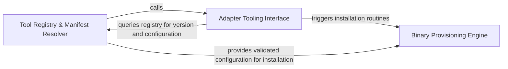

## Details

Handles the installation, version tracking, and registry management of Language Server Protocol (LSP) binaries required for analysis.

### Tool Registry & Manifest Resolver
Acts as the configuration authority for the subsystem, parsing tool definitions, resolving version constraints, and maintaining a registry of supported LSP servers.

**Related Classes/Methods**:

- `tool_registry.manifest.resolve_config`:203-249

**Source Files:**

- [`install.py`](https://github.com/CodeBoarding/CodeBoarding/blob/main/.codeboardinginstall.py)
  - `install.install_package_manager_lsp_servers` ([L491-L514](https://github.com/CodeBoarding/CodeBoarding/blob/main/.codeboardinginstall.py#L491-L514)) - Function
- [`static_analyzer/engine/adapters/csharp_adapter.py`](https://github.com/CodeBoarding/CodeBoarding/blob/main/.codeboardingstatic_analyzer/engine/adapters/csharp_adapter.py)
  - `static_analyzer.engine.adapters.csharp_adapter.CSharpAdapter._ensure_csharp_ls_installed` ([L57-L89](https://github.com/CodeBoarding/CodeBoarding/blob/main/.codeboardingstatic_analyzer/engine/adapters/csharp_adapter.py#L57-L89)) - Method
- [`static_analyzer/engine/adapters/java_adapter.py`](https://github.com/CodeBoarding/CodeBoarding/blob/main/.codeboardingstatic_analyzer/engine/adapters/java_adapter.py)
  - `static_analyzer.engine.adapters.java_adapter.JavaAdapter._find_jdtls_root` ([L74-L103](https://github.com/CodeBoarding/CodeBoarding/blob/main/.codeboardingstatic_analyzer/engine/adapters/java_adapter.py#L74-L103)) - Method

### Binary Provisioning Engine
Handles the physical installation and maintenance of tool binaries, managing interactions with external package managers and tracking installation state via stamps.

**Related Classes/Methods**:

- `tool_registry.installers.install_package_manager_tools`:333-423
- `tool_registry.installers._write_package_manager_tool_stamp`:323-330

**Source Files:**

- [`tool_registry/installers.py`](https://github.com/CodeBoarding/CodeBoarding/blob/main/.codeboardingtool_registry/installers.py)
  - `tool_registry.installers.package_manager_tool_dir` ([L277-L284](https://github.com/CodeBoarding/CodeBoarding/blob/main/.codeboardingtool_registry/installers.py#L277-L284)) - Function
  - `tool_registry.installers.package_manager_tool_fingerprint` ([L287-L301](https://github.com/CodeBoarding/CodeBoarding/blob/main/.codeboardingtool_registry/installers.py#L287-L301)) - Function
  - `tool_registry.installers.package_manager_tool_is_current` ([L304-L320](https://github.com/CodeBoarding/CodeBoarding/blob/main/.codeboardingtool_registry/installers.py#L304-L320)) - Function
  - `tool_registry.installers._write_package_manager_tool_stamp` ([L323-L330](https://github.com/CodeBoarding/CodeBoarding/blob/main/.codeboardingtool_registry/installers.py#L323-L330)) - Function
  - `tool_registry.installers.install_package_manager_tools` ([L333-L423](https://github.com/CodeBoarding/CodeBoarding/blob/main/.codeboardingtool_registry/installers.py#L333-L423)) - Function

### Adapter Tooling Interface
Provides the bridge between the registry and language-specific static analysis adapters, triggering installation logic during analysis initialization.

**Related Classes/Methods**:

- `static_analyzer.engine.adapters.csharp_adapter.CSharpAdapter._ensure_csharp_ls_installed`:57-89

**Source Files:**

- [`tool_registry/manifest.py`](https://github.com/CodeBoarding/CodeBoarding/blob/main/.codeboardingtool_registry/manifest.py)
  - `tool_registry.manifest.build_config` ([L166-L186](https://github.com/CodeBoarding/CodeBoarding/blob/main/.codeboardingtool_registry/manifest.py#L166-L186)) - Function
  - `tool_registry.manifest.package_manager_tool_path` ([L189-L200](https://github.com/CodeBoarding/CodeBoarding/blob/main/.codeboardingtool_registry/manifest.py#L189-L200)) - Function
  - `tool_registry.manifest.resolve_config` ([L203-L249](https://github.com/CodeBoarding/CodeBoarding/blob/main/.codeboardingtool_registry/manifest.py#L203-L249)) - Function
  - `tool_registry.manifest.resolve_config_from_path` ([L252-L275](https://github.com/CodeBoarding/CodeBoarding/blob/main/.codeboardingtool_registry/manifest.py#L252-L275)) - Function
  - `tool_registry.manifest.has_required_tools` ([L278-L347](https://github.com/CodeBoarding/CodeBoarding/blob/main/.codeboardingtool_registry/manifest.py#L278-L347)) - Function
- [`utils.py`](https://github.com/CodeBoarding/CodeBoarding/blob/main/.codeboardingutils.py)
  - `utils.get_config` ([L79-L85](https://github.com/CodeBoarding/CodeBoarding/blob/main/.codeboardingutils.py#L79-L85)) - Function
- [`vscode_constants.py`](https://github.com/CodeBoarding/CodeBoarding/blob/main/.codeboardingvscode_constants.py)
  - `vscode_constants.find_runnable` ([L65-L69](https://github.com/CodeBoarding/CodeBoarding/blob/main/.codeboardingvscode_constants.py#L65-L69)) - Function

### [FAQ](https://github.com/CodeBoarding/GeneratedOnBoardings/tree/main?tab=readme-ov-file#faq)