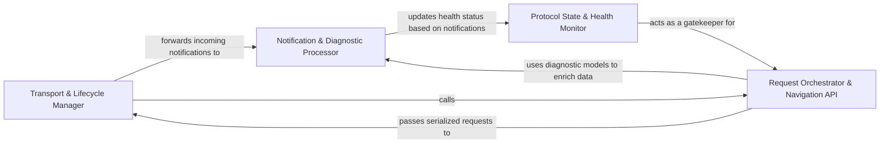

## Details

Handles the low-level JSON-RPC communication lifecycle with Language Server processes, managing asynchronous message reading/writing and server health.

### Transport & Lifecycle Manager
Manages the underlying OS process for the LSP server, handling the raw byte-level I/O and the JSON-RPC message framing.

**Related Classes/Methods**:

- `static_analyzer.engine.lsp_client.LSPClient.start`:94-186
- `static_analyzer.engine.lsp_client.LSPClient._reader_loop`:670-706
- `static_analyzer.engine.lsp_client.LSPClient._write_message`:578-591

**Source Files:**

- [`static_analyzer/engine/lsp_client.py`](https://github.com/CodeBoarding/CodeBoarding/blob/main/.codeboardingstatic_analyzer/engine/lsp_client.py)
  - `static_analyzer.engine.lsp_client.LSPClient.__enter__` ([L87-L89](https://github.com/CodeBoarding/CodeBoarding/blob/main/.codeboardingstatic_analyzer/engine/lsp_client.py#L87-L89)) - Method
  - `static_analyzer.engine.lsp_client.LSPClient.__exit__` ([L91-L92](https://github.com/CodeBoarding/CodeBoarding/blob/main/.codeboardingstatic_analyzer/engine/lsp_client.py#L91-L92)) - Method
  - `static_analyzer.engine.lsp_client.LSPClient.start` ([L94-L186](https://github.com/CodeBoarding/CodeBoarding/blob/main/.codeboardingstatic_analyzer/engine/lsp_client.py#L94-L186)) - Method
  - `static_analyzer.engine.lsp_client.LSPClient.shutdown` ([L188-L215](https://github.com/CodeBoarding/CodeBoarding/blob/main/.codeboardingstatic_analyzer/engine/lsp_client.py#L188-L215)) - Method
  - `static_analyzer.engine.lsp_client.LSPClient.did_open` ([L219-L244](https://github.com/CodeBoarding/CodeBoarding/blob/main/.codeboardingstatic_analyzer/engine/lsp_client.py#L219-L244)) - Method
  - `static_analyzer.engine.lsp_client.LSPClient.did_change` ([L246-L257](https://github.com/CodeBoarding/CodeBoarding/blob/main/.codeboardingstatic_analyzer/engine/lsp_client.py#L246-L257)) - Method
  - `static_analyzer.engine.lsp_client.LSPClient.did_close` ([L259-L267](https://github.com/CodeBoarding/CodeBoarding/blob/main/.codeboardingstatic_analyzer/engine/lsp_client.py#L259-L267)) - Method
  - `static_analyzer.engine.lsp_client.LSPClient._send_notification` ([L569-L576](https://github.com/CodeBoarding/CodeBoarding/blob/main/.codeboardingstatic_analyzer/engine/lsp_client.py#L569-L576)) - Method
  - `static_analyzer.engine.lsp_client.LSPClient._write_message` ([L578-L591](https://github.com/CodeBoarding/CodeBoarding/blob/main/.codeboardingstatic_analyzer/engine/lsp_client.py#L578-L591)) - Method
  - `static_analyzer.engine.lsp_client.LSPClient._reader_loop` ([L670-L706](https://github.com/CodeBoarding/CodeBoarding/blob/main/.codeboardingstatic_analyzer/engine/lsp_client.py#L670-L706)) - Method
  - `static_analyzer.engine.lsp_client.LSPClient._handle_server_request` ([L708-L722](https://github.com/CodeBoarding/CodeBoarding/blob/main/.codeboardingstatic_analyzer/engine/lsp_client.py#L708-L722)) - Method
  - `static_analyzer.engine.lsp_client.LSPClient._read_single_message` ([L780-L820](https://github.com/CodeBoarding/CodeBoarding/blob/main/.codeboardingstatic_analyzer/engine/lsp_client.py#L780-L820)) - Method

### Request Orchestrator & Navigation API
Provides a synchronous-like interface for complex LSP queries, managing request IDs and matching incoming responses to pending calls.

**Related Classes/Methods**:

- `static_analyzer.engine.lsp_client.LSPClient.definition`:323-337
- `static_analyzer.engine.lsp_client.LSPClient._send_request`:531-567
- `static_analyzer.engine.lsp_client.LSPClient.send_references_batch`:296-321
- `static_analyzer.engine.lsp_client.LSPClient._next_response`:593-614

**Source Files:**

- [`static_analyzer/engine/lsp_client.py`](https://github.com/CodeBoarding/CodeBoarding/blob/main/.codeboardingstatic_analyzer/engine/lsp_client.py)
  - `static_analyzer.engine.lsp_client.MethodNotFoundError` ([L27-L28](https://github.com/CodeBoarding/CodeBoarding/blob/main/.codeboardingstatic_analyzer/engine/lsp_client.py#L27-L28)) - Class
  - `static_analyzer.engine.lsp_client.LSPClient` ([L31-L820](https://github.com/CodeBoarding/CodeBoarding/blob/main/.codeboardingstatic_analyzer/engine/lsp_client.py#L31-L820)) - Class
  - `static_analyzer.engine.lsp_client.LSPClient.__init__` ([L42-L85](https://github.com/CodeBoarding/CodeBoarding/blob/main/.codeboardingstatic_analyzer/engine/lsp_client.py#L42-L85)) - Method
  - `static_analyzer.engine.lsp_client.LSPClient.references` ([L282-L294](https://github.com/CodeBoarding/CodeBoarding/blob/main/.codeboardingstatic_analyzer/engine/lsp_client.py#L282-L294)) - Method
  - `static_analyzer.engine.lsp_client.LSPClient.send_references_batch` ([L296-L321](https://github.com/CodeBoarding/CodeBoarding/blob/main/.codeboardingstatic_analyzer/engine/lsp_client.py#L296-L321)) - Method
  - `static_analyzer.engine.lsp_client.LSPClient.send_references_batch.build_params` ([L314-L319](https://github.com/CodeBoarding/CodeBoarding/blob/main/.codeboardingstatic_analyzer/engine/lsp_client.py#L314-L319)) - Function
  - `static_analyzer.engine.lsp_client.LSPClient.definition` ([L323-L337](https://github.com/CodeBoarding/CodeBoarding/blob/main/.codeboardingstatic_analyzer/engine/lsp_client.py#L323-L337)) - Method
  - `static_analyzer.engine.lsp_client.LSPClient.send_definition_batch` ([L339-L346](https://github.com/CodeBoarding/CodeBoarding/blob/main/.codeboardingstatic_analyzer/engine/lsp_client.py#L339-L346)) - Method
  - `static_analyzer.engine.lsp_client.LSPClient.implementation` ([L348-L362](https://github.com/CodeBoarding/CodeBoarding/blob/main/.codeboardingstatic_analyzer/engine/lsp_client.py#L348-L362)) - Method
  - `static_analyzer.engine.lsp_client.LSPClient.send_implementation_batch` ([L364-L371](https://github.com/CodeBoarding/CodeBoarding/blob/main/.codeboardingstatic_analyzer/engine/lsp_client.py#L364-L371)) - Method
  - `static_analyzer.engine.lsp_client.LSPClient.type_hierarchy_prepare` ([L373-L384](https://github.com/CodeBoarding/CodeBoarding/blob/main/.codeboardingstatic_analyzer/engine/lsp_client.py#L373-L384)) - Method
  - `static_analyzer.engine.lsp_client.LSPClient.type_hierarchy_supertypes` ([L386-L391](https://github.com/CodeBoarding/CodeBoarding/blob/main/.codeboardingstatic_analyzer/engine/lsp_client.py#L386-L391)) - Method
  - `static_analyzer.engine.lsp_client.LSPClient.type_hierarchy_subtypes` ([L393-L398](https://github.com/CodeBoarding/CodeBoarding/blob/main/.codeboardingstatic_analyzer/engine/lsp_client.py#L393-L398)) - Method
  - `static_analyzer.engine.lsp_client.LSPClient._position_params` ([L478-L483](https://github.com/CodeBoarding/CodeBoarding/blob/main/.codeboardingstatic_analyzer/engine/lsp_client.py#L478-L483)) - Method
  - `static_analyzer.engine.lsp_client.LSPClient._send_batch` ([L485-L529](https://github.com/CodeBoarding/CodeBoarding/blob/main/.codeboardingstatic_analyzer/engine/lsp_client.py#L485-L529)) - Method
  - `static_analyzer.engine.lsp_client.LSPClient._send_request` ([L531-L567](https://github.com/CodeBoarding/CodeBoarding/blob/main/.codeboardingstatic_analyzer/engine/lsp_client.py#L531-L567)) - Method
  - `static_analyzer.engine.lsp_client.LSPClient._next_response` ([L593-L614](https://github.com/CodeBoarding/CodeBoarding/blob/main/.codeboardingstatic_analyzer/engine/lsp_client.py#L593-L614)) - Method
  - `static_analyzer.engine.lsp_client.LSPClient._collect_batch_responses` ([L616-L666](https://github.com/CodeBoarding/CodeBoarding/blob/main/.codeboardingstatic_analyzer/engine/lsp_client.py#L616-L666)) - Method

### Protocol State & Health Monitor
Tracks the initialization state and readiness of the LSP server, providing synchronization primitives to prevent queries during indexing or unstable states.

**Related Classes/Methods**:

- `static_analyzer.engine.lsp_client.LSPClient.wait_for_server_ready`:440-463
- `static_analyzer.engine.lsp_client.LSPClient.wait_for_diagnostics_quiesce`:412-436

**Source Files:**

- [`static_analyzer/engine/adapters/rust_adapter.py`](https://github.com/CodeBoarding/CodeBoarding/blob/main/.codeboardingstatic_analyzer/engine/adapters/rust_adapter.py)
  - `static_analyzer.engine.adapters.rust_adapter.RustAdapter` ([L75-L190](https://github.com/CodeBoarding/CodeBoarding/blob/main/.codeboardingstatic_analyzer/engine/adapters/rust_adapter.py#L75-L190)) - Class
  - `static_analyzer.engine.adapters.rust_adapter.RustAdapter.language` ([L79-L80](https://github.com/CodeBoarding/CodeBoarding/blob/main/.codeboardingstatic_analyzer/engine/adapters/rust_adapter.py#L79-L80)) - Method
  - `static_analyzer.engine.adapters.rust_adapter.RustAdapter.language_enum` ([L83-L84](https://github.com/CodeBoarding/CodeBoarding/blob/main/.codeboardingstatic_analyzer/engine/adapters/rust_adapter.py#L83-L84)) - Method
  - `static_analyzer.engine.adapters.rust_adapter.RustAdapter.references_per_query_timeout` ([L87-L90](https://github.com/CodeBoarding/CodeBoarding/blob/main/.codeboardingstatic_analyzer/engine/adapters/rust_adapter.py#L87-L90)) - Method
  - `static_analyzer.engine.adapters.rust_adapter.RustAdapter.wait_for_workspace_ready` ([L93-L99](https://github.com/CodeBoarding/CodeBoarding/blob/main/.codeboardingstatic_analyzer/engine/adapters/rust_adapter.py#L93-L99)) - Method
  - `static_analyzer.engine.adapters.rust_adapter.RustAdapter.extra_client_capabilities` ([L102-L106](https://github.com/CodeBoarding/CodeBoarding/blob/main/.codeboardingstatic_analyzer/engine/adapters/rust_adapter.py#L102-L106)) - Method
  - `static_analyzer.engine.adapters.rust_adapter.RustAdapter.wait_for_diagnostics` ([L108-L120](https://github.com/CodeBoarding/CodeBoarding/blob/main/.codeboardingstatic_analyzer/engine/adapters/rust_adapter.py#L108-L120)) - Method
  - `static_analyzer.engine.adapters.rust_adapter.RustAdapter.lsp_command` ([L123-L124](https://github.com/CodeBoarding/CodeBoarding/blob/main/.codeboardingstatic_analyzer/engine/adapters/rust_adapter.py#L123-L124)) - Method
  - `static_analyzer.engine.adapters.rust_adapter.RustAdapter.language_id` ([L127-L128](https://github.com/CodeBoarding/CodeBoarding/blob/main/.codeboardingstatic_analyzer/engine/adapters/rust_adapter.py#L127-L128)) - Method
  - `static_analyzer.engine.adapters.rust_adapter.RustAdapter.get_lsp_init_options` ([L145-L164](https://github.com/CodeBoarding/CodeBoarding/blob/main/.codeboardingstatic_analyzer/engine/adapters/rust_adapter.py#L145-L164)) - Method
- [`static_analyzer/engine/lsp_client.py`](https://github.com/CodeBoarding/CodeBoarding/blob/main/.codeboardingstatic_analyzer/engine/lsp_client.py)
  - `static_analyzer.engine.lsp_client.LSPClient.get_diagnostics_generation` ([L407-L410](https://github.com/CodeBoarding/CodeBoarding/blob/main/.codeboardingstatic_analyzer/engine/lsp_client.py#L407-L410)) - Method
  - `static_analyzer.engine.lsp_client.LSPClient.wait_for_diagnostics_quiesce` ([L412-L436](https://github.com/CodeBoarding/CodeBoarding/blob/main/.codeboardingstatic_analyzer/engine/lsp_client.py#L412-L436)) - Method
  - `static_analyzer.engine.lsp_client.LSPClient.wait_for_server_ready` ([L440-L463](https://github.com/CodeBoarding/CodeBoarding/blob/main/.codeboardingstatic_analyzer/engine/lsp_client.py#L440-L463)) - Method
  - `static_analyzer.engine.lsp_client.LSPClient.reset_ready_signal` ([L465-L474](https://github.com/CodeBoarding/CodeBoarding/blob/main/.codeboardingstatic_analyzer/engine/lsp_client.py#L465-L474)) - Method

### Notification & Diagnostic Processor
Handles unsolicited server messages and transforms raw diagnostic data into domain-specific models.

**Related Classes/Methods**:

- `static_analyzer.lsp_client.diagnostics.LSPDiagnostic`:27-58
- `static_analyzer.engine.lsp_client.LSPClient._handle_notification`:724-778
- `static_analyzer.engine.adapters.rust_adapter.RustAdapter.build_qualified_name`:166-190

**Source Files:**

- [`static_analyzer/engine/adapters/rust_adapter.py`](https://github.com/CodeBoarding/CodeBoarding/blob/main/.codeboardingstatic_analyzer/engine/adapters/rust_adapter.py)
  - `static_analyzer.engine.adapters.rust_adapter._skip_angle_block` ([L21-L37](https://github.com/CodeBoarding/CodeBoarding/blob/main/.codeboardingstatic_analyzer/engine/adapters/rust_adapter.py#L21-L37)) - Function
  - `static_analyzer.engine.adapters.rust_adapter._normalize_parent` ([L40-L72](https://github.com/CodeBoarding/CodeBoarding/blob/main/.codeboardingstatic_analyzer/engine/adapters/rust_adapter.py#L40-L72)) - Function
  - `static_analyzer.engine.adapters.rust_adapter.RustAdapter.build_qualified_name` ([L166-L190](https://github.com/CodeBoarding/CodeBoarding/blob/main/.codeboardingstatic_analyzer/engine/adapters/rust_adapter.py#L166-L190)) - Method
- [`static_analyzer/engine/lsp_client.py`](https://github.com/CodeBoarding/CodeBoarding/blob/main/.codeboardingstatic_analyzer/engine/lsp_client.py)
  - `static_analyzer.engine.lsp_client.LSPClient._handle_notification` ([L724-L778](https://github.com/CodeBoarding/CodeBoarding/blob/main/.codeboardingstatic_analyzer/engine/lsp_client.py#L724-L778)) - Method
- [`static_analyzer/lsp_client/diagnostics.py`](https://github.com/CodeBoarding/CodeBoarding/blob/main/.codeboardingstatic_analyzer/lsp_client/diagnostics.py)
  - `static_analyzer.lsp_client.diagnostics.DiagnosticPosition` ([L11-L15](https://github.com/CodeBoarding/CodeBoarding/blob/main/.codeboardingstatic_analyzer/lsp_client/diagnostics.py#L11-L15)) - Class
  - `static_analyzer.lsp_client.diagnostics.DiagnosticRange` ([L19-L23](https://github.com/CodeBoarding/CodeBoarding/blob/main/.codeboardingstatic_analyzer/lsp_client/diagnostics.py#L19-L23)) - Class
  - `static_analyzer.lsp_client.diagnostics.LSPDiagnostic` ([L27-L58](https://github.com/CodeBoarding/CodeBoarding/blob/main/.codeboardingstatic_analyzer/lsp_client/diagnostics.py#L27-L58)) - Class
  - `static_analyzer.lsp_client.diagnostics.LSPDiagnostic.from_lsp_dict` ([L37-L50](https://github.com/CodeBoarding/CodeBoarding/blob/main/.codeboardingstatic_analyzer/lsp_client/diagnostics.py#L37-L50)) - Method
  - `static_analyzer.lsp_client.diagnostics.LSPDiagnostic.dedup_key` ([L52-L58](https://github.com/CodeBoarding/CodeBoarding/blob/main/.codeboardingstatic_analyzer/lsp_client/diagnostics.py#L52-L58)) - Method

### [FAQ](https://github.com/CodeBoarding/GeneratedOnBoardings/tree/main?tab=readme-ov-file#faq)