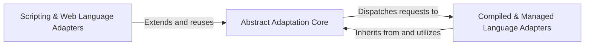

## Details

Provides a polymorphic abstraction layer that translates generic analysis requests into language-specific configurations, commands, and qualified name resolution logic.

### Abstract Adaptation Core
Defines the foundational contract and shared logic for all language-specific implementations, providing the base LanguageAdapter class.

**Related Classes/Methods**:

- `static_analyzer.engine.language_adapter.LanguageAdapter`:22-368
- `static_analyzer.engine.language_adapter.LanguageAdapter.build_qualified_name`:81-101
- `static_analyzer.engine.language_adapter.LanguageAdapter.get_workspace_settings`:139-149

**Source Files:**

- [`static_analyzer/engine/language_adapter.py`](https://github.com/CodeBoarding/CodeBoarding/blob/main/.codeboardingstatic_analyzer/engine/language_adapter.py)
  - `static_analyzer.engine.language_adapter.LanguageAdapter` ([L22-L368](https://github.com/CodeBoarding/CodeBoarding/blob/main/.codeboardingstatic_analyzer/engine/language_adapter.py#L22-L368)) - Class
  - `static_analyzer.engine.language_adapter.LanguageAdapter.build_qualified_name` ([L81-L101](https://github.com/CodeBoarding/CodeBoarding/blob/main/.codeboardingstatic_analyzer/engine/language_adapter.py#L81-L101)) - Method
  - `static_analyzer.engine.language_adapter.LanguageAdapter.extract_package` ([L111-L117](https://github.com/CodeBoarding/CodeBoarding/blob/main/.codeboardingstatic_analyzer/engine/language_adapter.py#L111-L117)) - Method
  - `static_analyzer.engine.language_adapter.LanguageAdapter.get_lsp_init_options` ([L135-L137](https://github.com/CodeBoarding/CodeBoarding/blob/main/.codeboardingstatic_analyzer/engine/language_adapter.py#L135-L137)) - Method
  - `static_analyzer.engine.language_adapter.LanguageAdapter.get_workspace_settings` ([L139-L149](https://github.com/CodeBoarding/CodeBoarding/blob/main/.codeboardingstatic_analyzer/engine/language_adapter.py#L139-L149)) - Method
  - `static_analyzer.engine.language_adapter.LanguageAdapter.get_lsp_default_timeout` ([L151-L159](https://github.com/CodeBoarding/CodeBoarding/blob/main/.codeboardingstatic_analyzer/engine/language_adapter.py#L151-L159)) - Method
  - `static_analyzer.engine.language_adapter.LanguageAdapter.wait_for_workspace_ready` ([L162-L169](https://github.com/CodeBoarding/CodeBoarding/blob/main/.codeboardingstatic_analyzer/engine/language_adapter.py#L162-L169)) - Method
  - `static_analyzer.engine.language_adapter.LanguageAdapter.get_lsp_env` ([L216-L218](https://github.com/CodeBoarding/CodeBoarding/blob/main/.codeboardingstatic_analyzer/engine/language_adapter.py#L216-L218)) - Method
  - `static_analyzer.engine.language_adapter.LanguageAdapter.prepare_project` ([L220-L228](https://github.com/CodeBoarding/CodeBoarding/blob/main/.codeboardingstatic_analyzer/engine/language_adapter.py#L220-L228)) - Method
  - `static_analyzer.engine.language_adapter.LanguageAdapter.is_class_like` ([L267-L268](https://github.com/CodeBoarding/CodeBoarding/blob/main/.codeboardingstatic_analyzer/engine/language_adapter.py#L267-L268)) - Method
  - `static_analyzer.engine.language_adapter.LanguageAdapter.is_callable` ([L270-L271](https://github.com/CodeBoarding/CodeBoarding/blob/main/.codeboardingstatic_analyzer/engine/language_adapter.py#L270-L271)) - Method
  - `static_analyzer.engine.language_adapter.LanguageAdapter.should_track_for_edges` ([L286-L287](https://github.com/CodeBoarding/CodeBoarding/blob/main/.codeboardingstatic_analyzer/engine/language_adapter.py#L286-L287)) - Method
  - `static_analyzer.engine.language_adapter.LanguageAdapter.extra_client_capabilities` ([L299-L304](https://github.com/CodeBoarding/CodeBoarding/blob/main/.codeboardingstatic_analyzer/engine/language_adapter.py#L299-L304)) - Method
  - `static_analyzer.engine.language_adapter.LanguageAdapter.references_batch_size` ([L307-L309](https://github.com/CodeBoarding/CodeBoarding/blob/main/.codeboardingstatic_analyzer/engine/language_adapter.py#L307-L309)) - Method
  - `static_analyzer.engine.language_adapter.LanguageAdapter.references_per_query_timeout` ([L312-L314](https://github.com/CodeBoarding/CodeBoarding/blob/main/.codeboardingstatic_analyzer/engine/language_adapter.py#L312-L314)) - Method
  - `static_analyzer.engine.language_adapter.LanguageAdapter.build_edge_name` ([L316-L326](https://github.com/CodeBoarding/CodeBoarding/blob/main/.codeboardingstatic_analyzer/engine/language_adapter.py#L316-L326)) - Method
  - `static_analyzer.engine.language_adapter.LanguageAdapter._extract_deep_package` ([L346-L358](https://github.com/CodeBoarding/CodeBoarding/blob/main/.codeboardingstatic_analyzer/engine/language_adapter.py#L346-L358)) - Method
  - `static_analyzer.engine.language_adapter.LanguageAdapter._get_hierarchical_packages` ([L360-L368](https://github.com/CodeBoarding/CodeBoarding/blob/main/.codeboardingstatic_analyzer/engine/language_adapter.py#L360-L368)) - Method

### Compiled & Managed Language Adapters
Specialized adapters for languages with strict type systems and complex symbol resolution requirements like Java, C#, Go, and Rust.

**Related Classes/Methods**:

- `static_analyzer.engine.adapters.java_adapter.JavaAdapter`:25-300
- `static_analyzer.engine.adapters.go_adapter.GoAdapter`:73-223

**Source Files:**

- [`static_analyzer/engine/adapters/csharp_adapter.py`](https://github.com/CodeBoarding/CodeBoarding/blob/main/.codeboardingstatic_analyzer/engine/adapters/csharp_adapter.py)
  - `static_analyzer.engine.adapters.csharp_adapter.CSharpAdapter.extract_package` ([L137-L142](https://github.com/CodeBoarding/CodeBoarding/blob/main/.codeboardingstatic_analyzer/engine/adapters/csharp_adapter.py#L137-L142)) - Method
  - `static_analyzer.engine.adapters.csharp_adapter.CSharpAdapter.wait_for_diagnostics` ([L175-L186](https://github.com/CodeBoarding/CodeBoarding/blob/main/.codeboardingstatic_analyzer/engine/adapters/csharp_adapter.py#L175-L186)) - Method
  - `static_analyzer.engine.adapters.csharp_adapter.CSharpAdapter.get_all_packages` ([L266-L268](https://github.com/CodeBoarding/CodeBoarding/blob/main/.codeboardingstatic_analyzer/engine/adapters/csharp_adapter.py#L266-L268)) - Method
- [`static_analyzer/engine/adapters/go_adapter.py`](https://github.com/CodeBoarding/CodeBoarding/blob/main/.codeboardingstatic_analyzer/engine/adapters/go_adapter.py)
  - `static_analyzer.engine.adapters.go_adapter.GoAdapter.build_qualified_name` ([L105-L126](https://github.com/CodeBoarding/CodeBoarding/blob/main/.codeboardingstatic_analyzer/engine/adapters/go_adapter.py#L105-L126)) - Method
  - `static_analyzer.engine.adapters.go_adapter.GoAdapter._is_pointer_receiver` ([L129-L132](https://github.com/CodeBoarding/CodeBoarding/blob/main/.codeboardingstatic_analyzer/engine/adapters/go_adapter.py#L129-L132)) - Method
- [`static_analyzer/engine/adapters/java_adapter.py`](https://github.com/CodeBoarding/CodeBoarding/blob/main/.codeboardingstatic_analyzer/engine/adapters/java_adapter.py)
  - `static_analyzer.engine.adapters.java_adapter.JavaAdapter` ([L25-L300](https://github.com/CodeBoarding/CodeBoarding/blob/main/.codeboardingstatic_analyzer/engine/adapters/java_adapter.py#L25-L300)) - Class
  - `static_analyzer.engine.adapters.java_adapter.JavaAdapter.wait_for_workspace_ready` ([L28-L33](https://github.com/CodeBoarding/CodeBoarding/blob/main/.codeboardingstatic_analyzer/engine/adapters/java_adapter.py#L28-L33)) - Method
  - `static_analyzer.engine.adapters.java_adapter.JavaAdapter.language` ([L36-L37](https://github.com/CodeBoarding/CodeBoarding/blob/main/.codeboardingstatic_analyzer/engine/adapters/java_adapter.py#L36-L37)) - Method
  - `static_analyzer.engine.adapters.java_adapter.JavaAdapter.language_enum` ([L40-L41](https://github.com/CodeBoarding/CodeBoarding/blob/main/.codeboardingstatic_analyzer/engine/adapters/java_adapter.py#L40-L41)) - Method
  - `static_analyzer.engine.adapters.java_adapter.JavaAdapter.lsp_command` ([L44-L45](https://github.com/CodeBoarding/CodeBoarding/blob/main/.codeboardingstatic_analyzer/engine/adapters/java_adapter.py#L44-L45)) - Method
  - `static_analyzer.engine.adapters.java_adapter.JavaAdapter.language_id` ([L48-L49](https://github.com/CodeBoarding/CodeBoarding/blob/main/.codeboardingstatic_analyzer/engine/adapters/java_adapter.py#L48-L49)) - Method
  - `static_analyzer.engine.adapters.java_adapter.JavaAdapter.build_qualified_name` ([L133-L158](https://github.com/CodeBoarding/CodeBoarding/blob/main/.codeboardingstatic_analyzer/engine/adapters/java_adapter.py#L133-L158)) - Method
  - `static_analyzer.engine.adapters.java_adapter.JavaAdapter._clean_symbol_name` ([L161-L199](https://github.com/CodeBoarding/CodeBoarding/blob/main/.codeboardingstatic_analyzer/engine/adapters/java_adapter.py#L161-L199)) - Method
  - `static_analyzer.engine.adapters.java_adapter.JavaAdapter._strip_generics` ([L202-L213](https://github.com/CodeBoarding/CodeBoarding/blob/main/.codeboardingstatic_analyzer/engine/adapters/java_adapter.py#L202-L213)) - Method
  - `static_analyzer.engine.adapters.java_adapter.JavaAdapter._split_params` ([L216-L235](https://github.com/CodeBoarding/CodeBoarding/blob/main/.codeboardingstatic_analyzer/engine/adapters/java_adapter.py#L216-L235)) - Method
  - `static_analyzer.engine.adapters.java_adapter.JavaAdapter.extract_package` ([L237-L267](https://github.com/CodeBoarding/CodeBoarding/blob/main/.codeboardingstatic_analyzer/engine/adapters/java_adapter.py#L237-L267)) - Method
  - `static_analyzer.engine.adapters.java_adapter.JavaAdapter.get_workspace_settings` ([L269-L281](https://github.com/CodeBoarding/CodeBoarding/blob/main/.codeboardingstatic_analyzer/engine/adapters/java_adapter.py#L269-L281)) - Method
  - `static_analyzer.engine.adapters.java_adapter.JavaAdapter.edge_strategy` ([L284-L286](https://github.com/CodeBoarding/CodeBoarding/blob/main/.codeboardingstatic_analyzer/engine/adapters/java_adapter.py#L284-L286)) - Method
  - `static_analyzer.engine.adapters.java_adapter.JavaAdapter.should_track_for_edges` ([L288-L289](https://github.com/CodeBoarding/CodeBoarding/blob/main/.codeboardingstatic_analyzer/engine/adapters/java_adapter.py#L288-L289)) - Method
  - `static_analyzer.engine.adapters.java_adapter.JavaAdapter.get_package_for_file` ([L291-L294](https://github.com/CodeBoarding/CodeBoarding/blob/main/.codeboardingstatic_analyzer/engine/adapters/java_adapter.py#L291-L294)) - Method
  - `static_analyzer.engine.adapters.java_adapter.JavaAdapter.get_all_packages` ([L296-L300](https://github.com/CodeBoarding/CodeBoarding/blob/main/.codeboardingstatic_analyzer/engine/adapters/java_adapter.py#L296-L300)) - Method

### Scripting & Web Language Adapters
Adapters tailored for dynamic and module-based languages like TypeScript, JavaScript, and PHP, focusing on file-system path to module mapping.

**Related Classes/Methods**:

- `static_analyzer.engine.adapters.typescript_adapter.TypeScriptAdapter`:11-33
- `static_analyzer.engine.adapters.php_adapter.PHPAdapter`:12-50
- `static_analyzer.engine.adapters.typescript_adapter.JavaScriptAdapter`:36-52

**Source Files:**

- [`static_analyzer/engine/adapters/php_adapter.py`](https://github.com/CodeBoarding/CodeBoarding/blob/main/.codeboardingstatic_analyzer/engine/adapters/php_adapter.py)
  - `static_analyzer.engine.adapters.php_adapter.PHPAdapter.extract_package` ([L30-L31](https://github.com/CodeBoarding/CodeBoarding/blob/main/.codeboardingstatic_analyzer/engine/adapters/php_adapter.py#L30-L31)) - Method
  - `static_analyzer.engine.adapters.php_adapter.PHPAdapter.get_all_packages` ([L49-L50](https://github.com/CodeBoarding/CodeBoarding/blob/main/.codeboardingstatic_analyzer/engine/adapters/php_adapter.py#L49-L50)) - Method
- [`static_analyzer/engine/adapters/typescript_adapter.py`](https://github.com/CodeBoarding/CodeBoarding/blob/main/.codeboardingstatic_analyzer/engine/adapters/typescript_adapter.py)
  - `static_analyzer.engine.adapters.typescript_adapter.TypeScriptAdapter` ([L11-L33](https://github.com/CodeBoarding/CodeBoarding/blob/main/.codeboardingstatic_analyzer/engine/adapters/typescript_adapter.py#L11-L33)) - Class
  - `static_analyzer.engine.adapters.typescript_adapter.TypeScriptAdapter.language` ([L14-L15](https://github.com/CodeBoarding/CodeBoarding/blob/main/.codeboardingstatic_analyzer/engine/adapters/typescript_adapter.py#L14-L15)) - Method
  - `static_analyzer.engine.adapters.typescript_adapter.TypeScriptAdapter.language_enum` ([L18-L19](https://github.com/CodeBoarding/CodeBoarding/blob/main/.codeboardingstatic_analyzer/engine/adapters/typescript_adapter.py#L18-L19)) - Method
  - `static_analyzer.engine.adapters.typescript_adapter.TypeScriptAdapter.lsp_command` ([L22-L23](https://github.com/CodeBoarding/CodeBoarding/blob/main/.codeboardingstatic_analyzer/engine/adapters/typescript_adapter.py#L22-L23)) - Method
  - `static_analyzer.engine.adapters.typescript_adapter.TypeScriptAdapter.language_id` ([L26-L27](https://github.com/CodeBoarding/CodeBoarding/blob/main/.codeboardingstatic_analyzer/engine/adapters/typescript_adapter.py#L26-L27)) - Method
  - `static_analyzer.engine.adapters.typescript_adapter.TypeScriptAdapter.extract_package` ([L29-L30](https://github.com/CodeBoarding/CodeBoarding/blob/main/.codeboardingstatic_analyzer/engine/adapters/typescript_adapter.py#L29-L30)) - Method
  - `static_analyzer.engine.adapters.typescript_adapter.TypeScriptAdapter.get_all_packages` ([L32-L33](https://github.com/CodeBoarding/CodeBoarding/blob/main/.codeboardingstatic_analyzer/engine/adapters/typescript_adapter.py#L32-L33)) - Method
  - `static_analyzer.engine.adapters.typescript_adapter.JavaScriptAdapter` ([L36-L52](https://github.com/CodeBoarding/CodeBoarding/blob/main/.codeboardingstatic_analyzer/engine/adapters/typescript_adapter.py#L36-L52)) - Class
  - `static_analyzer.engine.adapters.typescript_adapter.JavaScriptAdapter.language` ([L39-L40](https://github.com/CodeBoarding/CodeBoarding/blob/main/.codeboardingstatic_analyzer/engine/adapters/typescript_adapter.py#L39-L40)) - Method
  - `static_analyzer.engine.adapters.typescript_adapter.JavaScriptAdapter.language_enum` ([L43-L44](https://github.com/CodeBoarding/CodeBoarding/blob/main/.codeboardingstatic_analyzer/engine/adapters/typescript_adapter.py#L43-L44)) - Method
  - `static_analyzer.engine.adapters.typescript_adapter.JavaScriptAdapter.language_id` ([L47-L48](https://github.com/CodeBoarding/CodeBoarding/blob/main/.codeboardingstatic_analyzer/engine/adapters/typescript_adapter.py#L47-L48)) - Method
  - `static_analyzer.engine.adapters.typescript_adapter.JavaScriptAdapter.config_key` ([L51-L52](https://github.com/CodeBoarding/CodeBoarding/blob/main/.codeboardingstatic_analyzer/engine/adapters/typescript_adapter.py#L51-L52)) - Method

### [FAQ](https://github.com/CodeBoarding/GeneratedOnBoardings/tree/main?tab=readme-ov-file#faq)