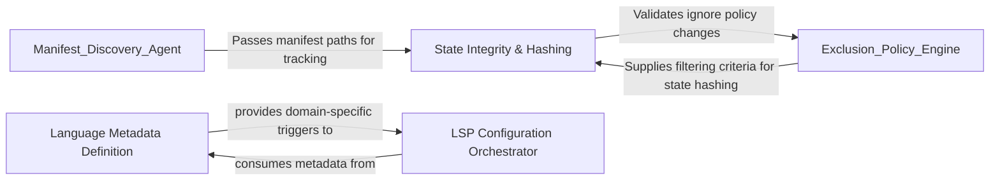

## Details

Acts as a configuration provider that maps detected file types and project structures to specific Language Server Protocol (LSP) configurations.

### State Integrity & Hashing
Generates a deterministic snapshot of the repository state to detect changes and support efficient caching.

**Related Classes/Methods**:

- `repo_utils.__init__.get_repo_state_hash`:193-223

**Source Files:**

- [`caching/meta_cache.py`](https://github.com/CodeBoarding/CodeBoarding/blob/main/.codeboardingcaching/meta_cache.py)
  - `caching.meta_cache.MetaCache.discover_metadata_files` ([L57-L69](https://github.com/CodeBoarding/CodeBoarding/blob/main/.codeboardingcaching/meta_cache.py#L57-L69)) - Method
- [`static_analyzer/typescript_config_scanner.py`](https://github.com/CodeBoarding/CodeBoarding/blob/main/.codeboardingstatic_analyzer/typescript_config_scanner.py)
  - `static_analyzer.typescript_config_scanner.TypeScriptConfigScanner._showconfig` ([L129-L153](https://github.com/CodeBoarding/CodeBoarding/blob/main/.codeboardingstatic_analyzer/typescript_config_scanner.py#L129-L153)) - Method
  - `static_analyzer.typescript_config_scanner._is_ancestor` ([L207-L212](https://github.com/CodeBoarding/CodeBoarding/blob/main/.codeboardingstatic_analyzer/typescript_config_scanner.py#L207-L212)) - Function
- [`utils.py`](https://github.com/CodeBoarding/CodeBoarding/blob/main/.codeboardingutils.py)
  - `utils.fingerprint_file` ([L63-L71](https://github.com/CodeBoarding/CodeBoarding/blob/main/.codeboardingutils.py#L63-L71)) - Function

### Language Metadata Definition
Defines the structural blueprint and static attributes for supported programming languages, acting as a registry for file extensions, comment patterns, and naming conventions.

**Related Classes/Methods**:

- `static_analyzer.programming_language.ProgrammingLanguage`:23-75
- `static_analyzer.programming_language.JavaConfig`:17-20

**Source Files:**

- [`static_analyzer/programming_language.py`](https://github.com/CodeBoarding/CodeBoarding/blob/main/.codeboardingstatic_analyzer/programming_language.py)
  - `static_analyzer.programming_language.JavaConfig` ([L17-L20](https://github.com/CodeBoarding/CodeBoarding/blob/main/.codeboardingstatic_analyzer/programming_language.py#L17-L20)) - Class
  - `static_analyzer.programming_language.ProgrammingLanguageBuilder._find_lsp_server_key` ([L91-L114](https://github.com/CodeBoarding/CodeBoarding/blob/main/.codeboardingstatic_analyzer/programming_language.py#L91-L114)) - Method

### LSP Configuration Orchestrator
Manages the creational logic and lifecycle configuration for Language Servers, mapping project structures to LSP initialization options and capabilities.

**Related Classes/Methods**:

- `static_analyzer.programming_language.ProgrammingLanguageBuilder`:78-152

**Source Files:**

- [`static_analyzer/programming_language.py`](https://github.com/CodeBoarding/CodeBoarding/blob/main/.codeboardingstatic_analyzer/programming_language.py)
  - `static_analyzer.programming_language.ProgrammingLanguage` ([L23-L75](https://github.com/CodeBoarding/CodeBoarding/blob/main/.codeboardingstatic_analyzer/programming_language.py#L23-L75)) - Class
  - `static_analyzer.programming_language.ProgrammingLanguageBuilder.build` ([L116-L149](https://github.com/CodeBoarding/CodeBoarding/blob/main/.codeboardingstatic_analyzer/programming_language.py#L116-L149)) - Method

### [FAQ](https://github.com/CodeBoarding/GeneratedOnBoardings/tree/main?tab=readme-ov-file#faq)