```mermaid
graph LR
    Incremental_Analysis_Call_Graph_Orchestrator["Incremental Analysis & Call Graph Orchestrator"]
    Environment_Bootstrapper_Binary_Provisioner["Environment Bootstrapper & Binary Provisioner"]
    Language_Server_Protocol_LSP_Adapter_Registry["Language Server Protocol (LSP) Adapter Registry"]
    Incremental_Analysis_Call_Graph_Orchestrator -- "Polymorphic dispatch for language-specific symbol discovery" --> Language_Server_Protocol_LSP_Adapter_Registry
    Environment_Bootstrapper_Binary_Provisioner -- "Validates tool availability for supported languages" --> Language_Server_Protocol_LSP_Adapter_Registry
    Language_Server_Protocol_LSP_Adapter_Registry -- "Resolves binary paths and environment configurations" --> Environment_Bootstrapper_Binary_Provisioner
    Language_Server_Protocol_LSP_Adapter_Registry -- "Lifecycle management and diagnostic feedback" --> Incremental_Analysis_Call_Graph_Orchestrator
    click Incremental_Analysis_Call_Graph_Orchestrator href "https://github.com/CodeBoarding/CodeBoarding/blob/main/.codeboarding/Incremental_Analysis_Call_Graph_Orchestrator.md" "Details"
    click Environment_Bootstrapper_Binary_Provisioner href "https://github.com/CodeBoarding/CodeBoarding/blob/main/.codeboarding/Environment_Bootstrapper_Binary_Provisioner.md" "Details"
    click Language_Server_Protocol_LSP_Adapter_Registry href "https://github.com/CodeBoarding/CodeBoarding/blob/main/.codeboarding/Language_Server_Protocol_LSP_Adapter_Registry.md" "Details"
```

## Details

Handles the environment bootstrapping, platform-specific binary downloads, and installation of language-specific LSP servers and runtimes required for static analysis.

### Incremental Analysis & Call Graph Orchestrator [[Expand]](./Incremental_Analysis_Call_Graph_Orchestrator.md)
Coordinates the high-level logic for building and updating the codebase model, managing cross-boundary edges, and handling incremental updates.

**Related Classes/Methods**:

- `static_analyzer.engine.call_graph_builder.CallGraphBuilder`:24-341
- `static_analyzer.incremental_orchestrator._rebuild_changed_file_edges`:111-129
- `static_analyzer.engine.edge_build_context.EdgeBuildContext`:14-22
- `static_analyzer.__init__.StaticAnalyzer.discover_file_dependencies`:478-527
- `static_analyzer.incremental_orchestrator._restore_cross_boundary_edges`:132-184

**Source Files:**

- [`agents/change_status.py`](https://github.com/CodeBoarding/CodeBoarding/blob/main/.codeboardingagents/change_status.py)
  - `agents.change_status.ChangeStatus` ([L4-L9](https://github.com/CodeBoarding/CodeBoarding/blob/main/.codeboardingagents/change_status.py#L4-L9)) - Class
- [`agents/constants.py`](https://github.com/CodeBoarding/CodeBoarding/blob/main/.codeboardingagents/constants.py)
  - `agents.constants.LLMDefaults` ([L4-L7](https://github.com/CodeBoarding/CodeBoarding/blob/main/.codeboardingagents/constants.py#L4-L7)) - Class
  - `agents.constants.FileStructureConfig` ([L10-L13](https://github.com/CodeBoarding/CodeBoarding/blob/main/.codeboardingagents/constants.py#L10-L13)) - Class
  - `agents.constants.ModelCapabilities` ([L16-L38](https://github.com/CodeBoarding/CodeBoarding/blob/main/.codeboardingagents/constants.py#L16-L38)) - Class
- [`constants.py`](https://github.com/CodeBoarding/CodeBoarding/blob/main/.codeboardingconstants.py)
  - `constants.AppConfig` ([L11-L15](https://github.com/CodeBoarding/CodeBoarding/blob/main/.codeboardingconstants.py#L11-L15)) - Class
- [`diagram_analysis/run_mode.py`](https://github.com/CodeBoarding/CodeBoarding/blob/main/.codeboardingdiagram_analysis/run_mode.py)
  - `diagram_analysis.run_mode.RunMode` ([L8-L10](https://github.com/CodeBoarding/CodeBoarding/blob/main/.codeboardingdiagram_analysis/run_mode.py#L8-L10)) - Class
- [`static_analyzer/__init__.py`](https://github.com/CodeBoarding/CodeBoarding/blob/main/.codeboardingstatic_analyzer/__init__.py)
  - `static_analyzer.__init__.StaticAnalyzer.discover_file_dependencies` ([L478-L527](https://github.com/CodeBoarding/CodeBoarding/blob/main/.codeboardingstatic_analyzer/__init__.py#L478-L527)) - Method
- [`static_analyzer/engine/adapters/rust_adapter.py`](https://github.com/CodeBoarding/CodeBoarding/blob/main/.codeboardingstatic_analyzer/engine/adapters/rust_adapter.py)
  - `static_analyzer.engine.adapters.rust_adapter.RustAdapter.wait_for_diagnostics` ([L109-L121](https://github.com/CodeBoarding/CodeBoarding/blob/main/.codeboardingstatic_analyzer/engine/adapters/rust_adapter.py#L109-L121)) - Method
  - `static_analyzer.engine.adapters.rust_adapter.RustAdapter.validate_workspace_ready` ([L123-L130](https://github.com/CodeBoarding/CodeBoarding/blob/main/.codeboardingstatic_analyzer/engine/adapters/rust_adapter.py#L123-L130)) - Method
- [`static_analyzer/engine/call_graph_builder.py`](https://github.com/CodeBoarding/CodeBoarding/blob/main/.codeboardingstatic_analyzer/engine/call_graph_builder.py)
  - `static_analyzer.engine.call_graph_builder.CallGraphBuilder` ([L24-L341](https://github.com/CodeBoarding/CodeBoarding/blob/main/.codeboardingstatic_analyzer/engine/call_graph_builder.py#L24-L341)) - Class
  - `static_analyzer.engine.call_graph_builder.CallGraphBuilder.__init__` ([L27-L38](https://github.com/CodeBoarding/CodeBoarding/blob/main/.codeboardingstatic_analyzer/engine/call_graph_builder.py#L27-L38)) - Method
  - `static_analyzer.engine.call_graph_builder.CallGraphBuilder.build` ([L45-L122](https://github.com/CodeBoarding/CodeBoarding/blob/main/.codeboardingstatic_analyzer/engine/call_graph_builder.py#L45-L122)) - Method
  - `static_analyzer.engine.call_graph_builder.CallGraphBuilder._build_recycler` ([L124-L128](https://github.com/CodeBoarding/CodeBoarding/blob/main/.codeboardingstatic_analyzer/engine/call_graph_builder.py#L124-L128)) - Method
  - `static_analyzer.engine.call_graph_builder.CallGraphBuilder._build_edges` ([L130-L134](https://github.com/CodeBoarding/CodeBoarding/blob/main/.codeboardingstatic_analyzer/engine/call_graph_builder.py#L130-L134)) - Method
  - `static_analyzer.engine.call_graph_builder.CallGraphBuilder._probe_timeout` ([L136-L149](https://github.com/CodeBoarding/CodeBoarding/blob/main/.codeboardingstatic_analyzer/engine/call_graph_builder.py#L136-L149)) - Method
  - `static_analyzer.engine.call_graph_builder.CallGraphBuilder._discover_symbols` ([L151-L192](https://github.com/CodeBoarding/CodeBoarding/blob/main/.codeboardingstatic_analyzer/engine/call_graph_builder.py#L151-L192)) - Method
  - `static_analyzer.engine.call_graph_builder.CallGraphBuilder._bulk_did_open` ([L194-L206](https://github.com/CodeBoarding/CodeBoarding/blob/main/.codeboardingstatic_analyzer/engine/call_graph_builder.py#L194-L206)) - Method
  - `static_analyzer.engine.call_graph_builder.CallGraphBuilder._send_sync_probe` ([L208-L220](https://github.com/CodeBoarding/CodeBoarding/blob/main/.codeboardingstatic_analyzer/engine/call_graph_builder.py#L208-L220)) - Method
  - `static_analyzer.engine.call_graph_builder.CallGraphBuilder._warmup_references` ([L222-L237](https://github.com/CodeBoarding/CodeBoarding/blob/main/.codeboardingstatic_analyzer/engine/call_graph_builder.py#L222-L237)) - Method
  - `static_analyzer.engine.call_graph_builder.CallGraphBuilder._postprocess_edges` ([L239-L313](https://github.com/CodeBoarding/CodeBoarding/blob/main/.codeboardingstatic_analyzer/engine/call_graph_builder.py#L239-L313)) - Method
  - `static_analyzer.engine.call_graph_builder.CallGraphBuilder._build_package_deps` ([L315-L341](https://github.com/CodeBoarding/CodeBoarding/blob/main/.codeboardingstatic_analyzer/engine/call_graph_builder.py#L315-L341)) - Method
- [`static_analyzer/engine/edge_build_context.py`](https://github.com/CodeBoarding/CodeBoarding/blob/main/.codeboardingstatic_analyzer/engine/edge_build_context.py)
  - `static_analyzer.engine.edge_build_context.EdgeBuildContext` ([L14-L22](https://github.com/CodeBoarding/CodeBoarding/blob/main/.codeboardingstatic_analyzer/engine/edge_build_context.py#L14-L22)) - Class
- [`static_analyzer/engine/edge_builder.py`](https://github.com/CodeBoarding/CodeBoarding/blob/main/.codeboardingstatic_analyzer/engine/edge_builder.py)
  - `static_analyzer.engine.edge_builder.ImplementationQuery` ([L33-L38](https://github.com/CodeBoarding/CodeBoarding/blob/main/.codeboardingstatic_analyzer/engine/edge_builder.py#L33-L38)) - Class
  - `static_analyzer.engine.edge_builder.DefinitionResolution` ([L42-L46](https://github.com/CodeBoarding/CodeBoarding/blob/main/.codeboardingstatic_analyzer/engine/edge_builder.py#L42-L46)) - Class
  - `static_analyzer.engine.edge_builder.build_edges_via_references` ([L54-L156](https://github.com/CodeBoarding/CodeBoarding/blob/main/.codeboardingstatic_analyzer/engine/edge_builder.py#L54-L156)) - Function
  - `static_analyzer.engine.edge_builder._prepare_trackable_symbols` ([L159-L190](https://github.com/CodeBoarding/CodeBoarding/blob/main/.codeboardingstatic_analyzer/engine/edge_builder.py#L159-L190)) - Function
  - `static_analyzer.engine.edge_builder._process_references_for_position` ([L193-L270](https://github.com/CodeBoarding/CodeBoarding/blob/main/.codeboardingstatic_analyzer/engine/edge_builder.py#L193-L270)) - Function
  - `static_analyzer.engine.edge_builder.build_edges_via_definitions` ([L278-L307](https://github.com/CodeBoarding/CodeBoarding/blob/main/.codeboardingstatic_analyzer/engine/edge_builder.py#L278-L307)) - Function
  - `static_analyzer.engine.edge_builder._build_definition_lookups` ([L310-L328](https://github.com/CodeBoarding/CodeBoarding/blob/main/.codeboardingstatic_analyzer/engine/edge_builder.py#L310-L328)) - Function
  - `static_analyzer.engine.edge_builder._resolve_definitions` ([L331-L419](https://github.com/CodeBoarding/CodeBoarding/blob/main/.codeboardingstatic_analyzer/engine/edge_builder.py#L331-L419)) - Function
  - `static_analyzer.engine.edge_builder._resolve_implementations` ([L422-L482](https://github.com/CodeBoarding/CodeBoarding/blob/main/.codeboardingstatic_analyzer/engine/edge_builder.py#L422-L482)) - Function
  - `static_analyzer.engine.edge_builder._call_site` ([L490-L492](https://github.com/CodeBoarding/CodeBoarding/blob/main/.codeboardingstatic_analyzer/engine/edge_builder.py#L490-L492)) - Function
  - `static_analyzer.engine.edge_builder._add_edge_site` ([L495-L496](https://github.com/CodeBoarding/CodeBoarding/blob/main/.codeboardingstatic_analyzer/engine/edge_builder.py#L495-L496)) - Function
  - `static_analyzer.engine.edge_builder._add_edge_call_site` ([L499-L502](https://github.com/CodeBoarding/CodeBoarding/blob/main/.codeboardingstatic_analyzer/engine/edge_builder.py#L499-L502)) - Function
  - `static_analyzer.engine.edge_builder._is_valid_edge` ([L505-L517](https://github.com/CodeBoarding/CodeBoarding/blob/main/.codeboardingstatic_analyzer/engine/edge_builder.py#L505-L517)) - Function
  - `static_analyzer.engine.edge_builder._resolve_definition_to_symbol` ([L520-L551](https://github.com/CodeBoarding/CodeBoarding/blob/main/.codeboardingstatic_analyzer/engine/edge_builder.py#L520-L551)) - Function
  - `static_analyzer.engine.edge_builder._best_candidate` ([L554-L562](https://github.com/CodeBoarding/CodeBoarding/blob/main/.codeboardingstatic_analyzer/engine/edge_builder.py#L554-L562)) - Function
- [`static_analyzer/engine/hierarchy_builder.py`](https://github.com/CodeBoarding/CodeBoarding/blob/main/.codeboardingstatic_analyzer/engine/hierarchy_builder.py)
  - `static_analyzer.engine.hierarchy_builder.HierarchyBuilder` ([L19-L200](https://github.com/CodeBoarding/CodeBoarding/blob/main/.codeboardingstatic_analyzer/engine/hierarchy_builder.py#L19-L200)) - Class
  - `static_analyzer.engine.hierarchy_builder.HierarchyBuilder.__init__` ([L22-L32](https://github.com/CodeBoarding/CodeBoarding/blob/main/.codeboardingstatic_analyzer/engine/hierarchy_builder.py#L22-L32)) - Method
  - `static_analyzer.engine.hierarchy_builder.HierarchyBuilder.build` ([L34-L111](https://github.com/CodeBoarding/CodeBoarding/blob/main/.codeboardingstatic_analyzer/engine/hierarchy_builder.py#L34-L111)) - Method
  - `static_analyzer.engine.hierarchy_builder.HierarchyBuilder._resolve_type_hierarchy_item` ([L113-L135](https://github.com/CodeBoarding/CodeBoarding/blob/main/.codeboardingstatic_analyzer/engine/hierarchy_builder.py#L113-L135)) - Method
  - `static_analyzer.engine.hierarchy_builder.HierarchyBuilder._infer_hierarchy_from_source` ([L137-L182](https://github.com/CodeBoarding/CodeBoarding/blob/main/.codeboardingstatic_analyzer/engine/hierarchy_builder.py#L137-L182)) - Method
  - `static_analyzer.engine.hierarchy_builder.HierarchyBuilder._link_hierarchy` ([L184-L200](https://github.com/CodeBoarding/CodeBoarding/blob/main/.codeboardingstatic_analyzer/engine/hierarchy_builder.py#L184-L200)) - Method
- [`static_analyzer/engine/language_adapter.py`](https://github.com/CodeBoarding/CodeBoarding/blob/main/.codeboardingstatic_analyzer/engine/language_adapter.py)
  - `static_analyzer.engine.language_adapter.LanguageAdapter.is_class_like` ([L293-L294](https://github.com/CodeBoarding/CodeBoarding/blob/main/.codeboardingstatic_analyzer/engine/language_adapter.py#L293-L294)) - Method
  - `static_analyzer.engine.language_adapter.LanguageAdapter.edge_strategy` ([L316-L322](https://github.com/CodeBoarding/CodeBoarding/blob/main/.codeboardingstatic_analyzer/engine/language_adapter.py#L316-L322)) - Method
- [`static_analyzer/engine/lsp_client.py`](https://github.com/CodeBoarding/CodeBoarding/blob/main/.codeboardingstatic_analyzer/engine/lsp_client.py)
  - `static_analyzer.engine.lsp_client._progress_indicates_failure` ([L28-L30](https://github.com/CodeBoarding/CodeBoarding/blob/main/.codeboardingstatic_analyzer/engine/lsp_client.py#L28-L30)) - Function
  - `static_analyzer.engine.lsp_client._progress_token` ([L33-L37](https://github.com/CodeBoarding/CodeBoarding/blob/main/.codeboardingstatic_analyzer/engine/lsp_client.py#L33-L37)) - Function
  - `static_analyzer.engine.lsp_client.MethodNotFoundError` ([L40-L41](https://github.com/CodeBoarding/CodeBoarding/blob/main/.codeboardingstatic_analyzer/engine/lsp_client.py#L40-L41)) - Class
  - `static_analyzer.engine.lsp_client.LSPClient` ([L44-L918](https://github.com/CodeBoarding/CodeBoarding/blob/main/.codeboardingstatic_analyzer/engine/lsp_client.py#L44-L918)) - Class
  - `static_analyzer.engine.lsp_client.LSPClient.__init__` ([L55-L102](https://github.com/CodeBoarding/CodeBoarding/blob/main/.codeboardingstatic_analyzer/engine/lsp_client.py#L55-L102)) - Method
  - `static_analyzer.engine.lsp_client.LSPClient.__enter__` ([L104-L106](https://github.com/CodeBoarding/CodeBoarding/blob/main/.codeboardingstatic_analyzer/engine/lsp_client.py#L104-L106)) - Method
  - `static_analyzer.engine.lsp_client.LSPClient.__exit__` ([L108-L109](https://github.com/CodeBoarding/CodeBoarding/blob/main/.codeboardingstatic_analyzer/engine/lsp_client.py#L108-L109)) - Method
  - `static_analyzer.engine.lsp_client.LSPClient.start` ([L111-L206](https://github.com/CodeBoarding/CodeBoarding/blob/main/.codeboardingstatic_analyzer/engine/lsp_client.py#L111-L206)) - Method
  - `static_analyzer.engine.lsp_client.LSPClient.shutdown` ([L208-L235](https://github.com/CodeBoarding/CodeBoarding/blob/main/.codeboardingstatic_analyzer/engine/lsp_client.py#L208-L235)) - Method
  - `static_analyzer.engine.lsp_client.LSPClient.restart` ([L237-L258](https://github.com/CodeBoarding/CodeBoarding/blob/main/.codeboardingstatic_analyzer/engine/lsp_client.py#L237-L258)) - Method
  - `static_analyzer.engine.lsp_client.LSPClient.pid` ([L261-L265](https://github.com/CodeBoarding/CodeBoarding/blob/main/.codeboardingstatic_analyzer/engine/lsp_client.py#L261-L265)) - Method
  - `static_analyzer.engine.lsp_client.LSPClient.did_open` ([L269-L294](https://github.com/CodeBoarding/CodeBoarding/blob/main/.codeboardingstatic_analyzer/engine/lsp_client.py#L269-L294)) - Method
  - `static_analyzer.engine.lsp_client.LSPClient.did_change` ([L296-L307](https://github.com/CodeBoarding/CodeBoarding/blob/main/.codeboardingstatic_analyzer/engine/lsp_client.py#L296-L307)) - Method
  - `static_analyzer.engine.lsp_client.LSPClient.did_close` ([L309-L317](https://github.com/CodeBoarding/CodeBoarding/blob/main/.codeboardingstatic_analyzer/engine/lsp_client.py#L309-L317)) - Method
  - `static_analyzer.engine.lsp_client.LSPClient.document_symbol` ([L321-L330](https://github.com/CodeBoarding/CodeBoarding/blob/main/.codeboardingstatic_analyzer/engine/lsp_client.py#L321-L330)) - Method
  - `static_analyzer.engine.lsp_client.LSPClient.references` ([L332-L345](https://github.com/CodeBoarding/CodeBoarding/blob/main/.codeboardingstatic_analyzer/engine/lsp_client.py#L332-L345)) - Method
  - `static_analyzer.engine.lsp_client.LSPClient.send_references_batch` ([L347-L372](https://github.com/CodeBoarding/CodeBoarding/blob/main/.codeboardingstatic_analyzer/engine/lsp_client.py#L347-L372)) - Method
  - `static_analyzer.engine.lsp_client.LSPClient.send_references_batch.build_params` ([L365-L370](https://github.com/CodeBoarding/CodeBoarding/blob/main/.codeboardingstatic_analyzer/engine/lsp_client.py#L365-L370)) - Function
  - `static_analyzer.engine.lsp_client.LSPClient.definition` ([L374-L388](https://github.com/CodeBoarding/CodeBoarding/blob/main/.codeboardingstatic_analyzer/engine/lsp_client.py#L374-L388)) - Method
  - `static_analyzer.engine.lsp_client.LSPClient.send_definition_batch` ([L390-L397](https://github.com/CodeBoarding/CodeBoarding/blob/main/.codeboardingstatic_analyzer/engine/lsp_client.py#L390-L397)) - Method
  - `static_analyzer.engine.lsp_client.LSPClient.implementation` ([L399-L413](https://github.com/CodeBoarding/CodeBoarding/blob/main/.codeboardingstatic_analyzer/engine/lsp_client.py#L399-L413)) - Method
  - `static_analyzer.engine.lsp_client.LSPClient.send_implementation_batch` ([L415-L422](https://github.com/CodeBoarding/CodeBoarding/blob/main/.codeboardingstatic_analyzer/engine/lsp_client.py#L415-L422)) - Method
  - `static_analyzer.engine.lsp_client.LSPClient.type_hierarchy_prepare` ([L424-L435](https://github.com/CodeBoarding/CodeBoarding/blob/main/.codeboardingstatic_analyzer/engine/lsp_client.py#L424-L435)) - Method
  - `static_analyzer.engine.lsp_client.LSPClient.type_hierarchy_supertypes` ([L437-L442](https://github.com/CodeBoarding/CodeBoarding/blob/main/.codeboardingstatic_analyzer/engine/lsp_client.py#L437-L442)) - Method
  - `static_analyzer.engine.lsp_client.LSPClient.type_hierarchy_subtypes` ([L444-L449](https://github.com/CodeBoarding/CodeBoarding/blob/main/.codeboardingstatic_analyzer/engine/lsp_client.py#L444-L449)) - Method
  - `static_analyzer.engine.lsp_client.LSPClient.get_diagnostics_generation` ([L458-L461](https://github.com/CodeBoarding/CodeBoarding/blob/main/.codeboardingstatic_analyzer/engine/lsp_client.py#L458-L461)) - Method
  - `static_analyzer.engine.lsp_client.LSPClient.wait_for_diagnostics_quiesce` ([L463-L487](https://github.com/CodeBoarding/CodeBoarding/blob/main/.codeboardingstatic_analyzer/engine/lsp_client.py#L463-L487)) - Method
  - `static_analyzer.engine.lsp_client.LSPClient.wait_for_server_ready` ([L491-L514](https://github.com/CodeBoarding/CodeBoarding/blob/main/.codeboardingstatic_analyzer/engine/lsp_client.py#L491-L514)) - Method
  - `static_analyzer.engine.lsp_client.LSPClient.reset_ready_signal` ([L516-L525](https://github.com/CodeBoarding/CodeBoarding/blob/main/.codeboardingstatic_analyzer/engine/lsp_client.py#L516-L525)) - Method
  - `static_analyzer.engine.lsp_client.LSPClient.server_health` ([L528-L529](https://github.com/CodeBoarding/CodeBoarding/blob/main/.codeboardingstatic_analyzer/engine/lsp_client.py#L528-L529)) - Method
  - `static_analyzer.engine.lsp_client.LSPClient.server_health_message` ([L532-L533](https://github.com/CodeBoarding/CodeBoarding/blob/main/.codeboardingstatic_analyzer/engine/lsp_client.py#L532-L533)) - Method
  - `static_analyzer.engine.lsp_client.LSPClient._position_params` ([L537-L542](https://github.com/CodeBoarding/CodeBoarding/blob/main/.codeboardingstatic_analyzer/engine/lsp_client.py#L537-L542)) - Method
  - `static_analyzer.engine.lsp_client.LSPClient._send_batch` ([L544-L588](https://github.com/CodeBoarding/CodeBoarding/blob/main/.codeboardingstatic_analyzer/engine/lsp_client.py#L544-L588)) - Method
  - `static_analyzer.engine.lsp_client.LSPClient._send_request` ([L590-L626](https://github.com/CodeBoarding/CodeBoarding/blob/main/.codeboardingstatic_analyzer/engine/lsp_client.py#L590-L626)) - Method
  - `static_analyzer.engine.lsp_client.LSPClient._send_notification` ([L628-L635](https://github.com/CodeBoarding/CodeBoarding/blob/main/.codeboardingstatic_analyzer/engine/lsp_client.py#L628-L635)) - Method
  - `static_analyzer.engine.lsp_client.LSPClient._write_message` ([L637-L650](https://github.com/CodeBoarding/CodeBoarding/blob/main/.codeboardingstatic_analyzer/engine/lsp_client.py#L637-L650)) - Method
  - `static_analyzer.engine.lsp_client.LSPClient._next_response` ([L652-L673](https://github.com/CodeBoarding/CodeBoarding/blob/main/.codeboardingstatic_analyzer/engine/lsp_client.py#L652-L673)) - Method
  - `static_analyzer.engine.lsp_client.LSPClient._collect_batch_responses` ([L675-L725](https://github.com/CodeBoarding/CodeBoarding/blob/main/.codeboardingstatic_analyzer/engine/lsp_client.py#L675-L725)) - Method
  - `static_analyzer.engine.lsp_client.LSPClient._reader_loop` ([L729-L765](https://github.com/CodeBoarding/CodeBoarding/blob/main/.codeboardingstatic_analyzer/engine/lsp_client.py#L729-L765)) - Method
  - `static_analyzer.engine.lsp_client.LSPClient._handle_server_request` ([L767-L781](https://github.com/CodeBoarding/CodeBoarding/blob/main/.codeboardingstatic_analyzer/engine/lsp_client.py#L767-L781)) - Method
  - `static_analyzer.engine.lsp_client.LSPClient._handle_notification` ([L783-L876](https://github.com/CodeBoarding/CodeBoarding/blob/main/.codeboardingstatic_analyzer/engine/lsp_client.py#L783-L876)) - Method
  - `static_analyzer.engine.lsp_client.LSPClient._read_single_message` ([L878-L918](https://github.com/CodeBoarding/CodeBoarding/blob/main/.codeboardingstatic_analyzer/engine/lsp_client.py#L878-L918)) - Method
- [`static_analyzer/engine/lsp_constants.py`](https://github.com/CodeBoarding/CodeBoarding/blob/main/.codeboardingstatic_analyzer/engine/lsp_constants.py)
  - `static_analyzer.engine.lsp_constants.EdgeStrategy` ([L41-L45](https://github.com/CodeBoarding/CodeBoarding/blob/main/.codeboardingstatic_analyzer/engine/lsp_constants.py#L41-L45)) - Class
- [`static_analyzer/engine/lsp_recycler.py`](https://github.com/CodeBoarding/CodeBoarding/blob/main/.codeboardingstatic_analyzer/engine/lsp_recycler.py)
  - `static_analyzer.engine.lsp_recycler.default_memory_budget` ([L37-L48](https://github.com/CodeBoarding/CodeBoarding/blob/main/.codeboardingstatic_analyzer/engine/lsp_recycler.py#L37-L48)) - Function
  - `static_analyzer.engine.lsp_recycler.LSPRecycler` ([L51-L142](https://github.com/CodeBoarding/CodeBoarding/blob/main/.codeboardingstatic_analyzer/engine/lsp_recycler.py#L51-L142)) - Class
  - `static_analyzer.engine.lsp_recycler.LSPRecycler.__init__` ([L54-L68](https://github.com/CodeBoarding/CodeBoarding/blob/main/.codeboardingstatic_analyzer/engine/lsp_recycler.py#L54-L68)) - Method
  - `static_analyzer.engine.lsp_recycler.LSPRecycler.before_batch` ([L70-L92](https://github.com/CodeBoarding/CodeBoarding/blob/main/.codeboardingstatic_analyzer/engine/lsp_recycler.py#L70-L92)) - Method
  - `static_analyzer.engine.lsp_recycler.LSPRecycler._recycle` ([L94-L136](https://github.com/CodeBoarding/CodeBoarding/blob/main/.codeboardingstatic_analyzer/engine/lsp_recycler.py#L94-L136)) - Method
  - `static_analyzer.engine.lsp_recycler.LSPRecycler._server_rss` ([L138-L142](https://github.com/CodeBoarding/CodeBoarding/blob/main/.codeboardingstatic_analyzer/engine/lsp_recycler.py#L138-L142)) - Method
- [`static_analyzer/engine/models.py`](https://github.com/CodeBoarding/CodeBoarding/blob/main/.codeboardingstatic_analyzer/engine/models.py)
  - `static_analyzer.engine.models.SymbolInfo` ([L14-L30](https://github.com/CodeBoarding/CodeBoarding/blob/main/.codeboardingstatic_analyzer/engine/models.py#L14-L30)) - Class
  - `static_analyzer.engine.models.SymbolInfo.definition_location` ([L28-L30](https://github.com/CodeBoarding/CodeBoarding/blob/main/.codeboardingstatic_analyzer/engine/models.py#L28-L30)) - Method
  - `static_analyzer.engine.models.CallSite` ([L34-L59](https://github.com/CodeBoarding/CodeBoarding/blob/main/.codeboardingstatic_analyzer/engine/models.py#L34-L59)) - Class
  - `static_analyzer.engine.models.CallSite.from_lsp_position` ([L42-L43](https://github.com/CodeBoarding/CodeBoarding/blob/main/.codeboardingstatic_analyzer/engine/models.py#L42-L43)) - Method
  - `static_analyzer.engine.models.CallSite.human_line` ([L46-L47](https://github.com/CodeBoarding/CodeBoarding/blob/main/.codeboardingstatic_analyzer/engine/models.py#L46-L47)) - Method
  - `static_analyzer.engine.models.CallSite.human_column` ([L50-L51](https://github.com/CodeBoarding/CodeBoarding/blob/main/.codeboardingstatic_analyzer/engine/models.py#L50-L51)) - Method
  - `static_analyzer.engine.models.CallSite.lsp_line` ([L54-L55](https://github.com/CodeBoarding/CodeBoarding/blob/main/.codeboardingstatic_analyzer/engine/models.py#L54-L55)) - Method
  - `static_analyzer.engine.models.CallSite.lsp_column` ([L58-L59](https://github.com/CodeBoarding/CodeBoarding/blob/main/.codeboardingstatic_analyzer/engine/models.py#L58-L59)) - Method
  - `static_analyzer.engine.models.Edge` ([L63-L68](https://github.com/CodeBoarding/CodeBoarding/blob/main/.codeboardingstatic_analyzer/engine/models.py#L63-L68)) - Class
  - `static_analyzer.engine.models.CallFlowGraph` ([L72-L87](https://github.com/CodeBoarding/CodeBoarding/blob/main/.codeboardingstatic_analyzer/engine/models.py#L72-L87)) - Class
  - `static_analyzer.engine.models.CallFlowGraph.from_edge_set` ([L79-L87](https://github.com/CodeBoarding/CodeBoarding/blob/main/.codeboardingstatic_analyzer/engine/models.py#L79-L87)) - Method
  - `static_analyzer.engine.models.LanguageAnalysisResult` ([L91-L104](https://github.com/CodeBoarding/CodeBoarding/blob/main/.codeboardingstatic_analyzer/engine/models.py#L91-L104)) - Class
- [`static_analyzer/engine/process_memory.py`](https://github.com/CodeBoarding/CodeBoarding/blob/main/.codeboardingstatic_analyzer/engine/process_memory.py)
  - `static_analyzer.engine.process_memory.physical_memory_bytes` ([L11-L16](https://github.com/CodeBoarding/CodeBoarding/blob/main/.codeboardingstatic_analyzer/engine/process_memory.py#L11-L16)) - Function
  - `static_analyzer.engine.process_memory.format_bytes` ([L19-L25](https://github.com/CodeBoarding/CodeBoarding/blob/main/.codeboardingstatic_analyzer/engine/process_memory.py#L19-L25)) - Function
  - `static_analyzer.engine.process_memory._linux_process_table` ([L28-L56](https://github.com/CodeBoarding/CodeBoarding/blob/main/.codeboardingstatic_analyzer/engine/process_memory.py#L28-L56)) - Function
  - `static_analyzer.engine.process_memory._ps_process_table` ([L59-L81](https://github.com/CodeBoarding/CodeBoarding/blob/main/.codeboardingstatic_analyzer/engine/process_memory.py#L59-L81)) - Function
  - `static_analyzer.engine.process_memory.process_tree_rss` ([L84-L104](https://github.com/CodeBoarding/CodeBoarding/blob/main/.codeboardingstatic_analyzer/engine/process_memory.py#L84-L104)) - Function
- [`static_analyzer/engine/progress.py`](https://github.com/CodeBoarding/CodeBoarding/blob/main/.codeboardingstatic_analyzer/engine/progress.py)
  - `static_analyzer.engine.progress.ProgressLogger` ([L22-L83](https://github.com/CodeBoarding/CodeBoarding/blob/main/.codeboardingstatic_analyzer/engine/progress.py#L22-L83)) - Class
  - `static_analyzer.engine.progress.ProgressLogger.__init__` ([L25-L42](https://github.com/CodeBoarding/CodeBoarding/blob/main/.codeboardingstatic_analyzer/engine/progress.py#L25-L42)) - Method
  - `static_analyzer.engine.progress.ProgressLogger.set_postfix` ([L44-L45](https://github.com/CodeBoarding/CodeBoarding/blob/main/.codeboardingstatic_analyzer/engine/progress.py#L44-L45)) - Method
  - `static_analyzer.engine.progress.ProgressLogger.update` ([L47-L60](https://github.com/CodeBoarding/CodeBoarding/blob/main/.codeboardingstatic_analyzer/engine/progress.py#L47-L60)) - Method
  - `static_analyzer.engine.progress.ProgressLogger.finish` ([L62-L65](https://github.com/CodeBoarding/CodeBoarding/blob/main/.codeboardingstatic_analyzer/engine/progress.py#L62-L65)) - Method
  - `static_analyzer.engine.progress.ProgressLogger._log` ([L67-L83](https://github.com/CodeBoarding/CodeBoarding/blob/main/.codeboardingstatic_analyzer/engine/progress.py#L67-L83)) - Method
- [`static_analyzer/engine/protocols.py`](https://github.com/CodeBoarding/CodeBoarding/blob/main/.codeboardingstatic_analyzer/engine/protocols.py)
  - `static_analyzer.engine.protocols.SymbolNaming` ([L15-L32](https://github.com/CodeBoarding/CodeBoarding/blob/main/.codeboardingstatic_analyzer/engine/protocols.py#L15-L32)) - Class
  - `static_analyzer.engine.protocols.SymbolNaming.build_qualified_name` ([L18-L26](https://github.com/CodeBoarding/CodeBoarding/blob/main/.codeboardingstatic_analyzer/engine/protocols.py#L18-L26)) - Method
  - `static_analyzer.engine.protocols.SymbolNaming.build_reference_key` ([L28-L28](https://github.com/CodeBoarding/CodeBoarding/blob/main/.codeboardingstatic_analyzer/engine/protocols.py#L28-L28)) - Method
  - `static_analyzer.engine.protocols.SymbolNaming.is_class_like` ([L30-L30](https://github.com/CodeBoarding/CodeBoarding/blob/main/.codeboardingstatic_analyzer/engine/protocols.py#L30-L30)) - Method
  - `static_analyzer.engine.protocols.SymbolNaming.is_callable` ([L32-L32](https://github.com/CodeBoarding/CodeBoarding/blob/main/.codeboardingstatic_analyzer/engine/protocols.py#L32-L32)) - Method
  - `static_analyzer.engine.protocols.EdgeBuildAdapter` ([L35-L51](https://github.com/CodeBoarding/CodeBoarding/blob/main/.codeboardingstatic_analyzer/engine/protocols.py#L35-L51)) - Class
  - `static_analyzer.engine.protocols.EdgeBuildAdapter.include_references_on_declaration_line` ([L39-L39](https://github.com/CodeBoarding/CodeBoarding/blob/main/.codeboardingstatic_analyzer/engine/protocols.py#L39-L39)) - Method
  - `static_analyzer.engine.protocols.EdgeBuildAdapter.references_batch_size` ([L42-L42](https://github.com/CodeBoarding/CodeBoarding/blob/main/.codeboardingstatic_analyzer/engine/protocols.py#L42-L42)) - Method
  - `static_analyzer.engine.protocols.EdgeBuildAdapter.references_per_query_timeout` ([L45-L45](https://github.com/CodeBoarding/CodeBoarding/blob/main/.codeboardingstatic_analyzer/engine/protocols.py#L45-L45)) - Method
  - `static_analyzer.engine.protocols.EdgeBuildAdapter.should_track_for_edges` ([L47-L47](https://github.com/CodeBoarding/CodeBoarding/blob/main/.codeboardingstatic_analyzer/engine/protocols.py#L47-L47)) - Method
  - `static_analyzer.engine.protocols.EdgeBuildAdapter.is_class_like` ([L49-L49](https://github.com/CodeBoarding/CodeBoarding/blob/main/.codeboardingstatic_analyzer/engine/protocols.py#L49-L49)) - Method
  - `static_analyzer.engine.protocols.EdgeBuildAdapter.is_callable` ([L51-L51](https://github.com/CodeBoarding/CodeBoarding/blob/main/.codeboardingstatic_analyzer/engine/protocols.py#L51-L51)) - Method
- [`static_analyzer/engine/source_inspector.py`](https://github.com/CodeBoarding/CodeBoarding/blob/main/.codeboardingstatic_analyzer/engine/source_inspector.py)
  - `static_analyzer.engine.source_inspector.ParsedSource` ([L93-L95](https://github.com/CodeBoarding/CodeBoarding/blob/main/.codeboardingstatic_analyzer/engine/source_inspector.py#L93-L95)) - Class
  - `static_analyzer.engine.source_inspector.SourceUsageIndex` ([L99-L101](https://github.com/CodeBoarding/CodeBoarding/blob/main/.codeboardingstatic_analyzer/engine/source_inspector.py#L99-L101)) - Class
  - `static_analyzer.engine.source_inspector.SourceInspector` ([L104-L441](https://github.com/CodeBoarding/CodeBoarding/blob/main/.codeboardingstatic_analyzer/engine/source_inspector.py#L104-L441)) - Class
  - `static_analyzer.engine.source_inspector.SourceInspector.__init__` ([L107-L116](https://github.com/CodeBoarding/CodeBoarding/blob/main/.codeboardingstatic_analyzer/engine/source_inspector.py#L107-L116)) - Method
  - `static_analyzer.engine.source_inspector.SourceInspector.cache_stats` ([L118-L132](https://github.com/CodeBoarding/CodeBoarding/blob/main/.codeboardingstatic_analyzer/engine/source_inspector.py#L118-L132)) - Method
  - `static_analyzer.engine.source_inspector.SourceInspector.get_source_line` ([L134-L139](https://github.com/CodeBoarding/CodeBoarding/blob/main/.codeboardingstatic_analyzer/engine/source_inspector.py#L134-L139)) - Method
  - `static_analyzer.engine.source_inspector.SourceInspector.get_file_lines` ([L141-L149](https://github.com/CodeBoarding/CodeBoarding/blob/main/.codeboardingstatic_analyzer/engine/source_inspector.py#L141-L149)) - Method
  - `static_analyzer.engine.source_inspector.SourceInspector.is_invocation` ([L151-L156](https://github.com/CodeBoarding/CodeBoarding/blob/main/.codeboardingstatic_analyzer/engine/source_inspector.py#L151-L156)) - Method
  - `static_analyzer.engine.source_inspector.SourceInspector.is_callable_usage` ([L158-L163](https://github.com/CodeBoarding/CodeBoarding/blob/main/.codeboardingstatic_analyzer/engine/source_inspector.py#L158-L163)) - Method
  - `static_analyzer.engine.source_inspector.SourceInspector.is_reference_in_declaration_body` ([L165-L196](https://github.com/CodeBoarding/CodeBoarding/blob/main/.codeboardingstatic_analyzer/engine/source_inspector.py#L165-L196)) - Method
  - `static_analyzer.engine.source_inspector.SourceInspector.find_call_sites` ([L198-L215](https://github.com/CodeBoarding/CodeBoarding/blob/main/.codeboardingstatic_analyzer/engine/source_inspector.py#L198-L215)) - Method
  - `static_analyzer.engine.source_inspector.SourceInspector._read_file_bytes` ([L218-L226](https://github.com/CodeBoarding/CodeBoarding/blob/main/.codeboardingstatic_analyzer/engine/source_inspector.py#L218-L226)) - Method
  - `static_analyzer.engine.source_inspector.SourceInspector._parse` ([L228-L246](https://github.com/CodeBoarding/CodeBoarding/blob/main/.codeboardingstatic_analyzer/engine/source_inspector.py#L228-L246)) - Method
  - `static_analyzer.engine.source_inspector.SourceInspector._evict_trees` ([L248-L253](https://github.com/CodeBoarding/CodeBoarding/blob/main/.codeboardingstatic_analyzer/engine/source_inspector.py#L248-L253)) - Method
  - `static_analyzer.engine.source_inspector.SourceInspector._usage_index` ([L255-L283](https://github.com/CodeBoarding/CodeBoarding/blob/main/.codeboardingstatic_analyzer/engine/source_inspector.py#L255-L283)) - Method
  - `static_analyzer.engine.source_inspector.SourceInspector._parser_for` ([L285-L294](https://github.com/CodeBoarding/CodeBoarding/blob/main/.codeboardingstatic_analyzer/engine/source_inspector.py#L285-L294)) - Method
  - `static_analyzer.engine.source_inspector.SourceInspector._call_target_node` ([L296-L312](https://github.com/CodeBoarding/CodeBoarding/blob/main/.codeboardingstatic_analyzer/engine/source_inspector.py#L296-L312)) - Method
  - `static_analyzer.engine.source_inspector.SourceInspector._select_query_node` ([L314-L326](https://github.com/CodeBoarding/CodeBoarding/blob/main/.codeboardingstatic_analyzer/engine/source_inspector.py#L314-L326)) - Method
  - `static_analyzer.engine.source_inspector.SourceInspector._node_is_call_target` ([L328-L335](https://github.com/CodeBoarding/CodeBoarding/blob/main/.codeboardingstatic_analyzer/engine/source_inspector.py#L328-L335)) - Method
  - `static_analyzer.engine.source_inspector.SourceInspector._node_is_return_value` ([L338-L347](https://github.com/CodeBoarding/CodeBoarding/blob/main/.codeboardingstatic_analyzer/engine/source_inspector.py#L338-L347)) - Method
  - `static_analyzer.engine.source_inspector.SourceInspector._node_is_call_argument` ([L349-L358](https://github.com/CodeBoarding/CodeBoarding/blob/main/.codeboardingstatic_analyzer/engine/source_inspector.py#L349-L358)) - Method
  - `static_analyzer.engine.source_inspector.SourceInspector._parent_is_call_like` ([L361-L365](https://github.com/CodeBoarding/CodeBoarding/blob/main/.codeboardingstatic_analyzer/engine/source_inspector.py#L361-L365)) - Method
  - `static_analyzer.engine.source_inspector.SourceInspector._smallest_named_node_ending_at` ([L367-L378](https://github.com/CodeBoarding/CodeBoarding/blob/main/.codeboardingstatic_analyzer/engine/source_inspector.py#L367-L378)) - Method
  - `static_analyzer.engine.source_inspector.SourceInspector._smallest_named_node_covering_range` ([L380-L395](https://github.com/CodeBoarding/CodeBoarding/blob/main/.codeboardingstatic_analyzer/engine/source_inspector.py#L380-L395)) - Method
  - `static_analyzer.engine.source_inspector.SourceInspector._node_contains_point` ([L398-L407](https://github.com/CodeBoarding/CodeBoarding/blob/main/.codeboardingstatic_analyzer/engine/source_inspector.py#L398-L407)) - Method
  - `static_analyzer.engine.source_inspector.SourceInspector._node_covers_range` ([L410-L419](https://github.com/CodeBoarding/CodeBoarding/blob/main/.codeboardingstatic_analyzer/engine/source_inspector.py#L410-L419)) - Method
  - `static_analyzer.engine.source_inspector.SourceInspector._node_size` ([L422-L423](https://github.com/CodeBoarding/CodeBoarding/blob/main/.codeboardingstatic_analyzer/engine/source_inspector.py#L422-L423)) - Method
  - `static_analyzer.engine.source_inspector.SourceInspector._first_named_child_of_type` ([L425-L429](https://github.com/CodeBoarding/CodeBoarding/blob/main/.codeboardingstatic_analyzer/engine/source_inspector.py#L425-L429)) - Method
  - `static_analyzer.engine.source_inspector.SourceInspector._last_named_child_of_type` ([L431-L436](https://github.com/CodeBoarding/CodeBoarding/blob/main/.codeboardingstatic_analyzer/engine/source_inspector.py#L431-L436)) - Method
  - `static_analyzer.engine.source_inspector.SourceInspector._walk` ([L438-L441](https://github.com/CodeBoarding/CodeBoarding/blob/main/.codeboardingstatic_analyzer/engine/source_inspector.py#L438-L441)) - Method
- [`static_analyzer/engine/symbol_table.py`](https://github.com/CodeBoarding/CodeBoarding/blob/main/.codeboardingstatic_analyzer/engine/symbol_table.py)
  - `static_analyzer.engine.symbol_table.SymbolTable` ([L16-L328](https://github.com/CodeBoarding/CodeBoarding/blob/main/.codeboardingstatic_analyzer/engine/symbol_table.py#L16-L328)) - Class
  - `static_analyzer.engine.symbol_table.SymbolTable.__init__` ([L23-L39](https://github.com/CodeBoarding/CodeBoarding/blob/main/.codeboardingstatic_analyzer/engine/symbol_table.py#L23-L39)) - Method
  - `static_analyzer.engine.symbol_table.SymbolTable.symbols` ([L42-L44](https://github.com/CodeBoarding/CodeBoarding/blob/main/.codeboardingstatic_analyzer/engine/symbol_table.py#L42-L44)) - Method
  - `static_analyzer.engine.symbol_table.SymbolTable.primary_file_symbols` ([L47-L49](https://github.com/CodeBoarding/CodeBoarding/blob/main/.codeboardingstatic_analyzer/engine/symbol_table.py#L47-L49)) - Method
  - `static_analyzer.engine.symbol_table.SymbolTable.file_symbols` ([L52-L54](https://github.com/CodeBoarding/CodeBoarding/blob/main/.codeboardingstatic_analyzer/engine/symbol_table.py#L52-L54)) - Method
  - `static_analyzer.engine.symbol_table.SymbolTable.class_to_ctors` ([L57-L59](https://github.com/CodeBoarding/CodeBoarding/blob/main/.codeboardingstatic_analyzer/engine/symbol_table.py#L57-L59)) - Method
  - `static_analyzer.engine.symbol_table.SymbolTable.register_symbols` ([L61-L167](https://github.com/CodeBoarding/CodeBoarding/blob/main/.codeboardingstatic_analyzer/engine/symbol_table.py#L61-L167)) - Method
  - `static_analyzer.engine.symbol_table.SymbolTable.build_indices` ([L169-L188](https://github.com/CodeBoarding/CodeBoarding/blob/main/.codeboardingstatic_analyzer/engine/symbol_table.py#L169-L188)) - Method
  - `static_analyzer.engine.symbol_table.SymbolTable.find_containing_symbol` ([L190-L241](https://github.com/CodeBoarding/CodeBoarding/blob/main/.codeboardingstatic_analyzer/engine/symbol_table.py#L190-L241)) - Method
  - `static_analyzer.engine.symbol_table.SymbolTable.lift_to_callable` ([L243-L265](https://github.com/CodeBoarding/CodeBoarding/blob/main/.codeboardingstatic_analyzer/engine/symbol_table.py#L243-L265)) - Method
  - `static_analyzer.engine.symbol_table.SymbolTable.get_equivalent_names` ([L267-L277](https://github.com/CodeBoarding/CodeBoarding/blob/main/.codeboardingstatic_analyzer/engine/symbol_table.py#L267-L277)) - Method
  - `static_analyzer.engine.symbol_table.SymbolTable.get_canonical_name` ([L279-L294](https://github.com/CodeBoarding/CodeBoarding/blob/main/.codeboardingstatic_analyzer/engine/symbol_table.py#L279-L294)) - Method
  - `static_analyzer.engine.symbol_table.SymbolTable.is_local_variable` ([L296-L328](https://github.com/CodeBoarding/CodeBoarding/blob/main/.codeboardingstatic_analyzer/engine/symbol_table.py#L296-L328)) - Method
- [`static_analyzer/engine/utils.py`](https://github.com/CodeBoarding/CodeBoarding/blob/main/.codeboardingstatic_analyzer/engine/utils.py)
  - `static_analyzer.engine.utils.uri_to_path` ([L16-L32](https://github.com/CodeBoarding/CodeBoarding/blob/main/.codeboardingstatic_analyzer/engine/utils.py#L16-L32)) - Function
  - `static_analyzer.engine.utils.definition_location` ([L35-L51](https://github.com/CodeBoarding/CodeBoarding/blob/main/.codeboardingstatic_analyzer/engine/utils.py#L35-L51)) - Function
- [`static_analyzer/incremental_orchestrator.py`](https://github.com/CodeBoarding/CodeBoarding/blob/main/.codeboardingstatic_analyzer/incremental_orchestrator.py)
  - `static_analyzer.incremental_orchestrator._rebuild_changed_file_edges` ([L111-L129](https://github.com/CodeBoarding/CodeBoarding/blob/main/.codeboardingstatic_analyzer/incremental_orchestrator.py#L111-L129)) - Function
  - `static_analyzer.incremental_orchestrator._restore_cross_boundary_edges` ([L132-L184](https://github.com/CodeBoarding/CodeBoarding/blob/main/.codeboardingstatic_analyzer/incremental_orchestrator.py#L132-L184)) - Function
  - `static_analyzer.incremental_orchestrator._edge_reference_call_sites` ([L187-L213](https://github.com/CodeBoarding/CodeBoarding/blob/main/.codeboardingstatic_analyzer/incremental_orchestrator.py#L187-L213)) - Function
  - `static_analyzer.incremental_orchestrator._add_outbound_edges_from_changed_files` ([L216-L267](https://github.com/CodeBoarding/CodeBoarding/blob/main/.codeboardingstatic_analyzer/incremental_orchestrator.py#L216-L267)) - Function
  - `static_analyzer.incremental_orchestrator._most_specific_node_at_position` ([L270-L294](https://github.com/CodeBoarding/CodeBoarding/blob/main/.codeboardingstatic_analyzer/incremental_orchestrator.py#L270-L294)) - Function
  - `static_analyzer.incremental_orchestrator._definition_nodes` ([L297-L330](https://github.com/CodeBoarding/CodeBoarding/blob/main/.codeboardingstatic_analyzer/incremental_orchestrator.py#L297-L330)) - Function
  - `static_analyzer.incremental_orchestrator._position_inside_node` ([L333-L339](https://github.com/CodeBoarding/CodeBoarding/blob/main/.codeboardingstatic_analyzer/incremental_orchestrator.py#L333-L339)) - Function
  - `static_analyzer.incremental_orchestrator._reference_matches_edge_kind` ([L342-L359](https://github.com/CodeBoarding/CodeBoarding/blob/main/.codeboardingstatic_analyzer/incremental_orchestrator.py#L342-L359)) - Function
- [`static_analyzer/internal_references.py`](https://github.com/CodeBoarding/CodeBoarding/blob/main/.codeboardingstatic_analyzer/internal_references.py)
  - `static_analyzer.internal_references.ReferenceNode` ([L10-L11](https://github.com/CodeBoarding/CodeBoarding/blob/main/.codeboardingstatic_analyzer/internal_references.py#L10-L11)) - Class
  - `static_analyzer.internal_references.parent_qualified_name` ([L24-L29](https://github.com/CodeBoarding/CodeBoarding/blob/main/.codeboardingstatic_analyzer/internal_references.py#L24-L29)) - Function
- [`static_analyzer/lsp_client/diagnostics.py`](https://github.com/CodeBoarding/CodeBoarding/blob/main/.codeboardingstatic_analyzer/lsp_client/diagnostics.py)
  - `static_analyzer.lsp_client.diagnostics.DiagnosticPosition` ([L11-L15](https://github.com/CodeBoarding/CodeBoarding/blob/main/.codeboardingstatic_analyzer/lsp_client/diagnostics.py#L11-L15)) - Class
  - `static_analyzer.lsp_client.diagnostics.DiagnosticRange` ([L19-L23](https://github.com/CodeBoarding/CodeBoarding/blob/main/.codeboardingstatic_analyzer/lsp_client/diagnostics.py#L19-L23)) - Class
  - `static_analyzer.lsp_client.diagnostics.LSPDiagnostic` ([L27-L58](https://github.com/CodeBoarding/CodeBoarding/blob/main/.codeboardingstatic_analyzer/lsp_client/diagnostics.py#L27-L58)) - Class
  - `static_analyzer.lsp_client.diagnostics.LSPDiagnostic.from_lsp_dict` ([L37-L50](https://github.com/CodeBoarding/CodeBoarding/blob/main/.codeboardingstatic_analyzer/lsp_client/diagnostics.py#L37-L50)) - Method
  - `static_analyzer.lsp_client.diagnostics.LSPDiagnostic.dedup_key` ([L52-L58](https://github.com/CodeBoarding/CodeBoarding/blob/main/.codeboardingstatic_analyzer/lsp_client/diagnostics.py#L52-L58)) - Method
- [`static_analyzer/node.py`](https://github.com/CodeBoarding/CodeBoarding/blob/main/.codeboardingstatic_analyzer/node.py)
  - `static_analyzer.node.Node.is_callable` ([L33-L35](https://github.com/CodeBoarding/CodeBoarding/blob/main/.codeboardingstatic_analyzer/node.py#L33-L35)) - Method

### Environment Bootstrapper & Binary Provisioner [[Expand]](./Environment_Bootstrapper_Binary_Provisioner.md)
Manages the low-level acquisition of external dependencies, including platform-specific binary downloads, archive extraction, and runtime environment setup.

**Related Classes/Methods**:

- `install.ensure_tools`:680-713
- `install.bootstrap_npm`:120-169
- `install.download_jdtls`:500-508
- `install.LanguageSupportCheck`:43-62
- `install.get_platform_bin_dir`:291-293

**Source Files:**

- [`install.py`](https://github.com/CodeBoarding/CodeBoarding/blob/main/.codeboardinginstall.py)
  - `install.LanguageSupportCheck` ([L43-L62](https://github.com/CodeBoarding/CodeBoarding/blob/main/.codeboardinginstall.py#L43-L62)) - Class
  - `install.LanguageSupportCheck.evaluate` ([L52-L62](https://github.com/CodeBoarding/CodeBoarding/blob/main/.codeboardinginstall.py#L52-L62)) - Method
  - `install.check_rust_toolchain` ([L65-L78](https://github.com/CodeBoarding/CodeBoarding/blob/main/.codeboardinginstall.py#L65-L78)) - Function
  - `install.check_npm` ([L81-L101](https://github.com/CodeBoarding/CodeBoarding/blob/main/.codeboardinginstall.py#L81-L101)) - Function
  - `install.bootstrapped_npm_cli_path` ([L104-L106](https://github.com/CodeBoarding/CodeBoarding/blob/main/.codeboardinginstall.py#L104-L106)) - Function
  - `install.extract_tarball_safely` ([L109-L117](https://github.com/CodeBoarding/CodeBoarding/blob/main/.codeboardinginstall.py#L109-L117)) - Function
  - `install.bootstrap_npm` ([L120-L169](https://github.com/CodeBoarding/CodeBoarding/blob/main/.codeboardinginstall.py#L120-L169)) - Function
  - `install.is_non_interactive_mode` ([L172-L178](https://github.com/CodeBoarding/CodeBoarding/blob/main/.codeboardinginstall.py#L172-L178)) - Function
  - `install.ensure_node_runtime` ([L181-L234](https://github.com/CodeBoarding/CodeBoarding/blob/main/.codeboardinginstall.py#L181-L234)) - Function
  - `install.resolve_missing_npm` ([L237-L262](https://github.com/CodeBoarding/CodeBoarding/blob/main/.codeboardinginstall.py#L237-L262)) - Function
  - `install.resolve_npm_availability` ([L265-L272](https://github.com/CodeBoarding/CodeBoarding/blob/main/.codeboardinginstall.py#L265-L272)) - Function
  - `install.parse_args` ([L275-L288](https://github.com/CodeBoarding/CodeBoarding/blob/main/.codeboardinginstall.py#L275-L288)) - Function
  - `install.get_platform_bin_dir` ([L291-L293](https://github.com/CodeBoarding/CodeBoarding/blob/main/.codeboardinginstall.py#L291-L293)) - Function
  - `install.install_node_servers` ([L296-L321](https://github.com/CodeBoarding/CodeBoarding/blob/main/.codeboardinginstall.py#L296-L321)) - Function
  - `install.BinaryStatus` ([L328-L333](https://github.com/CodeBoarding/CodeBoarding/blob/main/.codeboardinginstall.py#L328-L333)) - Class
  - `install.verify_binary` ([L336-L361](https://github.com/CodeBoarding/CodeBoarding/blob/main/.codeboardinginstall.py#L336-L361)) - Function
  - `install.install_vcpp_redistributable` ([L364-L431](https://github.com/CodeBoarding/CodeBoarding/blob/main/.codeboardinginstall.py#L364-L431)) - Function
  - `install.resolve_missing_vcpp` ([L434-L455](https://github.com/CodeBoarding/CodeBoarding/blob/main/.codeboardinginstall.py#L434-L455)) - Function
  - `install.download_binaries` ([L458-L497](https://github.com/CodeBoarding/CodeBoarding/blob/main/.codeboardinginstall.py#L458-L497)) - Function
  - `install.download_jdtls` ([L500-L508](https://github.com/CodeBoarding/CodeBoarding/blob/main/.codeboardinginstall.py#L500-L508)) - Function
  - `install.install_package_manager_lsp_servers` ([L511-L534](https://github.com/CodeBoarding/CodeBoarding/blob/main/.codeboardinginstall.py#L511-L534)) - Function
  - `install.install_pre_commit_hooks` ([L537-L572](https://github.com/CodeBoarding/CodeBoarding/blob/main/.codeboardinginstall.py#L537-L572)) - Function
  - `install._language_checks_from_registry` ([L575-L667](https://github.com/CodeBoarding/CodeBoarding/blob/main/.codeboardinginstall.py#L575-L667)) - Function
  - `install.print_language_support_summary` ([L670-L677](https://github.com/CodeBoarding/CodeBoarding/blob/main/.codeboardinginstall.py#L670-L677)) - Function
  - `install.ensure_tools` ([L680-L713](https://github.com/CodeBoarding/CodeBoarding/blob/main/.codeboardinginstall.py#L680-L713)) - Function
  - `install.run_install` ([L716-L763](https://github.com/CodeBoarding/CodeBoarding/blob/main/.codeboardinginstall.py#L716-L763)) - Function
  - `install.run_install.unified_progress` ([L748-L752](https://github.com/CodeBoarding/CodeBoarding/blob/main/.codeboardinginstall.py#L748-L752)) - Function
  - `install.main` ([L766-L791](https://github.com/CodeBoarding/CodeBoarding/blob/main/.codeboardinginstall.py#L766-L791)) - Function
- [`static_analyzer/dotnet_sdk.py`](https://github.com/CodeBoarding/CodeBoarding/blob/main/.codeboardingstatic_analyzer/dotnet_sdk.py)
  - `static_analyzer.dotnet_sdk.DotnetSdkError` ([L39-L40](https://github.com/CodeBoarding/CodeBoarding/blob/main/.codeboardingstatic_analyzer/dotnet_sdk.py#L39-L40)) - Class
  - `static_analyzer.dotnet_sdk.DotnetSdkResolution` ([L44-L50](https://github.com/CodeBoarding/CodeBoarding/blob/main/.codeboardingstatic_analyzer/dotnet_sdk.py#L44-L50)) - Class
  - `static_analyzer.dotnet_sdk._Probe` ([L54-L57](https://github.com/CodeBoarding/CodeBoarding/blob/main/.codeboardingstatic_analyzer/dotnet_sdk.py#L54-L57)) - Class
  - `static_analyzer.dotnet_sdk.dotnet_install_dir` ([L60-L61](https://github.com/CodeBoarding/CodeBoarding/blob/main/.codeboardingstatic_analyzer/dotnet_sdk.py#L60-L61)) - Function
  - `static_analyzer.dotnet_sdk.private_dotnet_path` ([L64-L65](https://github.com/CodeBoarding/CodeBoarding/blob/main/.codeboardingstatic_analyzer/dotnet_sdk.py#L64-L65)) - Function
  - `static_analyzer.dotnet_sdk.find_global_json` ([L68-L75](https://github.com/CodeBoarding/CodeBoarding/blob/main/.codeboardingstatic_analyzer/dotnet_sdk.py#L68-L75)) - Function
  - `static_analyzer.dotnet_sdk.read_global_sdk_version` ([L78-L84](https://github.com/CodeBoarding/CodeBoarding/blob/main/.codeboardingstatic_analyzer/dotnet_sdk.py#L78-L84)) - Function
  - `static_analyzer.dotnet_sdk.resolve_dotnet_sdk` ([L87-L155](https://github.com/CodeBoarding/CodeBoarding/blob/main/.codeboardingstatic_analyzer/dotnet_sdk.py#L87-L155)) - Function
  - `static_analyzer.dotnet_sdk.system_dotnet_env` ([L158-L185](https://github.com/CodeBoarding/CodeBoarding/blob/main/.codeboardingstatic_analyzer/dotnet_sdk.py#L158-L185)) - Function
  - `static_analyzer.dotnet_sdk._private_dotnet_env` ([L188-L193](https://github.com/CodeBoarding/CodeBoarding/blob/main/.codeboardingstatic_analyzer/dotnet_sdk.py#L188-L193)) - Function
  - `static_analyzer.dotnet_sdk._merged_env` ([L196-L199](https://github.com/CodeBoarding/CodeBoarding/blob/main/.codeboardingstatic_analyzer/dotnet_sdk.py#L196-L199)) - Function
  - `static_analyzer.dotnet_sdk._probe_dotnet` ([L202-L215](https://github.com/CodeBoarding/CodeBoarding/blob/main/.codeboardingstatic_analyzer/dotnet_sdk.py#L202-L215)) - Function
  - `static_analyzer.dotnet_sdk._has_sdk_major` ([L218-L242](https://github.com/CodeBoarding/CodeBoarding/blob/main/.codeboardingstatic_analyzer/dotnet_sdk.py#L218-L242)) - Function
  - `static_analyzer.dotnet_sdk._install_from_global_json` ([L245-L247](https://github.com/CodeBoarding/CodeBoarding/blob/main/.codeboardingstatic_analyzer/dotnet_sdk.py#L245-L247)) - Function
  - `static_analyzer.dotnet_sdk._install_channel` ([L250-L252](https://github.com/CodeBoarding/CodeBoarding/blob/main/.codeboardingstatic_analyzer/dotnet_sdk.py#L250-L252)) - Function
  - `static_analyzer.dotnet_sdk._run_install_script` ([L255-L291](https://github.com/CodeBoarding/CodeBoarding/blob/main/.codeboardingstatic_analyzer/dotnet_sdk.py#L255-L291)) - Function
  - `static_analyzer.dotnet_sdk._download_install_script` ([L294-L316](https://github.com/CodeBoarding/CodeBoarding/blob/main/.codeboardingstatic_analyzer/dotnet_sdk.py#L294-L316)) - Function
  - `static_analyzer.dotnet_sdk._to_powershell_install_args` ([L319-L327](https://github.com/CodeBoarding/CodeBoarding/blob/main/.codeboardingstatic_analyzer/dotnet_sdk.py#L319-L327)) - Function
- [`static_analyzer/engine/adapters/csharp_adapter.py`](https://github.com/CodeBoarding/CodeBoarding/blob/main/.codeboardingstatic_analyzer/engine/adapters/csharp_adapter.py)
  - `static_analyzer.engine.adapters.csharp_adapter._single_target_framework_env` ([L51-L68](https://github.com/CodeBoarding/CodeBoarding/blob/main/.codeboardingstatic_analyzer/engine/adapters/csharp_adapter.py#L51-L68)) - Function
  - `static_analyzer.engine.adapters.csharp_adapter.CSharpAdapter` ([L71-L321](https://github.com/CodeBoarding/CodeBoarding/blob/main/.codeboardingstatic_analyzer/engine/adapters/csharp_adapter.py#L71-L321)) - Class
  - `static_analyzer.engine.adapters.csharp_adapter.CSharpAdapter.get_lsp_command` ([L93-L101](https://github.com/CodeBoarding/CodeBoarding/blob/main/.codeboardingstatic_analyzer/engine/adapters/csharp_adapter.py#L93-L101)) - Method
  - `static_analyzer.engine.adapters.csharp_adapter.CSharpAdapter._ensure_csharp_ls_installed` ([L103-L135](https://github.com/CodeBoarding/CodeBoarding/blob/main/.codeboardingstatic_analyzer/engine/adapters/csharp_adapter.py#L103-L135)) - Method
  - `static_analyzer.engine.adapters.csharp_adapter.CSharpAdapter.prepare_project` ([L239-L289](https://github.com/CodeBoarding/CodeBoarding/blob/main/.codeboardingstatic_analyzer/engine/adapters/csharp_adapter.py#L239-L289)) - Method
  - `static_analyzer.engine.adapters.csharp_adapter.CSharpAdapter.get_lsp_env` ([L291-L309](https://github.com/CodeBoarding/CodeBoarding/blob/main/.codeboardingstatic_analyzer/engine/adapters/csharp_adapter.py#L291-L309)) - Method
- [`static_analyzer/engine/adapters/java_adapter.py`](https://github.com/CodeBoarding/CodeBoarding/blob/main/.codeboardingstatic_analyzer/engine/adapters/java_adapter.py)
  - `static_analyzer.engine.adapters.java_adapter.JavaAdapter` ([L25-L300](https://github.com/CodeBoarding/CodeBoarding/blob/main/.codeboardingstatic_analyzer/engine/adapters/java_adapter.py#L25-L300)) - Class
  - `static_analyzer.engine.adapters.java_adapter.JavaAdapter.wait_for_workspace_ready` ([L28-L33](https://github.com/CodeBoarding/CodeBoarding/blob/main/.codeboardingstatic_analyzer/engine/adapters/java_adapter.py#L28-L33)) - Method
  - `static_analyzer.engine.adapters.java_adapter.JavaAdapter.language` ([L36-L37](https://github.com/CodeBoarding/CodeBoarding/blob/main/.codeboardingstatic_analyzer/engine/adapters/java_adapter.py#L36-L37)) - Method
  - `static_analyzer.engine.adapters.java_adapter.JavaAdapter.language_enum` ([L40-L41](https://github.com/CodeBoarding/CodeBoarding/blob/main/.codeboardingstatic_analyzer/engine/adapters/java_adapter.py#L40-L41)) - Method
  - `static_analyzer.engine.adapters.java_adapter.JavaAdapter.lsp_command` ([L44-L45](https://github.com/CodeBoarding/CodeBoarding/blob/main/.codeboardingstatic_analyzer/engine/adapters/java_adapter.py#L44-L45)) - Method
  - `static_analyzer.engine.adapters.java_adapter.JavaAdapter.language_id` ([L48-L49](https://github.com/CodeBoarding/CodeBoarding/blob/main/.codeboardingstatic_analyzer/engine/adapters/java_adapter.py#L48-L49)) - Method
  - `static_analyzer.engine.adapters.java_adapter.JavaAdapter.get_lsp_command` ([L51-L71](https://github.com/CodeBoarding/CodeBoarding/blob/main/.codeboardingstatic_analyzer/engine/adapters/java_adapter.py#L51-L71)) - Method
  - `static_analyzer.engine.adapters.java_adapter.JavaAdapter._find_jdtls_root` ([L74-L103](https://github.com/CodeBoarding/CodeBoarding/blob/main/.codeboardingstatic_analyzer/engine/adapters/java_adapter.py#L74-L103)) - Method
  - `static_analyzer.engine.adapters.java_adapter.JavaAdapter._calculate_heap_size` ([L106-L131](https://github.com/CodeBoarding/CodeBoarding/blob/main/.codeboardingstatic_analyzer/engine/adapters/java_adapter.py#L106-L131)) - Method
  - `static_analyzer.engine.adapters.java_adapter.JavaAdapter.build_qualified_name` ([L133-L158](https://github.com/CodeBoarding/CodeBoarding/blob/main/.codeboardingstatic_analyzer/engine/adapters/java_adapter.py#L133-L158)) - Method
  - `static_analyzer.engine.adapters.java_adapter.JavaAdapter._clean_symbol_name` ([L161-L199](https://github.com/CodeBoarding/CodeBoarding/blob/main/.codeboardingstatic_analyzer/engine/adapters/java_adapter.py#L161-L199)) - Method
  - `static_analyzer.engine.adapters.java_adapter.JavaAdapter._strip_generics` ([L202-L213](https://github.com/CodeBoarding/CodeBoarding/blob/main/.codeboardingstatic_analyzer/engine/adapters/java_adapter.py#L202-L213)) - Method
  - `static_analyzer.engine.adapters.java_adapter.JavaAdapter._split_params` ([L216-L235](https://github.com/CodeBoarding/CodeBoarding/blob/main/.codeboardingstatic_analyzer/engine/adapters/java_adapter.py#L216-L235)) - Method
  - `static_analyzer.engine.adapters.java_adapter.JavaAdapter.extract_package` ([L237-L267](https://github.com/CodeBoarding/CodeBoarding/blob/main/.codeboardingstatic_analyzer/engine/adapters/java_adapter.py#L237-L267)) - Method
  - `static_analyzer.engine.adapters.java_adapter.JavaAdapter.get_workspace_settings` ([L269-L281](https://github.com/CodeBoarding/CodeBoarding/blob/main/.codeboardingstatic_analyzer/engine/adapters/java_adapter.py#L269-L281)) - Method
  - `static_analyzer.engine.adapters.java_adapter.JavaAdapter.edge_strategy` ([L284-L286](https://github.com/CodeBoarding/CodeBoarding/blob/main/.codeboardingstatic_analyzer/engine/adapters/java_adapter.py#L284-L286)) - Method
  - `static_analyzer.engine.adapters.java_adapter.JavaAdapter.should_track_for_edges` ([L288-L289](https://github.com/CodeBoarding/CodeBoarding/blob/main/.codeboardingstatic_analyzer/engine/adapters/java_adapter.py#L288-L289)) - Method
  - `static_analyzer.engine.adapters.java_adapter.JavaAdapter.get_package_for_file` ([L291-L294](https://github.com/CodeBoarding/CodeBoarding/blob/main/.codeboardingstatic_analyzer/engine/adapters/java_adapter.py#L291-L294)) - Method
  - `static_analyzer.engine.adapters.java_adapter.JavaAdapter.get_all_packages` ([L296-L300](https://github.com/CodeBoarding/CodeBoarding/blob/main/.codeboardingstatic_analyzer/engine/adapters/java_adapter.py#L296-L300)) - Method
- [`static_analyzer/engine/utils.py`](https://github.com/CodeBoarding/CodeBoarding/blob/main/.codeboardingstatic_analyzer/engine/utils.py)
  - `static_analyzer.engine.utils._MemoryStatusEx` ([L54-L65](https://github.com/CodeBoarding/CodeBoarding/blob/main/.codeboardingstatic_analyzer/engine/utils.py#L54-L65)) - Class
  - `static_analyzer.engine.utils.total_ram_gb` ([L68-L87](https://github.com/CodeBoarding/CodeBoarding/blob/main/.codeboardingstatic_analyzer/engine/utils.py#L68-L87)) - Function
- [`static_analyzer/java_utils.py`](https://github.com/CodeBoarding/CodeBoarding/blob/main/.codeboardingstatic_analyzer/java_utils.py)
  - `static_analyzer.java_utils.get_java_version` ([L12-L34](https://github.com/CodeBoarding/CodeBoarding/blob/main/.codeboardingstatic_analyzer/java_utils.py#L12-L34)) - Function
  - `static_analyzer.java_utils.detect_java_installations` ([L37-L92](https://github.com/CodeBoarding/CodeBoarding/blob/main/.codeboardingstatic_analyzer/java_utils.py#L37-L92)) - Function
  - `static_analyzer.java_utils.find_java_21_or_later` ([L95-L137](https://github.com/CodeBoarding/CodeBoarding/blob/main/.codeboardingstatic_analyzer/java_utils.py#L95-L137)) - Function
  - `static_analyzer.java_utils._is_arm64` ([L140-L142](https://github.com/CodeBoarding/CodeBoarding/blob/main/.codeboardingstatic_analyzer/java_utils.py#L140-L142)) - Function
  - `static_analyzer.java_utils.get_jdtls_config_dir` ([L145-L157](https://github.com/CodeBoarding/CodeBoarding/blob/main/.codeboardingstatic_analyzer/java_utils.py#L145-L157)) - Function
  - `static_analyzer.java_utils.find_launcher_jar` ([L160-L181](https://github.com/CodeBoarding/CodeBoarding/blob/main/.codeboardingstatic_analyzer/java_utils.py#L160-L181)) - Function
  - `static_analyzer.java_utils.create_jdtls_command` ([L184-L242](https://github.com/CodeBoarding/CodeBoarding/blob/main/.codeboardingstatic_analyzer/java_utils.py#L184-L242)) - Function
- [`static_analyzer/typescript_config_scanner.py`](https://github.com/CodeBoarding/CodeBoarding/blob/main/.codeboardingstatic_analyzer/typescript_config_scanner.py)
  - `static_analyzer.typescript_config_scanner._resolve_system_tsc` ([L215-L218](https://github.com/CodeBoarding/CodeBoarding/blob/main/.codeboardingstatic_analyzer/typescript_config_scanner.py#L215-L218)) - Function
  - `static_analyzer.typescript_config_scanner._resolve_tsc_command` ([L221-L235](https://github.com/CodeBoarding/CodeBoarding/blob/main/.codeboardingstatic_analyzer/typescript_config_scanner.py#L221-L235)) - Function
- [`tool_registry/installers.py`](https://github.com/CodeBoarding/CodeBoarding/blob/main/.codeboardingtool_registry/installers.py)
  - `tool_registry.installers.asset_url` ([L51-L57](https://github.com/CodeBoarding/CodeBoarding/blob/main/.codeboardingtool_registry/installers.py#L51-L57)) - Function
  - `tool_registry.installers.resolve_native_asset_name` ([L60-L82](https://github.com/CodeBoarding/CodeBoarding/blob/main/.codeboardingtool_registry/installers.py#L60-L82)) - Function
  - `tool_registry.installers._is_compressed_asset` ([L85-L88](https://github.com/CodeBoarding/CodeBoarding/blob/main/.codeboardingtool_registry/installers.py#L85-L88)) - Function
  - `tool_registry.installers._extract_compressed_binary` ([L91-L137](https://github.com/CodeBoarding/CodeBoarding/blob/main/.codeboardingtool_registry/installers.py#L91-L137)) - Function
  - `tool_registry.installers.download_asset` ([L140-L163](https://github.com/CodeBoarding/CodeBoarding/blob/main/.codeboardingtool_registry/installers.py#L140-L163)) - Function
  - `tool_registry.installers.install_native_tools` ([L169-L271](https://github.com/CodeBoarding/CodeBoarding/blob/main/.codeboardingtool_registry/installers.py#L169-L271)) - Function
  - `tool_registry.installers.package_manager_tool_dir` ([L277-L284](https://github.com/CodeBoarding/CodeBoarding/blob/main/.codeboardingtool_registry/installers.py#L277-L284)) - Function
  - `tool_registry.installers.package_manager_tool_fingerprint` ([L287-L301](https://github.com/CodeBoarding/CodeBoarding/blob/main/.codeboardingtool_registry/installers.py#L287-L301)) - Function
  - `tool_registry.installers.package_manager_tool_is_current` ([L304-L320](https://github.com/CodeBoarding/CodeBoarding/blob/main/.codeboardingtool_registry/installers.py#L304-L320)) - Function
  - `tool_registry.installers._write_package_manager_tool_stamp` ([L323-L330](https://github.com/CodeBoarding/CodeBoarding/blob/main/.codeboardingtool_registry/installers.py#L323-L330)) - Function
  - `tool_registry.installers.install_package_manager_tools` ([L333-L423](https://github.com/CodeBoarding/CodeBoarding/blob/main/.codeboardingtool_registry/installers.py#L333-L423)) - Function
  - `tool_registry.installers.install_node_tools` ([L429-L469](https://github.com/CodeBoarding/CodeBoarding/blob/main/.codeboardingtool_registry/installers.py#L429-L469)) - Function
  - `tool_registry.installers.install_archive_tool` ([L475-L509](https://github.com/CodeBoarding/CodeBoarding/blob/main/.codeboardingtool_registry/installers.py#L475-L509)) - Function
  - `tool_registry.installers.install_tools` ([L515-L537](https://github.com/CodeBoarding/CodeBoarding/blob/main/.codeboardingtool_registry/installers.py#L515-L537)) - Function
  - `tool_registry.installers.embedded_node_is_healthy` ([L548-L574](https://github.com/CodeBoarding/CodeBoarding/blob/main/.codeboardingtool_registry/installers.py#L548-L574)) - Function
  - `tool_registry.installers.initialize_nodeenv_globals` ([L577-L600](https://github.com/CodeBoarding/CodeBoarding/blob/main/.codeboardingtool_registry/installers.py#L577-L600)) - Function
  - `tool_registry.installers.nodeenv_needs_unofficial_builds` ([L603-L618](https://github.com/CodeBoarding/CodeBoarding/blob/main/.codeboardingtool_registry/installers.py#L603-L618)) - Function
  - `tool_registry.installers.install_embedded_node` ([L621-L703](https://github.com/CodeBoarding/CodeBoarding/blob/main/.codeboardingtool_registry/installers.py#L621-L703)) - Function
- [`tool_registry/manifest.py`](https://github.com/CodeBoarding/CodeBoarding/blob/main/.codeboardingtool_registry/manifest.py)
  - `tool_registry.manifest.installed_version` ([L40-L44](https://github.com/CodeBoarding/CodeBoarding/blob/main/.codeboardingtool_registry/manifest.py#L40-L44)) - Function
  - `tool_registry.manifest.manifest_path` ([L47-L48](https://github.com/CodeBoarding/CodeBoarding/blob/main/.codeboardingtool_registry/manifest.py#L47-L48)) - Function
  - `tool_registry.manifest.read_manifest` ([L51-L55](https://github.com/CodeBoarding/CodeBoarding/blob/main/.codeboardingtool_registry/manifest.py#L51-L55)) - Function
  - `tool_registry.manifest.npm_specs_fingerprint` ([L58-L68](https://github.com/CodeBoarding/CodeBoarding/blob/main/.codeboardingtool_registry/manifest.py#L58-L68)) - Function
  - `tool_registry.manifest.tools_fingerprint` ([L71-L91](https://github.com/CodeBoarding/CodeBoarding/blob/main/.codeboardingtool_registry/manifest.py#L71-L91)) - Function
  - `tool_registry.manifest.write_manifest` ([L94-L116](https://github.com/CodeBoarding/CodeBoarding/blob/main/.codeboardingtool_registry/manifest.py#L94-L116)) - Function
  - `tool_registry.manifest.needs_install` ([L119-L128](https://github.com/CodeBoarding/CodeBoarding/blob/main/.codeboardingtool_registry/manifest.py#L119-L128)) - Function
  - `tool_registry.manifest.acquire_lock` ([L134-L160](https://github.com/CodeBoarding/CodeBoarding/blob/main/.codeboardingtool_registry/manifest.py#L134-L160)) - Function
  - `tool_registry.manifest.build_config` ([L166-L186](https://github.com/CodeBoarding/CodeBoarding/blob/main/.codeboardingtool_registry/manifest.py#L166-L186)) - Function
  - `tool_registry.manifest.package_manager_tool_path` ([L189-L200](https://github.com/CodeBoarding/CodeBoarding/blob/main/.codeboardingtool_registry/manifest.py#L189-L200)) - Function
  - `tool_registry.manifest.resolve_config` ([L203-L249](https://github.com/CodeBoarding/CodeBoarding/blob/main/.codeboardingtool_registry/manifest.py#L203-L249)) - Function
  - `tool_registry.manifest.resolve_config_from_path` ([L252-L275](https://github.com/CodeBoarding/CodeBoarding/blob/main/.codeboardingtool_registry/manifest.py#L252-L275)) - Function
  - `tool_registry.manifest.has_required_tools` ([L278-L347](https://github.com/CodeBoarding/CodeBoarding/blob/main/.codeboardingtool_registry/manifest.py#L278-L347)) - Function
- [`tool_registry/paths.py`](https://github.com/CodeBoarding/CodeBoarding/blob/main/.codeboardingtool_registry/paths.py)
  - `tool_registry.paths.exe_suffix` ([L31-L33](https://github.com/CodeBoarding/CodeBoarding/blob/main/.codeboardingtool_registry/paths.py#L31-L33)) - Function
  - `tool_registry.paths.platform_bin_dir` ([L53-L59](https://github.com/CodeBoarding/CodeBoarding/blob/main/.codeboardingtool_registry/paths.py#L53-L59)) - Function
  - `tool_registry.paths.native_binary_ok` ([L62-L72](https://github.com/CodeBoarding/CodeBoarding/blob/main/.codeboardingtool_registry/paths.py#L62-L72)) - Function
  - `tool_registry.paths.user_data_dir` ([L78-L80](https://github.com/CodeBoarding/CodeBoarding/blob/main/.codeboardingtool_registry/paths.py#L78-L80)) - Function
  - `tool_registry.paths.get_servers_dir` ([L83-L85](https://github.com/CodeBoarding/CodeBoarding/blob/main/.codeboardingtool_registry/paths.py#L83-L85)) - Function
  - `tool_registry.paths.nodeenv_root_dir` ([L91-L93](https://github.com/CodeBoarding/CodeBoarding/blob/main/.codeboardingtool_registry/paths.py#L91-L93)) - Function
  - `tool_registry.paths.nodeenv_bin_dir` ([L96-L99](https://github.com/CodeBoarding/CodeBoarding/blob/main/.codeboardingtool_registry/paths.py#L96-L99)) - Function
  - `tool_registry.paths.embedded_node_path` ([L102-L106](https://github.com/CodeBoarding/CodeBoarding/blob/main/.codeboardingtool_registry/paths.py#L102-L106)) - Function
  - `tool_registry.paths.embedded_npm_path` ([L109-L113](https://github.com/CodeBoarding/CodeBoarding/blob/main/.codeboardingtool_registry/paths.py#L109-L113)) - Function
  - `tool_registry.paths.embedded_npm_cli_path` ([L116-L119](https://github.com/CodeBoarding/CodeBoarding/blob/main/.codeboardingtool_registry/paths.py#L116-L119)) - Function
  - `tool_registry.paths.node_version_tuple` ([L126-L172](https://github.com/CodeBoarding/CodeBoarding/blob/main/.codeboardingtool_registry/paths.py#L126-L172)) - Function
  - `tool_registry.paths.node_is_acceptable` ([L175-L196](https://github.com/CodeBoarding/CodeBoarding/blob/main/.codeboardingtool_registry/paths.py#L175-L196)) - Function
  - `tool_registry.paths.preferred_node_path` ([L202-L217](https://github.com/CodeBoarding/CodeBoarding/blob/main/.codeboardingtool_registry/paths.py#L202-L217)) - Function
  - `tool_registry.paths.sibling_npm_path` ([L220-L231](https://github.com/CodeBoarding/CodeBoarding/blob/main/.codeboardingtool_registry/paths.py#L220-L231)) - Function
  - `tool_registry.paths.preferred_npm_command` ([L234-L252](https://github.com/CodeBoarding/CodeBoarding/blob/main/.codeboardingtool_registry/paths.py#L234-L252)) - Function
  - `tool_registry.paths.npm_subprocess_env` ([L255-L264](https://github.com/CodeBoarding/CodeBoarding/blob/main/.codeboardingtool_registry/paths.py#L255-L264)) - Function
- [`tool_registry/registry.py`](https://github.com/CodeBoarding/CodeBoarding/blob/main/.codeboardingtool_registry/registry.py)
  - `tool_registry.registry.ToolKind` ([L54-L62](https://github.com/CodeBoarding/CodeBoarding/blob/main/.codeboardingtool_registry/registry.py#L54-L62)) - Class
  - `tool_registry.registry.ConfigSection` ([L65-L69](https://github.com/CodeBoarding/CodeBoarding/blob/main/.codeboardingtool_registry/registry.py#L65-L69)) - Class
  - `tool_registry.registry.ToolDependency` ([L125-L150](https://github.com/CodeBoarding/CodeBoarding/blob/main/.codeboardingtool_registry/registry.py#L125-L150)) - Class
  - `tool_registry.registry.ToolDependency.is_available_on_host` ([L138-L150](https://github.com/CodeBoarding/CodeBoarding/blob/main/.codeboardingtool_registry/registry.py#L138-L150)) - Method
- [`user_config.py`](https://github.com/CodeBoarding/CodeBoarding/blob/main/.codeboardinguser_config.py)
  - `user_config.ensure_config_template` ([L165-L171](https://github.com/CodeBoarding/CodeBoarding/blob/main/.codeboardinguser_config.py#L165-L171)) - Function
  - `user_config._append_commented_key` ([L174-L183](https://github.com/CodeBoarding/CodeBoarding/blob/main/.codeboardinguser_config.py#L174-L183)) - Function
- [`utils.py`](https://github.com/CodeBoarding/CodeBoarding/blob/main/.codeboardingutils.py)
  - `utils.get_config` ([L83-L89](https://github.com/CodeBoarding/CodeBoarding/blob/main/.codeboardingutils.py#L83-L89)) - Function
- [`vscode_constants.py`](https://github.com/CodeBoarding/CodeBoarding/blob/main/.codeboardingvscode_constants.py)
  - `vscode_constants.find_runnable` ([L65-L69](https://github.com/CodeBoarding/CodeBoarding/blob/main/.codeboardingvscode_constants.py#L65-L69)) - Function

### Language Server Protocol (LSP) Adapter Registry [[Expand]](./Language_Server_Protocol_LSP_Adapter_Registry.md)
Provides specialized interface implementations for different programming languages, configuring interactions with LSP servers and ensuring correct initialization.

**Related Classes/Methods**:

- `static_analyzer.engine.language_adapter.LanguageAdapter`:22-394
- `static_analyzer.engine.adapters.python_adapter.PythonAdapter`:10-57
- `static_analyzer.engine.adapters.rust_adapter.RustAdapter`:76-232
- `tool_registry.paths.ensure_node_on_path`:267-296
- `static_analyzer.__init__.StaticAnalyzer.start_clients`:209-324

**Source Files:**

- [`static_analyzer/__init__.py`](https://github.com/CodeBoarding/CodeBoarding/blob/main/.codeboardingstatic_analyzer/__init__.py)
  - `static_analyzer.__init__.StaticAnalyzer.__enter__` ([L202-L204](https://github.com/CodeBoarding/CodeBoarding/blob/main/.codeboardingstatic_analyzer/__init__.py#L202-L204)) - Method
  - `static_analyzer.__init__.StaticAnalyzer.start_clients` ([L209-L324](https://github.com/CodeBoarding/CodeBoarding/blob/main/.codeboardingstatic_analyzer/__init__.py#L209-L324)) - Method
- [`static_analyzer/engine/adapters/csharp_adapter.py`](https://github.com/CodeBoarding/CodeBoarding/blob/main/.codeboardingstatic_analyzer/engine/adapters/csharp_adapter.py)
  - `static_analyzer.engine.adapters.csharp_adapter.CSharpAdapter.include_references_on_declaration_line` ([L74-L75](https://github.com/CodeBoarding/CodeBoarding/blob/main/.codeboardingstatic_analyzer/engine/adapters/csharp_adapter.py#L74-L75)) - Method
  - `static_analyzer.engine.adapters.csharp_adapter.CSharpAdapter.language` ([L78-L79](https://github.com/CodeBoarding/CodeBoarding/blob/main/.codeboardingstatic_analyzer/engine/adapters/csharp_adapter.py#L78-L79)) - Method
  - `static_analyzer.engine.adapters.csharp_adapter.CSharpAdapter.language_enum` ([L82-L83](https://github.com/CodeBoarding/CodeBoarding/blob/main/.codeboardingstatic_analyzer/engine/adapters/csharp_adapter.py#L82-L83)) - Method
  - `static_analyzer.engine.adapters.csharp_adapter.CSharpAdapter.lsp_command` ([L86-L87](https://github.com/CodeBoarding/CodeBoarding/blob/main/.codeboardingstatic_analyzer/engine/adapters/csharp_adapter.py#L86-L87)) - Method
  - `static_analyzer.engine.adapters.csharp_adapter.CSharpAdapter.language_id` ([L90-L91](https://github.com/CodeBoarding/CodeBoarding/blob/main/.codeboardingstatic_analyzer/engine/adapters/csharp_adapter.py#L90-L91)) - Method
  - `static_analyzer.engine.adapters.csharp_adapter.CSharpAdapter.build_qualified_name` ([L137-L181](https://github.com/CodeBoarding/CodeBoarding/blob/main/.codeboardingstatic_analyzer/engine/adapters/csharp_adapter.py#L137-L181)) - Method
  - `static_analyzer.engine.adapters.csharp_adapter.CSharpAdapter.extract_package` ([L183-L188](https://github.com/CodeBoarding/CodeBoarding/blob/main/.codeboardingstatic_analyzer/engine/adapters/csharp_adapter.py#L183-L188)) - Method
  - `static_analyzer.engine.adapters.csharp_adapter.CSharpAdapter.get_lsp_init_options` ([L190-L199](https://github.com/CodeBoarding/CodeBoarding/blob/main/.codeboardingstatic_analyzer/engine/adapters/csharp_adapter.py#L190-L199)) - Method
  - `static_analyzer.engine.adapters.csharp_adapter.CSharpAdapter.get_workspace_settings` ([L201-L206](https://github.com/CodeBoarding/CodeBoarding/blob/main/.codeboardingstatic_analyzer/engine/adapters/csharp_adapter.py#L201-L206)) - Method
  - `static_analyzer.engine.adapters.csharp_adapter.CSharpAdapter.probe_before_open` ([L209-L211](https://github.com/CodeBoarding/CodeBoarding/blob/main/.codeboardingstatic_analyzer/engine/adapters/csharp_adapter.py#L209-L211)) - Method
  - `static_analyzer.engine.adapters.csharp_adapter.CSharpAdapter.workspace_owns_documents` ([L214-L216](https://github.com/CodeBoarding/CodeBoarding/blob/main/.codeboardingstatic_analyzer/engine/adapters/csharp_adapter.py#L214-L216)) - Method
  - `static_analyzer.engine.adapters.csharp_adapter.CSharpAdapter.get_lsp_default_timeout` ([L218-L220](https://github.com/CodeBoarding/CodeBoarding/blob/main/.codeboardingstatic_analyzer/engine/adapters/csharp_adapter.py#L218-L220)) - Method
  - `static_analyzer.engine.adapters.csharp_adapter.CSharpAdapter.get_probe_timeout_minimum` ([L222-L224](https://github.com/CodeBoarding/CodeBoarding/blob/main/.codeboardingstatic_analyzer/engine/adapters/csharp_adapter.py#L222-L224)) - Method
  - `static_analyzer.engine.adapters.csharp_adapter.CSharpAdapter.wait_for_diagnostics` ([L226-L237](https://github.com/CodeBoarding/CodeBoarding/blob/main/.codeboardingstatic_analyzer/engine/adapters/csharp_adapter.py#L226-L237)) - Method
  - `static_analyzer.engine.adapters.csharp_adapter.CSharpAdapter.fail_on_empty_symbols` ([L312-L313](https://github.com/CodeBoarding/CodeBoarding/blob/main/.codeboardingstatic_analyzer/engine/adapters/csharp_adapter.py#L312-L313)) - Method
  - `static_analyzer.engine.adapters.csharp_adapter.CSharpAdapter.is_reference_worthy` ([L315-L317](https://github.com/CodeBoarding/CodeBoarding/blob/main/.codeboardingstatic_analyzer/engine/adapters/csharp_adapter.py#L315-L317)) - Method
  - `static_analyzer.engine.adapters.csharp_adapter.CSharpAdapter.get_all_packages` ([L319-L321](https://github.com/CodeBoarding/CodeBoarding/blob/main/.codeboardingstatic_analyzer/engine/adapters/csharp_adapter.py#L319-L321)) - Method
- [`static_analyzer/engine/adapters/go_adapter.py`](https://github.com/CodeBoarding/CodeBoarding/blob/main/.codeboardingstatic_analyzer/engine/adapters/go_adapter.py)
  - `static_analyzer.engine.adapters.go_adapter._directory_filters_from_ignore_manager` ([L22-L70](https://github.com/CodeBoarding/CodeBoarding/blob/main/.codeboardingstatic_analyzer/engine/adapters/go_adapter.py#L22-L70)) - Function
  - `static_analyzer.engine.adapters.go_adapter.GoAdapter` ([L73-L248](https://github.com/CodeBoarding/CodeBoarding/blob/main/.codeboardingstatic_analyzer/engine/adapters/go_adapter.py#L73-L248)) - Class
  - `static_analyzer.engine.adapters.go_adapter.GoAdapter.wait_for_workspace_ready` ([L76-L78](https://github.com/CodeBoarding/CodeBoarding/blob/main/.codeboardingstatic_analyzer/engine/adapters/go_adapter.py#L76-L78)) - Method
  - `static_analyzer.engine.adapters.go_adapter.GoAdapter.probe_before_open` ([L81-L83](https://github.com/CodeBoarding/CodeBoarding/blob/main/.codeboardingstatic_analyzer/engine/adapters/go_adapter.py#L81-L83)) - Method
  - `static_analyzer.engine.adapters.go_adapter.GoAdapter.interleave_did_open_with_symbols` ([L86-L88](https://github.com/CodeBoarding/CodeBoarding/blob/main/.codeboardingstatic_analyzer/engine/adapters/go_adapter.py#L86-L88)) - Method
  - `static_analyzer.engine.adapters.go_adapter.GoAdapter.language` ([L91-L92](https://github.com/CodeBoarding/CodeBoarding/blob/main/.codeboardingstatic_analyzer/engine/adapters/go_adapter.py#L91-L92)) - Method
  - `static_analyzer.engine.adapters.go_adapter.GoAdapter.language_enum` ([L95-L96](https://github.com/CodeBoarding/CodeBoarding/blob/main/.codeboardingstatic_analyzer/engine/adapters/go_adapter.py#L95-L96)) - Method
  - `static_analyzer.engine.adapters.go_adapter.GoAdapter.lsp_command` ([L99-L100](https://github.com/CodeBoarding/CodeBoarding/blob/main/.codeboardingstatic_analyzer/engine/adapters/go_adapter.py#L99-L100)) - Method
  - `static_analyzer.engine.adapters.go_adapter.GoAdapter.language_id` ([L103-L104](https://github.com/CodeBoarding/CodeBoarding/blob/main/.codeboardingstatic_analyzer/engine/adapters/go_adapter.py#L103-L104)) - Method
  - `static_analyzer.engine.adapters.go_adapter.GoAdapter.get_lsp_command` ([L106-L118](https://github.com/CodeBoarding/CodeBoarding/blob/main/.codeboardingstatic_analyzer/engine/adapters/go_adapter.py#L106-L118)) - Method
  - `static_analyzer.engine.adapters.go_adapter.GoAdapter.build_qualified_name` ([L120-L141](https://github.com/CodeBoarding/CodeBoarding/blob/main/.codeboardingstatic_analyzer/engine/adapters/go_adapter.py#L120-L141)) - Method
  - `static_analyzer.engine.adapters.go_adapter.GoAdapter._is_pointer_receiver` ([L144-L147](https://github.com/CodeBoarding/CodeBoarding/blob/main/.codeboardingstatic_analyzer/engine/adapters/go_adapter.py#L144-L147)) - Method
  - `static_analyzer.engine.adapters.go_adapter.GoAdapter.build_reference_key` ([L149-L151](https://github.com/CodeBoarding/CodeBoarding/blob/main/.codeboardingstatic_analyzer/engine/adapters/go_adapter.py#L149-L151)) - Method
  - `static_analyzer.engine.adapters.go_adapter.GoAdapter.get_lsp_init_options` ([L153-L180](https://github.com/CodeBoarding/CodeBoarding/blob/main/.codeboardingstatic_analyzer/engine/adapters/go_adapter.py#L153-L180)) - Method
  - `static_analyzer.engine.adapters.go_adapter.GoAdapter.get_workspace_settings` ([L182-L191](https://github.com/CodeBoarding/CodeBoarding/blob/main/.codeboardingstatic_analyzer/engine/adapters/go_adapter.py#L182-L191)) - Method
  - `static_analyzer.engine.adapters.go_adapter.GoAdapter.get_lsp_env` ([L193-L201](https://github.com/CodeBoarding/CodeBoarding/blob/main/.codeboardingstatic_analyzer/engine/adapters/go_adapter.py#L193-L201)) - Method
  - `static_analyzer.engine.adapters.go_adapter.GoAdapter.references_batch_size` ([L204-L206](https://github.com/CodeBoarding/CodeBoarding/blob/main/.codeboardingstatic_analyzer/engine/adapters/go_adapter.py#L204-L206)) - Method
  - `static_analyzer.engine.adapters.go_adapter.GoAdapter.references_per_query_timeout` ([L209-L211](https://github.com/CodeBoarding/CodeBoarding/blob/main/.codeboardingstatic_analyzer/engine/adapters/go_adapter.py#L209-L211)) - Method
  - `static_analyzer.engine.adapters.go_adapter.GoAdapter.discover_source_files` ([L213-L225](https://github.com/CodeBoarding/CodeBoarding/blob/main/.codeboardingstatic_analyzer/engine/adapters/go_adapter.py#L213-L225)) - Method
  - `static_analyzer.engine.adapters.go_adapter.GoAdapter._has_excluding_build_tag` ([L228-L248](https://github.com/CodeBoarding/CodeBoarding/blob/main/.codeboardingstatic_analyzer/engine/adapters/go_adapter.py#L228-L248)) - Method
- [`static_analyzer/engine/adapters/php_adapter.py`](https://github.com/CodeBoarding/CodeBoarding/blob/main/.codeboardingstatic_analyzer/engine/adapters/php_adapter.py)
  - `static_analyzer.engine.adapters.php_adapter._env_int` ([L13-L21](https://github.com/CodeBoarding/CodeBoarding/blob/main/.codeboardingstatic_analyzer/engine/adapters/php_adapter.py#L13-L21)) - Function
  - `static_analyzer.engine.adapters.php_adapter.PHPAdapter` ([L24-L82](https://github.com/CodeBoarding/CodeBoarding/blob/main/.codeboardingstatic_analyzer/engine/adapters/php_adapter.py#L24-L82)) - Class
  - `static_analyzer.engine.adapters.php_adapter.PHPAdapter.probe_before_open` ([L27-L29](https://github.com/CodeBoarding/CodeBoarding/blob/main/.codeboardingstatic_analyzer/engine/adapters/php_adapter.py#L27-L29)) - Method
  - `static_analyzer.engine.adapters.php_adapter.PHPAdapter.interleave_did_open_with_symbols` ([L32-L34](https://github.com/CodeBoarding/CodeBoarding/blob/main/.codeboardingstatic_analyzer/engine/adapters/php_adapter.py#L32-L34)) - Method
  - `static_analyzer.engine.adapters.php_adapter.PHPAdapter.references_batch_size` ([L37-L39](https://github.com/CodeBoarding/CodeBoarding/blob/main/.codeboardingstatic_analyzer/engine/adapters/php_adapter.py#L37-L39)) - Method
  - `static_analyzer.engine.adapters.php_adapter.PHPAdapter.references_per_query_timeout` ([L42-L44](https://github.com/CodeBoarding/CodeBoarding/blob/main/.codeboardingstatic_analyzer/engine/adapters/php_adapter.py#L42-L44)) - Method
  - `static_analyzer.engine.adapters.php_adapter.PHPAdapter.language` ([L47-L48](https://github.com/CodeBoarding/CodeBoarding/blob/main/.codeboardingstatic_analyzer/engine/adapters/php_adapter.py#L47-L48)) - Method
  - `static_analyzer.engine.adapters.php_adapter.PHPAdapter.language_enum` ([L51-L52](https://github.com/CodeBoarding/CodeBoarding/blob/main/.codeboardingstatic_analyzer/engine/adapters/php_adapter.py#L51-L52)) - Method
  - `static_analyzer.engine.adapters.php_adapter.PHPAdapter.lsp_command` ([L55-L56](https://github.com/CodeBoarding/CodeBoarding/blob/main/.codeboardingstatic_analyzer/engine/adapters/php_adapter.py#L55-L56)) - Method
  - `static_analyzer.engine.adapters.php_adapter.PHPAdapter.language_id` ([L59-L60](https://github.com/CodeBoarding/CodeBoarding/blob/main/.codeboardingstatic_analyzer/engine/adapters/php_adapter.py#L59-L60)) - Method
  - `static_analyzer.engine.adapters.php_adapter.PHPAdapter.extract_package` ([L62-L63](https://github.com/CodeBoarding/CodeBoarding/blob/main/.codeboardingstatic_analyzer/engine/adapters/php_adapter.py#L62-L63)) - Method
  - `static_analyzer.engine.adapters.php_adapter.PHPAdapter.get_lsp_init_options` ([L65-L66](https://github.com/CodeBoarding/CodeBoarding/blob/main/.codeboardingstatic_analyzer/engine/adapters/php_adapter.py#L65-L66)) - Method
  - `static_analyzer.engine.adapters.php_adapter.PHPAdapter.get_workspace_settings` ([L68-L76](https://github.com/CodeBoarding/CodeBoarding/blob/main/.codeboardingstatic_analyzer/engine/adapters/php_adapter.py#L68-L76)) - Method
  - `static_analyzer.engine.adapters.php_adapter.PHPAdapter.is_reference_worthy` ([L78-L79](https://github.com/CodeBoarding/CodeBoarding/blob/main/.codeboardingstatic_analyzer/engine/adapters/php_adapter.py#L78-L79)) - Method
  - `static_analyzer.engine.adapters.php_adapter.PHPAdapter.get_all_packages` ([L81-L82](https://github.com/CodeBoarding/CodeBoarding/blob/main/.codeboardingstatic_analyzer/engine/adapters/php_adapter.py#L81-L82)) - Method
- [`static_analyzer/engine/adapters/python_adapter.py`](https://github.com/CodeBoarding/CodeBoarding/blob/main/.codeboardingstatic_analyzer/engine/adapters/python_adapter.py)
  - `static_analyzer.engine.adapters.python_adapter.PythonAdapter` ([L10-L57](https://github.com/CodeBoarding/CodeBoarding/blob/main/.codeboardingstatic_analyzer/engine/adapters/python_adapter.py#L10-L57)) - Class
  - `static_analyzer.engine.adapters.python_adapter.PythonAdapter.language` ([L13-L14](https://github.com/CodeBoarding/CodeBoarding/blob/main/.codeboardingstatic_analyzer/engine/adapters/python_adapter.py#L13-L14)) - Method
  - `static_analyzer.engine.adapters.python_adapter.PythonAdapter.language_enum` ([L17-L18](https://github.com/CodeBoarding/CodeBoarding/blob/main/.codeboardingstatic_analyzer/engine/adapters/python_adapter.py#L17-L18)) - Method
  - `static_analyzer.engine.adapters.python_adapter.PythonAdapter.lsp_command` ([L21-L22](https://github.com/CodeBoarding/CodeBoarding/blob/main/.codeboardingstatic_analyzer/engine/adapters/python_adapter.py#L21-L22)) - Method
  - `static_analyzer.engine.adapters.python_adapter.PythonAdapter.language_id` ([L25-L26](https://github.com/CodeBoarding/CodeBoarding/blob/main/.codeboardingstatic_analyzer/engine/adapters/python_adapter.py#L25-L26)) - Method
  - `static_analyzer.engine.adapters.python_adapter.PythonAdapter.get_lsp_init_options` ([L28-L37](https://github.com/CodeBoarding/CodeBoarding/blob/main/.codeboardingstatic_analyzer/engine/adapters/python_adapter.py#L28-L37)) - Method
  - `static_analyzer.engine.adapters.python_adapter.PythonAdapter.get_workspace_settings` ([L39-L57](https://github.com/CodeBoarding/CodeBoarding/blob/main/.codeboardingstatic_analyzer/engine/adapters/python_adapter.py#L39-L57)) - Method
- [`static_analyzer/engine/adapters/rust_adapter.py`](https://github.com/CodeBoarding/CodeBoarding/blob/main/.codeboardingstatic_analyzer/engine/adapters/rust_adapter.py)
  - `static_analyzer.engine.adapters.rust_adapter._skip_angle_block` ([L22-L38](https://github.com/CodeBoarding/CodeBoarding/blob/main/.codeboardingstatic_analyzer/engine/adapters/rust_adapter.py#L22-L38)) - Function
  - `static_analyzer.engine.adapters.rust_adapter._normalize_parent` ([L41-L73](https://github.com/CodeBoarding/CodeBoarding/blob/main/.codeboardingstatic_analyzer/engine/adapters/rust_adapter.py#L41-L73)) - Function
  - `static_analyzer.engine.adapters.rust_adapter.RustAdapter` ([L76-L232](https://github.com/CodeBoarding/CodeBoarding/blob/main/.codeboardingstatic_analyzer/engine/adapters/rust_adapter.py#L76-L232)) - Class
  - `static_analyzer.engine.adapters.rust_adapter.RustAdapter.language` ([L80-L81](https://github.com/CodeBoarding/CodeBoarding/blob/main/.codeboardingstatic_analyzer/engine/adapters/rust_adapter.py#L80-L81)) - Method
  - `static_analyzer.engine.adapters.rust_adapter.RustAdapter.language_enum` ([L84-L85](https://github.com/CodeBoarding/CodeBoarding/blob/main/.codeboardingstatic_analyzer/engine/adapters/rust_adapter.py#L84-L85)) - Method
  - `static_analyzer.engine.adapters.rust_adapter.RustAdapter.references_per_query_timeout` ([L88-L91](https://github.com/CodeBoarding/CodeBoarding/blob/main/.codeboardingstatic_analyzer/engine/adapters/rust_adapter.py#L88-L91)) - Method
  - `static_analyzer.engine.adapters.rust_adapter.RustAdapter.wait_for_workspace_ready` ([L94-L100](https://github.com/CodeBoarding/CodeBoarding/blob/main/.codeboardingstatic_analyzer/engine/adapters/rust_adapter.py#L94-L100)) - Method
  - `static_analyzer.engine.adapters.rust_adapter.RustAdapter.extra_client_capabilities` ([L103-L107](https://github.com/CodeBoarding/CodeBoarding/blob/main/.codeboardingstatic_analyzer/engine/adapters/rust_adapter.py#L103-L107)) - Method
  - `static_analyzer.engine.adapters.rust_adapter.RustAdapter.lsp_command` ([L133-L134](https://github.com/CodeBoarding/CodeBoarding/blob/main/.codeboardingstatic_analyzer/engine/adapters/rust_adapter.py#L133-L134)) - Method
  - `static_analyzer.engine.adapters.rust_adapter.RustAdapter.language_id` ([L137-L138](https://github.com/CodeBoarding/CodeBoarding/blob/main/.codeboardingstatic_analyzer/engine/adapters/rust_adapter.py#L137-L138)) - Method
  - `static_analyzer.engine.adapters.rust_adapter.RustAdapter.get_lsp_command` ([L140-L155](https://github.com/CodeBoarding/CodeBoarding/blob/main/.codeboardingstatic_analyzer/engine/adapters/rust_adapter.py#L140-L155)) - Method
  - `static_analyzer.engine.adapters.rust_adapter.RustAdapter._check_cargo_usable` ([L157-L185](https://github.com/CodeBoarding/CodeBoarding/blob/main/.codeboardingstatic_analyzer/engine/adapters/rust_adapter.py#L157-L185)) - Method
  - `static_analyzer.engine.adapters.rust_adapter.RustAdapter.get_lsp_init_options` ([L187-L206](https://github.com/CodeBoarding/CodeBoarding/blob/main/.codeboardingstatic_analyzer/engine/adapters/rust_adapter.py#L187-L206)) - Method
  - `static_analyzer.engine.adapters.rust_adapter.RustAdapter.build_qualified_name` ([L208-L232](https://github.com/CodeBoarding/CodeBoarding/blob/main/.codeboardingstatic_analyzer/engine/adapters/rust_adapter.py#L208-L232)) - Method
- [`static_analyzer/engine/adapters/typescript_adapter.py`](https://github.com/CodeBoarding/CodeBoarding/blob/main/.codeboardingstatic_analyzer/engine/adapters/typescript_adapter.py)
  - `static_analyzer.engine.adapters.typescript_adapter.TypeScriptAdapter` ([L11-L33](https://github.com/CodeBoarding/CodeBoarding/blob/main/.codeboardingstatic_analyzer/engine/adapters/typescript_adapter.py#L11-L33)) - Class
  - `static_analyzer.engine.adapters.typescript_adapter.TypeScriptAdapter.language` ([L14-L15](https://github.com/CodeBoarding/CodeBoarding/blob/main/.codeboardingstatic_analyzer/engine/adapters/typescript_adapter.py#L14-L15)) - Method
  - `static_analyzer.engine.adapters.typescript_adapter.TypeScriptAdapter.language_enum` ([L18-L19](https://github.com/CodeBoarding/CodeBoarding/blob/main/.codeboardingstatic_analyzer/engine/adapters/typescript_adapter.py#L18-L19)) - Method
  - `static_analyzer.engine.adapters.typescript_adapter.TypeScriptAdapter.lsp_command` ([L22-L23](https://github.com/CodeBoarding/CodeBoarding/blob/main/.codeboardingstatic_analyzer/engine/adapters/typescript_adapter.py#L22-L23)) - Method
  - `static_analyzer.engine.adapters.typescript_adapter.TypeScriptAdapter.language_id` ([L26-L27](https://github.com/CodeBoarding/CodeBoarding/blob/main/.codeboardingstatic_analyzer/engine/adapters/typescript_adapter.py#L26-L27)) - Method
  - `static_analyzer.engine.adapters.typescript_adapter.TypeScriptAdapter.extract_package` ([L29-L30](https://github.com/CodeBoarding/CodeBoarding/blob/main/.codeboardingstatic_analyzer/engine/adapters/typescript_adapter.py#L29-L30)) - Method
  - `static_analyzer.engine.adapters.typescript_adapter.TypeScriptAdapter.get_all_packages` ([L32-L33](https://github.com/CodeBoarding/CodeBoarding/blob/main/.codeboardingstatic_analyzer/engine/adapters/typescript_adapter.py#L32-L33)) - Method
  - `static_analyzer.engine.adapters.typescript_adapter.JavaScriptAdapter` ([L36-L52](https://github.com/CodeBoarding/CodeBoarding/blob/main/.codeboardingstatic_analyzer/engine/adapters/typescript_adapter.py#L36-L52)) - Class
  - `static_analyzer.engine.adapters.typescript_adapter.JavaScriptAdapter.language` ([L39-L40](https://github.com/CodeBoarding/CodeBoarding/blob/main/.codeboardingstatic_analyzer/engine/adapters/typescript_adapter.py#L39-L40)) - Method
  - `static_analyzer.engine.adapters.typescript_adapter.JavaScriptAdapter.language_enum` ([L43-L44](https://github.com/CodeBoarding/CodeBoarding/blob/main/.codeboardingstatic_analyzer/engine/adapters/typescript_adapter.py#L43-L44)) - Method
  - `static_analyzer.engine.adapters.typescript_adapter.JavaScriptAdapter.language_id` ([L47-L48](https://github.com/CodeBoarding/CodeBoarding/blob/main/.codeboardingstatic_analyzer/engine/adapters/typescript_adapter.py#L47-L48)) - Method
  - `static_analyzer.engine.adapters.typescript_adapter.JavaScriptAdapter.config_key` ([L51-L52](https://github.com/CodeBoarding/CodeBoarding/blob/main/.codeboardingstatic_analyzer/engine/adapters/typescript_adapter.py#L51-L52)) - Method
- [`static_analyzer/engine/language_adapter.py`](https://github.com/CodeBoarding/CodeBoarding/blob/main/.codeboardingstatic_analyzer/engine/language_adapter.py)
  - `static_analyzer.engine.language_adapter.LanguageAdapter` ([L22-L394](https://github.com/CodeBoarding/CodeBoarding/blob/main/.codeboardingstatic_analyzer/engine/language_adapter.py#L22-L394)) - Class
  - `static_analyzer.engine.language_adapter.LanguageAdapter.include_references_on_declaration_line` ([L26-L28](https://github.com/CodeBoarding/CodeBoarding/blob/main/.codeboardingstatic_analyzer/engine/language_adapter.py#L26-L28)) - Method
  - `static_analyzer.engine.language_adapter.LanguageAdapter.lsp_command` ([L55-L56](https://github.com/CodeBoarding/CodeBoarding/blob/main/.codeboardingstatic_analyzer/engine/language_adapter.py#L55-L56)) - Method
  - `static_analyzer.engine.language_adapter.LanguageAdapter.config_key` ([L59-L65](https://github.com/CodeBoarding/CodeBoarding/blob/main/.codeboardingstatic_analyzer/engine/language_adapter.py#L59-L65)) - Method
  - `static_analyzer.engine.language_adapter.LanguageAdapter.get_lsp_command` ([L67-L79](https://github.com/CodeBoarding/CodeBoarding/blob/main/.codeboardingstatic_analyzer/engine/language_adapter.py#L67-L79)) - Method
  - `static_analyzer.engine.language_adapter.LanguageAdapter.language_id` ([L82-L84](https://github.com/CodeBoarding/CodeBoarding/blob/main/.codeboardingstatic_analyzer/engine/language_adapter.py#L82-L84)) - Method
  - `static_analyzer.engine.language_adapter.LanguageAdapter.build_qualified_name` ([L86-L106](https://github.com/CodeBoarding/CodeBoarding/blob/main/.codeboardingstatic_analyzer/engine/language_adapter.py#L86-L106)) - Method
  - `static_analyzer.engine.language_adapter.LanguageAdapter.build_reference_key` ([L108-L114](https://github.com/CodeBoarding/CodeBoarding/blob/main/.codeboardingstatic_analyzer/engine/language_adapter.py#L108-L114)) - Method
  - `static_analyzer.engine.language_adapter.LanguageAdapter.extract_package` ([L116-L122](https://github.com/CodeBoarding/CodeBoarding/blob/main/.codeboardingstatic_analyzer/engine/language_adapter.py#L116-L122)) - Method
  - `static_analyzer.engine.language_adapter.LanguageAdapter.get_package_for_file` ([L124-L138](https://github.com/CodeBoarding/CodeBoarding/blob/main/.codeboardingstatic_analyzer/engine/language_adapter.py#L124-L138)) - Method
  - `static_analyzer.engine.language_adapter.LanguageAdapter.get_lsp_init_options` ([L140-L142](https://github.com/CodeBoarding/CodeBoarding/blob/main/.codeboardingstatic_analyzer/engine/language_adapter.py#L140-L142)) - Method
  - `static_analyzer.engine.language_adapter.LanguageAdapter.get_workspace_settings` ([L144-L154](https://github.com/CodeBoarding/CodeBoarding/blob/main/.codeboardingstatic_analyzer/engine/language_adapter.py#L144-L154)) - Method
  - `static_analyzer.engine.language_adapter.LanguageAdapter.get_lsp_default_timeout` ([L156-L164](https://github.com/CodeBoarding/CodeBoarding/blob/main/.codeboardingstatic_analyzer/engine/language_adapter.py#L156-L164)) - Method
  - `static_analyzer.engine.language_adapter.LanguageAdapter.wait_for_workspace_ready` ([L167-L174](https://github.com/CodeBoarding/CodeBoarding/blob/main/.codeboardingstatic_analyzer/engine/language_adapter.py#L167-L174)) - Method
  - `static_analyzer.engine.language_adapter.LanguageAdapter.probe_before_open` ([L177-L187](https://github.com/CodeBoarding/CodeBoarding/blob/main/.codeboardingstatic_analyzer/engine/language_adapter.py#L177-L187)) - Method
  - `static_analyzer.engine.language_adapter.LanguageAdapter.interleave_did_open_with_symbols` ([L190-L192](https://github.com/CodeBoarding/CodeBoarding/blob/main/.codeboardingstatic_analyzer/engine/language_adapter.py#L190-L192)) - Method
  - `static_analyzer.engine.language_adapter.LanguageAdapter.workspace_owns_documents` ([L195-L204](https://github.com/CodeBoarding/CodeBoarding/blob/main/.codeboardingstatic_analyzer/engine/language_adapter.py#L195-L204)) - Method
  - `static_analyzer.engine.language_adapter.LanguageAdapter.get_probe_timeout_minimum` ([L206-L214](https://github.com/CodeBoarding/CodeBoarding/blob/main/.codeboardingstatic_analyzer/engine/language_adapter.py#L206-L214)) - Method
  - `static_analyzer.engine.language_adapter.LanguageAdapter.wait_for_diagnostics` ([L221-L236](https://github.com/CodeBoarding/CodeBoarding/blob/main/.codeboardingstatic_analyzer/engine/language_adapter.py#L221-L236)) - Method
  - `static_analyzer.engine.language_adapter.LanguageAdapter.validate_workspace_ready` ([L238-L240](https://github.com/CodeBoarding/CodeBoarding/blob/main/.codeboardingstatic_analyzer/engine/language_adapter.py#L238-L240)) - Method
  - `static_analyzer.engine.language_adapter.LanguageAdapter.get_lsp_env` ([L242-L244](https://github.com/CodeBoarding/CodeBoarding/blob/main/.codeboardingstatic_analyzer/engine/language_adapter.py#L242-L244)) - Method
  - `static_analyzer.engine.language_adapter.LanguageAdapter.prepare_project` ([L246-L254](https://github.com/CodeBoarding/CodeBoarding/blob/main/.codeboardingstatic_analyzer/engine/language_adapter.py#L246-L254)) - Method
  - `static_analyzer.engine.language_adapter.LanguageAdapter.is_callable` ([L296-L297](https://github.com/CodeBoarding/CodeBoarding/blob/main/.codeboardingstatic_analyzer/engine/language_adapter.py#L296-L297)) - Method
  - `static_analyzer.engine.language_adapter.LanguageAdapter.is_reference_worthy` ([L299-L310](https://github.com/CodeBoarding/CodeBoarding/blob/main/.codeboardingstatic_analyzer/engine/language_adapter.py#L299-L310)) - Method
  - `static_analyzer.engine.language_adapter.LanguageAdapter.should_track_for_edges` ([L312-L313](https://github.com/CodeBoarding/CodeBoarding/blob/main/.codeboardingstatic_analyzer/engine/language_adapter.py#L312-L313)) - Method
  - `static_analyzer.engine.language_adapter.LanguageAdapter.extra_client_capabilities` ([L325-L330](https://github.com/CodeBoarding/CodeBoarding/blob/main/.codeboardingstatic_analyzer/engine/language_adapter.py#L325-L330)) - Method
  - `static_analyzer.engine.language_adapter.LanguageAdapter.references_batch_size` ([L333-L335](https://github.com/CodeBoarding/CodeBoarding/blob/main/.codeboardingstatic_analyzer/engine/language_adapter.py#L333-L335)) - Method
  - `static_analyzer.engine.language_adapter.LanguageAdapter.references_per_query_timeout` ([L338-L340](https://github.com/CodeBoarding/CodeBoarding/blob/main/.codeboardingstatic_analyzer/engine/language_adapter.py#L338-L340)) - Method
  - `static_analyzer.engine.language_adapter.LanguageAdapter.build_edge_name` ([L342-L352](https://github.com/CodeBoarding/CodeBoarding/blob/main/.codeboardingstatic_analyzer/engine/language_adapter.py#L342-L352)) - Method
  - `static_analyzer.engine.language_adapter.LanguageAdapter.get_all_packages` ([L354-L369](https://github.com/CodeBoarding/CodeBoarding/blob/main/.codeboardingstatic_analyzer/engine/language_adapter.py#L354-L369)) - Method
  - `static_analyzer.engine.language_adapter.LanguageAdapter._extract_deep_package` ([L372-L384](https://github.com/CodeBoarding/CodeBoarding/blob/main/.codeboardingstatic_analyzer/engine/language_adapter.py#L372-L384)) - Method
  - `static_analyzer.engine.language_adapter.LanguageAdapter._get_hierarchical_packages` ([L386-L394](https://github.com/CodeBoarding/CodeBoarding/blob/main/.codeboardingstatic_analyzer/engine/language_adapter.py#L386-L394)) - Method
- [`tool_registry/paths.py`](https://github.com/CodeBoarding/CodeBoarding/blob/main/.codeboardingtool_registry/paths.py)
  - `tool_registry.paths.ensure_node_on_path` ([L267-L296](https://github.com/CodeBoarding/CodeBoarding/blob/main/.codeboardingtool_registry/paths.py#L267-L296)) - Function

### [FAQ](https://github.com/CodeBoarding/GeneratedOnBoardings/tree/main?tab=readme-ov-file#faq)