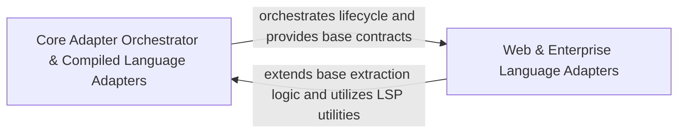

## Details

Provides specialized interface implementations for different programming languages, configuring interactions with LSP servers and ensuring correct initialization.

### Core Adapter Orchestrator & Compiled Language Adapters [[Expand]](./Core_Adapter_Orchestrator_Compiled_Language_Adapters.md)
Manages the lifecycle of LSP clients and provides the base abstraction for all language interactions, including environment preparation and specialized logic for compiled or strictly structured languages.

**Related Classes/Methods**:

- `static_analyzer.engine.language_adapter.LanguageAdapter`:22-382
- `static_analyzer.__init__.StaticAnalyzer.start_clients`:209-309
- `static_analyzer.engine.adapters.rust_adapter.RustAdapter`:76-232
- `static_analyzer.engine.adapters.go_adapter.GoAdapter`:73-248
- `tool_registry.paths.ensure_node_on_path`:267-296

**Source Files:**

- [`static_analyzer/__init__.py`](https://github.com/CodeBoarding/CodeBoarding/blob/main/.codeboardingstatic_analyzer/__init__.py)
  - `static_analyzer.__init__.StaticAnalyzer.__enter__` ([L202-L204](https://github.com/CodeBoarding/CodeBoarding/blob/main/.codeboardingstatic_analyzer/__init__.py#L202-L204)) - Method
  - `static_analyzer.__init__.StaticAnalyzer.start_clients` ([L209-L309](https://github.com/CodeBoarding/CodeBoarding/blob/main/.codeboardingstatic_analyzer/__init__.py#L209-L309)) - Method
- [`static_analyzer/engine/adapters/go_adapter.py`](https://github.com/CodeBoarding/CodeBoarding/blob/main/.codeboardingstatic_analyzer/engine/adapters/go_adapter.py)
  - `static_analyzer.engine.adapters.go_adapter._directory_filters_from_ignore_manager` ([L22-L70](https://github.com/CodeBoarding/CodeBoarding/blob/main/.codeboardingstatic_analyzer/engine/adapters/go_adapter.py#L22-L70)) - Function
  - `static_analyzer.engine.adapters.go_adapter.GoAdapter` ([L73-L248](https://github.com/CodeBoarding/CodeBoarding/blob/main/.codeboardingstatic_analyzer/engine/adapters/go_adapter.py#L73-L248)) - Class
  - `static_analyzer.engine.adapters.go_adapter.GoAdapter.wait_for_workspace_ready` ([L76-L78](https://github.com/CodeBoarding/CodeBoarding/blob/main/.codeboardingstatic_analyzer/engine/adapters/go_adapter.py#L76-L78)) - Method
  - `static_analyzer.engine.adapters.go_adapter.GoAdapter.probe_before_open` ([L81-L83](https://github.com/CodeBoarding/CodeBoarding/blob/main/.codeboardingstatic_analyzer/engine/adapters/go_adapter.py#L81-L83)) - Method
  - `static_analyzer.engine.adapters.go_adapter.GoAdapter.interleave_did_open_with_symbols` ([L86-L88](https://github.com/CodeBoarding/CodeBoarding/blob/main/.codeboardingstatic_analyzer/engine/adapters/go_adapter.py#L86-L88)) - Method
  - `static_analyzer.engine.adapters.go_adapter.GoAdapter.language` ([L91-L92](https://github.com/CodeBoarding/CodeBoarding/blob/main/.codeboardingstatic_analyzer/engine/adapters/go_adapter.py#L91-L92)) - Method
  - `static_analyzer.engine.adapters.go_adapter.GoAdapter.language_enum` ([L95-L96](https://github.com/CodeBoarding/CodeBoarding/blob/main/.codeboardingstatic_analyzer/engine/adapters/go_adapter.py#L95-L96)) - Method
  - `static_analyzer.engine.adapters.go_adapter.GoAdapter.lsp_command` ([L99-L100](https://github.com/CodeBoarding/CodeBoarding/blob/main/.codeboardingstatic_analyzer/engine/adapters/go_adapter.py#L99-L100)) - Method
  - `static_analyzer.engine.adapters.go_adapter.GoAdapter.language_id` ([L103-L104](https://github.com/CodeBoarding/CodeBoarding/blob/main/.codeboardingstatic_analyzer/engine/adapters/go_adapter.py#L103-L104)) - Method
  - `static_analyzer.engine.adapters.go_adapter.GoAdapter.get_lsp_command` ([L106-L118](https://github.com/CodeBoarding/CodeBoarding/blob/main/.codeboardingstatic_analyzer/engine/adapters/go_adapter.py#L106-L118)) - Method
  - `static_analyzer.engine.adapters.go_adapter.GoAdapter.build_qualified_name` ([L120-L141](https://github.com/CodeBoarding/CodeBoarding/blob/main/.codeboardingstatic_analyzer/engine/adapters/go_adapter.py#L120-L141)) - Method
  - `static_analyzer.engine.adapters.go_adapter.GoAdapter._is_pointer_receiver` ([L144-L147](https://github.com/CodeBoarding/CodeBoarding/blob/main/.codeboardingstatic_analyzer/engine/adapters/go_adapter.py#L144-L147)) - Method
  - `static_analyzer.engine.adapters.go_adapter.GoAdapter.build_reference_key` ([L149-L151](https://github.com/CodeBoarding/CodeBoarding/blob/main/.codeboardingstatic_analyzer/engine/adapters/go_adapter.py#L149-L151)) - Method
  - `static_analyzer.engine.adapters.go_adapter.GoAdapter.get_lsp_init_options` ([L153-L180](https://github.com/CodeBoarding/CodeBoarding/blob/main/.codeboardingstatic_analyzer/engine/adapters/go_adapter.py#L153-L180)) - Method
  - `static_analyzer.engine.adapters.go_adapter.GoAdapter.get_workspace_settings` ([L182-L191](https://github.com/CodeBoarding/CodeBoarding/blob/main/.codeboardingstatic_analyzer/engine/adapters/go_adapter.py#L182-L191)) - Method
  - `static_analyzer.engine.adapters.go_adapter.GoAdapter.get_lsp_env` ([L193-L201](https://github.com/CodeBoarding/CodeBoarding/blob/main/.codeboardingstatic_analyzer/engine/adapters/go_adapter.py#L193-L201)) - Method
  - `static_analyzer.engine.adapters.go_adapter.GoAdapter.references_batch_size` ([L204-L206](https://github.com/CodeBoarding/CodeBoarding/blob/main/.codeboardingstatic_analyzer/engine/adapters/go_adapter.py#L204-L206)) - Method
  - `static_analyzer.engine.adapters.go_adapter.GoAdapter.references_per_query_timeout` ([L209-L211](https://github.com/CodeBoarding/CodeBoarding/blob/main/.codeboardingstatic_analyzer/engine/adapters/go_adapter.py#L209-L211)) - Method
  - `static_analyzer.engine.adapters.go_adapter.GoAdapter.discover_source_files` ([L213-L225](https://github.com/CodeBoarding/CodeBoarding/blob/main/.codeboardingstatic_analyzer/engine/adapters/go_adapter.py#L213-L225)) - Method
  - `static_analyzer.engine.adapters.go_adapter.GoAdapter._has_excluding_build_tag` ([L228-L248](https://github.com/CodeBoarding/CodeBoarding/blob/main/.codeboardingstatic_analyzer/engine/adapters/go_adapter.py#L228-L248)) - Method
- [`static_analyzer/engine/adapters/python_adapter.py`](https://github.com/CodeBoarding/CodeBoarding/blob/main/.codeboardingstatic_analyzer/engine/adapters/python_adapter.py)
  - `static_analyzer.engine.adapters.python_adapter.PythonAdapter` ([L10-L57](https://github.com/CodeBoarding/CodeBoarding/blob/main/.codeboardingstatic_analyzer/engine/adapters/python_adapter.py#L10-L57)) - Class
  - `static_analyzer.engine.adapters.python_adapter.PythonAdapter.language` ([L13-L14](https://github.com/CodeBoarding/CodeBoarding/blob/main/.codeboardingstatic_analyzer/engine/adapters/python_adapter.py#L13-L14)) - Method
  - `static_analyzer.engine.adapters.python_adapter.PythonAdapter.language_enum` ([L17-L18](https://github.com/CodeBoarding/CodeBoarding/blob/main/.codeboardingstatic_analyzer/engine/adapters/python_adapter.py#L17-L18)) - Method
  - `static_analyzer.engine.adapters.python_adapter.PythonAdapter.lsp_command` ([L21-L22](https://github.com/CodeBoarding/CodeBoarding/blob/main/.codeboardingstatic_analyzer/engine/adapters/python_adapter.py#L21-L22)) - Method
  - `static_analyzer.engine.adapters.python_adapter.PythonAdapter.language_id` ([L25-L26](https://github.com/CodeBoarding/CodeBoarding/blob/main/.codeboardingstatic_analyzer/engine/adapters/python_adapter.py#L25-L26)) - Method
  - `static_analyzer.engine.adapters.python_adapter.PythonAdapter.get_lsp_init_options` ([L28-L37](https://github.com/CodeBoarding/CodeBoarding/blob/main/.codeboardingstatic_analyzer/engine/adapters/python_adapter.py#L28-L37)) - Method
  - `static_analyzer.engine.adapters.python_adapter.PythonAdapter.get_workspace_settings` ([L39-L57](https://github.com/CodeBoarding/CodeBoarding/blob/main/.codeboardingstatic_analyzer/engine/adapters/python_adapter.py#L39-L57)) - Method
- [`static_analyzer/engine/adapters/rust_adapter.py`](https://github.com/CodeBoarding/CodeBoarding/blob/main/.codeboardingstatic_analyzer/engine/adapters/rust_adapter.py)
  - `static_analyzer.engine.adapters.rust_adapter._skip_angle_block` ([L22-L38](https://github.com/CodeBoarding/CodeBoarding/blob/main/.codeboardingstatic_analyzer/engine/adapters/rust_adapter.py#L22-L38)) - Function
  - `static_analyzer.engine.adapters.rust_adapter._normalize_parent` ([L41-L73](https://github.com/CodeBoarding/CodeBoarding/blob/main/.codeboardingstatic_analyzer/engine/adapters/rust_adapter.py#L41-L73)) - Function
  - `static_analyzer.engine.adapters.rust_adapter.RustAdapter` ([L76-L232](https://github.com/CodeBoarding/CodeBoarding/blob/main/.codeboardingstatic_analyzer/engine/adapters/rust_adapter.py#L76-L232)) - Class
  - `static_analyzer.engine.adapters.rust_adapter.RustAdapter.language` ([L80-L81](https://github.com/CodeBoarding/CodeBoarding/blob/main/.codeboardingstatic_analyzer/engine/adapters/rust_adapter.py#L80-L81)) - Method
  - `static_analyzer.engine.adapters.rust_adapter.RustAdapter.language_enum` ([L84-L85](https://github.com/CodeBoarding/CodeBoarding/blob/main/.codeboardingstatic_analyzer/engine/adapters/rust_adapter.py#L84-L85)) - Method
  - `static_analyzer.engine.adapters.rust_adapter.RustAdapter.references_per_query_timeout` ([L88-L91](https://github.com/CodeBoarding/CodeBoarding/blob/main/.codeboardingstatic_analyzer/engine/adapters/rust_adapter.py#L88-L91)) - Method
  - `static_analyzer.engine.adapters.rust_adapter.RustAdapter.wait_for_workspace_ready` ([L94-L100](https://github.com/CodeBoarding/CodeBoarding/blob/main/.codeboardingstatic_analyzer/engine/adapters/rust_adapter.py#L94-L100)) - Method
  - `static_analyzer.engine.adapters.rust_adapter.RustAdapter.extra_client_capabilities` ([L103-L107](https://github.com/CodeBoarding/CodeBoarding/blob/main/.codeboardingstatic_analyzer/engine/adapters/rust_adapter.py#L103-L107)) - Method
  - `static_analyzer.engine.adapters.rust_adapter.RustAdapter.lsp_command` ([L133-L134](https://github.com/CodeBoarding/CodeBoarding/blob/main/.codeboardingstatic_analyzer/engine/adapters/rust_adapter.py#L133-L134)) - Method
  - `static_analyzer.engine.adapters.rust_adapter.RustAdapter.language_id` ([L137-L138](https://github.com/CodeBoarding/CodeBoarding/blob/main/.codeboardingstatic_analyzer/engine/adapters/rust_adapter.py#L137-L138)) - Method
  - `static_analyzer.engine.adapters.rust_adapter.RustAdapter.get_lsp_command` ([L140-L155](https://github.com/CodeBoarding/CodeBoarding/blob/main/.codeboardingstatic_analyzer/engine/adapters/rust_adapter.py#L140-L155)) - Method
  - `static_analyzer.engine.adapters.rust_adapter.RustAdapter._check_cargo_usable` ([L157-L185](https://github.com/CodeBoarding/CodeBoarding/blob/main/.codeboardingstatic_analyzer/engine/adapters/rust_adapter.py#L157-L185)) - Method
  - `static_analyzer.engine.adapters.rust_adapter.RustAdapter.get_lsp_init_options` ([L187-L206](https://github.com/CodeBoarding/CodeBoarding/blob/main/.codeboardingstatic_analyzer/engine/adapters/rust_adapter.py#L187-L206)) - Method
  - `static_analyzer.engine.adapters.rust_adapter.RustAdapter.build_qualified_name` ([L208-L232](https://github.com/CodeBoarding/CodeBoarding/blob/main/.codeboardingstatic_analyzer/engine/adapters/rust_adapter.py#L208-L232)) - Method
- [`static_analyzer/engine/language_adapter.py`](https://github.com/CodeBoarding/CodeBoarding/blob/main/.codeboardingstatic_analyzer/engine/language_adapter.py)
  - `static_analyzer.engine.language_adapter.LanguageAdapter` ([L22-L382](https://github.com/CodeBoarding/CodeBoarding/blob/main/.codeboardingstatic_analyzer/engine/language_adapter.py#L22-L382)) - Class
  - `static_analyzer.engine.language_adapter.LanguageAdapter.include_references_on_declaration_line` ([L26-L28](https://github.com/CodeBoarding/CodeBoarding/blob/main/.codeboardingstatic_analyzer/engine/language_adapter.py#L26-L28)) - Method
  - `static_analyzer.engine.language_adapter.LanguageAdapter.lsp_command` ([L55-L56](https://github.com/CodeBoarding/CodeBoarding/blob/main/.codeboardingstatic_analyzer/engine/language_adapter.py#L55-L56)) - Method
  - `static_analyzer.engine.language_adapter.LanguageAdapter.config_key` ([L59-L65](https://github.com/CodeBoarding/CodeBoarding/blob/main/.codeboardingstatic_analyzer/engine/language_adapter.py#L59-L65)) - Method
  - `static_analyzer.engine.language_adapter.LanguageAdapter.get_lsp_command` ([L67-L79](https://github.com/CodeBoarding/CodeBoarding/blob/main/.codeboardingstatic_analyzer/engine/language_adapter.py#L67-L79)) - Method
  - `static_analyzer.engine.language_adapter.LanguageAdapter.language_id` ([L82-L84](https://github.com/CodeBoarding/CodeBoarding/blob/main/.codeboardingstatic_analyzer/engine/language_adapter.py#L82-L84)) - Method
  - `static_analyzer.engine.language_adapter.LanguageAdapter.build_qualified_name` ([L86-L106](https://github.com/CodeBoarding/CodeBoarding/blob/main/.codeboardingstatic_analyzer/engine/language_adapter.py#L86-L106)) - Method
  - `static_analyzer.engine.language_adapter.LanguageAdapter.build_reference_key` ([L108-L114](https://github.com/CodeBoarding/CodeBoarding/blob/main/.codeboardingstatic_analyzer/engine/language_adapter.py#L108-L114)) - Method
  - `static_analyzer.engine.language_adapter.LanguageAdapter.extract_package` ([L116-L122](https://github.com/CodeBoarding/CodeBoarding/blob/main/.codeboardingstatic_analyzer/engine/language_adapter.py#L116-L122)) - Method
  - `static_analyzer.engine.language_adapter.LanguageAdapter.get_package_for_file` ([L124-L138](https://github.com/CodeBoarding/CodeBoarding/blob/main/.codeboardingstatic_analyzer/engine/language_adapter.py#L124-L138)) - Method
  - `static_analyzer.engine.language_adapter.LanguageAdapter.get_lsp_init_options` ([L140-L142](https://github.com/CodeBoarding/CodeBoarding/blob/main/.codeboardingstatic_analyzer/engine/language_adapter.py#L140-L142)) - Method
  - `static_analyzer.engine.language_adapter.LanguageAdapter.get_workspace_settings` ([L144-L154](https://github.com/CodeBoarding/CodeBoarding/blob/main/.codeboardingstatic_analyzer/engine/language_adapter.py#L144-L154)) - Method
  - `static_analyzer.engine.language_adapter.LanguageAdapter.get_lsp_default_timeout` ([L156-L164](https://github.com/CodeBoarding/CodeBoarding/blob/main/.codeboardingstatic_analyzer/engine/language_adapter.py#L156-L164)) - Method
  - `static_analyzer.engine.language_adapter.LanguageAdapter.wait_for_workspace_ready` ([L167-L174](https://github.com/CodeBoarding/CodeBoarding/blob/main/.codeboardingstatic_analyzer/engine/language_adapter.py#L167-L174)) - Method
  - `static_analyzer.engine.language_adapter.LanguageAdapter.probe_before_open` ([L177-L187](https://github.com/CodeBoarding/CodeBoarding/blob/main/.codeboardingstatic_analyzer/engine/language_adapter.py#L177-L187)) - Method
  - `static_analyzer.engine.language_adapter.LanguageAdapter.interleave_did_open_with_symbols` ([L190-L192](https://github.com/CodeBoarding/CodeBoarding/blob/main/.codeboardingstatic_analyzer/engine/language_adapter.py#L190-L192)) - Method
  - `static_analyzer.engine.language_adapter.LanguageAdapter.get_probe_timeout_minimum` ([L194-L202](https://github.com/CodeBoarding/CodeBoarding/blob/main/.codeboardingstatic_analyzer/engine/language_adapter.py#L194-L202)) - Method
  - `static_analyzer.engine.language_adapter.LanguageAdapter.wait_for_diagnostics` ([L209-L224](https://github.com/CodeBoarding/CodeBoarding/blob/main/.codeboardingstatic_analyzer/engine/language_adapter.py#L209-L224)) - Method
  - `static_analyzer.engine.language_adapter.LanguageAdapter.validate_workspace_ready` ([L226-L228](https://github.com/CodeBoarding/CodeBoarding/blob/main/.codeboardingstatic_analyzer/engine/language_adapter.py#L226-L228)) - Method
  - `static_analyzer.engine.language_adapter.LanguageAdapter.get_lsp_env` ([L230-L232](https://github.com/CodeBoarding/CodeBoarding/blob/main/.codeboardingstatic_analyzer/engine/language_adapter.py#L230-L232)) - Method
  - `static_analyzer.engine.language_adapter.LanguageAdapter.prepare_project` ([L234-L242](https://github.com/CodeBoarding/CodeBoarding/blob/main/.codeboardingstatic_analyzer/engine/language_adapter.py#L234-L242)) - Method
  - `static_analyzer.engine.language_adapter.LanguageAdapter.is_callable` ([L284-L285](https://github.com/CodeBoarding/CodeBoarding/blob/main/.codeboardingstatic_analyzer/engine/language_adapter.py#L284-L285)) - Method
  - `static_analyzer.engine.language_adapter.LanguageAdapter.should_track_for_edges` ([L300-L301](https://github.com/CodeBoarding/CodeBoarding/blob/main/.codeboardingstatic_analyzer/engine/language_adapter.py#L300-L301)) - Method
  - `static_analyzer.engine.language_adapter.LanguageAdapter.extra_client_capabilities` ([L313-L318](https://github.com/CodeBoarding/CodeBoarding/blob/main/.codeboardingstatic_analyzer/engine/language_adapter.py#L313-L318)) - Method
  - `static_analyzer.engine.language_adapter.LanguageAdapter.references_batch_size` ([L321-L323](https://github.com/CodeBoarding/CodeBoarding/blob/main/.codeboardingstatic_analyzer/engine/language_adapter.py#L321-L323)) - Method
  - `static_analyzer.engine.language_adapter.LanguageAdapter.references_per_query_timeout` ([L326-L328](https://github.com/CodeBoarding/CodeBoarding/blob/main/.codeboardingstatic_analyzer/engine/language_adapter.py#L326-L328)) - Method
  - `static_analyzer.engine.language_adapter.LanguageAdapter.build_edge_name` ([L330-L340](https://github.com/CodeBoarding/CodeBoarding/blob/main/.codeboardingstatic_analyzer/engine/language_adapter.py#L330-L340)) - Method
  - `static_analyzer.engine.language_adapter.LanguageAdapter.get_all_packages` ([L342-L357](https://github.com/CodeBoarding/CodeBoarding/blob/main/.codeboardingstatic_analyzer/engine/language_adapter.py#L342-L357)) - Method
- [`tool_registry/paths.py`](https://github.com/CodeBoarding/CodeBoarding/blob/main/.codeboardingtool_registry/paths.py)
  - `tool_registry.paths.ensure_node_on_path` ([L267-L296](https://github.com/CodeBoarding/CodeBoarding/blob/main/.codeboardingtool_registry/paths.py#L267-L296)) - Function

### Web & Enterprise Language Adapters [[Expand]](./Web_Enterprise_Language_Adapters.md)
Implements specialized semantic extraction logic for languages used in web and enterprise environments, focusing on complex package hierarchy resolution and deep namespace extraction.

**Related Classes/Methods**:

- `static_analyzer.engine.adapters.typescript_adapter.TypeScriptAdapter`:11-33
- `static_analyzer.engine.adapters.csharp_adapter.CSharpAdapter`:29-272
- `static_analyzer.engine.adapters.php_adapter.PHPAdapter`:24-82
- `static_analyzer.engine.language_adapter.LanguageAdapter._get_hierarchical_packages`:374-382

**Source Files:**

- [`static_analyzer/engine/adapters/csharp_adapter.py`](https://github.com/CodeBoarding/CodeBoarding/blob/main/.codeboardingstatic_analyzer/engine/adapters/csharp_adapter.py)
  - `static_analyzer.engine.adapters.csharp_adapter.CSharpAdapter` ([L29-L272](https://github.com/CodeBoarding/CodeBoarding/blob/main/.codeboardingstatic_analyzer/engine/adapters/csharp_adapter.py#L29-L272)) - Class
  - `static_analyzer.engine.adapters.csharp_adapter.CSharpAdapter.include_references_on_declaration_line` ([L32-L33](https://github.com/CodeBoarding/CodeBoarding/blob/main/.codeboardingstatic_analyzer/engine/adapters/csharp_adapter.py#L32-L33)) - Method
  - `static_analyzer.engine.adapters.csharp_adapter.CSharpAdapter.language` ([L36-L37](https://github.com/CodeBoarding/CodeBoarding/blob/main/.codeboardingstatic_analyzer/engine/adapters/csharp_adapter.py#L36-L37)) - Method
  - `static_analyzer.engine.adapters.csharp_adapter.CSharpAdapter.language_enum` ([L40-L41](https://github.com/CodeBoarding/CodeBoarding/blob/main/.codeboardingstatic_analyzer/engine/adapters/csharp_adapter.py#L40-L41)) - Method
  - `static_analyzer.engine.adapters.csharp_adapter.CSharpAdapter.lsp_command` ([L44-L45](https://github.com/CodeBoarding/CodeBoarding/blob/main/.codeboardingstatic_analyzer/engine/adapters/csharp_adapter.py#L44-L45)) - Method
  - `static_analyzer.engine.adapters.csharp_adapter.CSharpAdapter.language_id` ([L48-L49](https://github.com/CodeBoarding/CodeBoarding/blob/main/.codeboardingstatic_analyzer/engine/adapters/csharp_adapter.py#L48-L49)) - Method
  - `static_analyzer.engine.adapters.csharp_adapter.CSharpAdapter.build_qualified_name` ([L95-L139](https://github.com/CodeBoarding/CodeBoarding/blob/main/.codeboardingstatic_analyzer/engine/adapters/csharp_adapter.py#L95-L139)) - Method
  - `static_analyzer.engine.adapters.csharp_adapter.CSharpAdapter.extract_package` ([L141-L146](https://github.com/CodeBoarding/CodeBoarding/blob/main/.codeboardingstatic_analyzer/engine/adapters/csharp_adapter.py#L141-L146)) - Method
  - `static_analyzer.engine.adapters.csharp_adapter.CSharpAdapter.get_lsp_init_options` ([L148-L157](https://github.com/CodeBoarding/CodeBoarding/blob/main/.codeboardingstatic_analyzer/engine/adapters/csharp_adapter.py#L148-L157)) - Method
  - `static_analyzer.engine.adapters.csharp_adapter.CSharpAdapter.get_workspace_settings` ([L159-L164](https://github.com/CodeBoarding/CodeBoarding/blob/main/.codeboardingstatic_analyzer/engine/adapters/csharp_adapter.py#L159-L164)) - Method
  - `static_analyzer.engine.adapters.csharp_adapter.CSharpAdapter.probe_before_open` ([L167-L169](https://github.com/CodeBoarding/CodeBoarding/blob/main/.codeboardingstatic_analyzer/engine/adapters/csharp_adapter.py#L167-L169)) - Method
  - `static_analyzer.engine.adapters.csharp_adapter.CSharpAdapter.get_lsp_default_timeout` ([L171-L173](https://github.com/CodeBoarding/CodeBoarding/blob/main/.codeboardingstatic_analyzer/engine/adapters/csharp_adapter.py#L171-L173)) - Method
  - `static_analyzer.engine.adapters.csharp_adapter.CSharpAdapter.get_probe_timeout_minimum` ([L175-L177](https://github.com/CodeBoarding/CodeBoarding/blob/main/.codeboardingstatic_analyzer/engine/adapters/csharp_adapter.py#L175-L177)) - Method
  - `static_analyzer.engine.adapters.csharp_adapter.CSharpAdapter.wait_for_diagnostics` ([L179-L190](https://github.com/CodeBoarding/CodeBoarding/blob/main/.codeboardingstatic_analyzer/engine/adapters/csharp_adapter.py#L179-L190)) - Method
  - `static_analyzer.engine.adapters.csharp_adapter.CSharpAdapter.fail_on_empty_symbols` ([L263-L264](https://github.com/CodeBoarding/CodeBoarding/blob/main/.codeboardingstatic_analyzer/engine/adapters/csharp_adapter.py#L263-L264)) - Method
  - `static_analyzer.engine.adapters.csharp_adapter.CSharpAdapter.is_reference_worthy` ([L266-L268](https://github.com/CodeBoarding/CodeBoarding/blob/main/.codeboardingstatic_analyzer/engine/adapters/csharp_adapter.py#L266-L268)) - Method
  - `static_analyzer.engine.adapters.csharp_adapter.CSharpAdapter.get_all_packages` ([L270-L272](https://github.com/CodeBoarding/CodeBoarding/blob/main/.codeboardingstatic_analyzer/engine/adapters/csharp_adapter.py#L270-L272)) - Method
- [`static_analyzer/engine/adapters/php_adapter.py`](https://github.com/CodeBoarding/CodeBoarding/blob/main/.codeboardingstatic_analyzer/engine/adapters/php_adapter.py)
  - `static_analyzer.engine.adapters.php_adapter._env_int` ([L13-L21](https://github.com/CodeBoarding/CodeBoarding/blob/main/.codeboardingstatic_analyzer/engine/adapters/php_adapter.py#L13-L21)) - Function
  - `static_analyzer.engine.adapters.php_adapter.PHPAdapter` ([L24-L82](https://github.com/CodeBoarding/CodeBoarding/blob/main/.codeboardingstatic_analyzer/engine/adapters/php_adapter.py#L24-L82)) - Class
  - `static_analyzer.engine.adapters.php_adapter.PHPAdapter.probe_before_open` ([L27-L29](https://github.com/CodeBoarding/CodeBoarding/blob/main/.codeboardingstatic_analyzer/engine/adapters/php_adapter.py#L27-L29)) - Method
  - `static_analyzer.engine.adapters.php_adapter.PHPAdapter.interleave_did_open_with_symbols` ([L32-L34](https://github.com/CodeBoarding/CodeBoarding/blob/main/.codeboardingstatic_analyzer/engine/adapters/php_adapter.py#L32-L34)) - Method
  - `static_analyzer.engine.adapters.php_adapter.PHPAdapter.references_batch_size` ([L37-L39](https://github.com/CodeBoarding/CodeBoarding/blob/main/.codeboardingstatic_analyzer/engine/adapters/php_adapter.py#L37-L39)) - Method
  - `static_analyzer.engine.adapters.php_adapter.PHPAdapter.references_per_query_timeout` ([L42-L44](https://github.com/CodeBoarding/CodeBoarding/blob/main/.codeboardingstatic_analyzer/engine/adapters/php_adapter.py#L42-L44)) - Method
  - `static_analyzer.engine.adapters.php_adapter.PHPAdapter.language` ([L47-L48](https://github.com/CodeBoarding/CodeBoarding/blob/main/.codeboardingstatic_analyzer/engine/adapters/php_adapter.py#L47-L48)) - Method
  - `static_analyzer.engine.adapters.php_adapter.PHPAdapter.language_enum` ([L51-L52](https://github.com/CodeBoarding/CodeBoarding/blob/main/.codeboardingstatic_analyzer/engine/adapters/php_adapter.py#L51-L52)) - Method
  - `static_analyzer.engine.adapters.php_adapter.PHPAdapter.lsp_command` ([L55-L56](https://github.com/CodeBoarding/CodeBoarding/blob/main/.codeboardingstatic_analyzer/engine/adapters/php_adapter.py#L55-L56)) - Method
  - `static_analyzer.engine.adapters.php_adapter.PHPAdapter.language_id` ([L59-L60](https://github.com/CodeBoarding/CodeBoarding/blob/main/.codeboardingstatic_analyzer/engine/adapters/php_adapter.py#L59-L60)) - Method
  - `static_analyzer.engine.adapters.php_adapter.PHPAdapter.extract_package` ([L62-L63](https://github.com/CodeBoarding/CodeBoarding/blob/main/.codeboardingstatic_analyzer/engine/adapters/php_adapter.py#L62-L63)) - Method
  - `static_analyzer.engine.adapters.php_adapter.PHPAdapter.get_lsp_init_options` ([L65-L66](https://github.com/CodeBoarding/CodeBoarding/blob/main/.codeboardingstatic_analyzer/engine/adapters/php_adapter.py#L65-L66)) - Method
  - `static_analyzer.engine.adapters.php_adapter.PHPAdapter.get_workspace_settings` ([L68-L76](https://github.com/CodeBoarding/CodeBoarding/blob/main/.codeboardingstatic_analyzer/engine/adapters/php_adapter.py#L68-L76)) - Method
  - `static_analyzer.engine.adapters.php_adapter.PHPAdapter.is_reference_worthy` ([L78-L79](https://github.com/CodeBoarding/CodeBoarding/blob/main/.codeboardingstatic_analyzer/engine/adapters/php_adapter.py#L78-L79)) - Method
  - `static_analyzer.engine.adapters.php_adapter.PHPAdapter.get_all_packages` ([L81-L82](https://github.com/CodeBoarding/CodeBoarding/blob/main/.codeboardingstatic_analyzer/engine/adapters/php_adapter.py#L81-L82)) - Method
- [`static_analyzer/engine/adapters/typescript_adapter.py`](https://github.com/CodeBoarding/CodeBoarding/blob/main/.codeboardingstatic_analyzer/engine/adapters/typescript_adapter.py)
  - `static_analyzer.engine.adapters.typescript_adapter.TypeScriptAdapter` ([L11-L33](https://github.com/CodeBoarding/CodeBoarding/blob/main/.codeboardingstatic_analyzer/engine/adapters/typescript_adapter.py#L11-L33)) - Class
  - `static_analyzer.engine.adapters.typescript_adapter.TypeScriptAdapter.language` ([L14-L15](https://github.com/CodeBoarding/CodeBoarding/blob/main/.codeboardingstatic_analyzer/engine/adapters/typescript_adapter.py#L14-L15)) - Method
  - `static_analyzer.engine.adapters.typescript_adapter.TypeScriptAdapter.language_enum` ([L18-L19](https://github.com/CodeBoarding/CodeBoarding/blob/main/.codeboardingstatic_analyzer/engine/adapters/typescript_adapter.py#L18-L19)) - Method
  - `static_analyzer.engine.adapters.typescript_adapter.TypeScriptAdapter.lsp_command` ([L22-L23](https://github.com/CodeBoarding/CodeBoarding/blob/main/.codeboardingstatic_analyzer/engine/adapters/typescript_adapter.py#L22-L23)) - Method
  - `static_analyzer.engine.adapters.typescript_adapter.TypeScriptAdapter.language_id` ([L26-L27](https://github.com/CodeBoarding/CodeBoarding/blob/main/.codeboardingstatic_analyzer/engine/adapters/typescript_adapter.py#L26-L27)) - Method
  - `static_analyzer.engine.adapters.typescript_adapter.TypeScriptAdapter.extract_package` ([L29-L30](https://github.com/CodeBoarding/CodeBoarding/blob/main/.codeboardingstatic_analyzer/engine/adapters/typescript_adapter.py#L29-L30)) - Method
  - `static_analyzer.engine.adapters.typescript_adapter.TypeScriptAdapter.get_all_packages` ([L32-L33](https://github.com/CodeBoarding/CodeBoarding/blob/main/.codeboardingstatic_analyzer/engine/adapters/typescript_adapter.py#L32-L33)) - Method
  - `static_analyzer.engine.adapters.typescript_adapter.JavaScriptAdapter` ([L36-L52](https://github.com/CodeBoarding/CodeBoarding/blob/main/.codeboardingstatic_analyzer/engine/adapters/typescript_adapter.py#L36-L52)) - Class
  - `static_analyzer.engine.adapters.typescript_adapter.JavaScriptAdapter.language` ([L39-L40](https://github.com/CodeBoarding/CodeBoarding/blob/main/.codeboardingstatic_analyzer/engine/adapters/typescript_adapter.py#L39-L40)) - Method
  - `static_analyzer.engine.adapters.typescript_adapter.JavaScriptAdapter.language_enum` ([L43-L44](https://github.com/CodeBoarding/CodeBoarding/blob/main/.codeboardingstatic_analyzer/engine/adapters/typescript_adapter.py#L43-L44)) - Method
  - `static_analyzer.engine.adapters.typescript_adapter.JavaScriptAdapter.language_id` ([L47-L48](https://github.com/CodeBoarding/CodeBoarding/blob/main/.codeboardingstatic_analyzer/engine/adapters/typescript_adapter.py#L47-L48)) - Method
  - `static_analyzer.engine.adapters.typescript_adapter.JavaScriptAdapter.config_key` ([L51-L52](https://github.com/CodeBoarding/CodeBoarding/blob/main/.codeboardingstatic_analyzer/engine/adapters/typescript_adapter.py#L51-L52)) - Method
- [`static_analyzer/engine/language_adapter.py`](https://github.com/CodeBoarding/CodeBoarding/blob/main/.codeboardingstatic_analyzer/engine/language_adapter.py)
  - `static_analyzer.engine.language_adapter.LanguageAdapter.is_reference_worthy` ([L287-L298](https://github.com/CodeBoarding/CodeBoarding/blob/main/.codeboardingstatic_analyzer/engine/language_adapter.py#L287-L298)) - Method
  - `static_analyzer.engine.language_adapter.LanguageAdapter._extract_deep_package` ([L360-L372](https://github.com/CodeBoarding/CodeBoarding/blob/main/.codeboardingstatic_analyzer/engine/language_adapter.py#L360-L372)) - Method
  - `static_analyzer.engine.language_adapter.LanguageAdapter._get_hierarchical_packages` ([L374-L382](https://github.com/CodeBoarding/CodeBoarding/blob/main/.codeboardingstatic_analyzer/engine/language_adapter.py#L374-L382)) - Method

### [FAQ](https://github.com/CodeBoarding/GeneratedOnBoardings/tree/main?tab=readme-ov-file#faq)