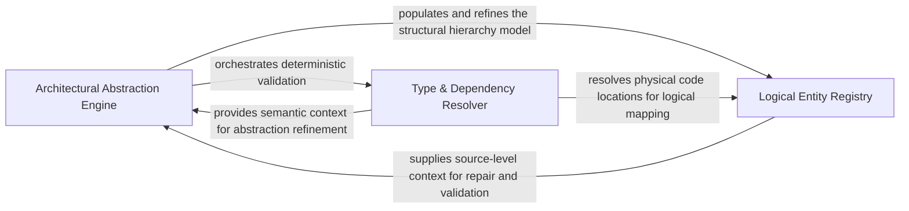

## Details

Analyzes relationships between code entities, focusing on inheritance, type resolution, and logical nesting of modules and classes.

### Architectural Abstraction Engine
The primary orchestrator for the subsystem, managing the lifecycle of architectural discovery and executing the pipeline that transitions from raw code clusters to refined logical components.

**Related Classes/Methods**: _None_

**Source Files:**

- [`static_analyzer/engine/hierarchy_builder.py`](https://github.com/CodeBoarding/CodeBoarding/blob/main/.codeboardingstatic_analyzer/engine/hierarchy_builder.py)
  - `static_analyzer.engine.hierarchy_builder.HierarchyBuilder._infer_hierarchy_from_source` ([L137-L182](https://github.com/CodeBoarding/CodeBoarding/blob/main/.codeboardingstatic_analyzer/engine/hierarchy_builder.py#L137-L182)) - Method

### Type & Dependency Resolver
Provides the deterministic foundation for the hierarchy by resolving code-level references, inheritance chains, and method calls to validate logical groupings.

**Related Classes/Methods**: _None_

**Source Files:**

- [`static_analyzer/engine/source_inspector.py`](https://github.com/CodeBoarding/CodeBoarding/blob/main/.codeboardingstatic_analyzer/engine/source_inspector.py)
  - `static_analyzer.engine.source_inspector.SourceInspector._node_covers_range` ([L334-L343](https://github.com/CodeBoarding/CodeBoarding/blob/main/.codeboardingstatic_analyzer/engine/source_inspector.py#L334-L343)) - Method

### Logical Entity Registry
Manages the structural integrity and identity of the inferred hierarchy, maintaining mappings between files/methods and their parent clusters to ensure data consistency.

**Related Classes/Methods**: _None_

**Source Files:**

- [`static_analyzer/engine/source_inspector.py`](https://github.com/CodeBoarding/CodeBoarding/blob/main/.codeboardingstatic_analyzer/engine/source_inspector.py)
  - `static_analyzer.engine.source_inspector.SourceInspector.get_source_line` ([L104-L109](https://github.com/CodeBoarding/CodeBoarding/blob/main/.codeboardingstatic_analyzer/engine/source_inspector.py#L104-L109)) - Method

### [FAQ](https://github.com/CodeBoarding/GeneratedOnBoardings/tree/main?tab=readme-ov-file#faq)