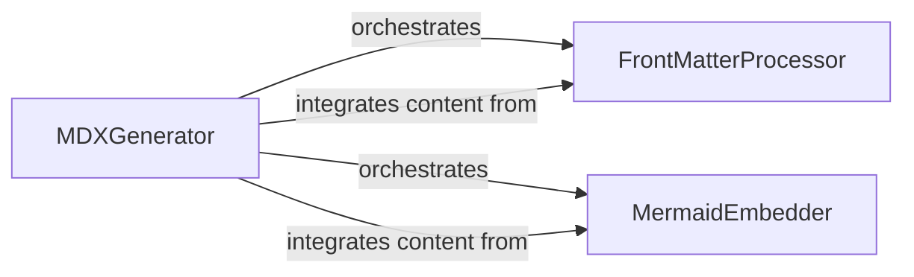

## Details

Creates documentation files in MDX format, which combines Markdown with JSX. This allows for rich, interactive content and seamless integration into modern documentation sites, handling front-matter and embedding diagrams.

### MDXGenerator
The primary orchestrator for MDX documentation generation. It takes processed data (e.g., code analysis results, diagram definitions) and assembles them into a final MDX file, coordinating the integration of front‑matter and embedded diagrams.

**Related Classes/Methods**:

- <a href="https://github.com/CodeBoarding/CodeBoarding/blob/main/.codeboardingoutput_generators/mdx.py" target="_blank" rel="noopener noreferrer">`repos.codeboarding.output.mdx.MDXGenerator`</a>

### FrontMatterProcessor
Manages the creation and insertion of metadata (front‑matter) into the MDX files. This includes essential documentation attributes such as title, author, and date, ensuring proper categorization and display of the generated content.

**Related Classes/Methods**:

- <a href="https://github.com/CodeBoarding/CodeBoarding/blob/main/.codeboardingoutput_generators/mdx.py" target="_blank" rel="noopener noreferrer">`repos.codeboarding.output.mdx.FrontMatterProcessor`</a>

### MermaidEmbedder
Handles the embedding of Mermaid diagrams within the MDX output. It processes Mermaid diagram definitions, formats them appropriately for MDX rendering, and ensures their seamless integration into the documentation.

**Related Classes/Methods**:

- <a href="https://github.com/CodeBoarding/CodeBoarding/blob/main/.codeboardingoutput_generators/mdx.py" target="_blank" rel="noopener noreferrer">`repos.codeboarding.output.mdx.MermaidEmbedder`</a>

### [FAQ](https://github.com/CodeBoarding/GeneratedOnBoardings/tree/main?tab=readme-ov-file#faq)