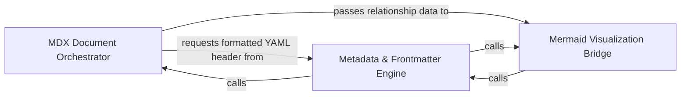

## Details

Generates MDX files for modern frameworks, handling frontmatter and embedded Mermaid.js syntax.

### MDX Document Orchestrator
Acts as the primary controller for the document generation lifecycle, managing the assembly of metadata, content, and diagrams into finalized MDX files.

**Related Classes/Methods**:

- `output_generators.mdx.generate_mdx_file`:161-183

**Source Files:**

- [`output_generators/mdx.py`](https://github.com/CodeBoarding/CodeBoarding/blob/main/.codeboardingoutput_generators/mdx.py)
  - `output_generators.mdx.component_header` ([L186-L194](https://github.com/CodeBoarding/CodeBoarding/blob/main/.codeboardingoutput_generators/mdx.py#L186-L194)) - Function

### Metadata & Frontmatter Engine
Extracts and formats file-level metadata into YAML frontmatter blocks for compatibility with static site generators.

**Related Classes/Methods**:

- `output_generators.mdx.generate_frontmatter`:38-49

**Source Files:**

- [`output_generators/mdx.py`](https://github.com/CodeBoarding/CodeBoarding/blob/main/.codeboardingoutput_generators/mdx.py)
  - `output_generators.mdx.generate_frontmatter` ([L38-L49](https://github.com/CodeBoarding/CodeBoarding/blob/main/.codeboardingoutput_generators/mdx.py#L38-L49)) - Function
  - `output_generators.mdx.generate_mdx` ([L52-L158](https://github.com/CodeBoarding/CodeBoarding/blob/main/.codeboardingoutput_generators/mdx.py#L52-L158)) - Function

### Mermaid Visualization Bridge
Translates internal graph representations and cluster data into Mermaid.js syntax for rendering within MDX code blocks.

**Related Classes/Methods**:

- `output_generators.mdx.generated_mermaid_str`:8-35

**Source Files:**

- [`output_generators/mdx.py`](https://github.com/CodeBoarding/CodeBoarding/blob/main/.codeboardingoutput_generators/mdx.py)
  - `output_generators.mdx.generated_mermaid_str` ([L8-L35](https://github.com/CodeBoarding/CodeBoarding/blob/main/.codeboardingoutput_generators/mdx.py#L8-L35)) - Function
  - `output_generators.mdx.generate_mdx_file` ([L161-L183](https://github.com/CodeBoarding/CodeBoarding/blob/main/.codeboardingoutput_generators/mdx.py#L161-L183)) - Function

### [FAQ](https://github.com/CodeBoarding/GeneratedOnBoardings/tree/main?tab=readme-ov-file#faq)