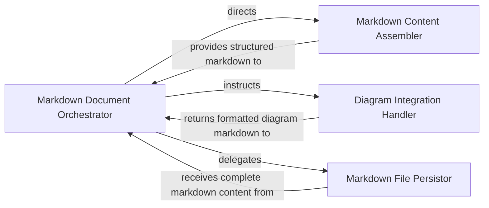

## Details

Generates documentation content in Markdown format. It incorporates textual explanations, code snippets, and embeds diagrams provided by the DiagramGenerator to create comprehensive Markdown files.

### Markdown Document Orchestrator
The primary component that orchestrates the entire Markdown documentation generation workflow. It coordinates the sequence of operations, from assembling textual content and headers to embedding diagrams and finally persisting the document to a file.

**Related Classes/Methods**:

- <a href="https://github.com/CodeBoarding/CodeBoarding/blob/main/.codeboardingoutput_generators/markdown.py" target="_blank" rel="noopener noreferrer">`repos.codeboarding.output.markdown.output_generators.markdown.generate_markdown`</a>
- <a href="https://github.com/CodeBoarding/CodeBoarding/blob/main/.codeboardingoutput_generators/markdown.py" target="_blank" rel="noopener noreferrer">`repos.codeboarding.output.markdown.output_generators.markdown.MarkdownOutputGenerator`</a>

### Markdown Content Assembler
Constructs the textual and structural elements of the Markdown document, generating component headers, incorporating code snippets, and formatting explanatory text, leveraging utilities like MarkdownBuilder for low‑level syntax generation.

**Related Classes/Methods**: _None_

### Diagram Integration Handler
Specializes in embedding diagram data (e.g., Mermaid strings) into the Markdown document, ensuring diagrams are correctly formatted and positioned within the generated content.

**Related Classes/Methods**: _None_

### Markdown File Persistor
Handles the final step of writing the complete Markdown document string to a specified file path on the file system, ensuring the generated content is saved persistently.

**Related Classes/Methods**: _None_

### [FAQ](https://github.com/CodeBoarding/GeneratedOnBoardings/tree/main?tab=readme-ov-file#faq)