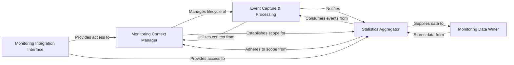

## Details

Collects and reports runtime statistics and usage data, particularly for LLM and tool interactions. This component is vital for understanding the performance, cost, and behavior of the AI agents and the overall analysis pipeline.

### Monitoring Context Manager
Provides a contextual wrapper for monitoring execution, allowing for the enablement/disablement of monitoring and the management of run-specific statistics and traces. It serves as the entry point for initiating and managing monitoring for a given operation or analysis run.

**Related Classes/Methods**:

- <a href="https://github.com/CodeBoarding/CodeBoarding/blob/main/.codeboardingmonitoring/context.py" target="_blank" rel="noopener noreferrer">`monitoring.context.MonitoringContext`</a>
- <a href="https://github.com/CodeBoarding/CodeBoarding/blob/main/.codeboardingmonitoring/context.py" target="_blank" rel="noopener noreferrer">`monitoring.context.MonitoringSession`</a>
- <a href="https://github.com/CodeBoarding/CodeBoarding/blob/main/.codeboardingmonitoring/context.py" target="_blank" rel="noopener noreferrer">`monitoring.context.enable_monitoring`</a>

### Event Capture & Processing
Responsible for capturing and processing events generated during the execution of LLM calls and tool usage. It records granular metrics such as LLM input/output, tool start/end times, and errors, acting as the primary listener for operational events.

**Related Classes/Methods**:

- <a href="https://github.com/CodeBoarding/CodeBoarding/blob/main/.codeboardingmonitoring/context.py" target="_blank" rel="noopener noreferrer">`monitoring.context.MonitoringCallback`</a>
- <a href="https://github.com/CodeBoarding/CodeBoarding/blob/main/.codeboardingmonitoring/context.py" target="_blank" rel="noopener noreferrer">`monitoring.events.LLMEvent`</a>
- <a href="https://github.com/CodeBoarding/CodeBoarding/blob/main/.codeboardingmonitoring/context.py" target="_blank" rel="noopener noreferrer">`monitoring.events.ToolEvent`</a>
- <a href="https://github.com/CodeBoarding/CodeBoarding/blob/main/.codeboardingmonitoring/context.py" target="_blank" rel="noopener noreferrer">`monitoring.events.EventDispatcher`</a>

### Statistics Aggregator
Aggregates and stores various runtime statistics for a single execution run, including token usage, tool call counts, errors, and latency. It acts as a central data container for transforming raw event data into meaningful metrics.

**Related Classes/Methods**:

- <a href="https://github.com/CodeBoarding/CodeBoarding/blob/main/.codeboardingmonitoring/stats.py" target="_blank" rel="noopener noreferrer">`monitoring.stats.StatsManager`</a>
- <a href="https://github.com/CodeBoarding/CodeBoarding/blob/main/.codeboardingmonitoring/stats.py" target="_blank" rel="noopener noreferrer">`monitoring.stats.RunStatistics`</a>
- <a href="https://github.com/CodeBoarding/CodeBoarding/blob/main/.codeboardingmonitoring/stats.py" target="_blank" rel="noopener noreferrer">`monitoring.stats.MetricCollector`</a>

### Monitoring Data Writer
Handles the persistence and output of collected monitoring data and aggregated statistics to various destinations, such as the console or files. It manages output directories and formats the collected data for storage or display.

**Related Classes/Methods**:

- <a href="https://github.com/CodeBoarding/CodeBoarding/blob/main/.codeboardingmonitoring/writers.py" target="_blank" rel="noopener noreferrer">`monitoring.writers.ConsoleWriter`</a>
- <a href="https://github.com/CodeBoarding/CodeBoarding/blob/main/.codeboardingmonitoring/writers.py" target="_blank" rel="noopener noreferrer">`monitoring.writers.FileWriter`</a>
- <a href="https://github.com/CodeBoarding/CodeBoarding/blob/main/.codeboardingmonitoring/writers.py" target="_blank" rel="noopener noreferrer">`monitoring.writers.StatsFormatter`</a>

### Monitoring Integration Interface
Offers a reusable and standardized interface for integrating monitoring capabilities into other classes and components throughout the project. It provides methods to retrieve monitoring callbacks and access aggregated agent statistics.

**Related Classes/Methods**:

- <a href="https://github.com/CodeBoarding/CodeBoarding/blob/main/.codeboardingmonitoring/mixin.py" target="_blank" rel="noopener noreferrer">`monitoring.api.MonitoringAPI`</a>
- <a href="https://github.com/CodeBoarding/CodeBoarding/blob/main/.codeboardingmonitoring/mixin.py" target="_blank" rel="noopener noreferrer">`monitoring.api.get_current_callback`</a>
- <a href="https://github.com/CodeBoarding/CodeBoarding/blob/main/.codeboardingmonitoring/mixin.py" target="_blank" rel="noopener noreferrer">`monitoring.api.get_current_stats`</a>

### [FAQ](https://github.com/CodeBoarding/GeneratedOnBoardings/tree/main?tab=readme-ov-file#faq)
