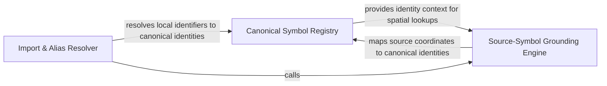

## Details

A specialized logic engine focused on symbol unification, resolving aliases, imports, and canonical paths to ensure entity consistency.

### Canonical Symbol Registry
The central authority for symbol identity, managing the lifecycle of canonical names and maintaining mappings of equivalent identifiers to prevent entity duplication.

**Related Classes/Methods**: _None_

**Source Files:**

- [`static_analyzer/engine/symbol_table.py`](https://github.com/CodeBoarding/CodeBoarding/blob/main/.codeboardingstatic_analyzer/engine/symbol_table.py)
  - `static_analyzer.engine.symbol_table.SymbolTable.__init__` ([L23-L39](https://github.com/CodeBoarding/CodeBoarding/blob/main/.codeboardingstatic_analyzer/engine/symbol_table.py#L23-L39)) - Method

### Import & Alias Resolver
Handles identifier translation by parsing import statements and local aliases to map local names to global symbols.

**Related Classes/Methods**: _None_

**Source Files:**

- [`static_analyzer/engine/symbol_table.py`](https://github.com/CodeBoarding/CodeBoarding/blob/main/.codeboardingstatic_analyzer/engine/symbol_table.py)
  - `static_analyzer.engine.symbol_table.SymbolTable.get_canonical_name` ([L279-L294](https://github.com/CodeBoarding/CodeBoarding/blob/main/.codeboardingstatic_analyzer/engine/symbol_table.py#L279-L294)) - Method

### Source-Symbol Grounding Engine
Bridges abstract symbol definitions with physical source code, mapping identities to specific file coordinates and handling reference refinement.

**Related Classes/Methods**: _None_

**Source Files:**

- [`static_analyzer/engine/symbol_table.py`](https://github.com/CodeBoarding/CodeBoarding/blob/main/.codeboardingstatic_analyzer/engine/symbol_table.py)
  - `static_analyzer.engine.symbol_table.SymbolTable.get_equivalent_names` ([L267-L277](https://github.com/CodeBoarding/CodeBoarding/blob/main/.codeboardingstatic_analyzer/engine/symbol_table.py#L267-L277)) - Method

### [FAQ](https://github.com/CodeBoarding/GeneratedOnBoardings/tree/main?tab=readme-ov-file#faq)