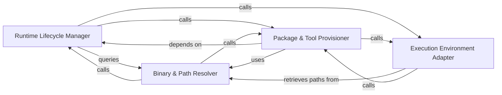

## Details

A specialized manager for the Node.js ecosystem. It bootstraps an embedded Node runtime and NPM, ensuring that TypeScript/JavaScript-based LSP servers can execute in an isolated path environment.

### Runtime Lifecycle Manager
Responsible for the end-to-end provisioning of the Node.js runtime, including environment creation and health checks.

**Related Classes/Methods**:

- `tool_registry.installers.install_embedded_node`:621-703
- `tool_registry.installers.embedded_node_is_healthy`:548-574
- `tool_registry.installers.initialize_nodeenv_globals`:577-600

**Source Files:**

- [`install.py`](https://github.com/CodeBoarding/CodeBoarding/blob/main/.codeboardinginstall.py)
  - `install.check_npm` ([L61-L81](https://github.com/CodeBoarding/CodeBoarding/blob/main/.codeboardinginstall.py#L61-L81)) - Function
  - `install.bootstrapped_npm_cli_path` ([L84-L86](https://github.com/CodeBoarding/CodeBoarding/blob/main/.codeboardinginstall.py#L84-L86)) - Function
  - `install.bootstrap_npm` ([L100-L149](https://github.com/CodeBoarding/CodeBoarding/blob/main/.codeboardinginstall.py#L100-L149)) - Function
- [`tool_registry/installers.py`](https://github.com/CodeBoarding/CodeBoarding/blob/main/.codeboardingtool_registry/installers.py)
  - `tool_registry.installers.install_node_tools` ([L429-L469](https://github.com/CodeBoarding/CodeBoarding/blob/main/.codeboardingtool_registry/installers.py#L429-L469)) - Function
  - `tool_registry.installers.initialize_nodeenv_globals` ([L577-L600](https://github.com/CodeBoarding/CodeBoarding/blob/main/.codeboardingtool_registry/installers.py#L577-L600)) - Function
  - `tool_registry.installers.install_embedded_node` ([L621-L703](https://github.com/CodeBoarding/CodeBoarding/blob/main/.codeboardingtool_registry/installers.py#L621-L703)) - Function

### Binary & Path Resolver
Discovery engine that locates Node.js/NPM binaries, enforces version constraints, and handles platform-specific pathing.

**Related Classes/Methods**:

- `tool_registry.paths.preferred_node_path`:183-198
- `tool_registry.paths.node_version_tuple`:107-153
- `tool_registry.paths.node_is_acceptable`:156-177

**Source Files:**

- [`install.py`](https://github.com/CodeBoarding/CodeBoarding/blob/main/.codeboardinginstall.py)
  - `install.extract_tarball_safely` ([L89-L97](https://github.com/CodeBoarding/CodeBoarding/blob/main/.codeboardinginstall.py#L89-L97)) - Function
  - `install.resolve_missing_npm` ([L217-L242](https://github.com/CodeBoarding/CodeBoarding/blob/main/.codeboardinginstall.py#L217-L242)) - Function
  - `install.resolve_npm_availability` ([L245-L252](https://github.com/CodeBoarding/CodeBoarding/blob/main/.codeboardinginstall.py#L245-L252)) - Function
- [`tool_registry/installers.py`](https://github.com/CodeBoarding/CodeBoarding/blob/main/.codeboardingtool_registry/installers.py)
  - `tool_registry.installers.nodeenv_needs_unofficial_builds` ([L603-L618](https://github.com/CodeBoarding/CodeBoarding/blob/main/.codeboardingtool_registry/installers.py#L603-L618)) - Function
- [`tool_registry/paths.py`](https://github.com/CodeBoarding/CodeBoarding/blob/main/.codeboardingtool_registry/paths.py)
  - `tool_registry.paths.embedded_node_path` ([L83-L87](https://github.com/CodeBoarding/CodeBoarding/blob/main/.codeboardingtool_registry/paths.py#L83-L87)) - Function
  - `tool_registry.paths.embedded_npm_path` ([L90-L94](https://github.com/CodeBoarding/CodeBoarding/blob/main/.codeboardingtool_registry/paths.py#L90-L94)) - Function
  - `tool_registry.paths.embedded_npm_cli_path` ([L97-L100](https://github.com/CodeBoarding/CodeBoarding/blob/main/.codeboardingtool_registry/paths.py#L97-L100)) - Function

### Package & Tool Provisioner
Manages the installation of Node.js packages and ensures correct structure for the execution context.

**Related Classes/Methods**:

- `tool_registry.installers.install_node_tools`:429-469
- `install.bootstrap_npm`:100-149
- `tool_registry.paths.sibling_npm_path`:201-212
- `tool_registry.paths.npm_subprocess_env`:236-245

**Source Files:**

- [`static_analyzer/typescript_config_scanner.py`](https://github.com/CodeBoarding/CodeBoarding/blob/main/.codeboardingstatic_analyzer/typescript_config_scanner.py)
  - `static_analyzer.typescript_config_scanner._resolve_system_tsc` ([L215-L218](https://github.com/CodeBoarding/CodeBoarding/blob/main/.codeboardingstatic_analyzer/typescript_config_scanner.py#L215-L218)) - Function
  - `static_analyzer.typescript_config_scanner._resolve_tsc_command` ([L221-L235](https://github.com/CodeBoarding/CodeBoarding/blob/main/.codeboardingstatic_analyzer/typescript_config_scanner.py#L221-L235)) - Function
- [`tool_registry/paths.py`](https://github.com/CodeBoarding/CodeBoarding/blob/main/.codeboardingtool_registry/paths.py)
  - `tool_registry.paths.nodeenv_root_dir` ([L72-L74](https://github.com/CodeBoarding/CodeBoarding/blob/main/.codeboardingtool_registry/paths.py#L72-L74)) - Function
  - `tool_registry.paths.nodeenv_bin_dir` ([L77-L80](https://github.com/CodeBoarding/CodeBoarding/blob/main/.codeboardingtool_registry/paths.py#L77-L80)) - Function
  - `tool_registry.paths.node_version_tuple` ([L107-L153](https://github.com/CodeBoarding/CodeBoarding/blob/main/.codeboardingtool_registry/paths.py#L107-L153)) - Function
  - `tool_registry.paths.node_is_acceptable` ([L156-L177](https://github.com/CodeBoarding/CodeBoarding/blob/main/.codeboardingtool_registry/paths.py#L156-L177)) - Function

### Execution Environment Adapter
Configures the runtime state for child processes by modifying environment variables to ensure correct binary resolution.

**Related Classes/Methods**: _None_

**Source Files:**

- [`tool_registry/installers.py`](https://github.com/CodeBoarding/CodeBoarding/blob/main/.codeboardingtool_registry/installers.py)
  - `tool_registry.installers.embedded_node_is_healthy` ([L548-L574](https://github.com/CodeBoarding/CodeBoarding/blob/main/.codeboardingtool_registry/installers.py#L548-L574)) - Function
- [`tool_registry/paths.py`](https://github.com/CodeBoarding/CodeBoarding/blob/main/.codeboardingtool_registry/paths.py)
  - `tool_registry.paths.preferred_node_path` ([L183-L198](https://github.com/CodeBoarding/CodeBoarding/blob/main/.codeboardingtool_registry/paths.py#L183-L198)) - Function
  - `tool_registry.paths.sibling_npm_path` ([L201-L212](https://github.com/CodeBoarding/CodeBoarding/blob/main/.codeboardingtool_registry/paths.py#L201-L212)) - Function
  - `tool_registry.paths.preferred_npm_command` ([L215-L233](https://github.com/CodeBoarding/CodeBoarding/blob/main/.codeboardingtool_registry/paths.py#L215-L233)) - Function
  - `tool_registry.paths.npm_subprocess_env` ([L236-L245](https://github.com/CodeBoarding/CodeBoarding/blob/main/.codeboardingtool_registry/paths.py#L236-L245)) - Function

### [FAQ](https://github.com/CodeBoarding/GeneratedOnBoardings/tree/main?tab=readme-ov-file#faq)