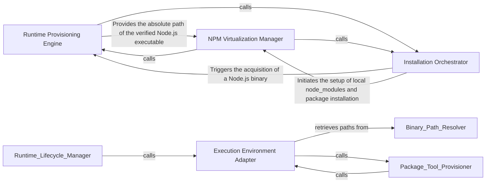

## Details

Specialized manager for bootstrapping local Node.js runtimes and npm environments for TypeScript-based LSP servers.

### Execution Environment Adapter
Configures the runtime state for child processes by modifying environment variables to ensure correct binary resolution.

**Related Classes/Methods**: _None_

**Source Files:**

- [`tool_registry/installers.py`](https://github.com/CodeBoarding/CodeBoarding/blob/main/.codeboardingtool_registry/installers.py)
  - `tool_registry.installers.embedded_node_is_healthy` ([L548-L574](https://github.com/CodeBoarding/CodeBoarding/blob/main/.codeboardingtool_registry/installers.py#L548-L574)) - Function
- [`tool_registry/paths.py`](https://github.com/CodeBoarding/CodeBoarding/blob/main/.codeboardingtool_registry/paths.py)
  - `tool_registry.paths.preferred_node_path` ([L200-L215](https://github.com/CodeBoarding/CodeBoarding/blob/main/.codeboardingtool_registry/paths.py#L200-L215)) - Function
  - `tool_registry.paths.sibling_npm_path` ([L218-L229](https://github.com/CodeBoarding/CodeBoarding/blob/main/.codeboardingtool_registry/paths.py#L218-L229)) - Function
  - `tool_registry.paths.preferred_npm_command` ([L232-L250](https://github.com/CodeBoarding/CodeBoarding/blob/main/.codeboardingtool_registry/paths.py#L232-L250)) - Function
  - `tool_registry.paths.npm_subprocess_env` ([L253-L262](https://github.com/CodeBoarding/CodeBoarding/blob/main/.codeboardingtool_registry/paths.py#L253-L262)) - Function

### Runtime Provisioning Engine
Manages the lifecycle of the Node.js binary, including detection, downloading, and extraction of embedded runtimes to ensure a predictable execution environment.

**Related Classes/Methods**:

- `install.ensure_node_runtime`:161-214
- `tool_registry.installers.install_embedded_node`:621-703

**Source Files:**

- [`install.py`](https://github.com/CodeBoarding/CodeBoarding/blob/main/.codeboardinginstall.py)
  - `install.check_npm` ([L61-L81](https://github.com/CodeBoarding/CodeBoarding/blob/main/.codeboardinginstall.py#L61-L81)) - Function
  - `install.bootstrap_npm` ([L100-L149](https://github.com/CodeBoarding/CodeBoarding/blob/main/.codeboardinginstall.py#L100-L149)) - Function
  - `install.install_vcpp_redistributable` ([L344-L411](https://github.com/CodeBoarding/CodeBoarding/blob/main/.codeboardinginstall.py#L344-L411)) - Function

### NPM Virtualization Manager
Bootstraps the package management layer by creating isolated node_modules environments and executing dependency installations required for LSP functionality.

**Related Classes/Methods**:

- `install.bootstrap_npm`:100-149
- `install.resolve_npm_availability`:245-252

**Source Files:**

- [`install.py`](https://github.com/CodeBoarding/CodeBoarding/blob/main/.codeboardinginstall.py)
  - `install.bootstrapped_npm_cli_path` ([L84-L86](https://github.com/CodeBoarding/CodeBoarding/blob/main/.codeboardinginstall.py#L84-L86)) - Function
  - `install.ensure_node_runtime` ([L161-L214](https://github.com/CodeBoarding/CodeBoarding/blob/main/.codeboardinginstall.py#L161-L214)) - Function
  - `install.resolve_missing_vcpp` ([L414-L435](https://github.com/CodeBoarding/CodeBoarding/blob/main/.codeboardinginstall.py#L414-L435)) - Function
- [`tool_registry/installers.py`](https://github.com/CodeBoarding/CodeBoarding/blob/main/.codeboardingtool_registry/installers.py)
  - `tool_registry.installers.install_embedded_node` ([L621-L703](https://github.com/CodeBoarding/CodeBoarding/blob/main/.codeboardingtool_registry/installers.py#L621-L703)) - Function

### Installation Orchestrator
Acts as the primary interface between the CodeBoarding tool registry and the Node-specific installation logic, mapping tool requirements to specific setup flows.

**Related Classes/Methods**:

- `tool_registry.installers`

**Source Files:**

- [`install.py`](https://github.com/CodeBoarding/CodeBoarding/blob/main/.codeboardinginstall.py)
  - `install.extract_tarball_safely` ([L89-L97](https://github.com/CodeBoarding/CodeBoarding/blob/main/.codeboardinginstall.py#L89-L97)) - Function
  - `install.is_non_interactive_mode` ([L152-L158](https://github.com/CodeBoarding/CodeBoarding/blob/main/.codeboardinginstall.py#L152-L158)) - Function
  - `install.resolve_missing_npm` ([L217-L242](https://github.com/CodeBoarding/CodeBoarding/blob/main/.codeboardinginstall.py#L217-L242)) - Function
  - `install.resolve_npm_availability` ([L245-L252](https://github.com/CodeBoarding/CodeBoarding/blob/main/.codeboardinginstall.py#L245-L252)) - Function
- [`tool_registry/installers.py`](https://github.com/CodeBoarding/CodeBoarding/blob/main/.codeboardingtool_registry/installers.py)
  - `tool_registry.installers.embedded_node_is_healthy` ([L548-L574](https://github.com/CodeBoarding/CodeBoarding/blob/main/.codeboardingtool_registry/installers.py#L548-L574)) - Function
  - `tool_registry.installers.initialize_nodeenv_globals` ([L577-L600](https://github.com/CodeBoarding/CodeBoarding/blob/main/.codeboardingtool_registry/installers.py#L577-L600)) - Function
  - `tool_registry.installers.nodeenv_needs_unofficial_builds` ([L603-L618](https://github.com/CodeBoarding/CodeBoarding/blob/main/.codeboardingtool_registry/installers.py#L603-L618)) - Function

### [FAQ](https://github.com/CodeBoarding/GeneratedOnBoardings/tree/main?tab=readme-ov-file#faq)