```mermaid
graph LR
    Execution_Resource_Monitor["Execution & Resource Monitor"]
    System_Health_Environment_Diagnostic["System Health & Environment Diagnostic"]
    Product_Telemetry_Service["Product Telemetry Service"]
    System_Health_Environment_Diagnostic -- "Reports identified technology stack and environment metadata" --> Product_Telemetry_Service
    Product_Telemetry_Service -- "Aggregates execution metrics for final event reporting" --> Execution_Resource_Monitor
    click Execution_Resource_Monitor href "https://github.com/CodeBoarding/CodeBoarding/blob/main/.codeboarding/Execution_Resource_Monitor.md" "Details"
    click System_Health_Environment_Diagnostic href "https://github.com/CodeBoarding/CodeBoarding/blob/main/.codeboarding/System_Health_Environment_Diagnostic.md" "Details"
    click Product_Telemetry_Service href "https://github.com/CodeBoarding/CodeBoarding/blob/main/.codeboarding/Product_Telemetry_Service.md" "Details"
```

## Details

Combines runtime monitoring, telemetry, and system diagnostics to track execution health, performance metrics, and pre-flight checks.

### Execution & Resource Monitor [[Expand]](./Execution_Resource_Monitor.md)
Tracks the internal state, performance metrics, and resource consumption (specifically LLM tokens) during an active analysis run. It provides the infrastructure for real-time statistics streaming and execution wrapping.

**Related Classes/Methods**:

- `monitoring.context.monitor_execution`:19-128
- `monitoring.stats.RunStats`:10-46

**Source Files:**

- [`monitoring/callbacks.py`](https://github.com/CodeBoarding/CodeBoarding/blob/main/.codeboardingmonitoring/callbacks.py)
  - `monitoring.callbacks.MonitoringCallback` ([L16-L163](https://github.com/CodeBoarding/CodeBoarding/blob/main/.codeboardingmonitoring/callbacks.py#L16-L163)) - Class
- [`monitoring/context.py`](https://github.com/CodeBoarding/CodeBoarding/blob/main/.codeboardingmonitoring/context.py)
  - `monitoring.context.monitor_execution` ([L19-L128](https://github.com/CodeBoarding/CodeBoarding/blob/main/.codeboardingmonitoring/context.py#L19-L128)) - Function
  - `monitoring.context.monitor_execution.DummyContext` ([L32-L37](https://github.com/CodeBoarding/CodeBoarding/blob/main/.codeboardingmonitoring/context.py#L32-L37)) - Class
  - `monitoring.context.monitor_execution.MonitorContext` ([L73-L91](https://github.com/CodeBoarding/CodeBoarding/blob/main/.codeboardingmonitoring/context.py#L73-L91)) - Class
  - `monitoring.context.monitor_execution.MonitorContext.end_step` ([L83-L87](https://github.com/CodeBoarding/CodeBoarding/blob/main/.codeboardingmonitoring/context.py#L83-L87)) - Method
  - `monitoring.context.monitor_execution.MonitorContext.close` ([L89-L91](https://github.com/CodeBoarding/CodeBoarding/blob/main/.codeboardingmonitoring/context.py#L89-L91)) - Method
- [`monitoring/mixin.py`](https://github.com/CodeBoarding/CodeBoarding/blob/main/.codeboardingmonitoring/mixin.py)
  - `monitoring.mixin.MonitoringMixin` ([L5-L16](https://github.com/CodeBoarding/CodeBoarding/blob/main/.codeboardingmonitoring/mixin.py#L5-L16)) - Class
  - `monitoring.mixin.MonitoringMixin.__init__` ([L6-L12](https://github.com/CodeBoarding/CodeBoarding/blob/main/.codeboardingmonitoring/mixin.py#L6-L12)) - Method
  - `monitoring.mixin.MonitoringMixin.get_monitoring_results` ([L14-L16](https://github.com/CodeBoarding/CodeBoarding/blob/main/.codeboardingmonitoring/mixin.py#L14-L16)) - Method
- [`monitoring/stats.py`](https://github.com/CodeBoarding/CodeBoarding/blob/main/.codeboardingmonitoring/stats.py)
  - `monitoring.stats.RunStats` ([L10-L46](https://github.com/CodeBoarding/CodeBoarding/blob/main/.codeboardingmonitoring/stats.py#L10-L46)) - Class
  - `monitoring.stats.RunStats.__init__` ([L13-L15](https://github.com/CodeBoarding/CodeBoarding/blob/main/.codeboardingmonitoring/stats.py#L13-L15)) - Method
  - `monitoring.stats.RunStats.reset` ([L17-L26](https://github.com/CodeBoarding/CodeBoarding/blob/main/.codeboardingmonitoring/stats.py#L17-L26)) - Method
  - `monitoring.stats.RunStats.to_dict` ([L28-L46](https://github.com/CodeBoarding/CodeBoarding/blob/main/.codeboardingmonitoring/stats.py#L28-L46)) - Method
- [`monitoring/writers.py`](https://github.com/CodeBoarding/CodeBoarding/blob/main/.codeboardingmonitoring/writers.py)
  - `monitoring.writers.StreamingStatsWriter.__init__` ([L24-L44](https://github.com/CodeBoarding/CodeBoarding/blob/main/.codeboardingmonitoring/writers.py#L24-L44)) - Method
  - `monitoring.writers.StreamingStatsWriter.llm_usage_file` ([L47-L48](https://github.com/CodeBoarding/CodeBoarding/blob/main/.codeboardingmonitoring/writers.py#L47-L48)) - Method
  - `monitoring.writers.StreamingStatsWriter.__enter__` ([L50-L52](https://github.com/CodeBoarding/CodeBoarding/blob/main/.codeboardingmonitoring/writers.py#L50-L52)) - Method
  - `monitoring.writers.StreamingStatsWriter.__exit__` ([L54-L56](https://github.com/CodeBoarding/CodeBoarding/blob/main/.codeboardingmonitoring/writers.py#L54-L56)) - Method
  - `monitoring.writers.StreamingStatsWriter.start` ([L58-L68](https://github.com/CodeBoarding/CodeBoarding/blob/main/.codeboardingmonitoring/writers.py#L58-L68)) - Method
  - `monitoring.writers.StreamingStatsWriter.stop` ([L70-L82](https://github.com/CodeBoarding/CodeBoarding/blob/main/.codeboardingmonitoring/writers.py#L70-L82)) - Method
  - `monitoring.writers.StreamingStatsWriter._loop` ([L84-L88](https://github.com/CodeBoarding/CodeBoarding/blob/main/.codeboardingmonitoring/writers.py#L84-L88)) - Method
  - `monitoring.writers.StreamingStatsWriter._stream_token_usage` ([L90-L114](https://github.com/CodeBoarding/CodeBoarding/blob/main/.codeboardingmonitoring/writers.py#L90-L114)) - Method
  - `monitoring.writers.StreamingStatsWriter._save_llm_usage` ([L116-L137](https://github.com/CodeBoarding/CodeBoarding/blob/main/.codeboardingmonitoring/writers.py#L116-L137)) - Method
  - `monitoring.writers.StreamingStatsWriter._save_run_metadata` ([L139-L172](https://github.com/CodeBoarding/CodeBoarding/blob/main/.codeboardingmonitoring/writers.py#L139-L172)) - Method
- [`telemetry/events.py`](https://github.com/CodeBoarding/CodeBoarding/blob/main/.codeboardingtelemetry/events.py)
  - `telemetry.events._token_usage` ([L58-L70](https://github.com/CodeBoarding/CodeBoarding/blob/main/.codeboardingtelemetry/events.py#L58-L70)) - Function
- [`telemetry/schemas.py`](https://github.com/CodeBoarding/CodeBoarding/blob/main/.codeboardingtelemetry/schemas.py)
  - `telemetry.schemas.TokenSnapshot` ([L63-L67](https://github.com/CodeBoarding/CodeBoarding/blob/main/.codeboardingtelemetry/schemas.py#L63-L67)) - Class

### System Health & Environment Diagnostic [[Expand]](./System_Health_Environment_Diagnostic.md)
Responsible for validating the local or remote execution environment. It performs pre-flight checks, aggregates file-level health summaries, and identifies the project's technology stack to ensure the necessary Language Servers and tools are available.

**Related Classes/Methods**:

- `health.runner.run_health_checks`:193-242
- `health.models.HealthReport`:122-135
- `static_analyzer.programming_language.ProgrammingLanguageBuilder`:78-152

**Source Files:**

- [`diagram_analysis/diagram_generator.py`](https://github.com/CodeBoarding/CodeBoarding/blob/main/.codeboardingdiagram_analysis/diagram_generator.py)
  - `diagram_analysis.diagram_generator.DiagramGenerator._run_health_report` ([L634-L652](https://github.com/CodeBoarding/CodeBoarding/blob/main/.codeboardingdiagram_analysis/diagram_generator.py#L634-L652)) - Method
- [`health/config.py`](https://github.com/CodeBoarding/CodeBoarding/blob/main/.codeboardinghealth/config.py)
  - `health.config._initialize_template` ([L77-L84](https://github.com/CodeBoarding/CodeBoarding/blob/main/.codeboardinghealth/config.py#L77-L84)) - Function
  - `health.config.initialize_health_dir` ([L87-L98](https://github.com/CodeBoarding/CodeBoarding/blob/main/.codeboardinghealth/config.py#L87-L98)) - Function
  - `health.config._load_health_exclude_patterns` ([L101-L126](https://github.com/CodeBoarding/CodeBoarding/blob/main/.codeboardinghealth/config.py#L101-L126)) - Function
  - `health.config.load_health_config` ([L129-L173](https://github.com/CodeBoarding/CodeBoarding/blob/main/.codeboardinghealth/config.py#L129-L173)) - Function
- [`health/models.py`](https://github.com/CodeBoarding/CodeBoarding/blob/main/.codeboardinghealth/models.py)
  - `health.models.Severity` ([L10-L15](https://github.com/CodeBoarding/CodeBoarding/blob/main/.codeboardinghealth/models.py#L10-L15)) - Class
  - `health.models.BaseCheckSummary` ([L51-L60](https://github.com/CodeBoarding/CodeBoarding/blob/main/.codeboardinghealth/models.py#L51-L60)) - Class
  - `health.models.StandardCheckSummary.findings` ([L76-L85](https://github.com/CodeBoarding/CodeBoarding/blob/main/.codeboardinghealth/models.py#L76-L85)) - Method
  - `health.models.CircularDependencyCheck.score` ([L97-L103](https://github.com/CodeBoarding/CodeBoarding/blob/main/.codeboardinghealth/models.py#L97-L103)) - Method
  - `health.models.FileHealthSummary` ([L110-L119](https://github.com/CodeBoarding/CodeBoarding/blob/main/.codeboardinghealth/models.py#L110-L119)) - Class
  - `health.models.HealthReport` ([L122-L135](https://github.com/CodeBoarding/CodeBoarding/blob/main/.codeboardinghealth/models.py#L122-L135)) - Class
  - `health.models.HealthCheckConfig` ([L138-L186](https://github.com/CodeBoarding/CodeBoarding/blob/main/.codeboardinghealth/models.py#L138-L186)) - Class
- [`health/runner.py`](https://github.com/CodeBoarding/CodeBoarding/blob/main/.codeboardinghealth/runner.py)
  - `health.runner._relativize_path` ([L66-L68](https://github.com/CodeBoarding/CodeBoarding/blob/main/.codeboardinghealth/runner.py#L66-L68)) - Function
  - `health.runner._compute_overall_score` ([L134-L142](https://github.com/CodeBoarding/CodeBoarding/blob/main/.codeboardinghealth/runner.py#L134-L142)) - Function
  - `health.runner._aggregate_file_summaries` ([L145-L171](https://github.com/CodeBoarding/CodeBoarding/blob/main/.codeboardinghealth/runner.py#L145-L171)) - Function
  - `health.runner._relativize_report_paths` ([L174-L190](https://github.com/CodeBoarding/CodeBoarding/blob/main/.codeboardinghealth/runner.py#L174-L190)) - Function
  - `health.runner.run_health_checks` ([L193-L242](https://github.com/CodeBoarding/CodeBoarding/blob/main/.codeboardinghealth/runner.py#L193-L242)) - Function
- [`health_main.py`](https://github.com/CodeBoarding/CodeBoarding/blob/main/.codeboardinghealth_main.py)
  - `health_main.run_health_check_local` ([L29-L49](https://github.com/CodeBoarding/CodeBoarding/blob/main/.codeboardinghealth_main.py#L29-L49)) - Function
  - `health_main.run_health_check_remote` ([L52-L71](https://github.com/CodeBoarding/CodeBoarding/blob/main/.codeboardinghealth_main.py#L52-L71)) - Function
  - `health_main._run_health_checks` ([L74-L94](https://github.com/CodeBoarding/CodeBoarding/blob/main/.codeboardinghealth_main.py#L74-L94)) - Function
  - `health_main.main` ([L97-L148](https://github.com/CodeBoarding/CodeBoarding/blob/main/.codeboardinghealth_main.py#L97-L148)) - Function
- [`logging_config.py`](https://github.com/CodeBoarding/CodeBoarding/blob/main/.codeboardinglogging_config.py)
  - `logging_config.setup_logging` ([L14-L71](https://github.com/CodeBoarding/CodeBoarding/blob/main/.codeboardinglogging_config.py#L14-L71)) - Function
  - `logging_config.add_file_handler` ([L74-L95](https://github.com/CodeBoarding/CodeBoarding/blob/main/.codeboardinglogging_config.py#L74-L95)) - Function
  - `logging_config._resolve_log_path` ([L98-L120](https://github.com/CodeBoarding/CodeBoarding/blob/main/.codeboardinglogging_config.py#L98-L120)) - Function
  - `logging_config._fix_console_encoding` ([L123-L136](https://github.com/CodeBoarding/CodeBoarding/blob/main/.codeboardinglogging_config.py#L123-L136)) - Function
- [`static_analyzer/programming_language.py`](https://github.com/CodeBoarding/CodeBoarding/blob/main/.codeboardingstatic_analyzer/programming_language.py)
  - `static_analyzer.programming_language.LanguageConfig` ([L11-L14](https://github.com/CodeBoarding/CodeBoarding/blob/main/.codeboardingstatic_analyzer/programming_language.py#L11-L14)) - Class
  - `static_analyzer.programming_language.JavaConfig` ([L17-L20](https://github.com/CodeBoarding/CodeBoarding/blob/main/.codeboardingstatic_analyzer/programming_language.py#L17-L20)) - Class
  - `static_analyzer.programming_language.ProgrammingLanguage` ([L23-L75](https://github.com/CodeBoarding/CodeBoarding/blob/main/.codeboardingstatic_analyzer/programming_language.py#L23-L75)) - Class
  - `static_analyzer.programming_language.ProgrammingLanguage.__init__` ([L24-L42](https://github.com/CodeBoarding/CodeBoarding/blob/main/.codeboardingstatic_analyzer/programming_language.py#L24-L42)) - Method
  - `static_analyzer.programming_language.ProgrammingLanguage.get_suffix_pattern` ([L44-L49](https://github.com/CodeBoarding/CodeBoarding/blob/main/.codeboardingstatic_analyzer/programming_language.py#L44-L49)) - Method
  - `static_analyzer.programming_language.ProgrammingLanguage.get_language_id` ([L51-L53](https://github.com/CodeBoarding/CodeBoarding/blob/main/.codeboardingstatic_analyzer/programming_language.py#L51-L53)) - Method
  - `static_analyzer.programming_language.ProgrammingLanguage.get_server_parameters` ([L55-L61](https://github.com/CodeBoarding/CodeBoarding/blob/main/.codeboardingstatic_analyzer/programming_language.py#L55-L61)) - Method
  - `static_analyzer.programming_language.ProgrammingLanguage.__hash__` ([L66-L67](https://github.com/CodeBoarding/CodeBoarding/blob/main/.codeboardingstatic_analyzer/programming_language.py#L66-L67)) - Method
  - `static_analyzer.programming_language.ProgrammingLanguage.__eq__` ([L69-L72](https://github.com/CodeBoarding/CodeBoarding/blob/main/.codeboardingstatic_analyzer/programming_language.py#L69-L72)) - Method
  - `static_analyzer.programming_language.ProgrammingLanguage.__str__` ([L74-L75](https://github.com/CodeBoarding/CodeBoarding/blob/main/.codeboardingstatic_analyzer/programming_language.py#L74-L75)) - Method
  - `static_analyzer.programming_language.ProgrammingLanguageBuilder` ([L78-L152](https://github.com/CodeBoarding/CodeBoarding/blob/main/.codeboardingstatic_analyzer/programming_language.py#L78-L152)) - Class
  - `static_analyzer.programming_language.ProgrammingLanguageBuilder.__init__` ([L81-L89](https://github.com/CodeBoarding/CodeBoarding/blob/main/.codeboardingstatic_analyzer/programming_language.py#L81-L89)) - Method
  - `static_analyzer.programming_language.ProgrammingLanguageBuilder._find_lsp_server_key` ([L91-L114](https://github.com/CodeBoarding/CodeBoarding/blob/main/.codeboardingstatic_analyzer/programming_language.py#L91-L114)) - Method
  - `static_analyzer.programming_language.ProgrammingLanguageBuilder.build` ([L116-L149](https://github.com/CodeBoarding/CodeBoarding/blob/main/.codeboardingstatic_analyzer/programming_language.py#L116-L149)) - Method
  - `static_analyzer.programming_language.ProgrammingLanguageBuilder.get_supported_extensions` ([L151-L152](https://github.com/CodeBoarding/CodeBoarding/blob/main/.codeboardingstatic_analyzer/programming_language.py#L151-L152)) - Method
- [`static_analyzer/scanner.py`](https://github.com/CodeBoarding/CodeBoarding/blob/main/.codeboardingstatic_analyzer/scanner.py)
  - `static_analyzer.scanner._format_command` ([L16-L21](https://github.com/CodeBoarding/CodeBoarding/blob/main/.codeboardingstatic_analyzer/scanner.py#L16-L21)) - Function
  - `static_analyzer.scanner._format_stderr` ([L24-L30](https://github.com/CodeBoarding/CodeBoarding/blob/main/.codeboardingstatic_analyzer/scanner.py#L24-L30)) - Function
  - `static_analyzer.scanner._tokei_failure_message` ([L33-L61](https://github.com/CodeBoarding/CodeBoarding/blob/main/.codeboardingstatic_analyzer/scanner.py#L33-L61)) - Function
  - `static_analyzer.scanner.ProjectScanner.__init__` ([L65-L67](https://github.com/CodeBoarding/CodeBoarding/blob/main/.codeboardingstatic_analyzer/scanner.py#L65-L67)) - Method
  - `static_analyzer.scanner.ProjectScanner.scan` ([L69-L161](https://github.com/CodeBoarding/CodeBoarding/blob/main/.codeboardingstatic_analyzer/scanner.py#L69-L161)) - Method
  - `static_analyzer.scanner.ProjectScanner._extract_suffixes` ([L164-L179](https://github.com/CodeBoarding/CodeBoarding/blob/main/.codeboardingstatic_analyzer/scanner.py#L164-L179)) - Method
- [`tool_registry/paths.py`](https://github.com/CodeBoarding/CodeBoarding/blob/main/.codeboardingtool_registry/paths.py)
  - `tool_registry.paths.is_wsl` ([L36-L50](https://github.com/CodeBoarding/CodeBoarding/blob/main/.codeboardingtool_registry/paths.py#L36-L50)) - Function
- [`utils.py`](https://github.com/CodeBoarding/CodeBoarding/blob/main/.codeboardingutils.py)
  - `utils.get_artifact_dir` ([L48-L56](https://github.com/CodeBoarding/CodeBoarding/blob/main/.codeboardingutils.py#L48-L56)) - Function
- [`vscode_constants.py`](https://github.com/CodeBoarding/CodeBoarding/blob/main/.codeboardingvscode_constants.py)
  - `vscode_constants.get_bin_path` ([L5-L12](https://github.com/CodeBoarding/CodeBoarding/blob/main/.codeboardingvscode_constants.py#L5-L12)) - Function
  - `vscode_constants.update_command_paths` ([L15-L62](https://github.com/CodeBoarding/CodeBoarding/blob/main/.codeboardingvscode_constants.py#L15-L62)) - Function
  - `vscode_constants.update_config` ([L72-L74](https://github.com/CodeBoarding/CodeBoarding/blob/main/.codeboardingvscode_constants.py#L72-L74)) - Function

### Product Telemetry Service [[Expand]](./Product_Telemetry_Service.md)
Manages high-level event tracking and application-wide telemetry. It maps execution data to unique installations and handles the structured reporting of completed analysis events to external monitoring sinks.

**Related Classes/Methods**:

- `telemetry.events.track_analysis.wrapper`:170-220
- `telemetry.device_id.generate_device_id`:85-91
- `telemetry.schemas.AnalysisCompleted`:50-60

**Source Files:**

- [`agents/incremental_planning_agent.py`](https://github.com/CodeBoarding/CodeBoarding/blob/main/.codeboardingagents/incremental_planning_agent.py)
  - `agents.incremental_planning_agent._track_invalid_planning_decision` ([L130-L140](https://github.com/CodeBoarding/CodeBoarding/blob/main/.codeboardingagents/incremental_planning_agent.py#L130-L140)) - Function
- [`telemetry/device_id.py`](https://github.com/CodeBoarding/CodeBoarding/blob/main/.codeboardingtelemetry/device_id.py)
  - `telemetry.device_id._sha256` ([L10-L11](https://github.com/CodeBoarding/CodeBoarding/blob/main/.codeboardingtelemetry/device_id.py#L10-L11)) - Function
  - `telemetry.device_id._shell` ([L14-L16](https://github.com/CodeBoarding/CodeBoarding/blob/main/.codeboardingtelemetry/device_id.py#L14-L16)) - Function
  - `telemetry.device_id._linux_machine_id` ([L19-L24](https://github.com/CodeBoarding/CodeBoarding/blob/main/.codeboardingtelemetry/device_id.py#L19-L24)) - Function
  - `telemetry.device_id._system_uuid` ([L27-L42](https://github.com/CodeBoarding/CodeBoarding/blob/main/.codeboardingtelemetry/device_id.py#L27-L42)) - Function
  - `telemetry.device_id._disk_serial` ([L45-L60](https://github.com/CodeBoarding/CodeBoarding/blob/main/.codeboardingtelemetry/device_id.py#L45-L60)) - Function
  - `telemetry.device_id._raw_cpu_model` ([L63-L82](https://github.com/CodeBoarding/CodeBoarding/blob/main/.codeboardingtelemetry/device_id.py#L63-L82)) - Function
  - `telemetry.device_id.generate_device_id` ([L85-L91](https://github.com/CodeBoarding/CodeBoarding/blob/main/.codeboardingtelemetry/device_id.py#L85-L91)) - Function
- [`telemetry/events.py`](https://github.com/CodeBoarding/CodeBoarding/blob/main/.codeboardingtelemetry/events.py)
  - `telemetry.events._app_version` ([L41-L45](https://github.com/CodeBoarding/CodeBoarding/blob/main/.codeboardingtelemetry/events.py#L41-L45)) - Function
  - `telemetry.events._resolve_run_id` ([L53-L55](https://github.com/CodeBoarding/CodeBoarding/blob/main/.codeboardingtelemetry/events.py#L53-L55)) - Function
  - `telemetry.events.track_tech_stack` ([L73-L91](https://github.com/CodeBoarding/CodeBoarding/blob/main/.codeboardingtelemetry/events.py#L73-L91)) - Function
  - `telemetry.events.track_lsp_result` ([L94-L157](https://github.com/CodeBoarding/CodeBoarding/blob/main/.codeboardingtelemetry/events.py#L94-L157)) - Function
  - `telemetry.events.track_analysis.wrapper` ([L170-L220](https://github.com/CodeBoarding/CodeBoarding/blob/main/.codeboardingtelemetry/events.py#L170-L220)) - Function
  - `telemetry.events.capture_error` ([L225-L240](https://github.com/CodeBoarding/CodeBoarding/blob/main/.codeboardingtelemetry/events.py#L225-L240)) - Function
  - `telemetry.events._exception_properties` ([L243-L246](https://github.com/CodeBoarding/CodeBoarding/blob/main/.codeboardingtelemetry/events.py#L243-L246)) - Function
- [`telemetry/schemas.py`](https://github.com/CodeBoarding/CodeBoarding/blob/main/.codeboardingtelemetry/schemas.py)
  - `telemetry.schemas.LanguageStat` ([L10-L13](https://github.com/CodeBoarding/CodeBoarding/blob/main/.codeboardingtelemetry/schemas.py#L10-L13)) - Class
  - `telemetry.schemas.RepoScanned` ([L16-L22](https://github.com/CodeBoarding/CodeBoarding/blob/main/.codeboardingtelemetry/schemas.py#L16-L22)) - Class
  - `telemetry.schemas.LspAnalysisResult` ([L25-L40](https://github.com/CodeBoarding/CodeBoarding/blob/main/.codeboardingtelemetry/schemas.py#L25-L40)) - Class
  - `telemetry.schemas.AnalysisStarted` ([L43-L47](https://github.com/CodeBoarding/CodeBoarding/blob/main/.codeboardingtelemetry/schemas.py#L43-L47)) - Class
  - `telemetry.schemas.AnalysisCompleted` ([L50-L60](https://github.com/CodeBoarding/CodeBoarding/blob/main/.codeboardingtelemetry/schemas.py#L50-L60)) - Class
- [`telemetry/service.py`](https://github.com/CodeBoarding/CodeBoarding/blob/main/.codeboardingtelemetry/service.py)
  - `telemetry.service._telemetry_disabled` ([L15-L18](https://github.com/CodeBoarding/CodeBoarding/blob/main/.codeboardingtelemetry/service.py#L15-L18)) - Function
  - `telemetry.service.ProductTelemetry` ([L21-L94](https://github.com/CodeBoarding/CodeBoarding/blob/main/.codeboardingtelemetry/service.py#L21-L94)) - Class
  - `telemetry.service.ProductTelemetry.__new__` ([L26-L30](https://github.com/CodeBoarding/CodeBoarding/blob/main/.codeboardingtelemetry/service.py#L26-L30)) - Method
  - `telemetry.service.ProductTelemetry._init` ([L32-L49](https://github.com/CodeBoarding/CodeBoarding/blob/main/.codeboardingtelemetry/service.py#L32-L49)) - Method
  - `telemetry.service.ProductTelemetry.user_id` ([L52-L58](https://github.com/CodeBoarding/CodeBoarding/blob/main/.codeboardingtelemetry/service.py#L52-L58)) - Method
  - `telemetry.service.ProductTelemetry.capture` ([L60-L73](https://github.com/CodeBoarding/CodeBoarding/blob/main/.codeboardingtelemetry/service.py#L60-L73)) - Method
  - `telemetry.service.ProductTelemetry.capture_exception` ([L75-L87](https://github.com/CodeBoarding/CodeBoarding/blob/main/.codeboardingtelemetry/service.py#L75-L87)) - Method
  - `telemetry.service.ProductTelemetry.flush` ([L89-L94](https://github.com/CodeBoarding/CodeBoarding/blob/main/.codeboardingtelemetry/service.py#L89-L94)) - Method

### [FAQ](https://github.com/CodeBoarding/GeneratedOnBoardings/tree/main?tab=readme-ov-file#faq)