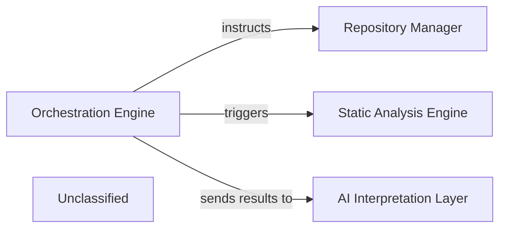

## Details

The system is orchestrated by the Orchestration Engine, which serves as the central control for the entire analysis and documentation generation workflow. It directs the Repository Manager to handle code repository interactions, ensuring the necessary source code is available. For code quality and structural insights, the Orchestration Engine triggers the Static Analysis Engine to perform detailed code analysis. The results from these processes are then forwarded by the Orchestration Engine to the AI Interpretation Layer, which processes and interprets the data, potentially leveraging AI models, to generate comprehensive documentation and insights. This architecture ensures a streamlined flow from code acquisition and analysis to intelligent interpretation and output generation.

### Orchestration Engine [[Expand]](./Orchestration_Engine.md)
The central coordinator of the analysis and documentation generation pipeline.

**Related Classes/Methods**:

- <a href="https://github.com/CodeBoarding/CodeBoarding/blob/main/.codeboardingagents/__init__.py" target="_blank" rel="noopener noreferrer">`agents`</a>

### Repository Manager [[Expand]](./Repository_Manager.md)
Manages interactions with code repositories.

**Related Classes/Methods**:

- <a href="https://github.com/CodeBoarding/CodeBoarding/blob/main/.codeboardingrepo_utils/__init__.py" target="_blank" rel="noopener noreferrer">`repo_utils`</a>

### Static Analysis Engine [[Expand]](./Static_Analysis_Engine.md)
Performs static code analysis.

**Related Classes/Methods**:

- <a href="https://github.com/CodeBoarding/CodeBoarding/blob/main/.codeboardingstatic_analyzer/__init__.py" target="_blank" rel="noopener noreferrer">`static_analyzer`</a>

### AI Interpretation Layer [[Expand]](./AI_Interpretation_Layer.md)
Processes and interprets data, potentially using AI models, to generate meaningful outputs.

**Related Classes/Methods**:

- <a href="https://github.com/CodeBoarding/CodeBoarding/blob/main/.codeboardingoutput_generators/__init__.py" target="_blank" rel="noopener noreferrer">`output_generators`</a>

### Unclassified
Component for all unclassified files and utility functions (Utility functions/External Libraries/Dependencies)

**Related Classes/Methods**: _None_

### [FAQ](https://github.com/CodeBoarding/GeneratedOnBoardings/tree/main?tab=readme-ov-file#faq)
