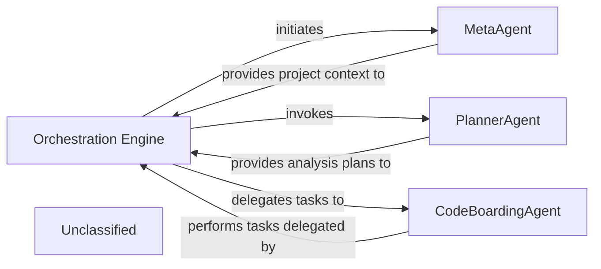

## Details

The CodeBoarding system is orchestrated by the `Orchestration Engine`, which acts as the central control unit for the entire code analysis and documentation generation pipeline. It initiates the process by interacting with the `MetaAgent` to gather architectural context and project metadata. Subsequently, it invokes the `PlannerAgent` to generate a structured plan for analyzing various components of the codebase. The `Orchestration Engine` then delegates specific analysis and execution tasks to the `CodeBoardingAgent`, which serves as a foundational worker agent. The `CodeBoardingAgent` provides core capabilities such as interacting with Large Language Models (LLMs), accessing various tools for reading source code, file structures, and Control Flow Graphs (CFGs), and handling robust invocation mechanisms with error handling. This collaborative interaction between the `Orchestration Engine` and its specialized agents ensures a comprehensive and structured approach to code analysis and documentation.

### Orchestration Engine [[Expand]](./Orchestration_Engine.md)
The central control unit managing the entire code analysis and documentation generation pipeline. It coordinates the execution flow, from static analysis to AI interpretation and final output generation, primarily by delegating to the `CodeBoardingAgent`. It now also integrates the `ValidatorAgent` into its workflow for post-processing validation.

**Related Classes/Methods**:

- <a href="https://github.com/CodeBoarding/CodeBoarding/blob/main/.codeboardingagents/meta_agent.py#L15-L39" target="_blank" rel="noopener noreferrer">`agents.meta_agent.MetaAgent`:15-39</a>
- <a href="https://github.com/CodeBoarding/CodeBoarding/blob/main/.codeboardingagents/planner_agent.py#L12-L32" target="_blank" rel="noopener noreferrer">`agents.planner_agent.PlannerAgent`:12-32</a>
- <a href="https://github.com/CodeBoarding/CodeBoarding/blob/main/.codeboardingagents/agent.py#L35-L329" target="_blank" rel="noopener noreferrer">`agents.agent.CodeBoardingAgent`:35-329</a>

### MetaAgent
Responsible for analyzing project metadata to establish architectural context and bias, supplying foundational understanding to initiate the analysis pipeline.

**Related Classes/Methods**:

- <a href="https://github.com/CodeBoarding/CodeBoarding/blob/main/.codeboardingagents/meta_agent.py#L15-L39" target="_blank" rel="noopener noreferrer">`agents.meta_agent.MetaAgent`:15-39</a>

### PlannerAgent
Generates a structured plan for analyzing components, serving as the strategic planning unit for the `Orchestration Engine` to determine the sequence and scope of subsequent analysis tasks.

**Related Classes/Methods**:

- <a href="https://github.com/CodeBoarding/CodeBoarding/blob/main/.codeboardingagents/planner_agent.py#L12-L32" target="_blank" rel="noopener noreferrer">`agents.planner_agent.PlannerAgent`:12-32</a>

### CodeBoardingAgent
A foundational agent providing core capabilities such as LLM interaction, tool access (e.g., reading source code, file structure, CFG), and robust invocation mechanisms with error handling. It acts as a base worker agent or a toolkit provider that the `Orchestration Engine` delegates specific execution tasks to, or that other specialized agents extend or compose.

**Related Classes/Methods**:

- <a href="https://github.com/CodeBoarding/CodeBoarding/blob/main/.codeboardingagents/agent.py#L35-L329" target="_blank" rel="noopener noreferrer">`agents.agent.CodeBoardingAgent`:35-329</a>

### Unclassified
Component for all unclassified files and utility functions (Utility functions/External Libraries/Dependencies)

**Related Classes/Methods**: _None_

### [FAQ](https://github.com/CodeBoarding/GeneratedOnBoardings/tree/main?tab=readme-ov-file#faq)
