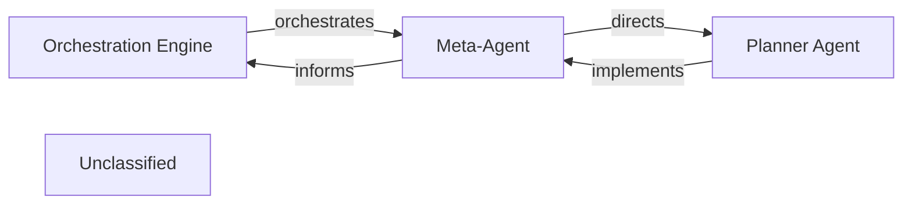

## Details

The Orchestration Engine serves as the central control point, initiating and overseeing the entire code analysis and documentation generation process. It delegates strategic planning to the Meta-Agent, which defines high-level goals and approaches. The Meta-Agent then directs the Planner Agent to translate these strategies into concrete, executable tasks. The Planner Agent is responsible for the tactical execution, reporting its progress and outcomes back to the Meta-Agent, which in turn provides updates to the Orchestration Engine. This hierarchical delegation ensures a clear separation of concerns, with the Orchestration Engine managing the overall workflow, the Meta-Agent handling strategic decisions, and the Planner Agent focusing on tactical execution.

### Orchestration Engine [[Expand]](./Orchestration_Engine.md)
The central control unit managing the entire code analysis and documentation generation pipeline. It defines and executes the end-to-end analysis workflow, coordinates specialized components, manages data flow, dynamically adjusts the analysis plan, and oversees the job lifecycle. It delegates the strategic and tactical planning to dedicated agents.

**Related Classes/Methods**:

- `conceptual.OrchestrationLogic`

### Meta-Agent
Embodies higher-level strategic decision-making within the Orchestration Engine. It is responsible for understanding overall analysis goals, defining the broad strategy, and selecting appropriate high-level analysis playbooks. It acts as the 'brain' that determines what needs to be done at a strategic level.

**Related Classes/Methods**:

- <a href="https://github.com/CodeBoarding/CodeBoarding/blob/main/.codeboardingagents/meta_agent.py" target="_blank" rel="noopener noreferrer">`agents.meta_agent`</a>

### Planner Agent
Translates strategic directives from the Meta-Agent into concrete, executable steps. It breaks down complex analysis tasks, identifies specific tools or services required for each step, and manages the tactical execution flow. It acts as the 'executor' that determines how to achieve the strategic goals.

**Related Classes/Methods**:

- <a href="https://github.com/CodeBoarding/CodeBoarding/blob/main/.codeboardingagents/planner_agent.py" target="_blank" rel="noopener noreferrer">`agents.planner_agent`</a>

### Unclassified
Component for all unclassified files and utility functions (Utility functions/External Libraries/Dependencies)

**Related Classes/Methods**: _None_

### [FAQ](https://github.com/CodeBoarding/GeneratedOnBoardings/tree/main?tab=readme-ov-file#faq)
