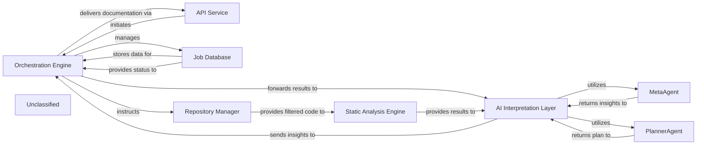

## Details

The system's architecture is centered around an `Orchestration Engine` that manages the entire code analysis and documentation generation workflow. It interfaces with an `API Service` for job initiation and delivery, and a `Job Database` for status management. Code acquisition and filtering are handled by the `Repository Manager`, which then feeds into the `Static Analysis Engine` for initial code analysis. The core intelligence resides in the `AI Interpretation Layer`, which, leveraging a recently updated agent framework, employs specialized `MetaAgent` and `PlannerAgent` components to derive architectural insights and strategic analysis plans from the static analysis results. These insights are then relayed back to the `Orchestration Engine` for final documentation generation and delivery.

### Orchestration Engine [[Expand]](./Orchestration_Engine.md)
The central control unit managing the entire code analysis and documentation generation pipeline. It coordinates the execution flow, from static analysis to AI interpretation and final output generation.

**Related Classes/Methods**:

### API Service
Handles external job requests and delivers final documentation.

**Related Classes/Methods**:

- `API Service`

### Job Database
Stores and manages job status and metadata.

**Related Classes/Methods**:

- `Job Database`

### Repository Manager
Responsible for fetching code from repositories and managing file and directory exclusions based on `.gitignore` patterns and default ignored paths.

**Related Classes/Methods**:

- `Repository Manager`:1-10

### Static Analysis Engine [[Expand]](./Static_Analysis_Engine.md)
Performs static analysis on the provided code, receiving a filtered set of files from the Repository Manager.

**Related Classes/Methods**:

- `Static Analysis Engine`:1-10

### AI Interpretation Layer
Interprets static analysis results and generates insights, encompassing specialized agents like `MetaAgent` and `PlannerAgent`. This layer is now built upon a significantly modified agent framework, impacting the internal workings and interactions of its constituent agents.

**Related Classes/Methods**:

- <a href="https://github.com/CodeBoarding/CodeBoarding/blob/main/.codeboardingagents/agent.py" target="_blank" rel="noopener noreferrer">`AI Interpretation Layer`</a>

### MetaAgent
Analyzes project-level metadata to extract high-level architectural context, project type, domain, and technological biases, guiding subsequent analysis and interpretation. Its behavior is now influenced by the updated agent framework in `agents/agent.py`.

**Related Classes/Methods**:

- <a href="https://github.com/CodeBoarding/CodeBoarding/blob/main/.codeboardingagents/agent.py" target="_blank" rel="noopener noreferrer">`MetaAgent`</a>

### PlannerAgent
Generates a strategic plan for deeper code analysis based on initial analysis and metadata, identifying key components for detailed examination and determining their expansion scope. Its design and behavior are now influenced by the updated agent framework in `agents/agent.py`.

**Related Classes/Methods**:

- <a href="https://github.com/CodeBoarding/CodeBoarding/blob/main/.codeboardingagents/agent.py" target="_blank" rel="noopener noreferrer">`PlannerAgent`</a>

### Unclassified
Component for all unclassified files and utility functions (Utility functions/External Libraries/Dependencies)

**Related Classes/Methods**: _None_

### [FAQ](https://github.com/CodeBoarding/GeneratedOnBoardings/tree/main?tab=readme-ov-file#faq)
