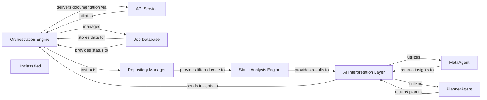

## Details

The system operates with the Orchestration Engine at its core, initiating processes via the API Service and managing job states through the Job Database. The Repository Manager fetches and filters code, which is then passed to the Static Analysis Engine. This engine, now enhanced with advanced reference resolution capabilities, performs detailed code analysis. The results are then forwarded to the AI Interpretation Layer, where specialized agents like MetaAgent and PlannerAgent, supported by refined validation mechanisms from the ValidatorAgent, generate architectural insights and strategic analysis plans. Finally, these insights are returned to the Orchestration Engine for documentation delivery via the API Service.

### Orchestration Engine [[Expand]](./Orchestration_Engine.md)
The central control unit managing the entire code analysis and documentation generation pipeline. It coordinates the execution flow, from static analysis to AI interpretation and final output generation.

**Related Classes/Methods**:

- `Orchestration Engine`:1-10

### API Service
Handles external job requests and delivers final documentation.

**Related Classes/Methods**:

- `API Service`:1-10

### Job Database
Stores and manages job status and metadata.

**Related Classes/Methods**:

- `Job Database`

### Repository Manager
Responsible for fetching code from repositories and managing file and directory exclusions based on `.gitignore` patterns and default ignored paths.

**Related Classes/Methods**:

- `Repository Manager`

### Static Analysis Engine [[Expand]](./Static_Analysis_Engine.md)
Performs static analysis on the provided code, receiving a filtered set of files from the Repository Manager. It now includes enhanced capabilities for resolving code references, significantly improving its ability to understand code relationships through the integration of components like `reference_resolve_mixin`.

**Related Classes/Methods**:

- <a href="https://github.com/CodeBoarding/CodeBoarding/blob/main/.codeboardingstatic_analyzer/reference_resolve_mixin.py" target="_blank" rel="noopener noreferrer">`reference_resolve_mixin`</a>

### AI Interpretation Layer
Interprets static analysis results and generates insights, encompassing specialized agents like `MetaAgent`, `PlannerAgent`, and `ValidatorAgent`. This layer is built upon a modified agent framework, now featuring refined validation mechanisms that enhance the accuracy and robustness of its insights.

**Related Classes/Methods**:

- <a href="https://github.com/CodeBoarding/CodeBoarding/blob/main/.codeboardingagents/agent.py" target="_blank" rel="noopener noreferrer">`AI Interpretation Layer`</a>
- <a href="https://github.com/CodeBoarding/CodeBoarding/blob/main/.codeboardingagents/validator_agent.py" target="_blank" rel="noopener noreferrer">`ValidatorAgent`</a>

### MetaAgent
Analyzes project-level metadata to extract high-level architectural context, project type, domain, and technological biases, guiding subsequent analysis and interpretation. Its behavior is now influenced by the updated agent framework in `agents/agent.py` and benefits from the refined validation capabilities within the `AI Interpretation Layer`.

**Related Classes/Methods**:

- <a href="https://github.com/CodeBoarding/CodeBoarding/blob/main/.codeboardingagents/agent.py" target="_blank" rel="noopener noreferrer">`MetaAgent`</a>

### PlannerAgent
Generates a strategic plan for deeper code analysis based on initial analysis and metadata, identifying key components for detailed examination and determining their expansion scope. Its design and behavior are now influenced by the updated agent framework in `agents/agent.py` and benefits from the refined validation capabilities within the `AI Interpretation Layer`.

**Related Classes/Methods**:

- <a href="https://github.com/CodeBoarding/CodeBoarding/blob/main/.codeboardingagents/agent.py" target="_blank" rel="noopener noreferrer">`PlannerAgent`</a>

### Unclassified
Component for all unclassified files and utility functions (Utility functions/External Libraries/Dependencies)

**Related Classes/Methods**: _None_

### [FAQ](https://github.com/CodeBoarding/GeneratedOnBoardings/tree/main?tab=readme-ov-file#faq)
