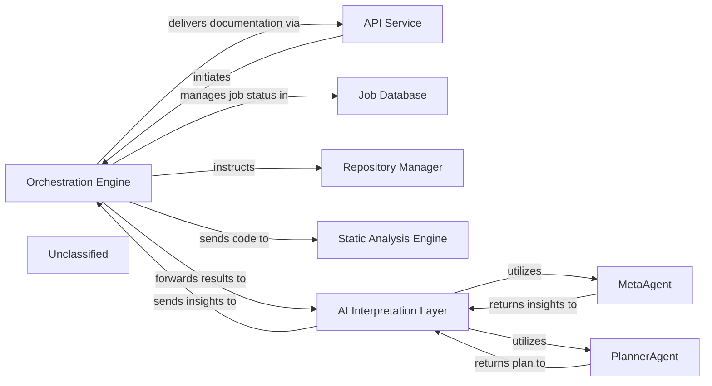

## Details

The system is designed around a central `Orchestration Engine` that drives the entire code analysis and documentation generation workflow. External requests are handled by the `API Service`, which initiates jobs within the `Orchestration Engine`. The `Orchestration Engine` first leverages the `Repository Manager` to acquire the target codebase and then dispatches it to the `Static Analysis Engine` for initial processing. The results are then fed into the `AI Interpretation Layer`, an intelligent component that utilizes specialized `MetaAgent` and `PlannerAgent` sub-components to derive architectural insights and formulate a detailed analysis strategy. Throughout this pipeline, the `Job Database` maintains a persistent record of job statuses and metadata. Upon completion, the `Orchestration Engine` compiles the final documentation and delivers it back through the `API Service`, providing a comprehensive and automated solution for understanding and documenting software projects.

### Orchestration Engine [[Expand]](./Orchestration_Engine.md)
The central control unit managing the entire code analysis and documentation generation pipeline. It coordinates the execution flow, from static analysis to AI interpretation and final output generation.

**Related Classes/Methods**:

- <a href="https://github.com/CodeBoarding/CodeBoarding/blob/main/.codeboardingmain.py#L55-L72" target="_blank" rel="noopener noreferrer">`main.generate_analysis`:55-72</a>

### API Service
Handles external job requests and delivers final documentation.

**Related Classes/Methods**:

- <a href="https://github.com/CodeBoarding/CodeBoarding/blob/main/.codeboardinglocal_app.py" target="_blank" rel="noopener noreferrer">`local_app.start_generation_job`</a>

### Job Database
Stores and manages job status and metadata.

**Related Classes/Methods**:

- <a href="https://github.com/CodeBoarding/CodeBoarding/blob/main/.codeboardingduckdb_crud.py" target="_blank" rel="noopener noreferrer">`duckdb_crud.update_job`</a>

### Repository Manager
Responsible for fetching code from repositories.

**Related Classes/Methods**:

- <a href="https://github.com/CodeBoarding/CodeBoarding/blob/main/.codeboardingrepo_utils/__init__.py" target="_blank" rel="noopener noreferrer">`repo_utils.clone_repository`</a>

### Static Analysis Engine [[Expand]](./Static_Analysis_Engine.md)
Performs static analysis on the provided code.

**Related Classes/Methods**:

- <a href="https://github.com/CodeBoarding/CodeBoarding/blob/main/.codeboardingstatic_analyzer/scanner.py" target="_blank" rel="noopener noreferrer">`static_analyzer.scanner.StaticAnalysisEngine.analyze_code`</a>

### AI Interpretation Layer
Interprets static analysis results and generates insights, encompassing specialized agents like MetaAgent and PlannerAgent. This layer is orchestrated by the `DiagramGenerator`.

**Related Classes/Methods**:

- <a href="https://github.com/CodeBoarding/CodeBoarding/blob/main/.codeboardingdiagram_analysis/diagram_generator.py" target="_blank" rel="noopener noreferrer">`diagram_analysis.diagram_generator.DiagramGenerator.generate_analysis`</a>

### MetaAgent
Analyzes project-level metadata to extract high-level architectural context, project type, domain, and technological biases, guiding subsequent analysis and interpretation.

**Related Classes/Methods**:

- <a href="https://github.com/CodeBoarding/CodeBoarding/blob/main/.codeboardingagents/meta_agent.py#L31-L40" target="_blank" rel="noopener noreferrer">`agents.meta_agent.MetaAgent.analyze_metadata`:31-40</a>

### PlannerAgent
Generates a strategic plan for deeper code analysis based on initial analysis and metadata, identifying key components for detailed examination and determining their expansion scope.

**Related Classes/Methods**:

- <a href="https://github.com/CodeBoarding/CodeBoarding/blob/main/.codeboardingagents/planner_agent.py#L22-L33" target="_blank" rel="noopener noreferrer">`agents.planner_agent.PlannerAgent.generate_plan`:22-33</a>

### Unclassified
Component for all unclassified files and utility functions (Utility functions/External Libraries/Dependencies)

**Related Classes/Methods**: _None_

### [FAQ](https://github.com/CodeBoarding/GeneratedOnBoardings/tree/main?tab=readme-ov-file#faq)
