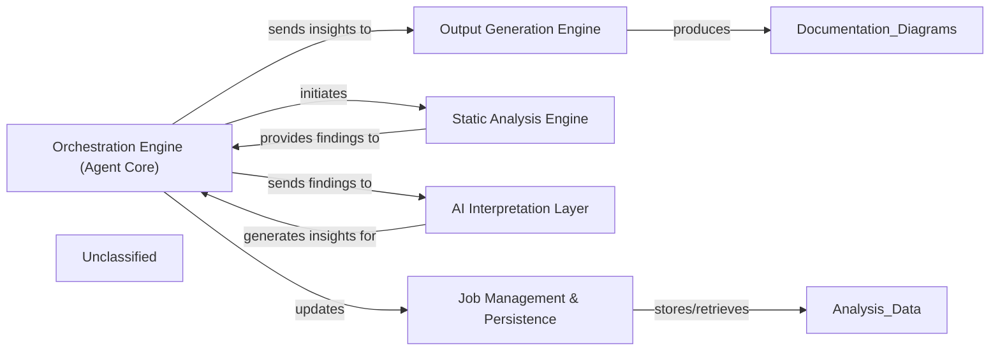

## Details

The system operates around a central Orchestration Engine (Agent Core), embodied by `agents.meta_agent.MetaAgent`, which directs the entire code analysis and documentation generation process. This engine initiates the Static Analysis Engine (`static_analyzer.scanner.Scanner`) to extract raw code findings. These findings are then passed back to the Orchestration Engine, which subsequently dispatches them to the AI Interpretation Layer (`agents.abstraction_agent.AbstractionAgent`). This layer leverages AI to transform raw data into meaningful architectural insights. The interpreted insights are returned to the Orchestration Engine, which then feeds them into the Output Generation Engine (`output_generators.markdown.MarkdownOutputGenerator`) to produce various documentation and diagram formats. Throughout this workflow, the Job Management & Persistence component (`duckdb_crud.DuckDBCRUD`) is responsible for maintaining the state of analysis jobs and persisting all relevant data, ensuring continuity and retrievability of results.

### Orchestration Engine (Agent Core) [[Expand]](./Orchestration_Engine_Agent_Core_.md)
The central control unit that manages the entire analysis workflow. It initiates, sequences, and manages the end-to-end code analysis and documentation generation workflow, orchestrating the execution of distinct analysis stages, maintaining the current state and progress of each analysis job, and managing data transfer between components.

**Related Classes/Methods**:

- <a href="https://github.com/CodeBoarding/CodeBoarding/blob/main/.codeboardingagents/meta_agent.py" target="_blank" rel="noopener noreferrer">`agents.meta_agent.MetaAgent`</a>

### Job Management & Persistence
Manages the lifecycle and state of analysis jobs, including their initiation, progress tracking, and the storage of results. It acts as the system's memory for ongoing and completed analysis tasks.

**Related Classes/Methods**:

- <a href="https://github.com/CodeBoarding/CodeBoarding/blob/main/.codeboardingduckdb_crud.py" target="_blank" rel="noopener noreferrer">`duckdb_crud.DuckDBCRUD`</a>

### Static Analysis Engine [[Expand]](./Static_Analysis_Engine.md)
Performs in-depth static code analysis on the provided codebase, extracting structural, syntactical, and semantic information without executing the code. It provides raw findings to the Orchestration Engine.

**Related Classes/Methods**:

- <a href="https://github.com/CodeBoarding/CodeBoarding/blob/main/.codeboardingstatic_analyzer/scanner.py" target="_blank" rel="noopener noreferrer">`static_analyzer.scanner.Scanner`</a>

### AI Interpretation Layer [[Expand]](./AI_Interpretation_Layer.md)
Utilizes AI/LLMs to process and interpret the raw findings from the Static Analysis Engine, transforming them into higher-level architectural insights, relationships, and contextual understanding.

**Related Classes/Methods**:

- <a href="https://github.com/CodeBoarding/CodeBoarding/blob/main/.codeboardingagents/abstraction_agent.py" target="_blank" rel="noopener noreferrer">`agents.abstraction_agent.AbstractionAgent`</a>

### Output Generation Engine [[Expand]](./Output_Generation_Engine.md)
Responsible for transforming the architectural insights into various consumable output formats, such as architectural diagrams (e.g., Mermaid.js), documentation, or reports.

**Related Classes/Methods**:

- <a href="https://github.com/CodeBoarding/CodeBoarding/blob/main/.codeboardingoutput_generators/markdown.py" target="_blank" rel="noopener noreferrer">`output_generators.markdown.MarkdownOutputGenerator`</a>

### Unclassified
Component for all unclassified files and utility functions (Utility functions/External Libraries/Dependencies)

**Related Classes/Methods**: _None_

### [FAQ](https://github.com/CodeBoarding/GeneratedOnBoardings/tree/main?tab=readme-ov-file#faq)
