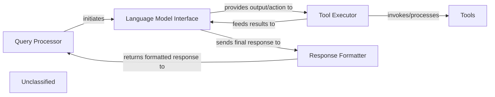

## Details

The system is structured around a core agentic loop, starting with the `Query Processor` which handles user input and orchestrates the overall flow. It passes the query to the `Language Model Interface`, responsible for interacting with the underlying LLM. The LLM's output, which may include a decision to use external capabilities, is then directed to the `Tool Executor`. This component is central to the system's extensibility, managing the invocation of various `Tools` and processing their outcomes. Recent modifications in `agents/agent.py` highlight ongoing enhancements to the `Tool Executor`'s logic, improving how tools are executed and their results handled. After tool execution, results are fed back to the `Language Model Interface` for further reasoning or to generate a conclusive response. Finally, the `Response Formatter` synthesizes and formats the LLM's output into a user-friendly message, which is then returned via the `Query Processor`. This architecture ensures a clear separation of concerns, enabling flexible interaction with LLMs and external tools.

### Query Processor
Handles user input and orchestrates the overall flow.

**Related Classes/Methods**:

- `QueryProcessor`:1-10

### Language Model Interface
Responsible for interacting with the underlying LLM.

**Related Classes/Methods**:

- `LanguageModelInterface`:1-10

### Tool Executor
Manages the invocation of various `Tools` and processing their outcomes. Recent modifications in `agents/agent.py` highlight ongoing enhancements to the `Tool Executor`'s logic, improving how tools are executed and their results handled.

**Related Classes/Methods**:

- <a href="https://github.com/CodeBoarding/CodeBoarding/blob/main/.codeboardingagents/agent.py" target="_blank" rel="noopener noreferrer">`ToolExecutor`</a>

### Tools
External functionalities invoked by the Tool Executor.

**Related Classes/Methods**:

- <a href="https://github.com/CodeBoarding/CodeBoarding/blob/main/.codeboardingagents/diff_analyzer.py" target="_blank" rel="noopener noreferrer">`Tool`</a>

### Response Formatter
Synthesizes and formats the LLM's output into a user-friendly message.

**Related Classes/Methods**:

### Unclassified
Component for all unclassified files and utility functions (Utility functions/External Libraries/Dependencies)

**Related Classes/Methods**: _None_

### [FAQ](https://github.com/CodeBoarding/GeneratedOnBoardings/tree/main?tab=readme-ov-file#faq)
