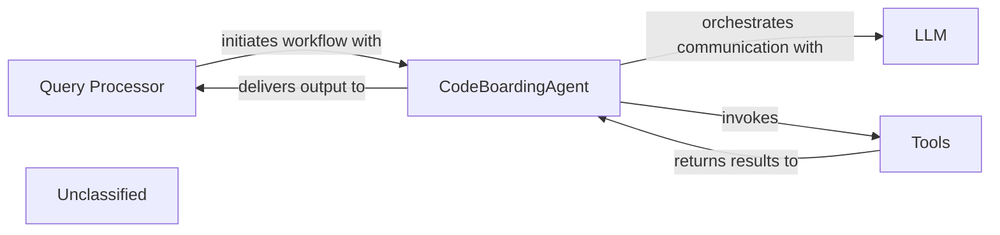

## Details

The system's architecture is centered around the `CodeBoardingAgent`, which acts as the intelligent core for processing user queries. The `Query Processor` initiates the workflow by forwarding user requests to the `CodeBoardingAgent`. The `CodeBoardingAgent` then orchestrates complex interactions with a Large Language Model (LLM) and a suite of specialized `Tools`. It dynamically selects and invokes these `Tools` to gather necessary information and perform static code analysis. After receiving results from the `Tools` and further refining its understanding with the LLM, the `CodeBoardingAgent` is responsible for parsing and formatting the final response, which is then delivered back to the `Query Processor` for presentation to the user. This design ensures a clear separation of concerns, with the `CodeBoardingAgent` managing the intelligent reasoning and execution, while `Tools` provide specific functionalities and the `Query Processor` handles user interaction.

### Query Processor
Manages user interactions and initiates the overall workflow.

**Related Classes/Methods**:

- `QueryProcessor.handle_request`:10-20

### CodeBoardingAgent
Serves as the central orchestrator, managing communication with the Large Language Model (LLM), directing the invocation of specialized tools, and processing/formatting the LLM's output. It embodies the core logic for intelligent reasoning and task execution.

**Related Classes/Methods**:

- <a href="https://github.com/CodeBoarding/CodeBoarding/blob/main/.codeboardingagents/agent.py#L155-L191" target="_blank" rel="noopener noreferrer">`agents.agent.CodeBoardingAgent._invoke`:155-191</a>
- <a href="https://github.com/CodeBoarding/CodeBoarding/blob/main/.codeboardingagents/agent.py#L198-L224" target="_blank" rel="noopener noreferrer">`agents.agent.CodeBoardingAgent._parse_response`:198-224</a>

### Tools
A collection of specialized utilities that execute advanced static code analysis and data retrieval. These tools perform advanced information gathering and static analysis as directed by the `CodeBoardingAgent`.

**Related Classes/Methods**:

- <a href="https://github.com/CodeBoarding/CodeBoarding/blob/main/.codeboarding." target="_blank" rel="noopener noreferrer">`Tools.read_tools`</a>
- `Tools.lsp_client`

### Unclassified
Component for all unclassified files and utility functions (Utility functions/External Libraries/Dependencies)

**Related Classes/Methods**: _None_

### [FAQ](https://github.com/CodeBoarding/GeneratedOnBoardings/tree/main?tab=readme-ov-file#faq)
