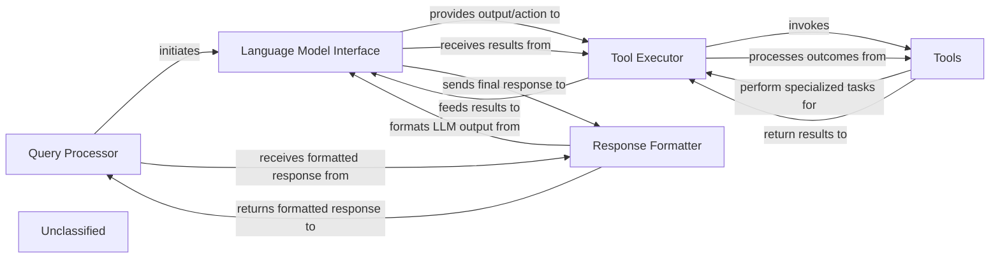

## Details

The system's architecture is centered around a `Query Processor` that manages user interactions and orchestrates the overall workflow. It communicates with a `Language Model Interface` to leverage the capabilities of an underlying Large Language Model. For specialized tasks, the `Language Model Interface` directs the `Tool Executor` to invoke various `Tools`, including a newly enhanced `Static Analyzer` for in-depth code analysis. After processing, the `Tool Executor` returns results to the `Language Model Interface`. Finally, the `Response Formatter` takes the LLM's output and formats it into a user-friendly message, which is then delivered back to the `Query Processor`. This design ensures a clear separation of concerns, allowing for flexible integration of new tools and output formats.

### Query Processor
Manages user interactions and orchestrates the overall workflow, initiating communication with the language model and receiving formatted responses.

**Related Classes/Methods**:

- `query_processor.QueryProcessor`:1-10

### Language Model Interface
Facilitates communication with the underlying Large Language Model, providing output/actions to the Tool Executor and receiving results.

**Related Classes/Methods**:

- `language_model_interface.LanguageModelInterface`:1-10

### Tool Executor
Directs the invocation of various tools, processes their outcomes, and feeds results back to the Language Model Interface.

**Related Classes/Methods**:

- `tool_executor.ToolExecutor`:1-10

### Tools
A collection of specialized functionalities that perform tasks for the Tool Executor, including static code analysis.

**Related Classes/Methods**:

- <a href="https://github.com/CodeBoarding/CodeBoarding/blob/main/.codeboardingstatic_analyzer/programming_language.py" target="_blank" rel="noopener noreferrer">`static_analyzer.programming_language`</a>
- <a href="https://github.com/CodeBoarding/CodeBoarding/blob/main/.codeboardingstatic_analyzer/scanner.py" target="_blank" rel="noopener noreferrer">`static_analyzer.scanner`</a>
- <a href="https://github.com/CodeBoarding/CodeBoarding/blob/main/.codeboardingstatic_analyzer/lsp_client" target="_blank" rel="noopener noreferrer">`static_analyzer.lsp_client`</a>

### Response Formatter
Takes the LLM's output and formats it into a user-friendly message in various formats.

**Related Classes/Methods**:

- <a href="https://github.com/CodeBoarding/CodeBoarding/blob/main/.codeboardingoutput_generators/html.py" target="_blank" rel="noopener noreferrer">`output_generators.html`</a>
- <a href="https://github.com/CodeBoarding/CodeBoarding/blob/main/.codeboardingoutput_generators/markdown.py" target="_blank" rel="noopener noreferrer">`output_generators.markdown`</a>
- <a href="https://github.com/CodeBoarding/CodeBoarding/blob/main/.codeboardingoutput_generators/mdx.py" target="_blank" rel="noopener noreferrer">`output_generators.mdx`</a>
- <a href="https://github.com/CodeBoarding/CodeBoarding/blob/main/.codeboardingoutput_generators/sphinx.py" target="_blank" rel="noopener noreferrer">`output_generators.sphinx`</a>

### Unclassified
Component for all unclassified files and utility functions (Utility functions/External Libraries/Dependencies)

**Related Classes/Methods**: _None_

### [FAQ](https://github.com/CodeBoarding/GeneratedOnBoardings/tree/main?tab=readme-ov-file#faq)
