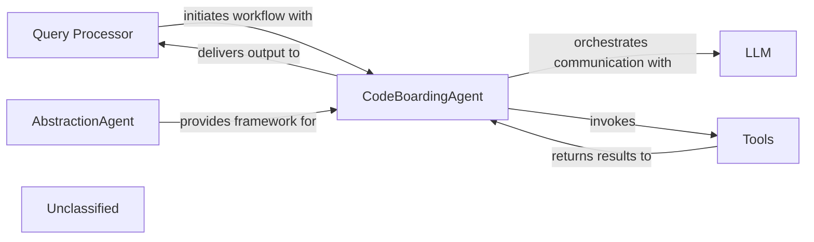

## Details

The system is designed around a reactive agent architecture, with the Query Processor serving as the initial interface for user requests. These requests are then managed by the CodeBoardingAgent, which acts as the central orchestrator. The CodeBoardingAgent leverages an external Large Language Model for intelligent reasoning and decision-making, and it dynamically invokes various Tools to perform specialized static code analysis and data retrieval. The recent introduction of an AbstractionAgent component suggests an evolving design pattern, where CodeBoardingAgent may become a concrete implementation, benefiting from a more generalized and extensible agent framework. This architecture ensures a clear separation of concerns, allowing for flexible interaction with external AI models and robust internal analysis capabilities.

### Query Processor
Manages user interactions and initiates the overall workflow.

**Related Classes/Methods**:

- `QueryProcessor.handle_request`:10-20

### AbstractionAgent
Likely introduces a new abstract base class for agents, providing a generalized framework for agent design.

**Related Classes/Methods**:

- <a href="https://github.com/CodeBoarding/CodeBoarding/blob/main/.codeboardingagents/abstraction_agent.py#L31-L197" target="_blank" rel="noopener noreferrer">`AbstractionAgent`:31-197</a>

### CodeBoardingAgent
Serves as the central orchestrator, managing communication with the Large Language Model (LLM), directing the invocation of specialized tools, and processing/formatting the LLM's output. It embodies the core logic for intelligent reasoning and task execution and may be a concrete implementation of AbstractionAgent.

**Related Classes/Methods**:

- <a href="https://github.com/CodeBoarding/CodeBoarding/blob/main/.codeboardingagents/agent.py#L155-L191" target="_blank" rel="noopener noreferrer">`agents.agent.CodeBoardingAgent._invoke`:155-191</a>
- <a href="https://github.com/CodeBoarding/CodeBoarding/blob/main/.codeboardingagents/agent.py#L198-L224" target="_blank" rel="noopener noreferrer">`agents.agent.CodeBoardingAgent._parse_response`:198-224</a>

### Tools
A collection of specialized utilities that execute advanced static code analysis and data retrieval. These tools perform advanced information gathering and static analysis as directed by the CodeBoardingAgent.

**Related Classes/Methods**:

- `Tools.read_tools`
- `Tools.lsp_client`:1-10

### Unclassified
Component for all unclassified files and utility functions.

**Related Classes/Methods**:

- `Unclassified`:1-10

### Unclassified
Component for all unclassified files and utility functions (Utility functions/External Libraries/Dependencies)

**Related Classes/Methods**: _None_

### [FAQ](https://github.com/CodeBoarding/GeneratedOnBoardings/tree/main?tab=readme-ov-file#faq)
