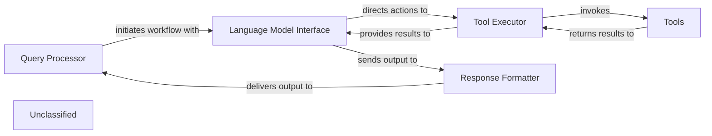

## Details

The system's architecture is designed around a Query Processor that manages user interactions and orchestrates the overall workflow. It interfaces with the Language Model Interface, which is responsible for communicating with the underlying Large Language Model and directing actions to the Tool Executor. A key strength of this architecture lies in its Tools component, which has been substantially enhanced to provide advanced information gathering, static code analysis, and LSP client interactions, significantly improving the system's analytical depth. The Tool Executor processes the rich data from these Tools and feeds it back to the Language Model Interface. Finally, the Response Formatter takes the LLM's output and transforms it into a user-friendly format, which is then returned to the Query Processor. This refined architecture underscores a robust and highly capable Tools component, driving a significant evolution in the system's ability to process and respond to complex queries.

### Query Processor
Manages user interactions and initiates the overall workflow.

**Related Classes/Methods**:

- `QueryProcessor.handle_request`:10-20

### Language Model Interface
Acts as the primary conduit to the Large Language Model (LLM), orchestrates communication with the LLM and directs necessary actions to the Tool Executor.

**Related Classes/Methods**:

- `LanguageModelInterface.communicate_with_llm`

### Tool Executor
Processes the outcomes from the Tools and feeds the enriched results back to the Language Model Interface. Directs invocation of Tools for specialized tasks.

**Related Classes/Methods**:

- `ToolExecutor.execute_tool`

### Tools
Has undergone substantial modifications to its `read_` tools and `lsp_client`. Executes advanced static code analysis and data retrieval. Performs advanced information gathering and static analysis.

**Related Classes/Methods**:

- `Tools.lsp_client`:1-10

### Response Formatter
Crafts a user-friendly message for the Query Processor. Formats LLM output.

**Related Classes/Methods**:

- `ResponseFormatter.format_response`:1-10

### Unclassified
Component for all unclassified files and utility functions (Utility functions/External Libraries/Dependencies)

**Related Classes/Methods**: _None_

### [FAQ](https://github.com/CodeBoarding/GeneratedOnBoardings/tree/main?tab=readme-ov-file#faq)
