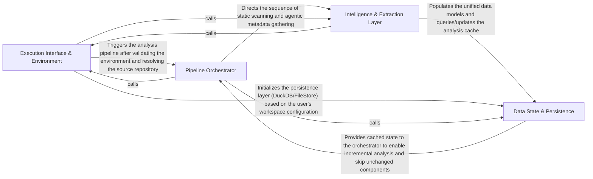

## Details

The central nervous system of the application. It handles CLI interactions, initializes the environment, manages the high-level execution sequence of the analysis pipeline, and coordinates between the repository and the analysis engines.

### Execution Interface & Environment
Handles the initial application bootstrap, CLI command parsing, and the setup of the physical/virtual workspace. It ensures that the target repository is available and that the necessary runtime dependencies (like Node.js or LSP servers) are correctly installed and mapped.

**Related Classes/Methods**:

- `codeboarding_cli.commands.full_analysis`
- `codeboarding_workflows.sources.local.local_source`:22-23
- `tool_registry.installers.install_tools`:440-462

**Source Files:**

- [`agents/change_status.py`](https://github.com/CodeBoarding/CodeBoarding/blob/main/.codeboardingagents/change_status.py)
  - `agents.change_status.ChangeStatus` ([L4-L9](https://github.com/CodeBoarding/CodeBoarding/blob/main/.codeboardingagents/change_status.py#L4-L9)) - Class
- [`codeboarding_cli/commands/full_analysis.py`](https://github.com/CodeBoarding/CodeBoarding/blob/main/.codeboardingcodeboarding_cli/commands/full_analysis.py)
  - `codeboarding_cli.commands.full_analysis.add_arguments` ([L23-L43](https://github.com/CodeBoarding/CodeBoarding/blob/main/.codeboardingcodeboarding_cli/commands/full_analysis.py#L23-L43)) - Function
  - `codeboarding_cli.commands.full_analysis.validate_arguments` ([L46-L59](https://github.com/CodeBoarding/CodeBoarding/blob/main/.codeboardingcodeboarding_cli/commands/full_analysis.py#L46-L59)) - Function
  - `codeboarding_cli.commands.full_analysis.run_from_args` ([L62-L68](https://github.com/CodeBoarding/CodeBoarding/blob/main/.codeboardingcodeboarding_cli/commands/full_analysis.py#L62-L68)) - Function
  - `codeboarding_cli.commands.full_analysis._run_local` ([L71-L105](https://github.com/CodeBoarding/CodeBoarding/blob/main/.codeboardingcodeboarding_cli/commands/full_analysis.py#L71-L105)) - Function
  - `codeboarding_cli.commands.full_analysis._run_remote` ([L108-L146](https://github.com/CodeBoarding/CodeBoarding/blob/main/.codeboardingcodeboarding_cli/commands/full_analysis.py#L108-L146)) - Function
  - `codeboarding_cli.commands.full_analysis._process_one_remote` ([L149-L197](https://github.com/CodeBoarding/CodeBoarding/blob/main/.codeboardingcodeboarding_cli/commands/full_analysis.py#L149-L197)) - Function
  - `codeboarding_cli.commands.full_analysis._process_one_remote.scope` ([L156-L191](https://github.com/CodeBoarding/CodeBoarding/blob/main/.codeboardingcodeboarding_cli/commands/full_analysis.py#L156-L191)) - Function
- [`codeboarding_workflows/orchestration.py`](https://github.com/CodeBoarding/CodeBoarding/blob/main/.codeboardingcodeboarding_workflows/orchestration.py)
  - `codeboarding_workflows.orchestration.run_analysis_pipeline` ([L25-L48](https://github.com/CodeBoarding/CodeBoarding/blob/main/.codeboardingcodeboarding_workflows/orchestration.py#L25-L48)) - Function
- [`codeboarding_workflows/rendering.py`](https://github.com/CodeBoarding/CodeBoarding/blob/main/.codeboardingcodeboarding_workflows/rendering.py)
  - `codeboarding_workflows.rendering.render_docs` ([L57-L92](https://github.com/CodeBoarding/CodeBoarding/blob/main/.codeboardingcodeboarding_workflows/rendering.py#L57-L92)) - Function
- [`codeboarding_workflows/sources/local.py`](https://github.com/CodeBoarding/CodeBoarding/blob/main/.codeboardingcodeboarding_workflows/sources/local.py)
  - `codeboarding_workflows.sources.local.SourceContext` ([L8-L18](https://github.com/CodeBoarding/CodeBoarding/blob/main/.codeboardingcodeboarding_workflows/sources/local.py#L8-L18)) - Class
  - `codeboarding_workflows.sources.local.local_source` ([L22-L23](https://github.com/CodeBoarding/CodeBoarding/blob/main/.codeboardingcodeboarding_workflows/sources/local.py#L22-L23)) - Function
- [`codeboarding_workflows/sources/remote.py`](https://github.com/CodeBoarding/CodeBoarding/blob/main/.codeboardingcodeboarding_workflows/sources/remote.py)
  - `codeboarding_workflows.sources.remote.onboarding_materials_exist` ([L18-L28](https://github.com/CodeBoarding/CodeBoarding/blob/main/.codeboardingcodeboarding_workflows/sources/remote.py#L18-L28)) - Function
  - `codeboarding_workflows.sources.remote.remote_source` ([L32-L71](https://github.com/CodeBoarding/CodeBoarding/blob/main/.codeboardingcodeboarding_workflows/sources/remote.py#L32-L71)) - Function
- [`constants.py`](https://github.com/CodeBoarding/CodeBoarding/blob/main/.codeboardingconstants.py)
  - `constants.AppConfig` ([L4-L8](https://github.com/CodeBoarding/CodeBoarding/blob/main/.codeboardingconstants.py#L4-L8)) - Class
- [`diagram_analysis/run_context.py`](https://github.com/CodeBoarding/CodeBoarding/blob/main/.codeboardingdiagram_analysis/run_context.py)
  - `diagram_analysis.run_context.RunContext` ([L13-L40](https://github.com/CodeBoarding/CodeBoarding/blob/main/.codeboardingdiagram_analysis/run_context.py#L13-L40)) - Class
  - `diagram_analysis.run_context.RunContext.resolve` ([L21-L36](https://github.com/CodeBoarding/CodeBoarding/blob/main/.codeboardingdiagram_analysis/run_context.py#L21-L36)) - Method
  - `diagram_analysis.run_context.RunContext.finalize` ([L38-L40](https://github.com/CodeBoarding/CodeBoarding/blob/main/.codeboardingdiagram_analysis/run_context.py#L38-L40)) - Method
- [`github_action.py`](https://github.com/CodeBoarding/CodeBoarding/blob/main/.codeboardinggithub_action.py)
  - `github_action.generate_markdown` ([L15-L29](https://github.com/CodeBoarding/CodeBoarding/blob/main/.codeboardinggithub_action.py#L15-L29)) - Function
  - `github_action.generate_html` ([L32-L41](https://github.com/CodeBoarding/CodeBoarding/blob/main/.codeboardinggithub_action.py#L32-L41)) - Function
  - `github_action.generate_mdx` ([L44-L58](https://github.com/CodeBoarding/CodeBoarding/blob/main/.codeboardinggithub_action.py#L44-L58)) - Function
  - `github_action.generate_rst` ([L61-L75](https://github.com/CodeBoarding/CodeBoarding/blob/main/.codeboardinggithub_action.py#L61-L75)) - Function
  - `github_action._seed_existing_analysis` ([L78-L84](https://github.com/CodeBoarding/CodeBoarding/blob/main/.codeboardinggithub_action.py#L78-L84)) - Function
  - `github_action.generate_analysis` ([L87-L130](https://github.com/CodeBoarding/CodeBoarding/blob/main/.codeboardinggithub_action.py#L87-L130)) - Function
- [`health/constants.py`](https://github.com/CodeBoarding/CodeBoarding/blob/main/.codeboardinghealth/constants.py)
  - `health.constants.HealthConfig` ([L4-L19](https://github.com/CodeBoarding/CodeBoarding/blob/main/.codeboardinghealth/constants.py#L4-L19)) - Class
- [`install.py`](https://github.com/CodeBoarding/CodeBoarding/blob/main/.codeboardinginstall.py)
  - `install.LanguageSupportCheck` ([L42-L58](https://github.com/CodeBoarding/CodeBoarding/blob/main/.codeboardinginstall.py#L42-L58)) - Class
  - `install.LanguageSupportCheck.evaluate` ([L50-L58](https://github.com/CodeBoarding/CodeBoarding/blob/main/.codeboardinginstall.py#L50-L58)) - Method
  - `install.check_npm` ([L61-L81](https://github.com/CodeBoarding/CodeBoarding/blob/main/.codeboardinginstall.py#L61-L81)) - Function
  - `install.bootstrapped_npm_cli_path` ([L84-L86](https://github.com/CodeBoarding/CodeBoarding/blob/main/.codeboardinginstall.py#L84-L86)) - Function
  - `install.extract_tarball_safely` ([L89-L97](https://github.com/CodeBoarding/CodeBoarding/blob/main/.codeboardinginstall.py#L89-L97)) - Function
  - `install.bootstrap_npm` ([L100-L149](https://github.com/CodeBoarding/CodeBoarding/blob/main/.codeboardinginstall.py#L100-L149)) - Function
  - `install.is_non_interactive_mode` ([L152-L158](https://github.com/CodeBoarding/CodeBoarding/blob/main/.codeboardinginstall.py#L152-L158)) - Function
  - `install.ensure_node_runtime` ([L161-L214](https://github.com/CodeBoarding/CodeBoarding/blob/main/.codeboardinginstall.py#L161-L214)) - Function
  - `install.resolve_missing_npm` ([L217-L242](https://github.com/CodeBoarding/CodeBoarding/blob/main/.codeboardinginstall.py#L217-L242)) - Function
  - `install.resolve_npm_availability` ([L245-L252](https://github.com/CodeBoarding/CodeBoarding/blob/main/.codeboardinginstall.py#L245-L252)) - Function
  - `install.parse_args` ([L255-L268](https://github.com/CodeBoarding/CodeBoarding/blob/main/.codeboardinginstall.py#L255-L268)) - Function
  - `install.get_platform_bin_dir` ([L271-L273](https://github.com/CodeBoarding/CodeBoarding/blob/main/.codeboardinginstall.py#L271-L273)) - Function
  - `install.install_node_servers` ([L276-L301](https://github.com/CodeBoarding/CodeBoarding/blob/main/.codeboardinginstall.py#L276-L301)) - Function
  - `install.BinaryStatus` ([L308-L313](https://github.com/CodeBoarding/CodeBoarding/blob/main/.codeboardinginstall.py#L308-L313)) - Class
  - `install.verify_binary` ([L316-L341](https://github.com/CodeBoarding/CodeBoarding/blob/main/.codeboardinginstall.py#L316-L341)) - Function
  - `install.install_vcpp_redistributable` ([L344-L411](https://github.com/CodeBoarding/CodeBoarding/blob/main/.codeboardinginstall.py#L344-L411)) - Function
  - `install.resolve_missing_vcpp` ([L414-L435](https://github.com/CodeBoarding/CodeBoarding/blob/main/.codeboardinginstall.py#L414-L435)) - Function
  - `install.download_binaries` ([L438-L477](https://github.com/CodeBoarding/CodeBoarding/blob/main/.codeboardinginstall.py#L438-L477)) - Function
  - `install.download_jdtls` ([L480-L488](https://github.com/CodeBoarding/CodeBoarding/blob/main/.codeboardinginstall.py#L480-L488)) - Function
  - `install.install_package_manager_lsp_servers` ([L491-L514](https://github.com/CodeBoarding/CodeBoarding/blob/main/.codeboardinginstall.py#L491-L514)) - Function
  - `install.install_pre_commit_hooks` ([L517-L552](https://github.com/CodeBoarding/CodeBoarding/blob/main/.codeboardinginstall.py#L517-L552)) - Function
  - `install._language_checks_from_registry` ([L555-L645](https://github.com/CodeBoarding/CodeBoarding/blob/main/.codeboardinginstall.py#L555-L645)) - Function
  - `install.print_language_support_summary` ([L648-L655](https://github.com/CodeBoarding/CodeBoarding/blob/main/.codeboardinginstall.py#L648-L655)) - Function
  - `install.ensure_tools` ([L658-L691](https://github.com/CodeBoarding/CodeBoarding/blob/main/.codeboardinginstall.py#L658-L691)) - Function
  - `install.run_install` ([L694-L741](https://github.com/CodeBoarding/CodeBoarding/blob/main/.codeboardinginstall.py#L694-L741)) - Function
  - `install.run_install.unified_progress` ([L726-L730](https://github.com/CodeBoarding/CodeBoarding/blob/main/.codeboardinginstall.py#L726-L730)) - Function
  - `install.main` ([L744-L769](https://github.com/CodeBoarding/CodeBoarding/blob/main/.codeboardinginstall.py#L744-L769)) - Function
- [`main.py`](https://github.com/CodeBoarding/CodeBoarding/blob/main/.codeboardingmain.py)
  - `main._build_shared_parser` ([L10-L27](https://github.com/CodeBoarding/CodeBoarding/blob/main/.codeboardingmain.py#L10-L27)) - Function
  - `main.build_parser` ([L30-L64](https://github.com/CodeBoarding/CodeBoarding/blob/main/.codeboardingmain.py#L30-L64)) - Function
  - `main._inject_default_subcommand` ([L67-L80](https://github.com/CodeBoarding/CodeBoarding/blob/main/.codeboardingmain.py#L67-L80)) - Function
  - `main.main` ([L83-L95](https://github.com/CodeBoarding/CodeBoarding/blob/main/.codeboardingmain.py#L83-L95)) - Function
- [`monitoring/context.py`](https://github.com/CodeBoarding/CodeBoarding/blob/main/.codeboardingmonitoring/context.py)
  - `monitoring.context.monitor_execution.DummyContext.step` ([L33-L34](https://github.com/CodeBoarding/CodeBoarding/blob/main/.codeboardingmonitoring/context.py#L33-L34)) - Method
  - `monitoring.context.monitor_execution.DummyContext.end_step` ([L36-L37](https://github.com/CodeBoarding/CodeBoarding/blob/main/.codeboardingmonitoring/context.py#L36-L37)) - Method
- [`monitoring/paths.py`](https://github.com/CodeBoarding/CodeBoarding/blob/main/.codeboardingmonitoring/paths.py)
  - `monitoring.paths.get_monitoring_base_dir` ([L7-L8](https://github.com/CodeBoarding/CodeBoarding/blob/main/.codeboardingmonitoring/paths.py#L7-L8)) - Function
  - `monitoring.paths.get_monitoring_run_dir` ([L11-L18](https://github.com/CodeBoarding/CodeBoarding/blob/main/.codeboardingmonitoring/paths.py#L11-L18)) - Function
  - `monitoring.paths.generate_log_path` ([L21-L23](https://github.com/CodeBoarding/CodeBoarding/blob/main/.codeboardingmonitoring/paths.py#L21-L23)) - Function
  - `monitoring.paths.get_latest_run_dir` ([L26-L46](https://github.com/CodeBoarding/CodeBoarding/blob/main/.codeboardingmonitoring/paths.py#L26-L46)) - Function
- [`repo_utils/__init__.py`](https://github.com/CodeBoarding/CodeBoarding/blob/main/.codeboardingrepo_utils/__init__.py)
  - `repo_utils.__init__.require_git_import` ([L30-L57](https://github.com/CodeBoarding/CodeBoarding/blob/main/.codeboardingrepo_utils/__init__.py#L30-L57)) - Function
  - `repo_utils.__init__.require_git_import.decorator` ([L37-L55](https://github.com/CodeBoarding/CodeBoarding/blob/main/.codeboardingrepo_utils/__init__.py#L37-L55)) - Function
  - `repo_utils.__init__.require_git_import.decorator.wrapper` ([L39-L53](https://github.com/CodeBoarding/CodeBoarding/blob/main/.codeboardingrepo_utils/__init__.py#L39-L53)) - Function
  - `repo_utils.__init__.sanitize_repo_url` ([L60-L74](https://github.com/CodeBoarding/CodeBoarding/blob/main/.codeboardingrepo_utils/__init__.py#L60-L74)) - Function
  - `repo_utils.__init__.remote_repo_exists` ([L78-L89](https://github.com/CodeBoarding/CodeBoarding/blob/main/.codeboardingrepo_utils/__init__.py#L78-L89)) - Function
  - `repo_utils.__init__.get_repo_name` ([L92-L96](https://github.com/CodeBoarding/CodeBoarding/blob/main/.codeboardingrepo_utils/__init__.py#L92-L96)) - Function
  - `repo_utils.__init__.clone_repository` ([L100-L122](https://github.com/CodeBoarding/CodeBoarding/blob/main/.codeboardingrepo_utils/__init__.py#L100-L122)) - Function
  - `repo_utils.__init__.checkout_repo` ([L126-L133](https://github.com/CodeBoarding/CodeBoarding/blob/main/.codeboardingrepo_utils/__init__.py#L126-L133)) - Function
  - `repo_utils.__init__.store_token` ([L136-L140](https://github.com/CodeBoarding/CodeBoarding/blob/main/.codeboardingrepo_utils/__init__.py#L136-L140)) - Function
  - `repo_utils.__init__.upload_onboarding_materials` ([L144-L173](https://github.com/CodeBoarding/CodeBoarding/blob/main/.codeboardingrepo_utils/__init__.py#L144-L173)) - Function
  - `repo_utils.__init__.is_repo_dirty` ([L186-L189](https://github.com/CodeBoarding/CodeBoarding/blob/main/.codeboardingrepo_utils/__init__.py#L186-L189)) - Function
  - `repo_utils.__init__.get_repo_state_hash` ([L193-L223](https://github.com/CodeBoarding/CodeBoarding/blob/main/.codeboardingrepo_utils/__init__.py#L193-L223)) - Function
  - `repo_utils.__init__.get_branch` ([L227-L232](https://github.com/CodeBoarding/CodeBoarding/blob/main/.codeboardingrepo_utils/__init__.py#L227-L232)) - Function
  - `repo_utils.__init__.normalize_path` ([L235-L261](https://github.com/CodeBoarding/CodeBoarding/blob/main/.codeboardingrepo_utils/__init__.py#L235-L261)) - Function
  - `repo_utils.__init__.normalize_paths` ([L264-L274](https://github.com/CodeBoarding/CodeBoarding/blob/main/.codeboardingrepo_utils/__init__.py#L264-L274)) - Function
- [`repo_utils/errors.py`](https://github.com/CodeBoarding/CodeBoarding/blob/main/.codeboardingrepo_utils/errors.py)
  - `repo_utils.errors.NoGithubTokenFoundError` ([L1-L2](https://github.com/CodeBoarding/CodeBoarding/blob/main/.codeboardingrepo_utils/errors.py#L1-L2)) - Class
  - `repo_utils.errors.RepoDontExistError` ([L5-L6](https://github.com/CodeBoarding/CodeBoarding/blob/main/.codeboardingrepo_utils/errors.py#L5-L6)) - Class
- [`static_analyzer/engine/lsp_constants.py`](https://github.com/CodeBoarding/CodeBoarding/blob/main/.codeboardingstatic_analyzer/engine/lsp_constants.py)
  - `static_analyzer.engine.lsp_constants.EdgeStrategy` ([L29-L33](https://github.com/CodeBoarding/CodeBoarding/blob/main/.codeboardingstatic_analyzer/engine/lsp_constants.py#L29-L33)) - Class
- [`tool_registry/installers.py`](https://github.com/CodeBoarding/CodeBoarding/blob/main/.codeboardingtool_registry/installers.py)
  - `tool_registry.installers.asset_url` ([L48-L54](https://github.com/CodeBoarding/CodeBoarding/blob/main/.codeboardingtool_registry/installers.py#L48-L54)) - Function
  - `tool_registry.installers.resolve_native_asset_name` ([L57-L79](https://github.com/CodeBoarding/CodeBoarding/blob/main/.codeboardingtool_registry/installers.py#L57-L79)) - Function
  - `tool_registry.installers._is_compressed_asset` ([L82-L85](https://github.com/CodeBoarding/CodeBoarding/blob/main/.codeboardingtool_registry/installers.py#L82-L85)) - Function
  - `tool_registry.installers._extract_compressed_binary` ([L88-L134](https://github.com/CodeBoarding/CodeBoarding/blob/main/.codeboardingtool_registry/installers.py#L88-L134)) - Function
  - `tool_registry.installers.download_asset` ([L137-L160](https://github.com/CodeBoarding/CodeBoarding/blob/main/.codeboardingtool_registry/installers.py#L137-L160)) - Function
  - `tool_registry.installers.install_native_tools` ([L166-L255](https://github.com/CodeBoarding/CodeBoarding/blob/main/.codeboardingtool_registry/installers.py#L166-L255)) - Function
  - `tool_registry.installers.package_manager_tool_dir` ([L261-L268](https://github.com/CodeBoarding/CodeBoarding/blob/main/.codeboardingtool_registry/installers.py#L261-L268)) - Function
  - `tool_registry.installers.install_package_manager_tools` ([L271-L348](https://github.com/CodeBoarding/CodeBoarding/blob/main/.codeboardingtool_registry/installers.py#L271-L348)) - Function
  - `tool_registry.installers.install_node_tools` ([L354-L394](https://github.com/CodeBoarding/CodeBoarding/blob/main/.codeboardingtool_registry/installers.py#L354-L394)) - Function
  - `tool_registry.installers.install_archive_tool` ([L400-L434](https://github.com/CodeBoarding/CodeBoarding/blob/main/.codeboardingtool_registry/installers.py#L400-L434)) - Function
  - `tool_registry.installers.install_tools` ([L440-L462](https://github.com/CodeBoarding/CodeBoarding/blob/main/.codeboardingtool_registry/installers.py#L440-L462)) - Function
  - `tool_registry.installers.embedded_node_is_healthy` ([L473-L499](https://github.com/CodeBoarding/CodeBoarding/blob/main/.codeboardingtool_registry/installers.py#L473-L499)) - Function
  - `tool_registry.installers.initialize_nodeenv_globals` ([L502-L525](https://github.com/CodeBoarding/CodeBoarding/blob/main/.codeboardingtool_registry/installers.py#L502-L525)) - Function
  - `tool_registry.installers.nodeenv_needs_unofficial_builds` ([L528-L543](https://github.com/CodeBoarding/CodeBoarding/blob/main/.codeboardingtool_registry/installers.py#L528-L543)) - Function
  - `tool_registry.installers.install_embedded_node` ([L546-L628](https://github.com/CodeBoarding/CodeBoarding/blob/main/.codeboardingtool_registry/installers.py#L546-L628)) - Function
- [`tool_registry/manifest.py`](https://github.com/CodeBoarding/CodeBoarding/blob/main/.codeboardingtool_registry/manifest.py)
  - `tool_registry.manifest.installed_version` ([L40-L44](https://github.com/CodeBoarding/CodeBoarding/blob/main/.codeboardingtool_registry/manifest.py#L40-L44)) - Function
  - `tool_registry.manifest.manifest_path` ([L47-L48](https://github.com/CodeBoarding/CodeBoarding/blob/main/.codeboardingtool_registry/manifest.py#L47-L48)) - Function
  - `tool_registry.manifest.read_manifest` ([L51-L55](https://github.com/CodeBoarding/CodeBoarding/blob/main/.codeboardingtool_registry/manifest.py#L51-L55)) - Function
  - `tool_registry.manifest.npm_specs_fingerprint` ([L58-L68](https://github.com/CodeBoarding/CodeBoarding/blob/main/.codeboardingtool_registry/manifest.py#L58-L68)) - Function
  - `tool_registry.manifest.tools_fingerprint` ([L71-L91](https://github.com/CodeBoarding/CodeBoarding/blob/main/.codeboardingtool_registry/manifest.py#L71-L91)) - Function
  - `tool_registry.manifest.write_manifest` ([L94-L116](https://github.com/CodeBoarding/CodeBoarding/blob/main/.codeboardingtool_registry/manifest.py#L94-L116)) - Function
  - `tool_registry.manifest.needs_install` ([L119-L128](https://github.com/CodeBoarding/CodeBoarding/blob/main/.codeboardingtool_registry/manifest.py#L119-L128)) - Function
  - `tool_registry.manifest.acquire_lock` ([L134-L160](https://github.com/CodeBoarding/CodeBoarding/blob/main/.codeboardingtool_registry/manifest.py#L134-L160)) - Function
  - `tool_registry.manifest.build_config` ([L166-L186](https://github.com/CodeBoarding/CodeBoarding/blob/main/.codeboardingtool_registry/manifest.py#L166-L186)) - Function
  - `tool_registry.manifest.package_manager_tool_path` ([L189-L200](https://github.com/CodeBoarding/CodeBoarding/blob/main/.codeboardingtool_registry/manifest.py#L189-L200)) - Function
  - `tool_registry.manifest.resolve_config` ([L203-L249](https://github.com/CodeBoarding/CodeBoarding/blob/main/.codeboardingtool_registry/manifest.py#L203-L249)) - Function
  - `tool_registry.manifest.resolve_config_from_path` ([L252-L275](https://github.com/CodeBoarding/CodeBoarding/blob/main/.codeboardingtool_registry/manifest.py#L252-L275)) - Function
  - `tool_registry.manifest.has_required_tools` ([L278-L347](https://github.com/CodeBoarding/CodeBoarding/blob/main/.codeboardingtool_registry/manifest.py#L278-L347)) - Function
- [`tool_registry/paths.py`](https://github.com/CodeBoarding/CodeBoarding/blob/main/.codeboardingtool_registry/paths.py)
  - `tool_registry.paths.exe_suffix` ([L29-L31](https://github.com/CodeBoarding/CodeBoarding/blob/main/.codeboardingtool_registry/paths.py#L29-L31)) - Function
  - `tool_registry.paths.platform_bin_dir` ([L34-L40](https://github.com/CodeBoarding/CodeBoarding/blob/main/.codeboardingtool_registry/paths.py#L34-L40)) - Function
  - `tool_registry.paths.user_data_dir` ([L46-L48](https://github.com/CodeBoarding/CodeBoarding/blob/main/.codeboardingtool_registry/paths.py#L46-L48)) - Function
  - `tool_registry.paths.get_servers_dir` ([L51-L53](https://github.com/CodeBoarding/CodeBoarding/blob/main/.codeboardingtool_registry/paths.py#L51-L53)) - Function
  - `tool_registry.paths.nodeenv_root_dir` ([L59-L61](https://github.com/CodeBoarding/CodeBoarding/blob/main/.codeboardingtool_registry/paths.py#L59-L61)) - Function
  - `tool_registry.paths.nodeenv_bin_dir` ([L64-L67](https://github.com/CodeBoarding/CodeBoarding/blob/main/.codeboardingtool_registry/paths.py#L64-L67)) - Function
  - `tool_registry.paths.embedded_node_path` ([L70-L74](https://github.com/CodeBoarding/CodeBoarding/blob/main/.codeboardingtool_registry/paths.py#L70-L74)) - Function
  - `tool_registry.paths.embedded_npm_path` ([L77-L81](https://github.com/CodeBoarding/CodeBoarding/blob/main/.codeboardingtool_registry/paths.py#L77-L81)) - Function
  - `tool_registry.paths.embedded_npm_cli_path` ([L84-L87](https://github.com/CodeBoarding/CodeBoarding/blob/main/.codeboardingtool_registry/paths.py#L84-L87)) - Function
  - `tool_registry.paths.node_version_tuple` ([L94-L140](https://github.com/CodeBoarding/CodeBoarding/blob/main/.codeboardingtool_registry/paths.py#L94-L140)) - Function
  - `tool_registry.paths.node_is_acceptable` ([L143-L164](https://github.com/CodeBoarding/CodeBoarding/blob/main/.codeboardingtool_registry/paths.py#L143-L164)) - Function
  - `tool_registry.paths.preferred_node_path` ([L170-L185](https://github.com/CodeBoarding/CodeBoarding/blob/main/.codeboardingtool_registry/paths.py#L170-L185)) - Function
  - `tool_registry.paths.sibling_npm_path` ([L188-L199](https://github.com/CodeBoarding/CodeBoarding/blob/main/.codeboardingtool_registry/paths.py#L188-L199)) - Function
  - `tool_registry.paths.preferred_npm_command` ([L202-L220](https://github.com/CodeBoarding/CodeBoarding/blob/main/.codeboardingtool_registry/paths.py#L202-L220)) - Function
  - `tool_registry.paths.npm_subprocess_env` ([L223-L232](https://github.com/CodeBoarding/CodeBoarding/blob/main/.codeboardingtool_registry/paths.py#L223-L232)) - Function
  - `tool_registry.paths.ensure_node_on_path` ([L235-L264](https://github.com/CodeBoarding/CodeBoarding/blob/main/.codeboardingtool_registry/paths.py#L235-L264)) - Function
- [`tool_registry/registry.py`](https://github.com/CodeBoarding/CodeBoarding/blob/main/.codeboardingtool_registry/registry.py)
  - `tool_registry.registry.ToolKind` ([L56-L64](https://github.com/CodeBoarding/CodeBoarding/blob/main/.codeboardingtool_registry/registry.py#L56-L64)) - Class
  - `tool_registry.registry.ConfigSection` ([L67-L71](https://github.com/CodeBoarding/CodeBoarding/blob/main/.codeboardingtool_registry/registry.py#L67-L71)) - Class
  - `tool_registry.registry.ToolSource` ([L75-L78](https://github.com/CodeBoarding/CodeBoarding/blob/main/.codeboardingtool_registry/registry.py#L75-L78)) - Class
  - `tool_registry.registry.GitHubToolSource` ([L82-L103](https://github.com/CodeBoarding/CodeBoarding/blob/main/.codeboardingtool_registry/registry.py#L82-L103)) - Class
  - `tool_registry.registry.UpstreamToolSource` ([L107-L111](https://github.com/CodeBoarding/CodeBoarding/blob/main/.codeboardingtool_registry/registry.py#L107-L111)) - Class
  - `tool_registry.registry.PackageManagerToolSource` ([L115-L123](https://github.com/CodeBoarding/CodeBoarding/blob/main/.codeboardingtool_registry/registry.py#L115-L123)) - Class
  - `tool_registry.registry.ToolDependency` ([L127-L152](https://github.com/CodeBoarding/CodeBoarding/blob/main/.codeboardingtool_registry/registry.py#L127-L152)) - Class
  - `tool_registry.registry.ToolDependency.is_available_on_host` ([L140-L152](https://github.com/CodeBoarding/CodeBoarding/blob/main/.codeboardingtool_registry/registry.py#L140-L152)) - Method
- [`utils.py`](https://github.com/CodeBoarding/CodeBoarding/blob/main/.codeboardingutils.py)
  - `utils.CFGGenerationError` ([L16-L17](https://github.com/CodeBoarding/CodeBoarding/blob/main/.codeboardingutils.py#L16-L17)) - Class
  - `utils.create_temp_repo_folder` ([L20-L24](https://github.com/CodeBoarding/CodeBoarding/blob/main/.codeboardingutils.py#L20-L24)) - Function
  - `utils.remove_temp_repo_folder` ([L27-L31](https://github.com/CodeBoarding/CodeBoarding/blob/main/.codeboardingutils.py#L27-L31)) - Function
  - `utils.get_project_root` ([L38-L43](https://github.com/CodeBoarding/CodeBoarding/blob/main/.codeboardingutils.py#L38-L43)) - Function
  - `utils.monitoring_enabled` ([L57-L59](https://github.com/CodeBoarding/CodeBoarding/blob/main/.codeboardingutils.py#L57-L59)) - Function
  - `utils.generate_run_id` ([L96-L97](https://github.com/CodeBoarding/CodeBoarding/blob/main/.codeboardingutils.py#L96-L97)) - Function
  - `utils.copy_files` ([L100-L106](https://github.com/CodeBoarding/CodeBoarding/blob/main/.codeboardingutils.py#L100-L106)) - Function

### Pipeline Orchestrator
The core logic engine that defines the sequence of the analysis. It coordinates between the static analysis phase and the agentic abstraction phase, managing the RunContext and determining which parts of the codebase need re-analysis or patching.

**Related Classes/Methods**:

- `codeboarding_workflows.orchestration.run_analysis_pipeline`:25-48
- `diagram_analysis.diagram_generator.DiagramGenerator`:50-517
- `diagram_analysis.analysis_patcher.patch_analysis_scope`:191-230

**Source Files:**

- [`agents/agent_responses.py`](https://github.com/CodeBoarding/CodeBoarding/blob/main/.codeboardingagents/agent_responses.py)
  - `agents.agent_responses.Relation` ([L90-L102](https://github.com/CodeBoarding/CodeBoarding/blob/main/.codeboardingagents/agent_responses.py#L90-L102)) - Class
- [`agents/meta_agent.py`](https://github.com/CodeBoarding/CodeBoarding/blob/main/.codeboardingagents/meta_agent.py)
  - `agents.meta_agent.MetaAgent` ([L18-L66](https://github.com/CodeBoarding/CodeBoarding/blob/main/.codeboardingagents/meta_agent.py#L18-L66)) - Class
- [`agents/planner_agent.py`](https://github.com/CodeBoarding/CodeBoarding/blob/main/.codeboardingagents/planner_agent.py)
  - `agents.planner_agent.should_expand_component` ([L33-L91](https://github.com/CodeBoarding/CodeBoarding/blob/main/.codeboardingagents/planner_agent.py#L33-L91)) - Function
  - `agents.planner_agent.get_expandable_components` ([L94-L117](https://github.com/CodeBoarding/CodeBoarding/blob/main/.codeboardingagents/planner_agent.py#L94-L117)) - Function
- [`caching/cache.py`](https://github.com/CodeBoarding/CodeBoarding/blob/main/.codeboardingcaching/cache.py)
  - `caching.cache.BaseCache.__init__` ([L36-L63](https://github.com/CodeBoarding/CodeBoarding/blob/main/.codeboardingcaching/cache.py#L36-L63)) - Method
  - `caching.cache.BaseCache.close` ([L259-L268](https://github.com/CodeBoarding/CodeBoarding/blob/main/.codeboardingcaching/cache.py#L259-L268)) - Method
- [`caching/details_cache.py`](https://github.com/CodeBoarding/CodeBoarding/blob/main/.codeboardingcaching/details_cache.py)
  - `caching.details_cache.FinalAnalysisCache.__init__` ([L24-L30](https://github.com/CodeBoarding/CodeBoarding/blob/main/.codeboardingcaching/details_cache.py#L24-L30)) - Method
  - `caching.details_cache.ClusterCache.__init__` ([L43-L49](https://github.com/CodeBoarding/CodeBoarding/blob/main/.codeboardingcaching/details_cache.py#L43-L49)) - Method
- [`caching/meta_cache.py`](https://github.com/CodeBoarding/CodeBoarding/blob/main/.codeboardingcaching/meta_cache.py)
  - `caching.meta_cache.MetaCache.__init__` ([L46-L55](https://github.com/CodeBoarding/CodeBoarding/blob/main/.codeboardingcaching/meta_cache.py#L46-L55)) - Method
- [`diagram_analysis/analysis_json.py`](https://github.com/CodeBoarding/CodeBoarding/blob/main/.codeboardingdiagram_analysis/analysis_json.py)
  - `diagram_analysis.analysis_json.NotAnalyzedFile` ([L56-L58](https://github.com/CodeBoarding/CodeBoarding/blob/main/.codeboardingdiagram_analysis/analysis_json.py#L56-L58)) - Class
  - `diagram_analysis.analysis_json.FileCoverageReport` ([L70-L75](https://github.com/CodeBoarding/CodeBoarding/blob/main/.codeboardingdiagram_analysis/analysis_json.py#L70-L75)) - Class
- [`diagram_analysis/analysis_patcher.py`](https://github.com/CodeBoarding/CodeBoarding/blob/main/.codeboardingdiagram_analysis/analysis_patcher.py)
  - `diagram_analysis.analysis_patcher.PatchScope` ([L17-L23](https://github.com/CodeBoarding/CodeBoarding/blob/main/.codeboardingdiagram_analysis/analysis_patcher.py#L17-L23)) - Class
  - `diagram_analysis.analysis_patcher.ComponentPatch` ([L26-L32](https://github.com/CodeBoarding/CodeBoarding/blob/main/.codeboardingdiagram_analysis/analysis_patcher.py#L26-L32)) - Class
  - `diagram_analysis.analysis_patcher.ComponentPatch.llm_str` ([L31-L32](https://github.com/CodeBoarding/CodeBoarding/blob/main/.codeboardingdiagram_analysis/analysis_patcher.py#L31-L32)) - Method
  - `diagram_analysis.analysis_patcher.RelationPatch` ([L35-L43](https://github.com/CodeBoarding/CodeBoarding/blob/main/.codeboardingdiagram_analysis/analysis_patcher.py#L35-L43)) - Class
  - `diagram_analysis.analysis_patcher.RelationPatch.llm_str` ([L42-L43](https://github.com/CodeBoarding/CodeBoarding/blob/main/.codeboardingdiagram_analysis/analysis_patcher.py#L42-L43)) - Method
  - `diagram_analysis.analysis_patcher.AnalysisScopePatch` ([L46-L58](https://github.com/CodeBoarding/CodeBoarding/blob/main/.codeboardingdiagram_analysis/analysis_patcher.py#L46-L58)) - Class
  - `diagram_analysis.analysis_patcher.AnalysisScopePatch.llm_str` ([L51-L58](https://github.com/CodeBoarding/CodeBoarding/blob/main/.codeboardingdiagram_analysis/analysis_patcher.py#L51-L58)) - Method
  - `diagram_analysis.analysis_patcher._relation_key_from_ids` ([L61-L62](https://github.com/CodeBoarding/CodeBoarding/blob/main/.codeboardingdiagram_analysis/analysis_patcher.py#L61-L62)) - Function
  - `diagram_analysis.analysis_patcher._relation_key` ([L65-L66](https://github.com/CodeBoarding/CodeBoarding/blob/main/.codeboardingdiagram_analysis/analysis_patcher.py#L65-L66)) - Function
  - `diagram_analysis.analysis_patcher._touches_target_component_ids` ([L69-L70](https://github.com/CodeBoarding/CodeBoarding/blob/main/.codeboardingdiagram_analysis/analysis_patcher.py#L69-L70)) - Function
  - `diagram_analysis.analysis_patcher._scope_snapshot` ([L73-L112](https://github.com/CodeBoarding/CodeBoarding/blob/main/.codeboardingdiagram_analysis/analysis_patcher.py#L73-L112)) - Function
  - `diagram_analysis.analysis_patcher._build_patch_prompt` ([L115-L123](https://github.com/CodeBoarding/CodeBoarding/blob/main/.codeboardingdiagram_analysis/analysis_patcher.py#L115-L123)) - Function
  - `diagram_analysis.analysis_patcher.apply_scope_patch` ([L126-L188](https://github.com/CodeBoarding/CodeBoarding/blob/main/.codeboardingdiagram_analysis/analysis_patcher.py#L126-L188)) - Function
  - `diagram_analysis.analysis_patcher.patch_analysis_scope` ([L191-L230](https://github.com/CodeBoarding/CodeBoarding/blob/main/.codeboardingdiagram_analysis/analysis_patcher.py#L191-L230)) - Function
- [`diagram_analysis/diagram_generator.py`](https://github.com/CodeBoarding/CodeBoarding/blob/main/.codeboardingdiagram_analysis/diagram_generator.py)
  - `diagram_analysis.diagram_generator.DiagramGenerator.process_component` ([L86-L104](https://github.com/CodeBoarding/CodeBoarding/blob/main/.codeboardingdiagram_analysis/diagram_generator.py#L86-L104)) - Method
  - `diagram_analysis.diagram_generator.DiagramGenerator._run_health_report` ([L106-L124](https://github.com/CodeBoarding/CodeBoarding/blob/main/.codeboardingdiagram_analysis/diagram_generator.py#L106-L124)) - Method
  - `diagram_analysis.diagram_generator.DiagramGenerator._build_file_coverage` ([L126-L135](https://github.com/CodeBoarding/CodeBoarding/blob/main/.codeboardingdiagram_analysis/diagram_generator.py#L126-L135)) - Method
  - `diagram_analysis.diagram_generator.DiagramGenerator._write_file_coverage` ([L137-L153](https://github.com/CodeBoarding/CodeBoarding/blob/main/.codeboardingdiagram_analysis/diagram_generator.py#L137-L153)) - Method
  - `diagram_analysis.diagram_generator.DiagramGenerator._get_static_from_injected_analyzer` ([L155-L163](https://github.com/CodeBoarding/CodeBoarding/blob/main/.codeboardingdiagram_analysis/diagram_generator.py#L155-L163)) - Method
  - `diagram_analysis.diagram_generator.DiagramGenerator.pre_analysis` ([L165-L270](https://github.com/CodeBoarding/CodeBoarding/blob/main/.codeboardingdiagram_analysis/diagram_generator.py#L165-L270)) - Method
  - `diagram_analysis.diagram_generator.DiagramGenerator.pre_analysis.get_static_with_injected_analyzer` ([L180-L182](https://github.com/CodeBoarding/CodeBoarding/blob/main/.codeboardingdiagram_analysis/diagram_generator.py#L180-L182)) - Function
  - `diagram_analysis.diagram_generator.DiagramGenerator.pre_analysis.get_static_with_new_analyzer` ([L184-L188](https://github.com/CodeBoarding/CodeBoarding/blob/main/.codeboardingdiagram_analysis/diagram_generator.py#L184-L188)) - Function
  - `diagram_analysis.diagram_generator.DiagramGenerator._generate_subcomponents` ([L272-L349](https://github.com/CodeBoarding/CodeBoarding/blob/main/.codeboardingdiagram_analysis/diagram_generator.py#L272-L349)) - Method
  - `diagram_analysis.diagram_generator.DiagramGenerator._generate_subcomponents.submit_component` ([L290-L294](https://github.com/CodeBoarding/CodeBoarding/blob/main/.codeboardingdiagram_analysis/diagram_generator.py#L290-L294)) - Function
  - `diagram_analysis.diagram_generator.DiagramGenerator.generate_analysis` ([L351-L391](https://github.com/CodeBoarding/CodeBoarding/blob/main/.codeboardingdiagram_analysis/diagram_generator.py#L351-L391)) - Method
  - `diagram_analysis.diagram_generator.DiagramGenerator._normalize_repo_path` ([L393-L402](https://github.com/CodeBoarding/CodeBoarding/blob/main/.codeboardingdiagram_analysis/diagram_generator.py#L393-L402)) - Method
  - `diagram_analysis.diagram_generator.DiagramGenerator._collect_method_entries_from_static_analysis` ([L404-L434](https://github.com/CodeBoarding/CodeBoarding/blob/main/.codeboardingdiagram_analysis/diagram_generator.py#L404-L434)) - Method
  - `diagram_analysis.diagram_generator.DiagramGenerator.generate_analysis_incremental` ([L447-L517](https://github.com/CodeBoarding/CodeBoarding/blob/main/.codeboardingdiagram_analysis/diagram_generator.py#L447-L517)) - Method
- [`diagram_analysis/io_utils.py`](https://github.com/CodeBoarding/CodeBoarding/blob/main/.codeboardingdiagram_analysis/io_utils.py)
  - `diagram_analysis.io_utils._AnalysisFileStore._compute_expandable_components` ([L45-L50](https://github.com/CodeBoarding/CodeBoarding/blob/main/.codeboardingdiagram_analysis/io_utils.py#L45-L50)) - Method
  - `diagram_analysis.io_utils.save_analysis` ([L282-L294](https://github.com/CodeBoarding/CodeBoarding/blob/main/.codeboardingdiagram_analysis/io_utils.py#L282-L294)) - Function
- [`diagram_analysis/scope_planner.py`](https://github.com/CodeBoarding/CodeBoarding/blob/main/.codeboardingdiagram_analysis/scope_planner.py)
  - `diagram_analysis.scope_planner.build_ownership_index` ([L11-L58](https://github.com/CodeBoarding/CodeBoarding/blob/main/.codeboardingdiagram_analysis/scope_planner.py#L11-L58)) - Function
  - `diagram_analysis.scope_planner._scope_component_ids` ([L61-L62](https://github.com/CodeBoarding/CodeBoarding/blob/main/.codeboardingdiagram_analysis/scope_planner.py#L61-L62)) - Function
  - `diagram_analysis.scope_planner.lowest_common_ancestor` ([L65-L76](https://github.com/CodeBoarding/CodeBoarding/blob/main/.codeboardingdiagram_analysis/scope_planner.py#L65-L76)) - Function
  - `diagram_analysis.scope_planner.directory_distance` ([L79-L87](https://github.com/CodeBoarding/CodeBoarding/blob/main/.codeboardingdiagram_analysis/scope_planner.py#L79-L87)) - Function
  - `diagram_analysis.scope_planner.pick_component_for_file` ([L90-L124](https://github.com/CodeBoarding/CodeBoarding/blob/main/.codeboardingdiagram_analysis/scope_planner.py#L90-L124)) - Function
  - `diagram_analysis.scope_planner.normalize_changes_for_delta` ([L127-L142](https://github.com/CodeBoarding/CodeBoarding/blob/main/.codeboardingdiagram_analysis/scope_planner.py#L127-L142)) - Function
  - `diagram_analysis.scope_planner.derive_patch_scopes` ([L145-L227](https://github.com/CodeBoarding/CodeBoarding/blob/main/.codeboardingdiagram_analysis/scope_planner.py#L145-L227)) - Function
  - `diagram_analysis.scope_planner.apply_patch_scopes` ([L230-L252](https://github.com/CodeBoarding/CodeBoarding/blob/main/.codeboardingdiagram_analysis/scope_planner.py#L230-L252)) - Function
- [`diagram_analysis/version.py`](https://github.com/CodeBoarding/CodeBoarding/blob/main/.codeboardingdiagram_analysis/version.py)
  - `diagram_analysis.version.Version` ([L4-L6](https://github.com/CodeBoarding/CodeBoarding/blob/main/.codeboardingdiagram_analysis/version.py#L4-L6)) - Class
- [`repo_utils/__init__.py`](https://github.com/CodeBoarding/CodeBoarding/blob/main/.codeboardingrepo_utils/__init__.py)
  - `repo_utils.__init__.get_git_commit_hash` ([L177-L182](https://github.com/CodeBoarding/CodeBoarding/blob/main/.codeboardingrepo_utils/__init__.py#L177-L182)) - Function
- [`static_analyzer/scanner.py`](https://github.com/CodeBoarding/CodeBoarding/blob/main/.codeboardingstatic_analyzer/scanner.py)
  - `static_analyzer.scanner.ProjectScanner` ([L13-L104](https://github.com/CodeBoarding/CodeBoarding/blob/main/.codeboardingstatic_analyzer/scanner.py#L13-L104)) - Class
  - `static_analyzer.scanner.ProjectScanner.__init__` ([L14-L16](https://github.com/CodeBoarding/CodeBoarding/blob/main/.codeboardingstatic_analyzer/scanner.py#L14-L16)) - Method
- [`utils.py`](https://github.com/CodeBoarding/CodeBoarding/blob/main/.codeboardingutils.py)
  - `utils.get_cache_dir` ([L34-L35](https://github.com/CodeBoarding/CodeBoarding/blob/main/.codeboardingutils.py#L34-L35)) - Function

### Intelligence & Extraction Layer
Combines deterministic static analysis with LLM-based "Agentic Workflows." It scans the code for symbols and relationships while simultaneously using AI agents to infer high-level architectural patterns and metadata that code alone cannot describe.

**Related Classes/Methods**:

- `static_analyzer.scanner.ProjectScanner`:13-104
- `agents.meta_agent.MetaAgent`:18-66

**Source Files:**

- [`agents/meta_agent.py`](https://github.com/CodeBoarding/CodeBoarding/blob/main/.codeboardingagents/meta_agent.py)
  - `agents.meta_agent.MetaAgent.__init__` ([L20-L48](https://github.com/CodeBoarding/CodeBoarding/blob/main/.codeboardingagents/meta_agent.py#L20-L48)) - Method
  - `agents.meta_agent.MetaAgent.analyze_project_metadata` ([L51-L66](https://github.com/CodeBoarding/CodeBoarding/blob/main/.codeboardingagents/meta_agent.py#L51-L66)) - Method
- [`caching/cache.py`](https://github.com/CodeBoarding/CodeBoarding/blob/main/.codeboardingcaching/cache.py)
  - `caching.cache.BaseCache._open_sqlite` ([L65-L73](https://github.com/CodeBoarding/CodeBoarding/blob/main/.codeboardingcaching/cache.py#L65-L73)) - Method
  - `caching.cache.BaseCache._configure_sqlite_connection` ([L76-L83](https://github.com/CodeBoarding/CodeBoarding/blob/main/.codeboardingcaching/cache.py#L76-L83)) - Method
  - `caching.cache.BaseCache._open_sqlite_unlocked` ([L85-L119](https://github.com/CodeBoarding/CodeBoarding/blob/main/.codeboardingcaching/cache.py#L85-L119)) - Method
  - `caching.cache.BaseCache._reset_if_incompatible_schema` ([L121-L135](https://github.com/CodeBoarding/CodeBoarding/blob/main/.codeboardingcaching/cache.py#L121-L135)) - Method
  - `caching.cache.BaseCache.signature` ([L137-L139](https://github.com/CodeBoarding/CodeBoarding/blob/main/.codeboardingcaching/cache.py#L137-L139)) - Method
  - `caching.cache.BaseCache._lookup` ([L141-L157](https://github.com/CodeBoarding/CodeBoarding/blob/main/.codeboardingcaching/cache.py#L141-L157)) - Method
  - `caching.cache.BaseCache._upsert_conn` ([L159-L174](https://github.com/CodeBoarding/CodeBoarding/blob/main/.codeboardingcaching/cache.py#L159-L174)) - Method
  - `caching.cache.BaseCache._clear_conn` ([L176-L183](https://github.com/CodeBoarding/CodeBoarding/blob/main/.codeboardingcaching/cache.py#L176-L183)) - Method
  - `caching.cache.BaseCache.load` ([L185-L197](https://github.com/CodeBoarding/CodeBoarding/blob/main/.codeboardingcaching/cache.py#L185-L197)) - Method
  - `caching.cache.BaseCache.store` ([L199-L216](https://github.com/CodeBoarding/CodeBoarding/blob/main/.codeboardingcaching/cache.py#L199-L216)) - Method
  - `caching.cache.BaseCache.clear` ([L218-L229](https://github.com/CodeBoarding/CodeBoarding/blob/main/.codeboardingcaching/cache.py#L218-L229)) - Method
  - `caching.cache.BaseCache.load_most_recent_run` ([L231-L257](https://github.com/CodeBoarding/CodeBoarding/blob/main/.codeboardingcaching/cache.py#L231-L257)) - Method
- [`caching/details_cache.py`](https://github.com/CodeBoarding/CodeBoarding/blob/main/.codeboardingcaching/details_cache.py)
  - `caching.details_cache.FinalAnalysisCache` ([L18-L34](https://github.com/CodeBoarding/CodeBoarding/blob/main/.codeboardingcaching/details_cache.py#L18-L34)) - Class
  - `caching.details_cache.ClusterCache` ([L37-L53](https://github.com/CodeBoarding/CodeBoarding/blob/main/.codeboardingcaching/details_cache.py#L37-L53)) - Class
  - `caching.details_cache.prune_details_caches` ([L56-L58](https://github.com/CodeBoarding/CodeBoarding/blob/main/.codeboardingcaching/details_cache.py#L56-L58)) - Function
- [`caching/meta_cache.py`](https://github.com/CodeBoarding/CodeBoarding/blob/main/.codeboardingcaching/meta_cache.py)
  - `caching.meta_cache.MetaCacheKey` ([L29-L37](https://github.com/CodeBoarding/CodeBoarding/blob/main/.codeboardingcaching/meta_cache.py#L29-L37)) - Class
  - `caching.meta_cache.MetaCache` ([L40-L111](https://github.com/CodeBoarding/CodeBoarding/blob/main/.codeboardingcaching/meta_cache.py#L40-L111)) - Class
  - `caching.meta_cache.MetaCache.discover_metadata_files` ([L57-L69](https://github.com/CodeBoarding/CodeBoarding/blob/main/.codeboardingcaching/meta_cache.py#L57-L69)) - Method
  - `caching.meta_cache.MetaCache.build_key` ([L71-L94](https://github.com/CodeBoarding/CodeBoarding/blob/main/.codeboardingcaching/meta_cache.py#L71-L94)) - Method
  - `caching.meta_cache.MetaCache._compute_metadata_content_hash` ([L96-L111](https://github.com/CodeBoarding/CodeBoarding/blob/main/.codeboardingcaching/meta_cache.py#L96-L111)) - Method
- [`diagram_analysis/run_context.py`](https://github.com/CodeBoarding/CodeBoarding/blob/main/.codeboardingdiagram_analysis/run_context.py)
  - `diagram_analysis.run_context._load_existing_run_id` ([L43-L60](https://github.com/CodeBoarding/CodeBoarding/blob/main/.codeboardingdiagram_analysis/run_context.py#L43-L60)) - Function
- [`static_analyzer/analysis_result.py`](https://github.com/CodeBoarding/CodeBoarding/blob/main/.codeboardingstatic_analyzer/analysis_result.py)
  - `static_analyzer.analysis_result.StaticAnalysisCache.__init__` ([L125-L127](https://github.com/CodeBoarding/CodeBoarding/blob/main/.codeboardingstatic_analyzer/analysis_result.py#L125-L127)) - Method
  - `static_analyzer.analysis_result.StaticAnalysisCache._to_relative` ([L129-L130](https://github.com/CodeBoarding/CodeBoarding/blob/main/.codeboardingstatic_analyzer/analysis_result.py#L129-L130)) - Method
  - `static_analyzer.analysis_result.StaticAnalysisCache._to_absolute` ([L132-L133](https://github.com/CodeBoarding/CodeBoarding/blob/main/.codeboardingstatic_analyzer/analysis_result.py#L132-L133)) - Method
  - `static_analyzer.analysis_result.StaticAnalysisCache._relativize` ([L135-L161](https://github.com/CodeBoarding/CodeBoarding/blob/main/.codeboardingstatic_analyzer/analysis_result.py#L135-L161)) - Method
  - `static_analyzer.analysis_result.StaticAnalysisCache._absolutize` ([L163-L188](https://github.com/CodeBoarding/CodeBoarding/blob/main/.codeboardingstatic_analyzer/analysis_result.py#L163-L188)) - Method
  - `static_analyzer.analysis_result.StaticAnalysisCache.get` ([L190-L204](https://github.com/CodeBoarding/CodeBoarding/blob/main/.codeboardingstatic_analyzer/analysis_result.py#L190-L204)) - Method
  - `static_analyzer.analysis_result.StaticAnalysisCache.save` ([L206-L224](https://github.com/CodeBoarding/CodeBoarding/blob/main/.codeboardingstatic_analyzer/analysis_result.py#L206-L224)) - Method
- [`static_analyzer/programming_language.py`](https://github.com/CodeBoarding/CodeBoarding/blob/main/.codeboardingstatic_analyzer/programming_language.py)
  - `static_analyzer.programming_language.LanguageConfig` ([L11-L14](https://github.com/CodeBoarding/CodeBoarding/blob/main/.codeboardingstatic_analyzer/programming_language.py#L11-L14)) - Class
  - `static_analyzer.programming_language.JavaConfig` ([L17-L20](https://github.com/CodeBoarding/CodeBoarding/blob/main/.codeboardingstatic_analyzer/programming_language.py#L17-L20)) - Class
  - `static_analyzer.programming_language.ProgrammingLanguage` ([L23-L75](https://github.com/CodeBoarding/CodeBoarding/blob/main/.codeboardingstatic_analyzer/programming_language.py#L23-L75)) - Class
  - `static_analyzer.programming_language.ProgrammingLanguageBuilder` ([L78-L152](https://github.com/CodeBoarding/CodeBoarding/blob/main/.codeboardingstatic_analyzer/programming_language.py#L78-L152)) - Class
  - `static_analyzer.programming_language.ProgrammingLanguageBuilder.__init__` ([L81-L89](https://github.com/CodeBoarding/CodeBoarding/blob/main/.codeboardingstatic_analyzer/programming_language.py#L81-L89)) - Method
  - `static_analyzer.programming_language.ProgrammingLanguageBuilder._find_lsp_server_key` ([L91-L114](https://github.com/CodeBoarding/CodeBoarding/blob/main/.codeboardingstatic_analyzer/programming_language.py#L91-L114)) - Method
  - `static_analyzer.programming_language.ProgrammingLanguageBuilder.build` ([L116-L149](https://github.com/CodeBoarding/CodeBoarding/blob/main/.codeboardingstatic_analyzer/programming_language.py#L116-L149)) - Method
  - `static_analyzer.programming_language.ProgrammingLanguageBuilder.get_supported_extensions` ([L151-L152](https://github.com/CodeBoarding/CodeBoarding/blob/main/.codeboardingstatic_analyzer/programming_language.py#L151-L152)) - Method
- [`static_analyzer/scanner.py`](https://github.com/CodeBoarding/CodeBoarding/blob/main/.codeboardingstatic_analyzer/scanner.py)
  - `static_analyzer.scanner.ProjectScanner.scan` ([L18-L86](https://github.com/CodeBoarding/CodeBoarding/blob/main/.codeboardingstatic_analyzer/scanner.py#L18-L86)) - Method
  - `static_analyzer.scanner.ProjectScanner._extract_suffixes` ([L89-L104](https://github.com/CodeBoarding/CodeBoarding/blob/main/.codeboardingstatic_analyzer/scanner.py#L89-L104)) - Method
- [`utils.py`](https://github.com/CodeBoarding/CodeBoarding/blob/main/.codeboardingutils.py)
  - `utils.fingerprint_file` ([L46-L54](https://github.com/CodeBoarding/CodeBoarding/blob/main/.codeboardingutils.py#L46-L54)) - Function
  - `utils.get_config` ([L62-L68](https://github.com/CodeBoarding/CodeBoarding/blob/main/.codeboardingutils.py#L62-L68)) - Function
  - `utils.to_relative_path` ([L71-L77](https://github.com/CodeBoarding/CodeBoarding/blob/main/.codeboardingutils.py#L71-L77)) - Function
  - `utils.to_absolute_path` ([L80-L88](https://github.com/CodeBoarding/CodeBoarding/blob/main/.codeboardingutils.py#L80-L88)) - Function

### Data State & Persistence
Manages the "Source of Truth" for the analysis. It defines the unified data models (JSON/HTML), handles incremental caching via DuckDB to prevent redundant LLM calls, and persists the final analysis components to disk.

**Related Classes/Methods**:

- `caching.meta_cache.MetaCache`:40-111
- `output_generators.html.generate_html`:59-125

**Source Files:**

- [`agents/agent_responses.py`](https://github.com/CodeBoarding/CodeBoarding/blob/main/.codeboardingagents/agent_responses.py)
  - `agents.agent_responses.LLMBaseModel` ([L14-L45](https://github.com/CodeBoarding/CodeBoarding/blob/main/.codeboardingagents/agent_responses.py#L14-L45)) - Class
  - `agents.agent_responses.SourceCodeReference` ([L48-L87](https://github.com/CodeBoarding/CodeBoarding/blob/main/.codeboardingagents/agent_responses.py#L48-L87)) - Class
  - `agents.agent_responses.ClustersComponent` ([L105-L120](https://github.com/CodeBoarding/CodeBoarding/blob/main/.codeboardingagents/agent_responses.py#L105-L120)) - Class
  - `agents.agent_responses.ClusterAnalysis` ([L123-L135](https://github.com/CodeBoarding/CodeBoarding/blob/main/.codeboardingagents/agent_responses.py#L123-L135)) - Class
  - `agents.agent_responses.MethodEntry` ([L138-L171](https://github.com/CodeBoarding/CodeBoarding/blob/main/.codeboardingagents/agent_responses.py#L138-L171)) - Class
  - `agents.agent_responses.FileMethodGroup` ([L174-L181](https://github.com/CodeBoarding/CodeBoarding/blob/main/.codeboardingagents/agent_responses.py#L174-L181)) - Class
  - `agents.agent_responses.FileEntry` ([L184-L190](https://github.com/CodeBoarding/CodeBoarding/blob/main/.codeboardingagents/agent_responses.py#L184-L190)) - Class
  - `agents.agent_responses.Component` ([L193-L237](https://github.com/CodeBoarding/CodeBoarding/blob/main/.codeboardingagents/agent_responses.py#L193-L237)) - Class
  - `agents.agent_responses.AnalysisInsights` ([L240-L264](https://github.com/CodeBoarding/CodeBoarding/blob/main/.codeboardingagents/agent_responses.py#L240-L264)) - Class
  - `agents.agent_responses.assign_component_ids` ([L267-L293](https://github.com/CodeBoarding/CodeBoarding/blob/main/.codeboardingagents/agent_responses.py#L267-L293)) - Function
  - `agents.agent_responses.CFGComponent` ([L296-L312](https://github.com/CodeBoarding/CodeBoarding/blob/main/.codeboardingagents/agent_responses.py#L296-L312)) - Class
  - `agents.agent_responses.CFGAnalysisInsights` ([L315-L327](https://github.com/CodeBoarding/CodeBoarding/blob/main/.codeboardingagents/agent_responses.py#L315-L327)) - Class
  - `agents.agent_responses.ExpandComponent` ([L330-L337](https://github.com/CodeBoarding/CodeBoarding/blob/main/.codeboardingagents/agent_responses.py#L330-L337)) - Class
  - `agents.agent_responses.ValidationInsights` ([L340-L350](https://github.com/CodeBoarding/CodeBoarding/blob/main/.codeboardingagents/agent_responses.py#L340-L350)) - Class
  - `agents.agent_responses.UpdateAnalysis` ([L353-L362](https://github.com/CodeBoarding/CodeBoarding/blob/main/.codeboardingagents/agent_responses.py#L353-L362)) - Class
  - `agents.agent_responses.MetaAnalysisInsights` ([L365-L391](https://github.com/CodeBoarding/CodeBoarding/blob/main/.codeboardingagents/agent_responses.py#L365-L391)) - Class
  - `agents.agent_responses.FileClassification` ([L394-L401](https://github.com/CodeBoarding/CodeBoarding/blob/main/.codeboardingagents/agent_responses.py#L394-L401)) - Class
  - `agents.agent_responses.ComponentFiles` ([L404-L416](https://github.com/CodeBoarding/CodeBoarding/blob/main/.codeboardingagents/agent_responses.py#L404-L416)) - Class
  - `agents.agent_responses.FilePath` ([L419-L433](https://github.com/CodeBoarding/CodeBoarding/blob/main/.codeboardingagents/agent_responses.py#L419-L433)) - Class
- [`caching/details_cache.py`](https://github.com/CodeBoarding/CodeBoarding/blob/main/.codeboardingcaching/details_cache.py)
  - `caching.details_cache.DetailsCacheKey` ([L12-L15](https://github.com/CodeBoarding/CodeBoarding/blob/main/.codeboardingcaching/details_cache.py#L12-L15)) - Class
  - `caching.details_cache.FinalAnalysisCache.build_key` ([L33-L34](https://github.com/CodeBoarding/CodeBoarding/blob/main/.codeboardingcaching/details_cache.py#L33-L34)) - Method
  - `caching.details_cache.ClusterCache.build_key` ([L52-L53](https://github.com/CodeBoarding/CodeBoarding/blob/main/.codeboardingcaching/details_cache.py#L52-L53)) - Method
- [`codeboarding_workflows/rendering.py`](https://github.com/CodeBoarding/CodeBoarding/blob/main/.codeboardingcodeboarding_workflows/rendering.py)
  - `codeboarding_workflows.rendering._load_entries` ([L34-L54](https://github.com/CodeBoarding/CodeBoarding/blob/main/.codeboardingcodeboarding_workflows/rendering.py#L34-L54)) - Function
- [`diagram_analysis/analysis_json.py`](https://github.com/CodeBoarding/CodeBoarding/blob/main/.codeboardingdiagram_analysis/analysis_json.py)
  - `diagram_analysis.analysis_json.RelationJson` ([L20-L26](https://github.com/CodeBoarding/CodeBoarding/blob/main/.codeboardingdiagram_analysis/analysis_json.py#L20-L26)) - Class
  - `diagram_analysis.analysis_json.ComponentJson` ([L29-L53](https://github.com/CodeBoarding/CodeBoarding/blob/main/.codeboardingdiagram_analysis/analysis_json.py#L29-L53)) - Class
  - `diagram_analysis.analysis_json.FileCoverageSummary` ([L61-L67](https://github.com/CodeBoarding/CodeBoarding/blob/main/.codeboardingdiagram_analysis/analysis_json.py#L61-L67)) - Class
  - `diagram_analysis.analysis_json.AnalysisMetadata` ([L78-L88](https://github.com/CodeBoarding/CodeBoarding/blob/main/.codeboardingdiagram_analysis/analysis_json.py#L78-L88)) - Class
  - `diagram_analysis.analysis_json.MethodIndexEntry` ([L91-L96](https://github.com/CodeBoarding/CodeBoarding/blob/main/.codeboardingdiagram_analysis/analysis_json.py#L91-L96)) - Class
  - `diagram_analysis.analysis_json.ComponentFileMethodGroupJson` ([L99-L104](https://github.com/CodeBoarding/CodeBoarding/blob/main/.codeboardingdiagram_analysis/analysis_json.py#L99-L104)) - Class
  - `diagram_analysis.analysis_json.FileEntryJson` ([L107-L116](https://github.com/CodeBoarding/CodeBoarding/blob/main/.codeboardingdiagram_analysis/analysis_json.py#L107-L116)) - Class
  - `diagram_analysis.analysis_json.UnifiedAnalysisJson` ([L119-L133](https://github.com/CodeBoarding/CodeBoarding/blob/main/.codeboardingdiagram_analysis/analysis_json.py#L119-L133)) - Class
  - `diagram_analysis.analysis_json._build_files_index_from_analysis` ([L136-L138](https://github.com/CodeBoarding/CodeBoarding/blob/main/.codeboardingdiagram_analysis/analysis_json.py#L136-L138)) - Function
  - `diagram_analysis.analysis_json._method_key` ([L141-L142](https://github.com/CodeBoarding/CodeBoarding/blob/main/.codeboardingdiagram_analysis/analysis_json.py#L141-L142)) - Function
  - `diagram_analysis.analysis_json._to_method_qualified_name` ([L145-L146](https://github.com/CodeBoarding/CodeBoarding/blob/main/.codeboardingdiagram_analysis/analysis_json.py#L145-L146)) - Function
  - `diagram_analysis.analysis_json._to_component_file_method_refs` ([L149-L161](https://github.com/CodeBoarding/CodeBoarding/blob/main/.codeboardingdiagram_analysis/analysis_json.py#L149-L161)) - Function
  - `diagram_analysis.analysis_json._method_refs_to_placeholders` ([L164-L173](https://github.com/CodeBoarding/CodeBoarding/blob/main/.codeboardingdiagram_analysis/analysis_json.py#L164-L173)) - Function
  - `diagram_analysis.analysis_json._build_methods_index_from_files` ([L176-L187](https://github.com/CodeBoarding/CodeBoarding/blob/main/.codeboardingdiagram_analysis/analysis_json.py#L176-L187)) - Function
  - `diagram_analysis.analysis_json._build_file_entry_json_from_files` ([L190-L196](https://github.com/CodeBoarding/CodeBoarding/blob/main/.codeboardingdiagram_analysis/analysis_json.py#L190-L196)) - Function
  - `diagram_analysis.analysis_json._hydrate_component_methods_from_refs` ([L199-L230](https://github.com/CodeBoarding/CodeBoarding/blob/main/.codeboardingdiagram_analysis/analysis_json.py#L199-L230)) - Function
  - `diagram_analysis.analysis_json._relation_to_json` ([L233-L243](https://github.com/CodeBoarding/CodeBoarding/blob/main/.codeboardingdiagram_analysis/analysis_json.py#L233-L243)) - Function
  - `diagram_analysis.analysis_json.from_component_to_json_component` ([L246-L285](https://github.com/CodeBoarding/CodeBoarding/blob/main/.codeboardingdiagram_analysis/analysis_json.py#L246-L285)) - Function
  - `diagram_analysis.analysis_json.from_analysis_to_json` ([L288-L310](https://github.com/CodeBoarding/CodeBoarding/blob/main/.codeboardingdiagram_analysis/analysis_json.py#L288-L310)) - Function
  - `diagram_analysis.analysis_json._compute_depth_level` ([L313-L354](https://github.com/CodeBoarding/CodeBoarding/blob/main/.codeboardingdiagram_analysis/analysis_json.py#L313-L354)) - Function
  - `diagram_analysis.analysis_json._compute_depth_level.get_depth` ([L324-L334](https://github.com/CodeBoarding/CodeBoarding/blob/main/.codeboardingdiagram_analysis/analysis_json.py#L324-L334)) - Function
  - `diagram_analysis.analysis_json.build_unified_analysis_json` ([L357-L397](https://github.com/CodeBoarding/CodeBoarding/blob/main/.codeboardingdiagram_analysis/analysis_json.py#L357-L397)) - Function
  - `diagram_analysis.analysis_json.parse_unified_analysis` ([L400-L426](https://github.com/CodeBoarding/CodeBoarding/blob/main/.codeboardingdiagram_analysis/analysis_json.py#L400-L426)) - Function
  - `diagram_analysis.analysis_json._reconstruct_files_index` ([L429-L451](https://github.com/CodeBoarding/CodeBoarding/blob/main/.codeboardingdiagram_analysis/analysis_json.py#L429-L451)) - Function
  - `diagram_analysis.analysis_json.build_id_to_name_map` ([L454-L460](https://github.com/CodeBoarding/CodeBoarding/blob/main/.codeboardingdiagram_analysis/analysis_json.py#L454-L460)) - Function
  - `diagram_analysis.analysis_json._extract_analysis_recursive` ([L463-L536](https://github.com/CodeBoarding/CodeBoarding/blob/main/.codeboardingdiagram_analysis/analysis_json.py#L463-L536)) - Function
- [`diagram_analysis/diagram_generator.py`](https://github.com/CodeBoarding/CodeBoarding/blob/main/.codeboardingdiagram_analysis/diagram_generator.py)
  - `diagram_analysis.diagram_generator.DiagramGenerator` ([L50-L517](https://github.com/CodeBoarding/CodeBoarding/blob/main/.codeboardingdiagram_analysis/diagram_generator.py#L50-L517)) - Class
  - `diagram_analysis.diagram_generator.DiagramGenerator.__init__` ([L51-L84](https://github.com/CodeBoarding/CodeBoarding/blob/main/.codeboardingdiagram_analysis/diagram_generator.py#L51-L84)) - Method
  - `diagram_analysis.diagram_generator.DiagramGenerator._build_file_coverage_summary` ([L436-L445](https://github.com/CodeBoarding/CodeBoarding/blob/main/.codeboardingdiagram_analysis/diagram_generator.py#L436-L445)) - Method
- [`diagram_analysis/io_utils.py`](https://github.com/CodeBoarding/CodeBoarding/blob/main/.codeboardingdiagram_analysis/io_utils.py)
  - `diagram_analysis.io_utils._AnalysisFileStore` ([L35-L233](https://github.com/CodeBoarding/CodeBoarding/blob/main/.codeboardingdiagram_analysis/io_utils.py#L35-L233)) - Class
  - `diagram_analysis.io_utils._AnalysisFileStore._build_component_lookup` ([L53-L64](https://github.com/CodeBoarding/CodeBoarding/blob/main/.codeboardingdiagram_analysis/io_utils.py#L53-L64)) - Method
  - `diagram_analysis.io_utils._AnalysisFileStore.__init__` ([L66-L70](https://github.com/CodeBoarding/CodeBoarding/blob/main/.codeboardingdiagram_analysis/io_utils.py#L66-L70)) - Method
  - `diagram_analysis.io_utils._AnalysisFileStore.read` ([L72-L90](https://github.com/CodeBoarding/CodeBoarding/blob/main/.codeboardingdiagram_analysis/io_utils.py#L72-L90)) - Method
  - `diagram_analysis.io_utils._AnalysisFileStore.read_root` ([L92-L95](https://github.com/CodeBoarding/CodeBoarding/blob/main/.codeboardingdiagram_analysis/io_utils.py#L92-L95)) - Method
  - `diagram_analysis.io_utils._AnalysisFileStore.read_sub` ([L97-L107](https://github.com/CodeBoarding/CodeBoarding/blob/main/.codeboardingdiagram_analysis/io_utils.py#L97-L107)) - Method
  - `diagram_analysis.io_utils._AnalysisFileStore.write` ([L109-L126](https://github.com/CodeBoarding/CodeBoarding/blob/main/.codeboardingdiagram_analysis/io_utils.py#L109-L126)) - Method
  - `diagram_analysis.io_utils._AnalysisFileStore.write_sub` ([L128-L158](https://github.com/CodeBoarding/CodeBoarding/blob/main/.codeboardingdiagram_analysis/io_utils.py#L128-L158)) - Method
  - `diagram_analysis.io_utils._AnalysisFileStore.detect_expanded_components` ([L160-L167](https://github.com/CodeBoarding/CodeBoarding/blob/main/.codeboardingdiagram_analysis/io_utils.py#L160-L167)) - Method
  - `diagram_analysis.io_utils._AnalysisFileStore._write_with_lock_held` ([L169-L233](https://github.com/CodeBoarding/CodeBoarding/blob/main/.codeboardingdiagram_analysis/io_utils.py#L169-L233)) - Method
  - `diagram_analysis.io_utils._get_store` ([L243-L248](https://github.com/CodeBoarding/CodeBoarding/blob/main/.codeboardingdiagram_analysis/io_utils.py#L243-L248)) - Function
  - `diagram_analysis.io_utils.load_root_analysis` ([L256-L258](https://github.com/CodeBoarding/CodeBoarding/blob/main/.codeboardingdiagram_analysis/io_utils.py#L256-L258)) - Function
  - `diagram_analysis.io_utils.load_full_analysis` ([L261-L271](https://github.com/CodeBoarding/CodeBoarding/blob/main/.codeboardingdiagram_analysis/io_utils.py#L261-L271)) - Function
  - `diagram_analysis.io_utils.load_analysis_metadata` ([L274-L279](https://github.com/CodeBoarding/CodeBoarding/blob/main/.codeboardingdiagram_analysis/io_utils.py#L274-L279)) - Function
  - `diagram_analysis.io_utils.load_sub_analysis` ([L297-L299](https://github.com/CodeBoarding/CodeBoarding/blob/main/.codeboardingdiagram_analysis/io_utils.py#L297-L299)) - Function
  - `diagram_analysis.io_utils.save_sub_analysis` ([L302-L309](https://github.com/CodeBoarding/CodeBoarding/blob/main/.codeboardingdiagram_analysis/io_utils.py#L302-L309)) - Function
- [`duckdb_crud.py`](https://github.com/CodeBoarding/CodeBoarding/blob/main/.codeboardingduckdb_crud.py)
  - `duckdb_crud._connect` ([L11-L12](https://github.com/CodeBoarding/CodeBoarding/blob/main/.codeboardingduckdb_crud.py#L11-L12)) - Function
  - `duckdb_crud.init_db` ([L16-L45](https://github.com/CodeBoarding/CodeBoarding/blob/main/.codeboardingduckdb_crud.py#L16-L45)) - Function
  - `duckdb_crud.insert_job` ([L49-L65](https://github.com/CodeBoarding/CodeBoarding/blob/main/.codeboardingduckdb_crud.py#L49-L65)) - Function
  - `duckdb_crud.update_job` ([L68-L77](https://github.com/CodeBoarding/CodeBoarding/blob/main/.codeboardingduckdb_crud.py#L68-L77)) - Function
  - `duckdb_crud.fetch_job` ([L80-L99](https://github.com/CodeBoarding/CodeBoarding/blob/main/.codeboardingduckdb_crud.py#L80-L99)) - Function
  - `duckdb_crud.fetch_all_jobs` ([L102-L125](https://github.com/CodeBoarding/CodeBoarding/blob/main/.codeboardingduckdb_crud.py#L102-L125)) - Function
- [`output_generators/html.py`](https://github.com/CodeBoarding/CodeBoarding/blob/main/.codeboardingoutput_generators/html.py)
  - `output_generators.html.generate_cytoscape_data` ([L10-L56](https://github.com/CodeBoarding/CodeBoarding/blob/main/.codeboardingoutput_generators/html.py#L10-L56)) - Function
  - `output_generators.html.generate_html` ([L59-L125](https://github.com/CodeBoarding/CodeBoarding/blob/main/.codeboardingoutput_generators/html.py#L59-L125)) - Function
  - `output_generators.html.generate_html_file` ([L128-L152](https://github.com/CodeBoarding/CodeBoarding/blob/main/.codeboardingoutput_generators/html.py#L128-L152)) - Function
  - `output_generators.html.component_header_html` ([L155-L163](https://github.com/CodeBoarding/CodeBoarding/blob/main/.codeboardingoutput_generators/html.py#L155-L163)) - Function
- [`output_generators/html_template.py`](https://github.com/CodeBoarding/CodeBoarding/blob/main/.codeboardingoutput_generators/html_template.py)
  - `output_generators.html_template._generate_css_styles` ([L4-L86](https://github.com/CodeBoarding/CodeBoarding/blob/main/.codeboardingoutput_generators/html_template.py#L4-L86)) - Function
  - `output_generators.html_template._generate_html_body` ([L89-L119](https://github.com/CodeBoarding/CodeBoarding/blob/main/.codeboardingoutput_generators/html_template.py#L89-L119)) - Function
  - `output_generators.html_template._get_library_checks` ([L122-L142](https://github.com/CodeBoarding/CodeBoarding/blob/main/.codeboardingoutput_generators/html_template.py#L122-L142)) - Function
  - `output_generators.html_template._get_dagre_registration` ([L145-L156](https://github.com/CodeBoarding/CodeBoarding/blob/main/.codeboardingoutput_generators/html_template.py#L145-L156)) - Function
  - `output_generators.html_template._get_cytoscape_style` ([L159-L218](https://github.com/CodeBoarding/CodeBoarding/blob/main/.codeboardingoutput_generators/html_template.py#L159-L218)) - Function
  - `output_generators.html_template._get_layout_config` ([L221-L232](https://github.com/CodeBoarding/CodeBoarding/blob/main/.codeboardingoutput_generators/html_template.py#L221-L232)) - Function
  - `output_generators.html_template._get_event_handlers` ([L235-L282](https://github.com/CodeBoarding/CodeBoarding/blob/main/.codeboardingoutput_generators/html_template.py#L235-L282)) - Function
  - `output_generators.html_template._get_control_functions` ([L285-L311](https://github.com/CodeBoarding/CodeBoarding/blob/main/.codeboardingoutput_generators/html_template.py#L285-L311)) - Function
  - `output_generators.html_template._generate_cytoscape_script` ([L314-L357](https://github.com/CodeBoarding/CodeBoarding/blob/main/.codeboardingoutput_generators/html_template.py#L314-L357)) - Function
  - `output_generators.html_template.populate_html_template` ([L360-L382](https://github.com/CodeBoarding/CodeBoarding/blob/main/.codeboardingoutput_generators/html_template.py#L360-L382)) - Function
- [`utils.py`](https://github.com/CodeBoarding/CodeBoarding/blob/main/.codeboardingutils.py)
  - `utils.sanitize` ([L91-L93](https://github.com/CodeBoarding/CodeBoarding/blob/main/.codeboardingutils.py#L91-L93)) - Function

### [FAQ](https://github.com/CodeBoarding/GeneratedOnBoardings/tree/main?tab=readme-ov-file#faq)