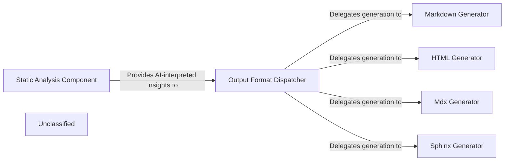

## Details

The system's architecture is centered around an Output Generation Engine that transforms AI-interpreted insights into various documentation formats. This process begins with the Static Analysis Component, which is responsible for generating the core "AI-interpreted insights" from code analysis. These insights are then passed to the Output Format Dispatcher, the central orchestrator of the engine. The Dispatcher, based on the requested output format, delegates the task to specialized generators: the Markdown Generator, HTML Generator, Mdx Generator, and Sphinx Generator. Each generator is responsible for producing high-quality documentation in its specific format, ensuring a flexible and extensible output pipeline. This design promotes a clear separation of concerns, allowing for independent development and enhancement of both the analysis and output generation capabilities.

### Static Analysis Component
This component is responsible for performing static analysis on the codebase and generating "AI-interpreted insights." It acts as a crucial upstream dependency, providing the raw, processed data that the Output Generation Engine transforms into various documentation formats. The significant updates in its LSP client highlight its active development and importance in the overall system.

**Related Classes/Methods**:

- <a href="https://github.com/CodeBoarding/CodeBoarding/blob/main/.codeboardingstatic_analyzer/lsp_client/client.py" target="_blank" rel="noopener noreferrer">`static_analyzer/lsp_client/client.py`</a>

### Output Format Dispatcher
This component serves as the central orchestrator within the Output Generation Engine. It receives AI-interpreted insights along with the desired output format and dispatches the data to the appropriate specialized generator (e.g., Markdown, HTML, MDX, Sphinx). This component is crucial for maintaining a clear separation of concerns and supporting the "Pipeline/Workflow" architectural pattern by managing the flow to specific formatters.

**Related Classes/Methods**:

- <a href="https://github.com/CodeBoarding/CodeBoarding/blob/main/.codeboardingoutput_generators/markdown.py" target="_blank" rel="noopener noreferrer">`output_generators/markdown.py`</a>
- <a href="https://github.com/CodeBoarding/CodeBoarding/blob/main/.codeboardingoutput_generators/html.py" target="_blank" rel="noopener noreferrer">`output_generators/html.py`</a>
- <a href="https://github.com/CodeBoarding/CodeBoarding/blob/main/.codeboardingoutput_generators/mdx.py" target="_blank" rel="noopener noreferrer">`output_generators/mdx.py`</a>
- <a href="https://github.com/CodeBoarding/CodeBoarding/blob/main/.codeboardingoutput_generators/sphinx.py" target="_blank" rel="noopener noreferrer">`output_generators/sphinx.py`</a>

### Markdown Generator
Specializes in converting AI-interpreted insights into a well-structured Markdown format. This output is ideal for human-readable documentation, README files, and integration with Markdown-based rendering tools. It is a fundamental component for generating textual documentation, a primary output of a "Code Analysis and Documentation Generation Tool."

**Related Classes/Methods**:

- <a href="https://github.com/CodeBoarding/CodeBoarding/blob/main/.codeboardingoutput_generators/markdown.py" target="_blank" rel="noopener noreferrer">`output_generators/markdown.py`</a>

### HTML Generator
Focuses on transforming AI-interpreted insights into HTML format. This enables rich, web-based documentation, interactive reports, and seamless integration with web platforms or tools. This component provides an alternative, often more visually rich, documentation output, supporting diverse presentation needs.

**Related Classes/Methods**:

- <a href="https://github.com/CodeBoarding/CodeBoarding/blob/main/.codeboardingoutput_generators/html.py" target="_blank" rel="noopener noreferrer">`output_generators/html.py`</a>

### Mdx Generator
Specializes in converting AI-interpreted insights into MDX (Markdown with JSX) format. This enables the creation of interactive and dynamic documentation, leveraging the power of React components within Markdown.

**Related Classes/Methods**:

- <a href="https://github.com/CodeBoarding/CodeBoarding/blob/main/.codeboardingoutput_generators/mdx.py" target="_blank" rel="noopener noreferrer">`output_generators/mdx.py`</a>

### Sphinx Generator
Focuses on transforming AI-interpreted insights into a format compatible with Sphinx, a popular documentation generator. This allows for the creation of comprehensive and structured documentation, often used for large software projects.

**Related Classes/Methods**:

- <a href="https://github.com/CodeBoarding/CodeBoarding/blob/main/.codeboardingoutput_generators/sphinx.py" target="_blank" rel="noopener noreferrer">`output_generators/sphinx.py`</a>

### Unclassified
Component for all unclassified files and utility functions (Utility functions/External Libraries/Dependencies)

**Related Classes/Methods**: _None_

### [FAQ](https://github.com/CodeBoarding/GeneratedOnBoardings/tree/main?tab=readme-ov-file#faq)
